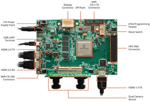

# PolarFire Video Kit Setup Instructions

## Introduction to PolarFire Video Kit Setup Instructions

These instructions describe how to setup, compile and run an example on the PolarFireVideo Kit with the MiV\_RV32 Reference Design. The instructions below assume your host computer is running Linux, but similar steps can be done on Windows.

## PolarFire® Video Kit Image

This is a picture of the PolarFire Video Kit:



## Board Connections

The following cables must be connected to the board for use with SmartHLS :

-   Power cable \(connects to `12V Power Supply Input`\).
-   Mini-USB cable for serial communication to the board and embedded JTAG programmer. The same cable is used for both. Alternatively, you use the External FP6 programmer.
-   Jumper `J28` must be open to use the external programmer, or closed to use the embedded programmer.

## Install Host PC Applications

The following programs are required to be installed on the host PC to set up the PolarFire Video Kit:

-   SmartHLS v2024.2 or newer.
-   Libero v2024.2 or newer.
-   SoftConsole v2021.3 or later.
-   A serial communication terminal of your choosing. In this guide, we will use [tio](https://github.com/tio/tio).

Users need to install SoftConsole and append the RISC-V compilation tool chain to<br /> `$PATH` environment variable. For example, on Linux users need to<br /> run:

``` {#CODEBLOCK_X3Z_NBS_BFC}
export PATH=$SOFTCONSOLE_PATH/riscv-unknown-elf-gcc/bin:$PATH
```

And on Windows Powershell, users need to<br /> run:

``` {#CODEBLOCK_VJ2_VBS_BFC}
$env:PATH = "$env:SOFTCONSOLE_PATH\riscv-unknown-elf-gcc\bin;$env:PATH"
```

Where `$SOFTCONSOLE_PATH` and `$env::SOFTCONSOLE_PATH`<br /> represent the installation path of SoftConsole.

**Important:** Automated SoC flow support for the PolarFire Video Kit on Linux from command line is a Beta feature available starting from SmartHLS v2025.1. Earlier versions require using the manual SoC flow.

<br />

## Write, compile and run a simple test program

During the test, we will open the 3 serial terminals labeled below:

1.  `UART Terminal`: We will use this to see the stdout from the program.
2.  `SmartHLS terminal`: Linux terminal that we will use to run SmartHLS commands from the command line.
3.  `OpenOCD terminal`: Linux terminal that we will use to launch OpenOCD manually from the command line, provided the SmartHLS version is 2025.1 or previous.

Create a temporary directory, for example, `test`, and use your favorite text<br /> editor to write the following 3 files under this directory:

``` {#CODEBLOCK_ZSW_2R3_PZB .language-cmd}
$> mkdir test
$> cd test

```

Create a `simple_add.c` file with the following content:

``` {#CODEBLOCK_KZN_GR3_PZB .language-cpp}
#include <stdio.h>
#include <stdint.h>
 
uint32_t hw_add(uint32_t a, uint32_t b) {
   #pragma HLS function top
   #pragma HLS interface default type(axi_target)
   return a + b;
}
 
int main() {
   uint32_t sum;
   uint32_t a = 2, b = 3;
   sum = hw_add(a, b);
 
   int error = (sum != a + b);
   printf("\n%s\n", error ? "FAIL" : "PASS");
   return error;
}

```

Create the `Makefile` with the following content:

``` {#CODEBLOCK_JKF_3R3_PZB .language-cpp}
NAME=simple_add
SRCS=$(NAME).c
LOCAL_CONFIG = -legup-config=config.tcl
LEVEL = $(SHLS_ROOT_DIR)/examples
include $(LEVEL)/Makefile.common
```

Create a `config.tcl` file:

``` {#CODEBLOCK_XZW_KR3_PZB .language-cpp}
source $env(SHLS_ROOT_DIR)/examples/legup.tcl
set_project PolarFire MPF300 MiV_SoC
```

Note that we used the `SHLS_ROOT_DIR` environment variable, it should point to where SmartHLS is installed. On the `SmartHLS Terminal` type the following:

``` {#CODEBLOCK_UVR_NR3_PZB}
$> export SHLS_ROOT_DIR=/path/to/Microchip/SmartHLS_`2025.1`/SmartHLS
```

Now run the SmartHLS SoC flow to:

1.  Compile the `hw_add` function into a Verilog module.
2.  Integrate the module into the MiV\_RV32 Reference Design. See [MiV\_RV32 Reference Design](Chunk2006016459.md#).
3.  Run RTL synthesis.
4.  Run place and route.
5.  Check timing.
6.  Program the FPGA.
7.  Cross-compile software program.
8.  Initialize the processor memory with RISC-V binary.
9.  Run the firmware with the standard output capture via UART.

The command below will invoke all these tasks as they are dependencies to program the FPGA.<br /> This will take a few minutes:

``` {#CODEBLOCK_MZD_RR3_PZB .language-cpp}
$> shls -a soc_accel_proj_program

```

Now cross-compile the `simple_add.c` program. This will generate a<br /> `hls_output/simple_add.elf` file.

``` {#CODEBLOCK_SXK_SR3_PZB .language-cpp}
$> shls soc_sw_compile_accel

```

In the `UART terminal` open the UART connection. Your device may be<br /> different:

``` {#CODEBLOCK_DXH_TR3_PZB .language-cpp}
$> tio /dev/ttyUSB0 -b 115200

```

In the `OpenOCD terminal` launch OpenOCD.

``` {#CODEBLOCK_DHQ_VR3_PZB .language-cpp}
$> openocd -f board/microsemi-riscv.cfg
```

Now go back to the `SmartHLS terminal` and run<br /> gdb to execute the code on the MiV\_RV32.

``` {#CODEBLOCK_K4S_WR3_PZB .language-cpp}
$> riscv64-unknown-elf-gdb ./hls_output/simple_add.elf -x ./gdb.txt

```

At this point you should see the word `PASS` in the `UART terminal`. You can type `Ctrl+C` and then press<br /> `q` to terminate the gdb session.

Also, you can press `Ctrl+C` on the `OpenOCD terminal` to<br /> close the program, otherwise it would not release the JTAG cable.

### Automated SOC Flow \(Beta Version\)

Starting from version v2025.1, SmartHLS™<br /> supports automated SoC flow to perform the steps mentioned in [Write, compile and run a simple test program](Chunk2018178330.md#)<br /> **on the Linux platforms via command lines**. Prior to running the associated SHLS command,<br /> the following environment variables must be configured:

-   `PROGRAMMER_ID`
-   `SERIAL_PORT`
-   `OPENOCD_TOOL_PATH`

    **Important:** Regarding OpenOCD version, the pre-released OpenOCD-0.12.0-4 from [Microchip PIC64GX Curiosity Kit Support](https://github.com/microchip-fpga/openocd/releases/tag/v0.12.0-mchp.0.0.3) needs to be used to realize the step 8 and 9 mentioned in [Write, compile and run a simple test program](Chunk2018178330.md#). Since the `openocd` binary is bundled in every compressed release asset, users simply need to do the following:

    -   Download and extract the compressed asset.
    -   Configure `OPENOCD_TOOL_PATH` to the bin sub-directory of the openocd directory.

The command below will invoke all these tasks as they are prerequisites to program the FPGA,<br /> cross-compile the `simple_add.c` program and run the generated<br /> `hls_output/simple_add.elf` on board:<br />

```
$> shls -a soc_accel_proj_run
```

### Manual SOC Flow

For versions 2024.2 or previous, SmartHLS™™<br /> only supports manual SoC flow to perform the steps mentioned in [Write, compile and run a simple test program](Chunk2018178330.md#). Prior to running the associated SHLS<br /> command, `PROGRAMMER_ID` environment variable needs to be configured.

The command below will invoke all steps 1 to 6 \(see [Write, compile and run a simple test program](Chunk2018178330.md#)\) as they are prerequisites to program the<br /> FPGA. This will take a few<br /> minutes:

```
$> shls -a soc_accel_proj_program
```

Now, create a `gdb.txt` file that is used by gdb to connect to OpenOCD, load<br /> the .elf binary into the MiV\_RV32’s memory and run the<br /> code:

```
set $target_riscv = 1
set mem inaccessible-by-default off
set arch riscv:rv32
target extended-remote localhost:3333
load
run
```

Cross-compile the `simple_add.c` program. This will generate a<br /> `hls_output/simple_add.elf`<br /> file.

```
$> shls -a soc_sw_compile_accel
```

In the `UART terminal` open the UART connection. Please note that your device<br /> may be different:

```
$> tio /dev/ttyUSB0 -b 115200
```

In the `OpenOCD terminal` launch<br /> OpenOCD:

```
$> openocd -f board/microsemi-riscv.cfg
```

Now go back to the `SmartHLS terminal` and run gdb to execute the code on the<br /> MiV\_RV32.

```
$> riscv64-unknown-elf-gdb ./hls_output/simple_add.elf -x ./gdb.txt
```

At this point you should see the word `PASS` in the `UART terminal`. You can type `Ctrl+C` and then press `q` to<br /> terminate the gdb session.

Also, you can press `Ctrl+C` on the `OpenOCD terminal` to close<br /> the program, otherwise it would not release the JTAG cable.

