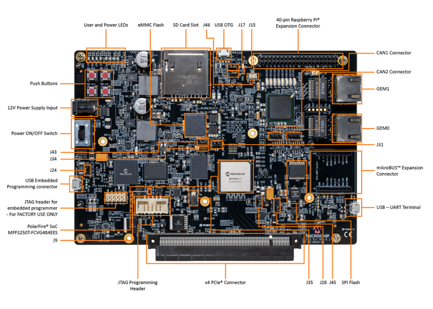
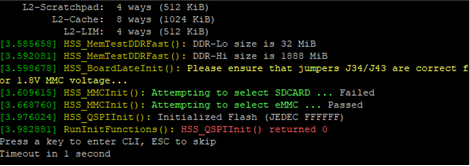
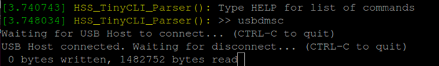
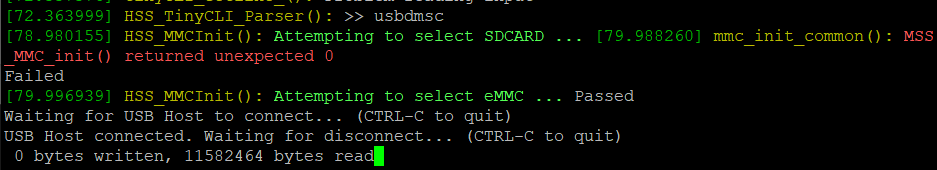
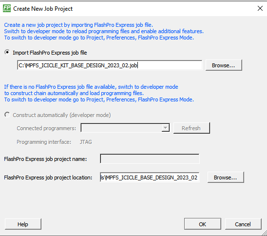
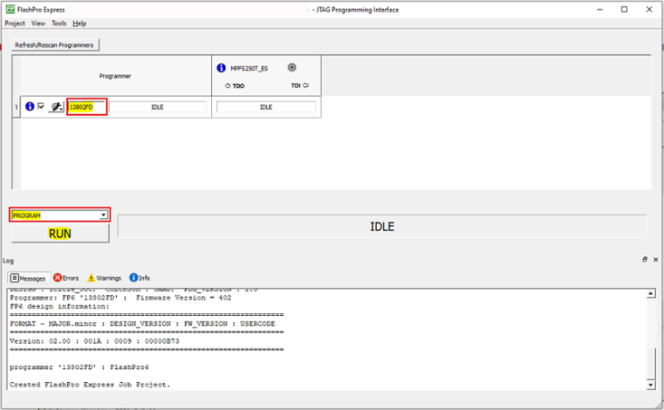
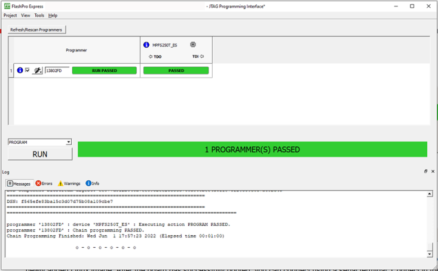
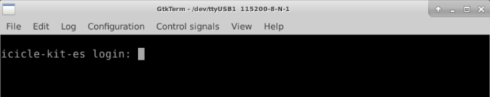
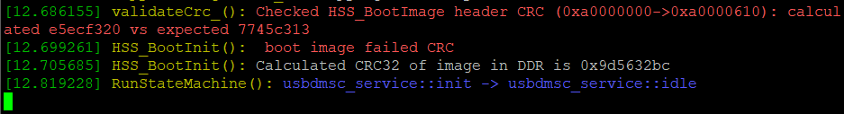

# Icicle Kit Setup Instructions

## Introduction

These instructions describe how to update the [PolarFire SoC Icicle Kit](https://www.microchip.com/en-us/development-tool/MPFS-ICICLE-KIT-ES) Linux image and FPGA bit stream necessary to support the SmartHLS™ [SoC Features](Chunk120481216.md#).

The instructions are a simplified version of [Updating PolarFire SoC Icicle-Kit FPGA Design and Linux Image](https://github.com/polarfire-soc/polarfire-soc-documentation/blob/master/reference-designs-fpga-and-development-kits/icicle-kit-user-guide.md#updating). The SmartHLS PolarFire SoC feature uses the [PolarFire SoC Icicle Kit Reference Design \(v2023.02\)](https://github.com/polarfire-soc/icicle-kit-reference-design/releases/tag/v2023.02) as the base project, and the Linux image for the PolarFire SoC Icicle Kit Reference Design: [PolarFire SoC Yocto Board Support Package \(v2023.02.1\)](https://github.com/polarfire-soc/meta-polarfire-soc-yocto-bsp/releases/tag/v2023.02.1).

### PolarFire® SoC Icicle Kit Diagram

For the following setup instructions, please refer to the labelled diagram of a PolarFire SoC<br /> Icicle Kit below:



## Step 1 - Setup Required Board Connections

**Important:** Micro USB sockets on the Icicle board are very fragile and can easily break. Be careful when plugging/unplugging the micro USB cables. Also micro USB cables can occasionally fail, so try another cable.

The following cables must be connected to the Icicle Kit for use with SmartHLS™:

-   Power cable \(connects to `12V Power Supply Input`\).
-   Micro USB for transferring the image to the board \(one end connects to `USB OTG`, while the other end connects to the host PC that will transfer the image\).
    -   This cable is used to expose the internal eMMC memory as a USB storage
    -   Required only if the Linux image needs to be updated
-   Micro USB for serial communication to the board \(one end connects to `USB - UART Terminal`, while the other end connects to the host PC\).
    -   This cable is used to open a serial communication terminal between the Linux system on the board and the host PC.
    -   Required only if serial communication is required \(for Linux image transfer or determining the board’s network IP address\).
-   FlashPro6 programmer, embedded or external, connected to the host PC.
    -   For an embedded programmer, connect a micro USB cable to `USB Embedded Programming Connector`, and make sure that jumpers J9 and J24 are **closed**.
    -   For an external programmer, connect it to `JTAG Programming Header`, and make sure that jumpers J9 is **open**.
-   Ethernet cable, one end connected to `GEM1`, and the other end connected either directly to the PC, or to the same network as the host PC \(for example, the same router\). Tip: On Dell laptops to enable both Ethernet and WiFi at the same time you may have to modify your [bios settings](https://www.dell.com/support/kbdoc/en-ca/000137415/how-to-disable-wireless-when-connected-via-wired-connection-on-latitude-and-precision-mobile-workstations).

## Step 2 - Check Jumper Settings

The following jumpers must be set on the board:

|Jumper|Setting|
|------|-------|
|`J9`|Open for external FlashPro6, Closed for embedded FlashPro6|
|`J24`|Closed for embedded FlashPro6|
|`J28`|Closed|
|`J34`|Closed \(Right two pins\)|
|`J35`|Closed \(2P5V setting / bottom two pins\)|
|`J43`|Closed \(Right two pins\)|
|`J45`|Closed \(1V setting / bottom two pins\)|
|`J46`|Closed|
|All other jumpers|Open|

## Step 3 - Install Host PC Applications

The following programs are required to be installed on the host PC to set up the Icicle kit:

-   SmartHLS™ v2023.2 or newer.
-   Libero v2023.2 or newer.
-   A serial communication terminal. In this guide we will use the following:
    -   Windows: [PuTTY](https://www.putty.org/)
    -   Linux: [GTKTerm](https://github.com/Jeija/gtkterm)

## Step 4 - Open Serial UART Terminals

During the setup process you will need a couple of serial UART terminals to communicate with the PolarFireSoC: one for the HSS and another for the embedded Linux command line.

Ensure the board is powered on and the board’s `USB - UART Terminal` connection is made as described in[Step 1 - Setup Required Board Connections](Chunk377344541.md#).

Windows Users
:   On Windows, To open the `HSS Serial Terminal`:

    1.  Open **Start** &gt; **Device Manager**. Select **View** &gt; **Show hidden devices**. Under Ports \(COM &amp; LPT\), and look for “Silicon Labs Quad CP2108 USB to UART Bridge: **Interface 0** as shown below. Take note of the serial line number in parenthesis. In this case, Interface 0 is **COM3**. The digit could be different on your machine.

        

        If you encounter an issue configuring the serial connection to the board try the following:

        -   If you can’t find the serial port with the correct name, you may have to install [CP210x Windows Drivers from SiLabs](https://www.silabs.com/developers/usb-to-uart-bridge-vcp-drivers).
        -   You should be able to see the UART interfaces in **StartDevice Manager**. If you can’t, try selecting **ViewShow hidden devices**,
        -   If you still can’t see the serial ports, then your USB socket could be broken, which is usually indicated if Windows makes no sound when disconnecting/reconnecting the USB cable.
    2.  With the Icicle Kit on and connected, open a new PuTTY terminal. Change the settings on the left navigation panel, under **ConnectionSerial** to:

        -   Serial line to connect to: &lt;Serial line number&gt;
        -   Baud Rate: 115200
        -   Data Bits: 8
        -   Stop Bits: 1
        -   Parity: None
        -   Flow Control: None
        Below is an image of how the settings look in PuTTY:

        

    3.  Go back to **Session** on the left navigation panel, Change **Connection Type** to **Serial** as shown below, then click **Open**:

        


Linux Users
:   On Linux, to open the `HSS Serial Terminal`:

    -   The UART channel that we will connect to is channel 0. To do this in GTKTerm, the command is:

        > `sudo gtkterm -p /dev/ttyUSB0 -s 115200`

    -   Note that if you have other ttyUSB devices connected to your host PC, the number after `/dev/ttyUSb` may need to change. To out find which devices are associated with the Icicle Kit’s UART channels, you can run `ls /dev/ttyUSB*` with and without the USB cable connected to the board. Any new devices \(there should be four\) that appear when plugging in the board are the UART channels. For this step, we want to use the `/dev/ttyUSB` device with the lowest number.


### Embedded Linux Serial Terminal

To open the `Embedded Linux Serial Terminal` follow the same instructions as the previous [Step 4 - Open Serial UART Terminals](Chunk377344541.md#) section. Except this time use interface 1 \(`/dev/ttyUSB1` on a Linux host PC, and `Interface 1` on a Windows host PC\).

In the example below, Interface 1 is on the **COM4** serial line.


## Step 5 - Flashing the Embedded Linux Image to the Board

A Linux image is tightly related to the SoC hardware design it was compiled for. SmartHLS™ uses the [Microchip Linux image - 2023.02.1 release](https://github.com/polarfire-soc/meta-polarfire-soc-yocto-bsp/releases/tag/v2023.02.1), which is meant to be used with the [Icicle Kit Reference Design - 2023.02 release](https://github.com/polarfire-soc/icicle-kit-reference-design/releases/tag/v2023.02) and may not be the same as the image that the Icicle Kit board has been flashed with from the factory, or any other image currently loaded in your board. If you have your own Linux image and your own Libero SoC project then see the [User-defined SmartDesigns](Chunk120481216.md#) section.

To program this Linux image to the board, follow these instructions:

1.  Download the Linux image [core-image-minimal-dev-icicle-kit-es-20230328094718.rootfs.wic.gz](https://github.com/polarfire-soc/meta-polarfire-soc-yocto-bsp/releases/download/v2023.02.1/core-image-minimal-dev-icicle-kit-es-20230328094718.rootfs.wic.gz) and its associated [core-image-minimal-dev-icicle-kit-es-20230328094718.rootfs.wic.bmap file](https://github.com/polarfire-soc/meta-polarfire-soc-yocto-bsp/releases/download/v2023.02.1/core-image-minimal-dev-icicle-kit-es-20230328094718.rootfs.wic.bmap) file. Then verify their checksum.

    ``` {#PRE_NZ5_FL5_4ZB}
    $> wget https://github.com/polarfire-soc/meta-polarfire-soc-yocto-bsp/releases/download/v2025.1/core-image-minimal-dev-icicle-kit-es-20230328094718.rootfs.wic.gz
    
    $> wget https://github.com/polarfire-soc/meta-polarfire-soc-yocto-bsp/releases/download/v2025.1/core-image-minimal-dev-icicle-kit-es-20230328094718.rootfs.wic.bmap
    
    $> sha256sum core-image-minimal-dev-icicle-kit-es.wic.*
    
    58fdce37eb4e3f63cb8e6aa0569d5a5a47fcb67352e6548dc659a082e8ad6a76  core-image-minimal-dev-icicle-kit-es-20230328094718.rootfs.wic.bmap
    
    4a1406ba9e764a94026fcea2ee8fbb84f91384e953e7ba6176fcb7dadcbc5522  core-image-minimal-dev-icicle-kit-es-20230328094718.rootfs.wic.gz
         ...
    
    ```

2.  In the Host PC with Linux enter the command `ls /dev/sd*`, and take note of what appears. This will be used [in a later step](Chunk377344541.md#P_VCD_RNB_PZB) to help determine the device name of the eMMC flash memory.

In our example, we have `/dev/sda` and `/dev/sdc` already:


### Expose Board’s eMMC Flash Memory to Host PC as USB flash storage

To flash the Embedded Linux image we first need to expose the eMMC flash memory as a USB storage device to the host PC. Make sure the board’s `USB OTG` connection is made as described in [Step 1: Setup Required Board Connections](https://microchiptech.github.io/fpga-hls-docs/icicle_setup.html#icicle-required-connections).

1.  Reset the Icicle Kit by pressing push button SW4 \(top left push button\). In the `HSS Serial terminal`, when prompted to `Press a key to enter CLI`, press any key aside from `ESC`. If you don’t press a key within 1 second then the board will continue to boot Linux and you will have to reset the board again. Double check in the `Linux Serial Terminal` to verify that you don’t see any output from Linux booting.

    

    You should now see a prompt for the HSS command-line interface:

    

2.  In the `HSS Serial Terminal`, enter the command `mmc` to select the eMMC flash memory \(only needed for newer HSS versions\). Then enter the command `usbdmsc`.

    

    **Important:** If you see “FLASH\_DRIVE\_init\(\) returned false” \(below\), then you forgot to run the `mmc` command before running `usbdmsc`.

    

3.  If the board is properly connected to your host computer, you should see data being read as shown on the last line of the following image:

    

4.  On a Linux host PC, you can run again `ls /dev/sd*` and compare against what we saw in[in the earlier step](Chunk377344541.md#GUID-789C57CB-A890-4476-8078-6BFD052EEEB4). Note which new device shows up. In our example, `/dev/sda` and `/dev/sdc` were present before, but `/dev/sdb` is new. Therefore, the eMMC flash memory on the board is represented on our host machine as: `/dev/sdb`. We can now flash the Linux image to the board.

    

    Alternatively, you can check the exact device using the `lshw` command and it will show the device for the *PolarFireSoC*:

    ```
    $> sudo lshw -class disk -short
    H/W path                 Device     Class          Description==============================================================
    /0/100/14/0/6/0.0.0      /dev/sdb   disk           7820MB PolarFireSoC_msd
    /0/100/14/0/6/0.0.0/0    /dev/sdb   disk           7820MB
    /0/1/0.0.0               /dev/sda   disk           1TB Samsung SSD 860
    ```

    On a Windows host PC, you can use the Windows File Explorer -&gt; This PC to see the Icicle Kit’s eMMC flash memory as a media drive. In this case, shown as “boot \(D:\)”:

    


### Flash the Embedded Linux Image to the Board

Using Balena Etcher

For<br /> either Linux or Windows, you can easily flash the Embedded Linux image \(\*.wic.gz<br /> file\) using Balena Etcher software, which can be downloaded here: [https://etcher.balena.io](https://etcher.balena.io).

Open<br /> Balena's Etcher and click on “**Flash from file**”. This will open a<br /> window to select the file you want to flash. Choose the \*.wic.gz file \(Embedde<br /> Linux Image file\) then click on “**Select target**” button and choose<br /> the board's flash memory drive as described in the previous section. The drive<br /> should have been detected by Windows or Linux when you issued the **usbdmmc**<br /> command. Once you have set the target and file, click on the“**Flash!**”<br /> button and wait for the image file to be flashed to the board.

After the<br /> flashing command completes, you should disconnect the mounted drive, by typing<br /> **Ctrl+C** in the HSS Serial Terminal. The embedded Linux image on the<br /> board is now updated.

Using command line \(Linux-only\).

Alternateively, when using Linux you can use the<br /> `bmap` tool. Assuming the board flash storage device is<br /> “/dev/sdb” you can flash the image like this:

`$> bmaptool copy <linux image>.wic.gz /dev/sdb`

Note that<br /> to use `bmap` you need the “\*.wic.bmap” file that was<br /> downloaded earlier.

Yet another alternative in Linux is to use the<br /> `dd` command as<br /> follows:

```
$> sudo umount /dev/sdb
$> zcat <linux image>.wic.gz | sudo dd of=/dev/sdb bs=4096 iflag=fullblock oflag=direct conv=fsync status=progress
```

**Warning:**

```
`dd` flashing command should take several minutes to complete. **DO NOT** power cycle the Icicle board at this point.
```

After the flashing command completes, you should disconnect the mounted drive, by typing `Ctrl+C` in the `HSS Serial Terminal`. The embedded Linux image on the board is now updated.

## Step 6 - Programming the FPGA bitstream with FPExpress

After programming the Linux image for the first time, in order to boot the board, you’ll also have to program a matching bitstream to the FPGA. SmartHLS™ comes with a default bitstream that can be used to boot the board, which can be programmed using the following steps:

1.  Open FPExpress:
    -   On Windows, the program can be found by opening the Start Menu, then scrolling down the list of programs until you see the `Microchip Libero SoC v`2025.1`` folder \(under the `M` letter\) -&gt; `FPExpress`.
    -   On Linux, you can navigate to the `bin` directory in your Libero installation, and then `sudo ./fp6_env_install`, then open FPExpress with the command `./FPExpress`.
2.  Click **New**, select **Import FlashPro Express job file**, and navigate to your SmartHLS installation to select the job file: `<SMARTHLS_INSTALLATION_DIR>\SmartHLS\reference_designs\Icicle_SoC\MPFS_ICICLE_KIT_BASE_DESIGN_<VERSION>.job`. For example: `C:\Microchip\SmartHLS-2025.1\SmartHLS\reference_designs\Icicle_SoC\MPFS_ICICLE_KIT_BASE_DESIGN_2023_02.job`. Then choose a temporary path for the FPExpress project location.

    

    **Important:** Ensure that the version is updated in the path.

3.  Select which programmer you wish to use \(if you have multiple\), and note down the programmer ID \(highlighted in a red box in the picture below\). From the drop-down box above the `RUN` button make sure that `PROGRAM` is selected.

    

4.  Now press the `RUN` button, and you should see a confirmation that the programming passed:

    

    This will program a default bitstream to the FPGA fabric, as well as a compatible bootloader \(HSS\), which will allow the board to boot up with the newly added Linux image.

5.  Programming the bitstream will automatically reset the board. Do NOT power cycle.

## Step 7 - Accessing Linux on Board and Determining the IP Address

In the `Linux Serial Terminal`, after Linux boots you should see a login screen:



The login is `root`, and no password is required. After logging in,<br /> you should be able to see a terminal.

Troubleshooting if Linux does not boot:

-   If you see an error message when booting Linux there could have been a problem/corruption when writing the Linux image to the board. Please repeat the steps in [Step 5: Flashing the Linux Image to the Board](https://microchiptech.github.io/fpga-hls-docs/icicle_setup.html#icicle-linux-image) and try again.
-   Also check the serial terminal output from the other UART *Interface 0* and if you see “boot image failed CRC” as shown below. This error means there is a mismatch between your FPGA job file \(which writes the HSS bootloader\) and the Linux image. Double check that you used the exact files specified in this document. The Linux image will only boot with a compatible FPGA job file.

    


Make sure the ethernet cable is connected as described in [Step 1: Setup Required Board Connections](https://microchiptech.github.io/fpga-hls-docs/icicle_setup.html#icicle-required-connections). Now enter `ifconfig eth0`, and take note of the IP address that should have been assigned to the Icicle Kit by the network:

```
root@icicle-kit-es:~*\# ifconfig eth0*eth0: flags=4163<UP,BROADCAST,RUNNING,MULTICAST>  mtu 1500inet 192.168.0.173  netmask 255.255.255.0  broadcast 192.168.0.255inet6 fe80::204:a3ff:fefb:406f  prefixlen 64  scopeid 0x20<link>ether 00:04:a3:fb:40:6f  txqueuelen 1000  (Ethernet)RX packets 17882  bytes 3231759 (3.0 MiB)RX errors 0  dropped 4843  overruns 0  frame 0TX packets 4963  bytes 1478718 (1.4 MiB)TX errors 0  dropped 0 overruns 0  carrier 0  collisions 0device interrupt 18
```

If the network is not setup or if you want to assign a static IP address, for example 192.168.0.173 to eth0 using 192.168.0.161 as the gateway, you can create a file like this: */etc/systemd/network/70-static-eth0.network* with the following content:

```
$> vim /etc/systemd/network/70-static-eth0.network
[Match]
Name=eth0

[Network]
Address=192.168.0.173/24
Gateway=192.168.0.161
DCHP=no
```

Save the file and restart the network and confirm the status:

```
$> systemctl restart systemd-networkd
$> networkctl status
*        State: routable
Online state: online
    Address: 192.168.0.173 on eth0
             fe80::204:a3ff:fefb:406f on eth0
             fe80::204:a3ff:fefb:406e on eth1
    Gateway: 192.168.0.161 on eth0

```

Now you should be able to ping and ssh into the board.

## Accessing Linux over network using SSH

Now that the IP address of the board was determined in the previous step, you can access the board remotely over the network using SSH from your `Host PC Terminal` with the command:

`ssh root@[your board IP here]`

For the example above, you would run `ssh root@192.168.0.173`.

**Important:** SmartHLS uses SSH to access and run programs on the Icicle Kit as well, so all SmartHLS projects will need to specify the BOARD\_IP. In addition, if you have multiple connected programmers and only want to program a specific one, you need to specify the PROGRAMMER\_ID. By default, all connected programmers are programmed. For SmartHLS IDE projects, this can be done by adding `BOARD_IP=[your board IP here]` and `PROGRAMMER_ID=[your FlashPro ID here]` to the project’s `Makefile.user`. For command line projects, this can be done by adding the same to the `Makefile` \(or `makefile`\), or exporting environment variables: `export BOARD_IP=[your board IP here]` and `export PROGRAMMER_ID=[your FlashPro ID here]`.

