# Quick Start Tutorial

Learn how to use some of the major features and optimization techniques of SmartHLS.

## Introduction

This tutorial introduces you to high-level synthesis \(HLS\) concepts using SmartHLS™. You apply HLS to a real problem, such as synthesizing<br /> an image processing application from software written in the C++ programming language.<br /> Specifically, you synthesize a circuit that performs one of the key steps of *edge detection*- a widely used transformation that identifies the edges in an input image and produces an<br /> output image showing just those edges. The step you implement is called *Sobel*filtering. The computations in Sobel filtering are identical to those involved in<br /> convolutional layers of a Convolutional Neural Network \(CNN\).

The following figure shows an example of Sobel filtering applied to an image. This is the image that is used as input data in this tutorial.


Sobel filtering involves applying two 3 x 3 convolutional kernels \(also called filters\) to an image. The kernels are usually called *G**x***and *G**y*, and they are shown in the following figure. These two kernels detect the edges in the image in the horizontal and vertical directions. They are applied separately and then combined to produce a pixel value in the output image at each position in the input image.

The output value is approximated by:

G = \|Gx\| + \|Gy\|

Where the *G**x***and *G**y***terms are computed by multiplying each filter value by a pixel value and then summing the products together.

Sobel filters and computational action are used to compute one pixel in the output image from an input image.

The bottom of the following image shows an input image with 4 rows and 4 columns, where the value in each cell represents a pixel color. The figure illustrates applying the Sobel filters at one position in the input image to compute one value in the output image. The input image pixels involved in the computation are often referred to as the receptive field.

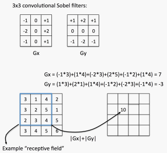

A question that might occur to you is: what happens at the edges of the image? That is, the locations where the placement of the 3 x 3 Sobel filters would slide off the edge of the input image. In this tutorial, our program/circuit places 0s into the perimeter of the output image corresponding to such edge locations- this is referred to as *padding*, and it is a commonly done technique.

### Requirements

-   The files for this tutorial can be found on github: [https://github.com/MicrochipTech/fpga-hls-examples/tree/main/sobel\_tutorial](https://github.com/MicrochipTech/fpga-hls-examples/tree/main/sobel_tutorial)
-   You can download all the files using this link: [https://github.com/MicrochipTech/fpga-hls-examples/archive/refs/heads/main.zip](https://github.com/MicrochipTech/fpga-hls-examples/archive/refs/heads/main.zip)
-   Extract this zip file and navigate to the sobel\_tutorial folder: `fpga-hls-examples-main\sobel_tutorial`
-   Before beginning this tutorial, you should install the following software:
    -   SmartHLS™ 2021.1.2 or later
    -   Libero® SoC 2021.1 or later with ModelSim

## Step 1: Basic Implementation

In this section, use SmartHLS™ to compile the Sobel filter to hardware without any modifications to the C++ code.

1.  Start the SmartHLS IDE. On Windows, double click on the SmartHLS shortcut either in the start menu or the desktop. On Linux, ensure that `$(SMARTHLS_INSTALL_DIR)/SmartHLS/bin` is on your PATH, and the SmartHLS IDE can be opened by running the following command: `shls_ide`. The Eclipse Launcher dialog box is displayed with a default workspace directory as shown in the following figure.
2.  Click **OK** to use the default workspace for all parts of this tutorial.

    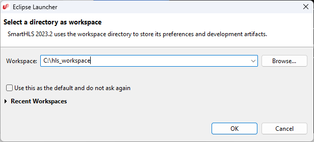

    **Important:** Ensure that there are no spaces in your workspace path. Otherwise, SmartHLS displays an error message while running synthesis.

3.  Launch the SmartHLS IDE. Choose **File** &gt; **New** &gt; **SmartHLS C/C++ Project** as shown in the following figure.

    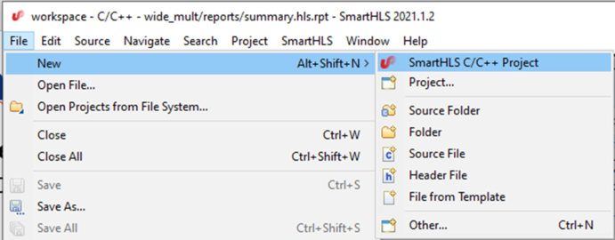

4.  Enter `sobel_part1` as the project name as shown in the following figure. Click **Next**.

    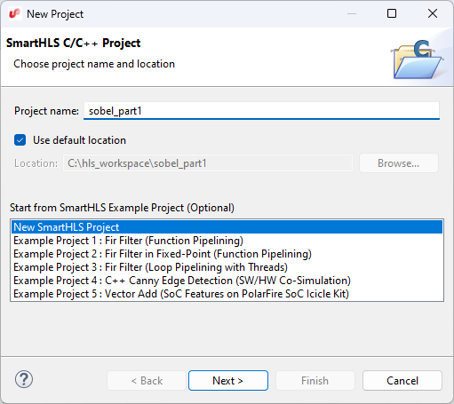

5.  The following figure shows leaving the **Top-Level Function** blank as the `sobel_filter` function in `sobel.cpp` already has a pragma to indicate the top-level function.
6.  Click on **Add Files** to import the source files for part 1 of this tutorial into the project. Navigate to where you have downloaded the tutorial files and go into the `part1` directory. You can hold shift to select all three source files: `input.h`, `output.h` and `sobel.cpp`. After you have added the source files to the project, click **Next**.

    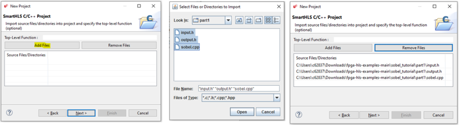

7.  A dialog box appears where you can specify your test bench, which is not needed for this part of the tutorial. Click**Next** without changing any of the options.
8.  To complete the project creation, you must choose the FPGA device you intend to target. Use the selections shown in the following figure for the **FPGA family** choose PolarFire®. For **FPGA Device**, you have an option to choose MPF300TS-1FCG1152I on the MPF300 Board or use another PolarFire device that is not listed.

    **Important:** For this tutorial, you will use another PolarFire device, MPF100T-FCVG484I, which can be used with a Microchip Libero® free *Silver*license \(the bigger MPF300TS-1FCG1152I device requires the paid *Gold*license\). To use MPF100T, choose *Custom Device*for the **FPGA Device**field, then type in MPF100T-FCVG484I in the **Custom Device**field. Click on **Finish**when you are done. It may take a few moments to create the project.

    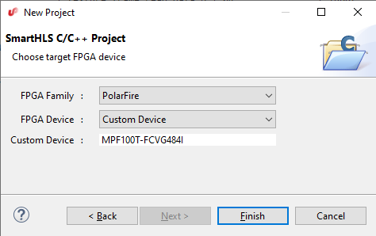

9.  Setup the paths to ModelSim \(and Microchip Libero for later parts of this tutorial\), if this is the first time you are using SmartHLS. To setup the paths, click SmartHLS on the top menu bar, then click **Tool Path Settings**. The dialog opens, set the paths for ModelSim **Simulator** and **Microchip Libero SoC** as shown in the following figure, and click **OK**.

    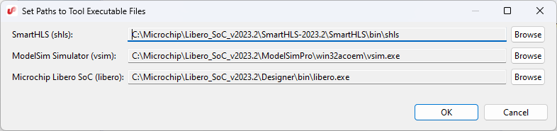

10. An important panel of the SmartHLS IDE is the **Project Explorer** on the left side of the window, as shown in the following figure. You will use the project explorer throughout this tutorial to view source files and synthesis reports. Click on the small arrow icon to expand the `sobel_part1` project. Now double click any of the source files, such as `sobel.cpp`, and you will see the source file appear in the main panel to the right of the **Project Explorer**.

    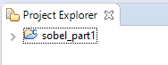

    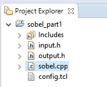

11. After creating a project in SmartHLS, you should open one of the source files, like `sobel.cpp`, or double-click on the `sobel_part1` directory in the **Project Explorer** pane. This action will set `sobel_part1` as the active project. If there are multiple projects open, you must select the project in the **Project Explorer** pane or open a file from the project to activate it before running any SmartHLS commands.

    The steps in the SmartHLS design flow are summarized in the following list:

    1.  Create the SmartHLS project and follow the standard software development process for C++ \(compile/run/debug\).
    2.  Apply HLS constraints \(like target clock period\) and compile the software into hardware using SmartHLS. You can check reports about the generated hardware.
    3.  Perform software/hardware co-simulation to validate the generated hardware.
    4.  Synthesize the hardware to our target FPGA to report hardware resource usage and Fmax.
    <br />

    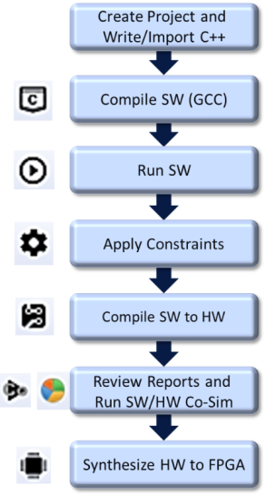

    At the top of SmartHLS, you will find a toolbar, shown in the figure below, that allows you to execute the main features of the SmartHLS tool. Hover over each icon to discover its function. The icons are listed in the table below the figure, starting from the left.

    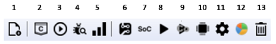

    |Icon|Description|
    |----|-----------|
    |1|Add files to a project|
    |**Software Development Flow**|
    |2|Compile software with GCC|
    |3|Run compiled software|
    |4|Debug software|
    |5|Profile software with gprof|
    |**Hardware Development Flow**|
    |6|Compile Software to Hardware|
    |7|Compile Software to Processor/Accelerator SoC|
    |8|Simulate Hardware|
    |9|Software/Hardware Co-simulation|
    |10|Synthesize Hardware to FPGA|
    |**Misc**|
    |11|Set HLS Constraints|
    |12|Launch Schedule Viewer|
    |13|Clean SmartHLS™ Project|

    You can also run SmartHLS commands from the **SmartHLS** top bar menu.

    You can now examine the code in `sobel.cpp`. In the `sobel_filter` function, the first line `#pragma HLS function top` indicates that this function is the main function of the project. SmartHLS will only create a hardware module for the main function and all related functions. The `sobel_filter` main function includes nested loops that process each pixel in the image. Within the loops, another set of nested loops handle the filter window at the current image location. For each non-border pixel, the 3x3 area around the pixel undergoes convolution with *G**x* and *G**y*, and then the magnitude is summed to produce the final output pixel.

    The main function validates the functionality of the `sobel_filter` function. The grayscale \(8-bit\) input image is stored in the 512x512 array `elaine_512_input` defined in `input.h`, while the expected output image is stored in `elaine_512_golden_output` defined in `output.h`. The `main` function sends the input image to the `sobel_filter` function and displays “PASS!” if the computed output matches the expected output.

12. Before compiling to hardware, you should verify that the C++ program is correct by compiling and running the software. This is typical of HLS design, where the designer will verify that the design is functionally correct in software before compiling it to hardware. Click on the **Compile Software** icon  in the toolbar. This compiles the software with the GCC compiler. You will see the output from the compilation appearing at the bottom of the screen in the **Console** window of the IDE.
13. Execute the compiled software by clicking on the **Run Software**icon  in the toolbar. You should see the message `PASS!` appearing in the **Console** window, as shown in the following figure.

    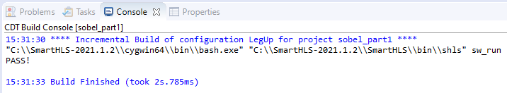

14. You can now compile the Sobel filter C++ software into hardware using SmartHLS by clicking on the toolbar icon  to **Compile Software to Hardware**. This command invokes SmartHLS to compile the top-level `sobel_filter` function into hardware. If the top-level function calls descendant functions, all descendant functions are also compiled to hardware. You can find the generated Verilog code in `sobel_part1.v`, as shown in the following figure.

    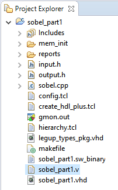

    When the compilation finishes, a SmartHLS report file \(`summary.hls.rpt`\) opens. The report shows the RTL interface of the top-level module corresponding to the top-level C++ function, the number of cycles scheduled for each basic block of the function, and the memories that are used in the hardware. In this example, you will see the top-level RTL module has three interfaces, the standard **Control** interface that is used by any SmartHLS-generated circuit and two **Memory** interfaces corresponding to the input and output array arguments of the top-level `sobel_filter` function. In the Memory Usage section of the report, there are no memories inside the generated hardware, as the input and output arrays are passed in as arguments into the top-level function. These input/output function arguments are listed as the I/O Memories table.

15. You can visualize the schedule and control flow of the hardware using the SmartHLS schedule viewer. Start the schedule viewer by clicking on the **Launch Schedule Viewer** icon  in the toolbar. In the left panel of the schedule viewer, you will see the names of the functions and basic blocks of each function. In this example, there is only one function that was compiled to hardware, `sobel_filter`. In the Explorer pane on the left, you see the `sobel_filter` function and eight basic blocks within the functions prefixed by `BB_`.
16. Double-click on the `sobel_filter` function in the call-graph pane, and you will see the control-flow graph for the function, similar to the following figure. The names of the basic blocks in the program are prefixed with `BB_`. Note that the basic block names may be slightly different depending on the version of SmartHLS you use. The basic block names are not easy to relate to the original C++ code. However, you can observe two loops in the control-flow graph, which correspond to the two outermost loops in the C++ code for the `sobel_filter` function. The inner loop contains basic blocks: `BB_for_body3`, `BB_for_cond14_preheader`, `BB_for_body3_for_inc54_crit_edge`, and `BB_for_inc54`. Try double-clicking on `BB_for_cond14_preheader` \(if the basic block names are different from the figure, click on the left-most basic block\).

    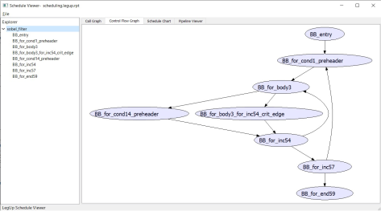

17. The following figure shows the schedule for `BB_for_cond14_preheader`, which is the main part of the inner-most loop body. The middle panel shows the names of the instructions. The right-most panel shows how the instructions are scheduled into states \(the figure shows that states 6 to 14 are scheduled for this basic block\). Hold your mouse over top of some of the blue boxes in the schedule, and you will see the inputs of the current instruction become red and outputs become orange. Look closely at the names of the instructions and try to connect the computations with those in the original C++ program. You will see that there are some loads, additions, subtractions, and shifts. Close the schedule viewer \(**FileExit**\).

    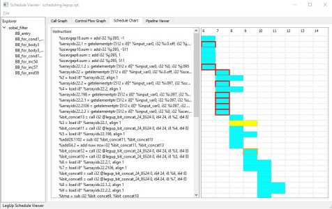

18. Simulate the Verilog RTL hardware with ModelSim to find out the number of cycles needed to execute the circuit – the cycle latency. Close the schedule viewer first, then click on the **SW/HW Co-Simulation**icon  in the toolbar. SW/HW co-simulation will simulate the generated Verilog module, `sobel_filter_top`, in RTL using ModelSim while running the rest of the program, `main`, in software. The co-simulation flow allows you to simulate and verify the SmartHLS-generated hardware without writing a custom RTL test bench. You will see various messages printed by ModelSim related to loading simulation models for the hardware in the **Console**window. The hardware may take a few minutes to simulate. You must focus on the messages near the end of the simulation, which will look like this:

    ```language-cpp
    ...
    # Cycle latency: 3392549
    # ** Note: $finish : ../simulation/cosim_tb.sv(279)
    # Time: 67851010 ns Iteration: 1 Instance: /cosim_tb
    # End time: 15:39:12 on Jun 30,2021, Elapsed time: 0:00:41
    # Errors: 0, Warnings: 0
    ...
    Info: Verifying RTL simulation
    ...
    Retrieving hardware outputs from RTL simulation for sobel_filter function call 1.
    PASS!
    ...
    Number of calls: 1
    Cycle latency: 3,392,549
    SW/HW co-simulation: PASS
    ```

    See that the co-simulation took 3,392,549 clock cycles to finish. The simulation printed `SW/HW co-simulation: PASS!` which indicates that the RTL generated by SmartHLS matches the software model. The co-simulation flow uses the return value from the `main` software function to determine whether the co-simulation has passed. If the `main` function returns 0, then the co-simulation will PASS otherwise, a nonzero return value will FAIL. Please make sure that your `main` function always follows this convention and returns 0 if the top-level function tests are all successful. In the `main` function of `sobel_part1`, also called the software test bench, we iterate over every pixel of the computed output image and verify the pixel against the expected value after calling the top-level function. A mismatch counter is incremented if a pixel is not as expected, and this counter value is returned by the `main` function. If all values match, then the `main` function will return 0. Since co-simulation printed PASS \(`main` returned 0\) it is verified that the generated hardware is correct.

19. You can also run co-simulation and launch ModelSim to show the Waveforms. From the SmartHLS top menu, select **SW/HW Co-Simulation with Waveforms**, as shown in the following figure.

    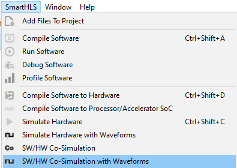

20. When ModelSim opens, it will prompt, “Are you sure you want to finish?”. Select **No**. You can view the signal waveforms as shown in the following figure. After you are finished, close ModelSim \(**FileQuit**\).

    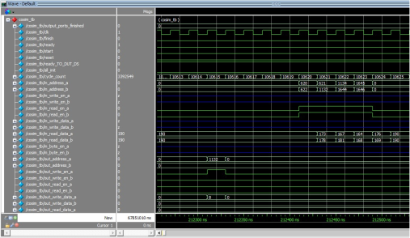

    Libero is the name of Microchip’s synthesis, placement, routing, and timing analysis tool. SmartHLS can execute Libero to synthesize, place and route the Verilog to the Microchip PolarFire FPGA to obtain information such as the resource usage and the Fmax of this design \(that is, the clock period\).

21. Click on the  icon on the toolbar to **Synthesize Hardware to FPGA**. SmartHLS will automatically invoke Libero to create a Libero project and synthesize the SmartHLS design targeting the PolarFire FPGA device. Libero may take a while to finish. Once the command completes, SmartHLS will open the `summary.results.rpt` report file. SmartHLS will summarize the resource usage and Fmax results reported by Libero after place and route. You should get similar results as what is shown below. Your numbers may differ slightly, depending on the version of SmartHLS and Libero you are using. This tutorial used Libero SoC v2021.1. The timing results and resource usage might also differ depending on the random seed used in the synthesis tool flow.

    ```language-cpp
    ====== 2. Timing Result ======
    +--------------+---------------+-------------+-------------+----------+-------------+
    | Clock Domain | Target Period | Target Fmax | Worst Slack | Period | Fmax |
    +--------------+---------------+-------------+-------------+----------+-------------+
    | clk | 10.000 ns | 100.000 MHz | 7.815 ns | 2.185 ns | 457.666 MHz |
    +--------------+---------------+-------------+-------------+----------+-------------+
    The reported Fmax is for the HLS core in isolation (from Libero's post-place-and-route timing analysis). 
    When the HLS core is integrated into a larger system, the system Fmax may be lower depending on the critical path of the system.
    ====== 3. Resource Usage ======
    +--------------------------+---------------+--------+------------+
    | Resource Type | Used | Total | Percentage |
    +--------------------------+---------------+--------+------------+
    | Fabric + Interface 4LUT* | 684 + 0 = 684 | 108600 | 0.63 |
    | Fabric + Interface DFF* | 432 + 0 = 432 | 108600 | 0.40 |
    | I/O Register | 0 | 852 | 0.00 |
    | User I/O | 0 | 284 | 0.00 |
    | uSRAM | 0 | 1008 | 0.00 |
    | LSRAM | 0 | 352 | 0.00 |
    | Math | 0 | 336 | 0.00 |
    +--------------------------+---------------+--------+------------+
    * Interface 4LUTs and DFFs are occupied due to the uses of LSRAM, Math, and uSRAM.
    Number of interface 4LUTs/DFFs = (36 * #.LSRAM) + (36 * #.Math) + (12 * #.uSRAM) = (36 * 0) + (36 * 0) + (12 * 0) = 0. 
    
    ```

    Wall-clock time is one of the key performance metrics for an FPGA design, computed as the product of the cycle latency and the clock period. In this case, our cycle latency was 3,392,549, and the clock period was 2.346 ns. The wall-clock time of our implementation is therefore 3,392,549 × 2.346 ns = 7.959 ms.

22. Close the project by right clicking on the `sobel_part1` folder in the Project Explorer pane, and click on **Close Project**.

## Step 2: Loop Pipelining

In this section, you will use loop pipelining to improve the throughput of the hardware generated<br /> by SmartHLS™. Loop pipelining allows a new<br /> iteration of the loop to be started before the current iteration has finished. By allowing the<br /> execution of the loop iterations to be overlapped, a higher throughput can be achieved. The<br /> amount of overlap is controlled by the initiation interval \(II\). The II indicates how many<br /> cycles are required before starting the next loop iteration. Thus, an II of 1 means a new loop<br /> iteration can be started every clock cycle, which is the best that can be achieved. The II<br /> needs to be larger than 1 in other cases, such as when there is a resource contention<br /> \(multiple loop iterations need the same resource in the same clock cycle\) or when there are<br /> loop-carried dependencies \(the output of a previous iteration is needed as an input to the<br /> subsequent iteration\). Resource contention commonly happens with memory accesses to dual-port<br /> block RAMs, which can only perform two memory accesses per cycle.

The following figure shows an example of loop pipelining. The following figure\(b\) shows the sequential loop, where a new loop iteration can start every three clock cycles \(II=3\), and the loop takes nine clock cycles to finish the final write. The following figure\(c\) shows the pipelined loop. In this example, there are no resource contentions or data dependencies. Therefore, the pipelined loop can start a new iteration every clock cycle \(II=1\) and takes only five clock cycles to finish the final write. As shown in this example, loop pipelining can significantly improve your circuit's performance, when there are no data dependencies or resource contentions.

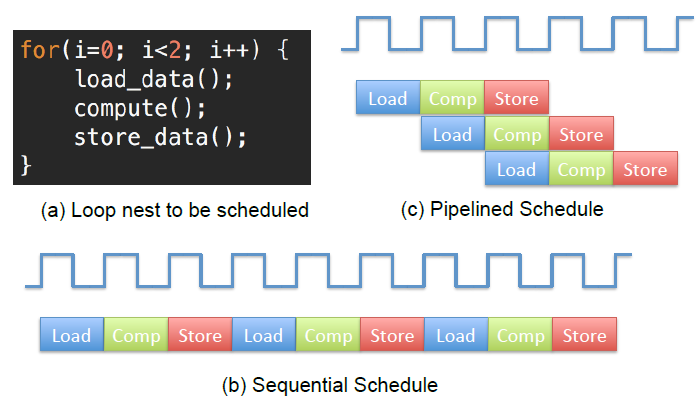

Follow the same procedure you used in the previous part of this tutorial \(include the source files for part 2 and target MPF100T-FCVG484I\), and create a new SmartHLS project for part 2. Once the project is created, open the part 2 source file `sobel.cpp`. With the Sobel filter, since each pixel of the output is dependent only on the input image and the constant matrices *G**x***and *G**y*, the calculation of each pixel would be pipelined. The loop pipeline pragma in front of the loop, `#pragma HLS loop pipeline`, tells SmartHLS to pipeline the loop and take advantage of loop parallelism:

```language-cpp
#pragma HLS loop pipeline
for (int i = 0; i < (HEIGHT – 2) * (WIDTH – 2); i++) {
```

You will notice that the pair of nested loops in part 1 \(previously using i and j\) have been flattened into one for a loop. The nested loops have been flattened to allow the application of loop pipelining on the entire loop body. Otherwise, when loop pipelining is applied on a nested outer loop, SmartHLS automatically unrolls the inner loops, which would not be possible with 512 iterations. See [Appendix: Loop Pipelining in Part 1 vs. Part 2](Chunk921617846.md#) for more details.

1.  You can now synthesize the design by clicking on the **Compile Software to Hardware**icon  in the toolbar. In the **Console**window, you should see messages similar to the following:

    ```language-cpp
    Info: Resource constraint limits initiation interval to 4.
    Resource 'in_external_memory_port' has 8 uses per cycle but only 2 units available.
    +--------------------------------------+---------------------------+---------------------+
    | Operation | Location | Competing Use Count |
    +--------------------------------------+---------------------------+---------------------+
    | 'load' (8b) operation for array 'in' | line 30 of sobel.cpp | 1 |
    | 'load' (8b) operation for array 'in' | line 30 of sobel.cpp | 2 |
    | 'load' (8b) operation for array 'in' | line 30 of sobel.cpp | 3 |
    | 'load' (8b) operation for array 'in' | line 30 of sobel.cpp | 4 |
    | 'load' (8b) operation for array 'in' | line 30 of sobel.cpp | 5 |
    | 'load' (8b) operation for array 'in' | line 30 of sobel.cpp | 6 |
    | 'load' (8b) operation for array 'in' | line 30 of sobel.cpp | 7 |
    | 'load' (8b) operation for array 'in' | line 30 of sobel.cpp | 8 |
    +--------------------------------------+---------------------------+---------------------+
    | | Total # of Competing Uses | 8 |
    +--------------------------------------+---------------------------+---------------------+
    ```

    These messages indicate that SmartHLS cannot achieve an II of 1 \(highest throughput\) due to resource conflicts – there are eight loads from the same RAM in the loop body. Since RAM blocks are dual-ported on an FPGA, we need four cycles to perform eight loads. Therefore, SmartHLS needs to schedule four cycles between successive iterations of the loop \(an initiation interval of 4\).

2.  You can visualize the 8 memory loads in the pipeline using the SmartHLS schedule viewer. Click on the **Launch Schedule Viewer** icon . Double-click on `sobel_filter`, then in the Control Flow Graph, you will see a basic block called `BB_for_body`. Double-click `BB_for_body` to reveal the loop pipeline schedule, similar to what is shown in the following figure. Horizontally from left to right shows the operations performed on successive clock cycles, and vertically going down shows successive loop iterations. Here, you can see that the II of the loop is 4 and that a new loop iteration starts every 4 cycles. You can also see the instructions that are scheduled in each cycle for each loop iteration. All instructions that are shown in the same column are executed in the same cycle. Now scroll to the far right in the schedule viewer. The dark black rectangle on the far right illustrates what the pipeline looks like in a steady-state. In steady-state, three iterations of the loop are “in-flight” at once. In steady-state, you can see that there are two loads in cycle 8 from iteration 1 \(the second row down\), two loads in cycle 9 from iteration 1, two loads in cycle 10 from iteration 2 \(third row down\), and two loads in cycle 11 from iteration 2. Thus the eight loads are spread out over four cycles, making the Initiation Interval = 4.

    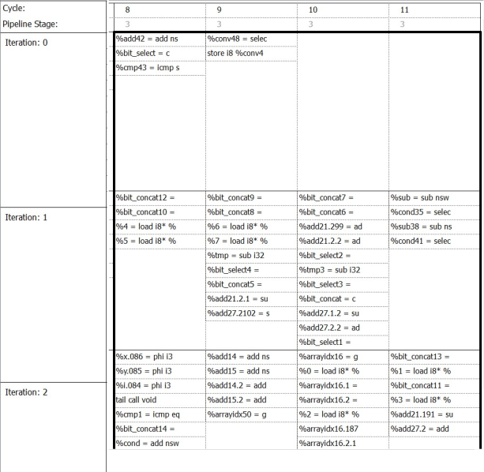

3.  Exit the schedule viewer and simulate the design in ModelSim by clicking on the **SW/HW Co-Simulation** icon  on the toolbar. You should see Console output similar to the following:

    ```language-cpp
    ...
    # Cycle latency: 1040413
    # ** Note: $finish : ../simulation/cosim_tb.sv(279)
    # Time: 20808290 ns Iteration: 1 Instance: /cosim_tb
    # End time: 00:04:28 on Jun 30,2021, Elapsed time: 0:00:37
    # Errors: 0, Warnings: 0
    ...
    Info: Verifying RTL simulation
    ...
    Retrieving hardware outputs from RTL simulation for sobel_filter function call 1.
    PASS!
    ...
    Number of calls: 1
    Cycle latency: 1,040,413
    SW/HW co-simulation: PASS
    ```

    Observe that the loop pipelining has dramatically improved the cycle latency for the design, reducing it from 3,392,549 cycles to 1,040,413 cycles in total.

4.  Use Microchip’s Libero® to map the design onto the PolarFire® FPGA by clicking on the **Synthesize Hardware to FPGA**icon  on the toolbar. Once the synthesis run finishes, examine the FPGA speed \(FMax\) and area data from the `summary.results.rpt` report file. You should see results similar to the following:

    ```language-cpp
    ====== 2. Timing Result ======
    +--------------+---------------+-------------+-------------+----------+-------------+
    | Clock Domain | Target Period | Target Fmax | Worst Slack | Period | Fmax |
    +--------------+---------------+-------------+-------------+----------+-------------+
    | clk | 10.000 ns | 100.000 MHz | 7.288 ns | 2.712 ns | 368.732 MHz |
    +--------------+---------------+-------------+-------------+----------+-------------+
    ...
    ====== 3. Resource Usage ======
    +--------------------------+---------------+--------+------------+
    | Resource Type | Used | Total | Percentage |
    +--------------------------+---------------+--------+------------+
    | Fabric + Interface 4LUT* | 778 + 0 = 778 | 108600 | 0.72 |
    | Fabric + Interface DFF* | 535 + 0 = 535 | 108600 | 0.49 |
    | I/O Register | 0 | 852 | 0.00 |
    | User I/O | 0 | 284 | 0.00 |
    | uSRAM | 0 | 1008 | 0.00 |
    | LSRAM | 0 | 352 | 0.00 |
    | Math | 0 | 336 | 0.00 |
    +--------------------------+---------------+--------+------------+
    ```


## Step 3: Designing Streaming/Dataflow Hardware

The final hardware implementation covered in this tutorial is called a *streaming* implementation \(also sometimes called a *dataflow* implementation\). Streaming hardware can accept new inputs at a regular initiation interval \(II\), for example, every cycle. This bears some similarity to the loop pipelining part of the tutorial you completed above. While the streaming hardware is processing one set of inputs, new inputs can continue to be injected into the hardware every II cycles.

For example, a streaming hardware module might have a *latency* of 10 clock cycles and an II of 1 cycle. This would mean that, the hardware takes 10 clock cycles to complete its work for a given set of inputs. However, the hardware can continue to receive new inputs every single cycle. Streaming hardware is thus very similar to a pipelined processor, where multiple instructions are in flight at once, at intermediate stages of the pipeline. The word “streaming” is used because the generated hardware operates on a continuous stream of input data and produces a stream of output data. Image, audio, and video processing are all examples of streaming applications.

In this part of the tutorial, you will synthesize a circuit that accepts a new input pixel of an image every cycle \(the input stream\) and produces a pixel of the output image \(the output stream\). Given this desired behavior, an approach that may spring to your mind is as follows:

1.  Read in the entire input image, pixel by pixel.
2.  Once the input image is stored, begin computing the Sobel-filtered output image.
3.  Output the filtered image, pixel by pixel. While this approach is certainly possible, it suffers from several weaknesses.

First, if the input image is 512x512 pixels, then it would take 262,144 cycles to input an image, pixel by pixel. This represents a significant wait before seeing any output. Second, you would need to store the entire input image in memory. Assuming 8-bit pixel values, this would require 262KB of memory. An alternative widely used approach to streaming image processing is to use *line buffers*.

The following figure shows the 3x3 Sobel filter sweeping across an input image. From this figure, a key observation can be made. Namely, that to apply the Sobel filter, you do not need the *entire*input image. Instead, you only need to store the previous two rows of the input image, along with a few pixels from the current row being received \(bottom row of pixels in the figure\). Leveraging this observation, you can drastically reduce the amount of memory required to just two rows of the input image. The memory used to store the two rows are called “line buffers”, and they can be efficiently implemented as block RAMs on the FPGA.


1.  Create a new SmartHLS™ project for part 3 of the tutorial and include all the `.cpp` and `.h` files for part 3. Again, specify Microchip’s PolarFire® custom device \(MPF100T-FCVG484I\) and finish creating the project. Examine the `sobel.cpp` file in the project viewer, and you will find the following line:

    ```language-cpp
    static LineBuffer<unsigned char, WIDTH, 3> line_buffer;
    ```

    This<br /> statement “instantiates” SmartHLS’s LineBuffer template class from the<br /> `<hls/image_processing.hpp>` C++ library to create a<br /> line\_buffer object. The template parameters specify the desired line buffer<br /> configuration:

    1.  Use “unsigned char” 8-bit type to represent pixels
    2.  Set image width to WIDTH
    3.  Set the filter size to 3.
    Inside the LineBuffer, there are internal arrays for storing the previous rows<br /> \(two rows when filter size is 3\) and an externally accessible 2D array named<br /> `window` to contain pixels in the current 3x3 receptive field. The<br /> line\_buffer is declared as static so that its internal state and memory are retained<br /> between functions calls.

    A few lines below, you should see<br /> `line_buffer.ShiftInPixel(input_pixel);`. Each call of the<br /> `ShiftInPixel()` function pushes in a new pixel into the line buffer and<br /> updates the line buffer’s internal previous-row arrays as well as the receptive field<br /> window. In the subsequent nested loop, you will see the 3x3 receptive field is accessed by<br /> reading the `window` array, i.e., `line_buffer.window[m + 1][n + 1]`.

    A common feature of streaming hardware is called a<br /> FIFO \(first-in-first-out\) queue. We use FIFO queues to interconnect the various streaming<br /> components, as shown in the following figure. Here, we see a system with four streaming<br /> hardware modules, often called *kernels*\(not to be confused with the convolutional<br /> kernels used in the Sobel filter!\). The hardware kernels are connected with FIFO queues in<br /> between them. A kernel consumes data from its input FIFO queue\(s\) and pushes computed data<br /> into its output queue\(s\). If its input queue is empty, the kernel stalls \(stops<br /> executing\). Likewise, if the output queues are full, the unit stalls. In the example in<br /> the following figure, kernel 4 has two queues on its input, and consequently, kernel 4<br /> commences once a data item is available in both of the queues.

    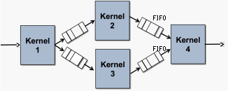

    The SmartHLS tool provides an easy-to-use FIFO data structure to interconnect streaming kernels, which is automatically converted into a hardware FIFO during circuit synthesis. Below is a snippet from the `sobel_filter` function in the `sobel.cpp` file. Observe that the input and output FIFOs are passed by reference to the function. A pixel value is read from the input FIFO via the read\(\) function; later, a pixel is written to the output FIFO through the write\(\) function. These functions are declared in the `hls/streaming.hpp` header file.

    ```language-cpp
    void sobel_filter(FIFO<unsigned char> &input_fifo,
    FIFO<**unsigned** **char**> &output_fifo) {
    ...
    unsigned char input_pixel = input_fifo.read();
    ...
    output_fifo.write(outofbounds ? 0 : sum);
    ...
    }
    ```

    The rest of the `sobel_filter` function is very similar to the previous parts of this tutorial. An exception relates to the use of static variables so that data can be retained across calls to the function. A count variable tracks the number of times the function has been invoked, and this is used to determine if the line buffers have been filled with data. Two static variables, i and j keep track of the row and column of the current input pixel being streamed into the function; this tracking allows the function to determine whether the pixel is out of bounds for the convolution operation \(that is, on the edge of the image\). The `sobel_filter` top-level function has an additional pragma:

    ```language-cpp
    #pragma HLS function pipeline
    ```

    This<br /> pragma tells SmartHLS that the `sobel_filter` function is<br /> intended to be a streaming kernel.

    In the main function in<br /> `sobel.cpp`, you will see that FIFOs are declared in the beginning.<br /> The FIFO class has a template parameter to specify the data type stored inside the FIFO.<br /> The FIFO constructor argument specifies the depth \(how many elements can be stored\). In<br /> this case, the FIFOs are declared to have the unsigned char data type to create 8-bit wide<br /> FIFOs.

    In the main function, you see that the image input data \(stored in<br /> `input.h`\) is pushed into the `input_fifo` and the<br /> Sobel filter is invoked for *HEIGHT x WIDTH* times. Finally, the output values are<br /> checked for correctness and PASS or FAIL is reported. The main function returns 0 if the<br /> output values are correct.

2.  Click the icons to compile  and run the software , and you should see the computed and golden pixel values and the message `RESULT: PASS`.
3.  Generate the hardware with SmartHLS by clicking on the **Compile Software to Hardware**icon . In the report file \(`summary.hls.rpt`\) that opens, you should see the top-level RTL interface now includes an input AXI stream interface and an output AXI stream interface, corresponding to the `input_fifo` and `output_fifo` arguments of the top-level function. Under Pipeline Result that the `sobel_filter` function is pipelined and has an initiation interval of 1.

    ```language-cpp
    ====== 3. Pipeline Result ======
    +--------------+--------------+-------------+-------------------------+---------------------+-----------------+
    | Label | Function | Basic Block | Location in Source Code | Initiation Interval | Pipeline Length |
    +--------------+--------------+-------------+-------------------------+---------------------+-----------------+
    | sobel_filter | sobel_filter | %init.check | line 12 of sobel.cpp | 1 | 7 |
    +--------------+--------------+-------------+-------------------------+---------------------+-----------------+
    ```

    This circuit has memories inside the hardware \(see Local Memories under Memory Usage\) due to the line buffers and the counters that are used. You can see that there are two RAMs in the circuit, both with 4096 bits, corresponding to the two-line buffers, each storing 512 x 8-bit pixels. Note that other local memories from the report have been removed from the snippet below:

    ```language-cpp
    +-----------------------------------------------------------------------------------------------------------+
    | Local Memories |
    +-----------------------------------------+-----------------------+------+-------------+------------+-------+
    | Name | Accessing Function(s) | Type | Size [Bits] | Data Width | Depth |
    +-----------------------------------------+-----------------------+------+-------------+------------+-------+
    ... ... ...
    ... ... ...
    ... ... ...
    | sobel_filter_line_buffer_prev_row_a0_a0 | sobel_filter | RAM | 4096 | 8 | 512 |
    | sobel_filter_line_buffer_prev_row_a1_a0 | sobel_filter | RAM | 4096 | 8 | 512 |
    ```

4.  Simulate the streaming hardware by clicking on the **SW/HW Co-Simulation**icon . You will see scrolling output in the Console window, reporting the computed and expected pixel value at each clock cycle. After a few minutes, the co-simulation will finish, and in the Console, you should see:

    ```language-cpp
    ...
    PASS!
    ...
    Number of calls: 262,658
    Cycle latency: 262,667
    SW/HW co-simulation: PASS
    ```

    The total number of clock cycles is about 262,667, which is very close to 512 x 512 = 262,144. The number of cycles for the streaming hardware is close to the total number of pixels computed, which confirms that you are processing 1 pixel every clock cycle \(Initiation Interval is 1\). At the end of the co-simulation, you should see that the co-simulation has passed.

5.  You can now synthesize the circuit with Libero® targeting the PolarFire FPGA by clicking on the **Synthesize Hardware to FPGA**icon  in the toolbar. You should see the following results in the `summary.results.rpt` report file:

    ```language-cpp
    ====== 2. Timing Result ======
    +--------------+---------------+-------------+-------------+----------+-------------+
    | Clock Domain | Target Period | Target Fmax | Worst Slack | Period | Fmax |
    +--------------+---------------+-------------+-------------+----------+-------------+
    | clk | 10.000 ns | 100.000 MHz | 6.064 ns | 3.936 ns | 254.065 MHz |
    +--------------+---------------+-------------+-------------+----------+-------------+
    ...
    ====== 3. Resource Usage ======
    +--------------------------+----------------+--------+------------+
    | Resource Type | Used | Total | Percentage |
    +--------------------------+----------------+--------+------------+
    | Fabric + Interface 4LUT* | 486 + 72 = 558 | 108600 | 0.51 |
    | Fabric + Interface DFF* | 398 + 72 = 470 | 108600 | 0.43 |
    | I/O Register | 0 | 852 | 0.00 |
    | User I/O | 0 | 284 | 0.00 |
    | uSRAM | 0 | 1008 | 0.00 |
    | LSRAM | 2 | 352 | 0.57 |
    | Math | 0 | 336 | 0.00 |
    +--------------------------+----------------+--------+------------+
    ```

    SmartHLS also allows you to give a target clock period constraint, which the<br /> compiler uses to schedule the operations in the program and insert registers so that the<br /> generated circuit can be implemented accordingly. It may not always be possible for SmartHLS to meet the user-provided target period precisely due to the<br /> complexity of the circuit or the physical properties of the target FPGA device, but in<br /> general, a lower clock period constraint leads to higher Fmax. A lower clock<br /> period may cause a larger circuit area due to SmartHLS inserting more<br /> registers, and a higher clock period constraint leads to lower Fmax but can also have less<br /> area.

6.  Open the HLS Constraints dialog by clicking the icon  where you can change the target clock period constraint. As shown in the following figure, select **Set target clock period** for **Constraint Type** and set **Constraint Value** to the desired clock period in nanoseconds: 7. Click on the **Add** button. The constraint will appear in the list of active HLS constraints. Click on **OK**.

    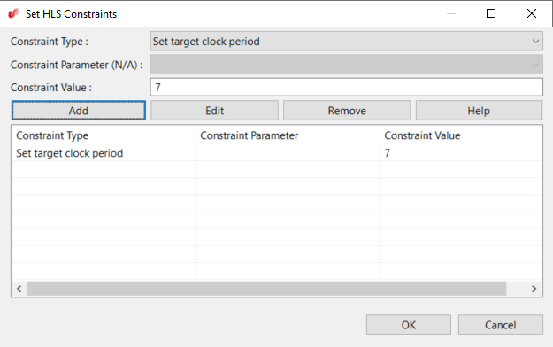

    If the target clock period constraint is not provided by you, as in this tutorial,<br /> SmartHLS will use the default target clock period constraint that has<br /> been set for each target FPGA device. The default clock period constraint is 10 ns for the<br /> Microchip PolarFire FPGA.

7.  Now that the clock period constraint is lowered to 7 ns, you can recompile software to hardware by clicking the icon . You should see the pipeline length has increased from 7 to 12 cycles as shown in the following `summary.hls.rpt` report file:

    ```language-cpp
    ====== 3. Pipeline Result ======
    +--------------+--------------+-------------+-------------------------+---------------------+-----------------+
    | Label | Function | Basic Block | Location in Source Code | Initiation Interval | Pipeline Length |
    +--------------+--------------+-------------+-------------------------+---------------------+-----------------+
    | sobel_filter | sobel_filter | %init.check | line 12 of sobel.cpp | 1 | 12 |
    +--------------+--------------+-------------+-------------------------+---------------------+-----------------+
    ```

    The pipeline length increased because SmartHLS has added additional pipeline stages/registers to achieve the higher target Fmax. You can also synthesize the generated circuit with Libero to examine the impact of the clock period constraint on the generated circuit.


## Step 4: Instantiating SmartHLS IP Core in Libero SmartDesign

After you use SmartHLS to design a hardware IP component, you can instantiate the component into Libero SmartDesign and integrate this core into our larger system. When SmartHLS generates the hardware, SmartHLS will also generate a `create_hdl_plus.tcl` script to easily instantiate the SmartHLS-generated IP core into Libero SmartDesign. You will see the Info message in the SmartHLS IDE console window, which includes the full path to the script:

```language-cpp
Info: Generating HDL+ Tcl script to be imported in SmartDesign: `C:\SmartHLS-2021.1.2\workspace\sobel_part3\create_hdl_plus.tcl.`
```

1.  Open Libero SoC from the **Start** menu. Create a new Libero Project by selecting from the top menu: **Project** &gt; **New Project**. Choose any project name and target PolarFire® FPGAs. In the new Libero project, create a new SmartDesign by double-clicking **Create SmartDesign**, as shown in the following figure. Choose any name in the **Create New SmartDesign** dialog.

    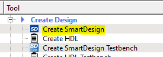

2.  Go to the Libero **Project** menu and select **Execute Script** and give the path to the generated `create_hdl_plus.tcl` script, as shown in the following figure. Click on **Run**.

    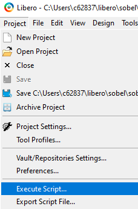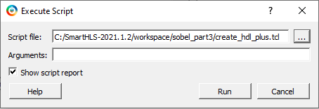

    Running the Tcl script will add the SmartHLS-generated HDL+ component `sobel_filter_top` and all required Verilog files, memory initialization files, and other dependencies to the Libero project. You must see the Execute Script command succeeded, as shown in the following figure.

    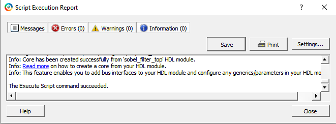

3.  As shown in the following figure, you can now instantiate the component in SmartDesign by right-clicking on the `sobel_filter_top` HDL+ component in the **Design Hierarchy** panel on the left and selecting **Instantiate in system**. In the SmartDesign system, you will now see the new `sobel_filter_top_0` IP component.

    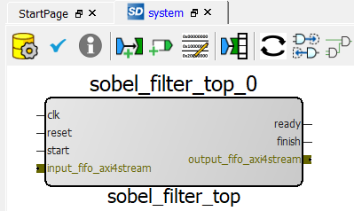

    Since the `sobel_filter_top` IP component used SmartHLS FIFOs as top-level arguments, SmartHLS has automatically grouped the `output_fifo` and `input_fifo` data/ready/valid ports as AXI4-Stream bus interfaces.

    You also have the option to expose the sub-signals under the AXI4-Stream bus. This will allow you to connect individual ports instead of the entire bus. To do this, right click on the AXI4-Stream bus on the SmartHLS-generated IP component and choose **Show/Hide BIF Pins**. Then choose the sub-signals as appropriate.

4.  Example: As shown in the following figure, you can right click the **output\_fifo\_axi4stream** bus and choose to **Show/Hide BIF Pins**, then you select all 3 pins and press **OK**. You will now see that the **sobel\_filter\_top\_0** IP component has an input pin for **output\_fifo\_ready**, an output pin for **output\_fifo\[7:0\]**, and an output pin for **output\_fifo\_valid**.

    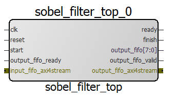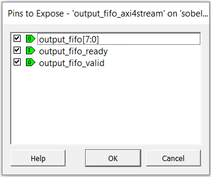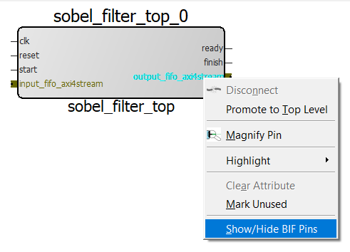


## Summary

High-level synthesis allows hardware to be designed at a higher level of abstraction, lowering<br /> design time and cost. In this tutorial, you have gained experience with several key high-level<br /> synthesis concepts in SmartHLS™, including<br /> loop pipelining and streaming/function pipelining, as applied to a practical example: edge<br /> detection in images. These key techniques allow you to create a high-performance circuit using<br /> the software.

## Appendix: Loop Pipelining in Part 1 vs. Part 2

In Part 2 of the tutorial, it was noted that the nested loops from Part 1 were manually flattened into a single for loop \(called “loop flattening”\). As shown in `sobel.cpp` from Part 2 below:

```language-cpp
#pragma HLS loop pipeline
 for (int i = 0; i < (HEIGHT - 2) * (WIDTH - 2); i++) {
 // increment row when column reaches end of row
 y = (x == WIDTH - 2) ? y + 1 : y;
 // increment column until end of row
 x = (x == WIDTH - 2) ? 1 : x + 1;
```

The nested loops were flattened because SmartHLS does not support loop pipelining nested loops without unrolling the inner loops. For example, if you open `sobel.cpp` from Part 1 and add a pragma to pipeline the outer loop of the nested loop:

```language-cpp
#pragma HLS loop pipeline
 for (int i = 0; i < HEIGHT; i++) {
 for (int j = 0; j < WIDTH; j++) {
 // Set output to 0 if the 3x3 receptive field is out of bound.
 if ((i < 1) | (i > HEIGHT - 2) | (j < 1) | (j > WIDTH - 2)) {
 out[i][j] = 0;
 continue;
 }
```

Then SmartHLS will try to fully unroll the innermost loop \(j index\) but SmartHLS will give a warning in the Console output since the loop has many iterations:

```language-cpp
Warning: Failed to unroll the entire loop nest on line 19 of sobel.c.
```

And since the innermost loop has not been unrolled, then the loop cannot be pipelined:

```language-cpp
Warning: SmartHLS cannot pipeline nested loops.
```

See the following screenshot from the SmartHLS IDE console.

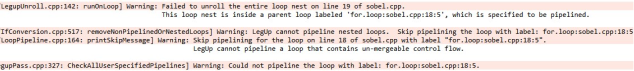

If you pipeline the innermost loop, then the hardware will be less efficient than flattening the nested loop into a single loop. Because for each outer loop iteration, you will need to stop and wait for the innermost loop pipeline to finish. If the nested loops are flattened, and everything is pipelined, then all the iterations can be overlapped, and you never need to wait.

For example, if you open `sobel.cpp` from Part 1 and pipeline the innermost loop by adding the loop pipeline pragma:

```language-cpp
 for (int i = 0; i < HEIGHT; i++) {
#pragma HLS loop pipeline
 for (int j = 0; j < WIDTH; j++) {
 // Set output to 0 if the 3x3 receptive field is out of bound.
 if ((i < 1) | (i > HEIGHT - 2) | (j < 1) | (j > WIDTH - 2)) {
 out[i][j] = 0;
 continue;
 }
```

When you re-run Software to Hardware by clicking on the  icon. The initiation interval of the innermost loop is 4 as shown in the following summary report:

```language-cpp
====== 3. Pipeline Result ======
+-------------------------+--------------+-------------+-------------------------+---------------------+-----------------+-----------------+---------+
| Label | Function | Basic Block | Location in Source Code | Initiation Interval | Pipeline Length | Iteration Count | Latency |
+-------------------------+--------------+-------------+-------------------------+---------------------+-----------------+-----------------+---------+
| for_loop_sobel_cpp_20_6 | sobel_filter | %for.body3 | line 20 of sobel.cpp | 4 | 10 | 512 | 2054 |
+-------------------------+--------------+-------------+-------------------------+---------------------+-----------------+-----------------+---------+
```

Run co-simulation  and see the Console output as shown below:

```language-cpp
Number of calls: 1
Cycle latency: 1,052,677
SW/HW co-simulation: PASS
make[1]: Leaving directory '.../workspace/sobel_part1'
15:51:35 Build Finished (took 1m:51s.138ms)
```

This cycle latency roughly corresponds to 512 \(outer loop iterations\) x 2054 \(latency of innermost loop pipeline\) = 1,051,648 cycles. There are extra cycles for the hardware running before and after the pipelined loop.

Compare this latency to `sobel.cpp` in Part 2 when you pipelined the flattened loop:

```language-cpp
#pragma HLS loop pipeline
 for (int i = 0; i < (HEIGHT - 2) * (WIDTH - 2); i++) {
 // increment row when column reaches end of row
 y = (x == WIDTH - 2) ? y + 1 : y;
 // increment column until end of row
 x = (x == WIDTH - 2) ? 1 : x + 1;
 When we run compile software to hardware  and we look at the summary report:
====== 3. Pipeline Result ======
+-------------------------+--------------+-------------+-------------------------+---------------------+-----------------+-----------------+---------+
| Label | Function | Basic Block | Location in Source Code | Initiation Interval | Pipeline Length | Iteration Count | Latency |
+-------------------------+--------------+-------------+-------------------------+---------------------+-----------------+-----------------+---------+
| for_loop_sobel_cpp_20_5 | sobel_filter | %for.body | line 20 of sobel.cpp | 4 | 11 | 260100 | 1040407 |
+-------------------------+--------------+-------------+-------------------------+---------------------+-----------------+-----------------+---------+
```

The initiation interval of the flattened loop is still 4. But the pipeline length/depth is now 1 cycle longer \(11 cycles instead of 10 cycles\).

When you run co-simulation  you see the Console output as shown below:

```language-cpp
Number of calls: 1
Cycle latency: 1,040,413
SW/HW co-simulation: PASS
make[1]: Leaving directory '.../workspace/sobel_part2'
15:59:45 Build Finished (took 1m:40s.823ms)
```

This cycle latency roughly corresponds to the 1,040,407 latency reported in the last column, “Latency” in the pipeline summary report. Flattening the loop improves the cycle latency from: 1,052,677 to 1,040,413 \(1% improvement\). In this case, there is not much improvement by loop flattening. But depending on the loop nest, there can be a big impact.

