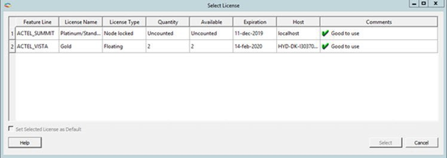
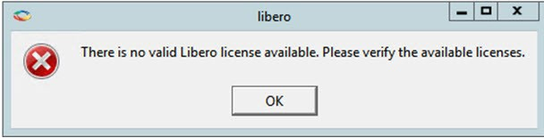
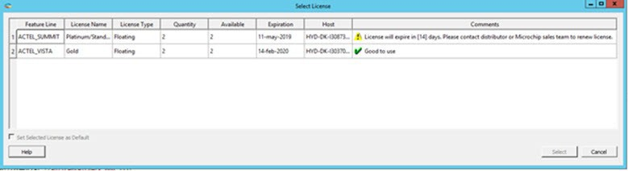
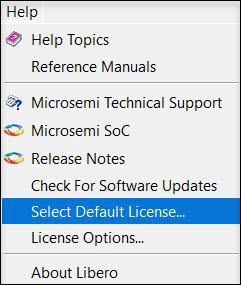
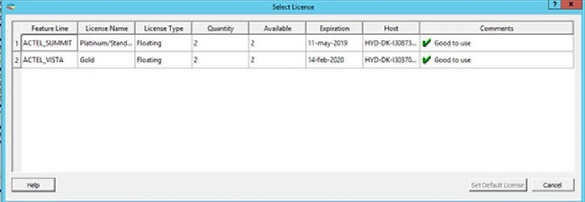
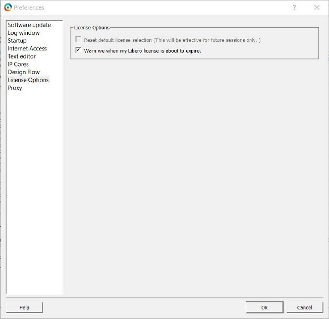
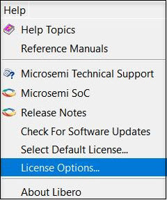
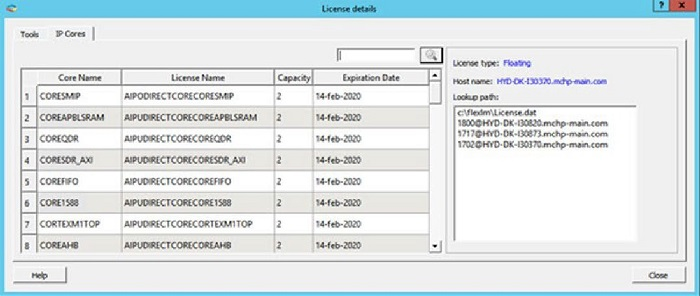

# Managing Licenses

This chapter describes Libero SoC licensing.

## Microchip License Utility

The Microchip License Utility allows you to check and update your license settings for the Libero  SoC software. It displays your current license settings and the license host-id for the  current host, and allows you to add a new license file to your settings.

### Starting the Microchip License Utility

Click **&lt;Installation Directory&gt;:\\Microchip\\Libero\_SoC\_vXXXX\_X\\Designer\\bin\\** &gt; **actel\_lutil.exe**.

**Note:** If you have more than one license available and have not selected a default license, the [Select License dialog box](GUID-002B1810-11AC-4FDF-B9FA-41C838A297CF.md#) appears.

### Requesting a License

To request a license, navigate to the Microchip [Licensing page](https://www.microchip.com/en-us/products/fpgas-and-plds/fpga-and-soc-design-tools/fpga/licensing), and then click one of the  Purchase License options or click **Register a Free License**. You  are redirected to the microchipDIRECT website to generate a license.

The following table describes the available licenses.

|License|Description|
|-------|-----------|
|1 year Platinum|Purchased license that supports all devices.|
|1 year Gold|Purchased license that supports a smaller set of devices than  Platinum.|
|1 year Silver|Free license that supports a smaller set of devices than  Gold.|
|30-day Evaluation|Free license that supports all devices, but disables  programming.|

When you receive your license file, follow the instructions that come with it and save the  license to your local disk. In the Microchip License Utility window, click  **Add License File**, browse to the license file, and then select  it. If you use a floating license, click **Add License Server**, and  enter the port number and name of the license server host.

Although the list of features for which you are licensed shows all versions, your license  must have a version equal to or greater than your design tools release version for the  `libero.exe` and `designer.exe` tools to run.

The list at the lower right shows the order in which the license files are read. The first file  read appears at the top of the list.

### Printing the Licenses Report

Click **Write Report File** to print the Microchip Tools Licenses Report  or to save it as a `.txt` file.

### Related Information

For more information about licensing, including links to troubleshooting and FAQ documents, see  the [Microchip Libero SoC License Information Web Page](https://www.microchip.com/en-us/products/fpgas-and-plds/fpga-and-soc-design-tools/fpga/licensing#documents).

## Selecting a Default License from a License List

If you have more than one license available and have not selected a default license, the  Select License dialog box appears when you start the Microchip License Utility. Select  the feature license you want to use from the list of available licenses shown.

-   The **Quantity** and **Available** columns show the total number of licenses and number of available licenses, respectively.
-   The **License Type** column shows whether an available license is a Node Locked license, Floating license, or Server-based license. Floating and Server-based Licenses can be used by multiple users, depending on the number of seats available.

 

 

 

 

### Selecting a License to Use

1.  In the Select License dialog box, click **Select** to activate Libero using the selected license. This button is disabled by default and is enabled after you select a license.
2.  Check the **Set Selected License as Default** check box to save the selected license as the default license to be used for future sessions. Selecting this option skips the license selection step for future sessions. Use this option if you want to use the same license features for future sessions.
    -   If you select a license that was acquired by another user, the following message appears:

         

        

         

    -   If you select a license for which there are no valid licenses available,  the following message appears:

         

        

         

3.  To close the license selection window and exit Libero, click **Cancel**. To view the online help topic for License Selection, click **Help**.

### License Expiration

If a license will expire within 15 days, a warning appears in the  **Comments** column of the dialog box and in the Log window  \(see the following examples\).

 

 

## Setting a Default License

After you start Libero, use the following procedure to select the default Libero license  that will be used for future sessions.

1.  Click **Help &gt; Select Default License** to change the default license.

    

2.  When the Select License dialog box appears, click a row, and then click **Set Default License** to specify the Libero license you selected as the default.

    

3.  Close the dialog box.
4.  After you select a default Libero license, click **Project &gt; Preferences** to set license options in the Libero Preferences dialog box. The following table describes the options.

    

|Option|Description|
|------|-----------|
|Reset Default License Selection|This option is selected when a default license is available. When  checked, the default license is cleared and the check box is  disabled.|
|Warn we when my Libero license is about to expire|Enables or disables Notification of License expiry. When checked, a  message appears when the selected license’s expiration date is within 15  days. Use this option only when the license’s expiration date is longer  than 5 days and shorter than 15 days.|

## Viewing License Details

The License Details dialog box shows detailed information about Libero  SoC licenses and cores. To display this dialog box, click **Help &gt; License Options**.

The License Details dialog box has the following two tabs:

-   The **Tools** tab displays tool license details.
-   The **IP Cores** tab displays IP Cores license details, as shown in the following example.

The following table describes the elements in the dialog  box.

|Element|Description|
|-------|-----------|
|Close|Closes the dialog box.|
|Help|Displays the online help topic for License  Selection.|
|Filter|Searches for the pattern entered in the  text edit box. Filtered rows appear in the Cores table.|
|Lookup Path|Shows the list of License hosts included in  the LM\_LICENSE\_FILE.|

## Libero SoC Online Help

The Libero SoC online help system is designed to open in the HTML Help Viewer – Microsoft's Help  window for viewing compiled HTML Help. If you do not have the HTML Help Viewer  components installed on your system, you can view the help using Microsoft Internet  Explorer browser version 4.x or later.

The Libero SoC online help includes the following navigation tabs:

-   The **Contents** tab shows books and pages that represent the categories of information in the online help system. When you click a closed book, it opens to display its content of sub-books and pages. When you click an open book, it closes. When you click pages, you select topics to view in the right-hand pane of the HTML Help viewer.
-   The **Search** tab allows you to find topics that contain key words. Full-text searching searches through every word in the online help to find matches. When the search is completed, a list of topics appears, so you can select a topic to view.

**Note:** Linux users might need to set the `LINUX_HTMLREADER` variable to enable an HTML viewer. For example: `setenv LINUX_HTMLREADER/usr/bin/firefox`. If you do not set this variable, HTML files, such as the online help, will not be available from within the software.

## Libero SoC User Guides

Libero SoC includes online manuals that are in PDF format and are available from the Libero SoC  Start menu. To access these guides, click **All Programs** &gt; **Microchip** &gt; **Libero SoC** &gt; **Libero SoC Reference Manuals**. You must have Adobe Acrobat Reader or similar PDF viewer to open and  view the PDF user guides.

**Note:** Linux users might need to set their `LINUX_PDFREADER` variable to enable a PDF viewer. For example: `setenv LINUX_PDFREADER /usr/bin/kpdf`. If you do not set this variable, some PDF files will not be available from within the software.

