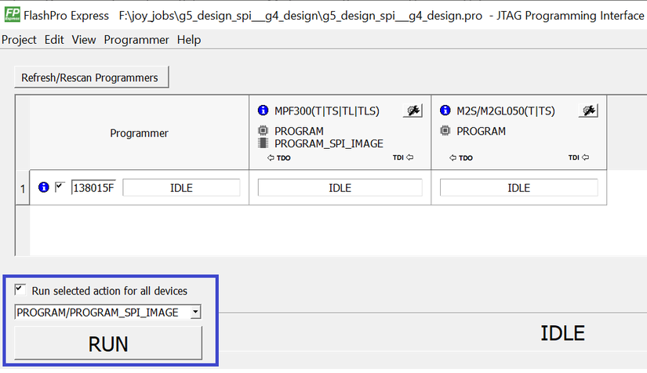
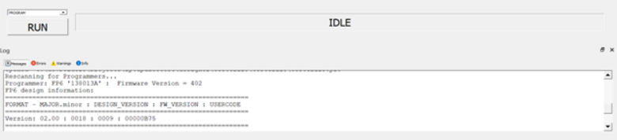
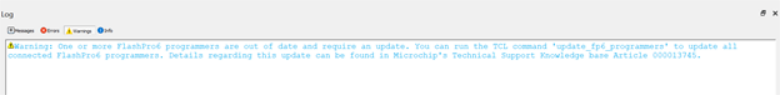

# FlashPro Express Modes

Starting with Libero SoC v12.5, FlashPro Express supports two modes:

-   Operator mode
-   Developer mode

Operator mode is a current flow that provides production programming. It is the  default mode and allows you to run selected actions for individual and all devices.

Developer mode allows you to:

-   Update jobs before running programming.
-   Enable or disable chain devices.
-   Load design and SPI Flash Programming files and select different programming actions for each chain device and SPI-Flash.
-   Run selected actions for individual and all devices.

You select Operator or Developer mode using the Preference dialog box \(**Project** &gt; **Preferences**\). The preference is saved per user per machine on Windows and per user on  Linux. The mode preference remains the same until you change it.

")

")

The FlashPro Express mode can be switched before opening a job. If a job is opened, you  are prompted to confirm closing of the job to save the mode preference after clicking  the **OK** button.

After a job is opened in Developer mode, each device displays:

-   An info \(\) icon with device specific data.
-   Design icon \(\). The per-device selected action appears next to the icon if the **Run selected action for all devices** option is unselected.
-   SPI Flash icon \(\) if SPI Flash programming is available for the device. The per-device selected SPI Flash action appears next to the icon if the **Run selected action for all devices** option is unselected.
-   Configure button \(\) providing a menu of configuration options based on the device. The configure button is enabled when no programming action is running.

The following list describes Developer mode features:

-   Device configuration options

    

    

-   Enable/Disable device for programming. The option allows the device to be enabled or disabled \(put in “bypass”\). You must load the programming file when enabling a device that is in “bypass,” with no programming file associated with the device or SPI-Flash. The device header info tooltip is updated with selected programming action if enabled or “bypass” if disabled.

    **Note:** The job cannot be saved if all devices are disabled or if any enabled devices do not have a loaded programming file. If all the devices are disabled, an actions combo box and a **Run** button are disabled.

-   Load Programming File. The option is available for the enabled devices to load a different programming file for the target device. FlashPro Express requires all programming files to be in the local job folder. When loading a programming file from outside the job folder the file will be copied to the job folder first and then loaded for the selected device. The user must confirm copying the programming file to the job folder and overwriting the existing file.
-   Select a programming action and configure actions and procedures per device. The option allows the selection of the programming action and configuration of the actions’ procedures. The option is available for an enabled device that has programming file loaded, and when the **Run selected action for all devices** option is unselected.
-   Load SPI Flash file. This option allows you to load a different SPI Flash programming file.
-   Select SPI Flash Action. The option allows the selection of the programming action for the SPI Flash. The option is available for the enabled device that has SPI Flash Programming File loaded, and when the **Run selected action for all devices** option is unselected.
-   Program device selected actions. In Developer mode, when the **Run selected action for all devices** check box is selected, FlashPro Express runs selected action from the drop-down list below the check box for all enabled devices – similar to Operator mode.

    

    When the **Run selected action for all devices** check box is unselected, the actions drop-down list is disabled. FlashPro Express runs the programming actions for the enabled device and SPI Flash, as selected uniquely for each device.

    

## Updating FlashPro6 Internal Design

FlashPro6 programmer internal design is updated to handle a corner case of JTAG state machine  traversal. This corner case is not observed using Libero or FlashPro Express tools, but  it needs to be fixed for integrating with other debug tools. The FlashPro6 design update  feature is added as part of the Libero or FlashPro Express software flow to detect the  current design version of the attached programmer and trigger an update if you choose  to. This update is possible only in Developer mode. Operator mode does not support this  feature. The tool displays a warning message in the following two scenarios:

-   If you choose not to proceed with the update in Developer mode.
-   If the tool is in Operator mode and the programmer design is out of date.

You can update FlashPro6 with FlashPro Express tool or with Tcl Commands.

### Updating FlashPro6 Internal Design To New Version In Developer Mode

In order to update FlashPro6 internal design from old version to new version in Developer  mode, you need to follow the below steps:

1.  On connecting the FlashPro6 programmers, the **Message** window displays the design information.
2.  After executing the **RUN** action, the FlashPro6 update starts.
3.  A warning message pop up displays all the FlashPro6 programmers that need to be updated. You can choose whether you want the programmer to be updated with the latest design. If **Yes**, the flow starts updating all the programmers listed and then completes the action. If **No**, then the flow continues with the intended action \(in this case, it runs DEVICE\_INFO\) along with a warning message in **Warnings** window. Whenever, you choose **RUN**, it displays all the programmers that need to be updated, regardless of selecting **No** previously.

    **Note:** You must not disconnect the programmers while the update is running. If you do so, the programmer does not get detected by the operating system. It is recommended to contact Microchip FPGA Support to get the defective programmer repaired.

If update passes, the programmer message shows that the update passed.

The below example shows how the  design version in FlashPro6 programmer 138013A is updated from old version 0018 to  new version 001A.

On connecting the programmer, the message window displays  the design version 0018 for FlashPro6 programmer 138013A.

After executing the **RUN** action, the FlashPro6 update starts. As shown in figure below, only one programmer is out of date \(that is, 138013A\).

On choosing **Yes**, the FlashPro6 programmer 138013A starts  updating. If the update passes, the programmer message shows that the update passed.  Once the programmer is updated, the design version of FlashPro6 programmer 138013A  is updated to design version 001A.

### Updating FlashPro6 Internal Design To New Version In Operator Mode

When a FlashPro6 programmer is out of date in Operator mode, a warning message is  displayed in **Warnings** window as shown in figure below.

The warning message states that one or more programmers require update. There are two  options to update the programmers:

1.  Switch to [developer mode](GUID-024D7BED-D3D5-4589-B215-2EDE1EC0E425.md#) and run an action.
2.  Use Tcl command `update_fp6_programmers` in your Tcl script.

 

