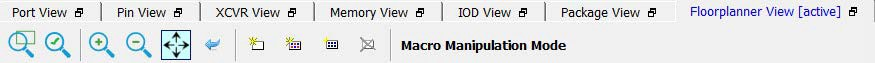
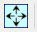
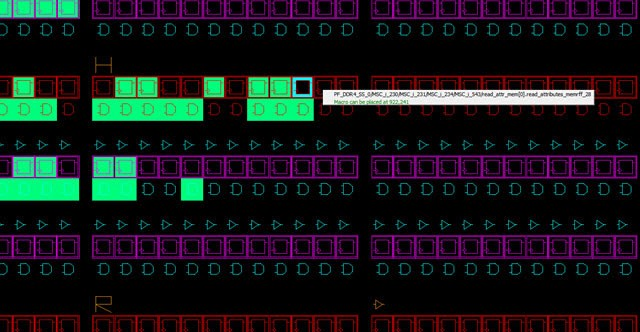
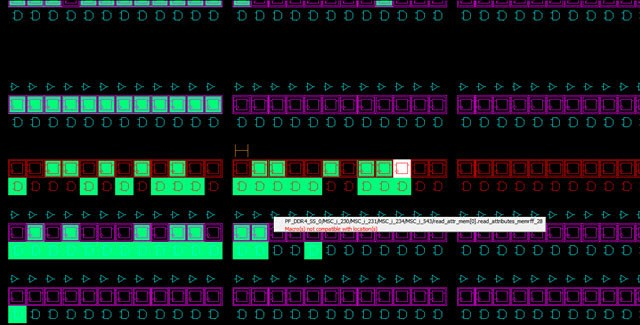

# Floorplanner View Icons

The icons available across the top of the Floorplanner View window allows  you to zoom in, zoom out, assign I/O banks, runs DRC checks, and create regions for  placement.

The following figure shows floorplanner view icons.

The following table lists the functions of each icon.

|Icon|Name|Function|
|----|----|--------|
||Rubber Band Zoom|Rubber Band Zoom - Drags out an area to enlarge/zoom into.|
||Rubber Band Select|Rubber Band Select an area to Zoom into. Click in the Floorplanner View and drag the mouse to delineate an area. Release the mouse and all macros inside the delineated area are selected.Works in the Macro Manipulation Mode.|
||Zoom In|Zoom In to canvas.|
||Zoom Out|Zoom Out of canvas.|
||Zoom to Fit|Zoom to fit the canvas size.|
||Zoom to Location|Zoom to a Location Specified by X-Y co-ordinates.|
||Zoom to fit Selection|Zoom to fit selected macros and ports. When enabled, the view attempts to center the view on the selected and placed ports.|
||Check Design Rules|Run the Prelayout Checker, a preliminary check of the netlist for possible Place and Route issues.|
||Check DRC Rules for Selected Interfaces|Check the DRC Rules for selected interfaces.|
||I/O Bank Settings|Set the I/O bank to specific I/O Technology.|
||Auto Assign I/O Bank|Run the Auto I/O Bank and Globals Assigner.  Assigns a voltage to every I/O Bank that does not have a voltage assigned to it  and if required, a VREF pin.|
||Collapse Visible Views|Collapse the visible views.|
||Expand Selected Items in Visible  Views|Expand selected Items in the visible  views.|
||Create Empty|Create an empty user region.|
||Create Inclusive|Create an inclusive user region.|
||Create Exclusive|Create an Exclusive user region.|
||Delete|Delete the selected user region.|
||Show Nets For Macros|Show all nets connected to the macro. There  are often many nets attached to the macro, and it is off by default.|

An object or a collection of the objects in the Design View window can be selected and placed in any location that is legal.

The following figure shows an example of a successful placement into the Floorplanner View.

The following figure shows an example of an unsuccessful placement  attempt into the Floorplanner View.

**Parent topic:**[Operating Modes](GUID-BA522578-5894-4CAA-9E78-66546C3F5B81.md)

