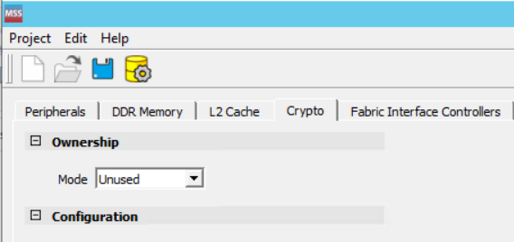
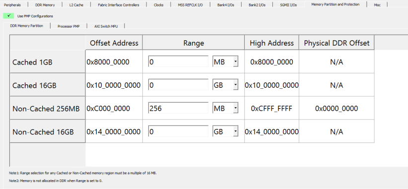
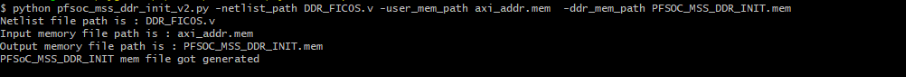
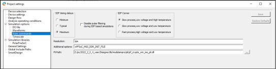
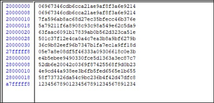

# DDR Controller

To enable fast simulation, the DDR controller follows a BFM behavioral model. It is a single<br /> model for DDR controller+PHY+DDR Memory, with no activity seen on the DDR pins connected<br /> to an external DDR memory. The DDR memory is modeled as a sparse array; it performs<br /> address decoding and prints row, column, bank, and rank address information in a<br /> simulation log. The following figure shows the Unused DDR dialog box.



When no DDR memory is selected in MSS stand-alone configurator, and FIC tries to access the DDR<br /> memory, MSS simulation model displays the following message in the simulation log.

```
# DDR is set to unused in the MSS Configuration, cannot process AXI transaction with address 00c7000000.
```

The MSS stand-alone configurator configures the MSS DDR and generates configuration parameters. The simulation model considers only the parameters in the following table.

|MSS Configurator|Considered Parameters|
|----------------|---------------------|
|DDR\_DDRC\_CFG\_CHIPADDR\_MAP\_CFG\_CHIPADDR\_MAP|All possible values|
|DDR\_DDRC\_CFG\_BANKADDR\_MAP\_0\_CFG\_BANKADDR\_MAP\_0|All possible values|
|DDR\_DDRC\_CFG\_ROWADDR\_MAP\_0\_CFG\_ROWADDR\_MAP\_0|All possible values|
|DDR\_DDRC\_CFG\_ROWADDR\_MAP\_1\_CFG\_ROWADDR\_MAP\_1|All possible values|
|DDR\_DDRC\_CFG\_ROWADDR\_MAP\_2\_CFG\_ROWADDR\_MAP\_2|All possible values|
|DDR\_DDRC\_CFG\_ROWADDR\_MAP\_3\_CFG\_ROWADDR\_MAP\_3|All possible values|
|DDR\_DDRC\_CFG\_COLADDR\_MAP\_0\_CFG\_COLADDR\_MAP\_0|All possible values|
|DDR\_DDRC\_CFG\_COLADDR\_MAP\_1\_CFG\_COLADDR\_MAP\_1|All possible values|
|DDR\_DDRC\_CFG\_COLADDR\_MAP\_2\_CFG\_COLADDR\_MAP\_2|All possible values|
|DDR\_DDRC\_CFG\_MEM\_COLBITS\_CFG\_MEM\_COLBITS|All possible values|
|DDR\_DDRC\_CFG\_MEM\_ROWBITS\_CFG\_MEM\_ROWBITS|All possible values|
|DDR\_DDRC\_CFG\_MEM\_BANKBITS\_CFG\_MEM\_BANKBITS|All possible values|
|DDR\_DDRC\_CFG\_NUM\_RANKS\_CFG\_NUM\_RANKS|All possible values|
|DDR\_DDRC\_CFG\_MANUAL\_ADDRESS\_MAP\_CFG\_MANUAL\_ADDRESS\_MAP|All possible values|
|DDR\_DDRC\_CFG\_MEMORY\_TYPE\_CFG\_MEMORY\_TYPE|All possible values|
|DDR\_DDRC\_CFG\_BG\_INTERLEAVE\_CFG\_BG\_INTERLEAVE|All possible values|
|DDR\_DDRC\_CFG\_BL\_MODE\_CFG\_BL\_MODE|8|
|DDR\_DDRC\_CFG\_DQ\_WIDTH\_CFG\_DQ\_WIDTH|All possible values|
|DDR\_DDRC\_CFG\_CWL\_CFG\_CWL\(DDR3/3L/4\)|All possible values|
|DDR\_DDRC\_CFG\_CL\_CFG\_CL\(DDR3/3L/4\)|All possible values|
|DDR\_DDRC\_CFG\_WL\_CFG\_WL\(LPDDR3/4\)|All possible values|
|DDR\_DDRC\_CFG\_RL\_CFG\_RL\(LPDDR3/4\)|All possible values|
|DDR\_DDRC\_CFG\_CLK\_FREQ|All possible values|

The following are the MSS DDR model limitations.

-   AXI transactions with 64-bit data only are supported. There is no support for word \(32-bit\), halfword \(16-bit\) based, and byte \(8-bit\) based AXI transactions.
-   Supports Burst Length of Fixed BL8 only.

In page hits and page misses in real time applications, this simulation model always considers<br /> page hits to avoid latencies caused by page misses.

You can access MSS DDR from any FIC interface and choose to share \(compromise\) bandwidth to the<br /> QoS initiator. By default, this QoS initiator is enabled and accesses DDR with default<br /> configurations. See [QoS Parameter](GUID-4AFF2337-4706-4047-9B3F-816B296AE461.md) for more details.

The fabric initiator can access the DDR memory with the following AXI address region.

|Type|64-bit Address Start|64-bit Address End|32-bit Address Start|32-bit Address End|
|----|--------------------|------------------|--------------------|------------------|
|Non-Cache access|0x14\_0000\_0000|0x17\_ffff\_ffff|0xc000\_0000|0xcfff\_ffff|
|Non-Cache WCB access|0x18\_0000\_0000|0x1b\_ffff\_ffff|0xd000\_0000|0xdfff\_ffff|

In **DDR Memory Partition** tab of MSS stand-alone configurator, the DDR<br /> memory is partitioned into **Cached** and<br /> **Non-Cached** region as shown in the following figure.



The stand-alone MSS configurator calculates the Physical DDR offset for each region, and this<br /> information is also used by the MSS simulation model. At present, the MSS-DDR simulation<br /> model supports access of Non-Cache region only from FPGA fabric.

After configuring the MSS-DDR and creating a Libero project, you can launch the pre-synthesis<br /> simulation. The following is an example of a simulation log of a fabric initiator, for<br /> example, PCIe-BFM accessing MSS-DDR.

```
###########################################################################
# AMBA BFM Model
# Version 2.1 22Dec08
#  
# Opening BFM Script file PCIE_1.vec
# Read 41 Vectors - Compiler Version 26.28
# BFM :Filenames referenced in Vectors
# PF_PCIE_C1_PF_PCIE_C1_0_PF_PCIE_PCIE_1_user.bfm
# BFM:22:writemultiple64 x c7000000 00000000 ... at 105 ns
# BFM: Data Write c7000000 0000000000000001
# BFM:24:readmultchk64 x c7000000 00000000 ... at 145 ns
# BFM: Data Write c7000008 0000000000000002
# Writing to DDR3 Memory @ rank = 0, bank = 00, row = 00700, col = 00000000, data = 00000001
# Writing to DDR3 Memory @ rank = 0, bank = 00, row = 00700, col = 00000001, data = 00000000
# Writing to DDR3 Memory @ rank = 0, bank = 00, row = 00700, col = 00000002, data = 00000002
# Writing to DDR3 Memory @ rank = 0, bank = 00, row = 00700, col = 00000003, data = 00000000
# Writing to DDR3 Memory @ rank = 0, bank = 00, row = 00700, col = 00000004, data = 00000003
# Writing to DDR3 Memory @ rank = 0, bank = 00, row = 00700, col = 00000005, data = 00000000
# Writing to DDR3 Memory @ rank = 0, bank = 00, row = 00700, col = 00000006, data = xxxxxxxx
# Writing to DDR3 Memory @ rank = 0, bank = 00, row = 00700, col = 00000007, data = xxxxxxxx
# BFM: Data Write c7000010 0000000000000003
# Reading from DDR3 Memory @ rank = 0, bank = 00, row = 00700, col = 00000000, data = 00000001
# Reading from DDR3 Memory @ rank = 0, bank = 00, row = 00700, col = 00000001, data = 00000000
# Reading from DDR3 Memory @ rank = 0, bank = 00, row = 00700, col = 00000002, data = 00000002
# Reading from DDR3 Memory @ rank = 0, bank = 00, row = 00700, col = 00000003, data = 00000000
# Reading from DDR3 Memory @ rank = 0, bank = 00, row = 00700, col = 00000004, data = 00000003
# Reading from DDR3 Memory @ rank = 0, bank = 00, row = 00700, col = 00000005, data = 00000000
# Reading from DDR3 Memory @ rank = 0, bank = 00, row = 00700, col = 00000006, data = xxxxxxxx
# Reading from DDR3 Memory @ rank = 0, bank = 00, row = 00700, col = 00000007, data = xxxxxxxx
# BFM: Data Read c7000000 0000000000000001 MASK:ffffffffffffffff at 385.000000ns
# BFM:27:return
# BFM: Data Read c7000008 0000000000000002 MASK:ffffffffffffffff at 395.000000ns
# BFM: Data Read c7000010 0000000000000003 MASK:ffffffffffffffff at 405.000000ns
#############################################################################
#  
# PCIE1 BFM Simulation Complete - 3 Instructions - NO ERRORS
#  
#############################################################################

```

You can disable the row and column related prints coming from the emulated DDR memory by using<br /> vsim commands as listed in following table.

<table id="TABLE_TZH_XSV_2PB"><thead><tr><th>

Parameter

</th><th>

Description

</th><th>

Value

</th></tr></thead><tbody><tr><td>

DEBUG\_MEM

</td><td>

Enable/disable the prints coming from DDR memory in simulation log.You can change<br /> the value of this parameter through vsim command as<br /> follows.To disable the prints:`vsim -L polarfire -L presynth -t 1ps -gDEBUG_MEM=0 presynth.tb`

</td><td>

-   1: Prints row and column related information in the simulation log \(Default\)
-   0: Does not print row and column related information in simulation log

</td></tr></tbody>
</table>The following is an example of a simulation log where PCIe-BFM accessing MSS-DDR with DDR memory and prints are disabled.

```
###########################################################################
# AMBA BFM Model
# Version 2.1 22Dec08
#  
# Opening BFM Script file PCIE_1.vec
# Read 41 Vectors - Compiler Version 26.28
# BFM :Filenames referenced in Vectors
# PF_PCIE_C1_PF_PCIE_C1_0_PF_PCIE_PCIE_1_user.bfm
# BFM:22:writemultiple64 x c7000000 00000000 ... at 105 ns
# BFM: Data Write c7000000 0000000000000001
# BFM:24:readmultchk64 x c7000000 00000000 ... at 145 ns
# BFM: Data Write c7000008 0000000000000002
# BFM: Data Write c7000010 0000000000000003
# BFM: Data Read c7000000 0000000000000001 MASK:ffffffffffffffff at 385.000000ns
# BFM:27:return
# BFM: Data Read c7000008 0000000000000002 MASK:ffffffffffffffff at 395.000000ns
# BFM: Data Read c7000010 0000000000000003 MASK:ffffffffffffffff at 405.000000ns
#############################################################################
#  
# PCIE1 BFM Simulation Complete - 3 Instructions - NO ERRORS
#  
#############################################################################

```

## DDR Memory Initialization

DDR memory is modeled as a sparse array, and it allows you to initialize DDR memory content with<br /> the `.mem` file. The pre-initialized DDR memory helps in many<br /> applications by avoiding you to perform first AXI write transactions and then<br /> readback, instead, the fabric ​host can now start reading the DDR memory from the<br /> start of the simulation. Follow the steps to initialize the DDR memory:

1.  Prepare a user `.mem` file with the AXI address and data.
2.  Execute a python script that converts the user `.mem` file to ddr `.mem` file. The simulation model reads the `.mem` file The address and data content from this file is used to initialize the internal memory array.
3.  Run a simulation to see and use the initialized data.

## User memory file \(`.mem`\)

Follow the instructions while creating a user `.mem` file:

-   The AXI address must start with "@" in each address line, and it must be within the range as listed in the following table.

    |Address Segment|Range|
    |---------------|-----|
    |32-bit address segment|0xC000\_0000 to 0xCFFF\_FFFF|
    |38-bit address segment|0x14\_0000\_0000 to 0x17\_FFFF\_FFFF|

    **Tip:** The memory contents can be distributed by specifying multiple AXI start addresses of the corresponding segment. The model automatically calculates incremental addresses for each location within the segment.

-   For `DQ_WIDTH` = 16 configuration, specify the AXI address with offset of 0x10 only. The maximum address that can be given in user mem file is 0xCFFF\_FFF0 for 32-bit address and 0x17\_FFFF\_FFF0 for 38-bit address. The AXI data to be initialized must have width = \(`DQ_WIDTH * BL_MAX`\) = 16\*8 = 128 bits.

    **Important:** At present, only `BL_MAX` = 8 is supported in simulation.

    The<br /> following code block shows the user memory file<br /> format.

    ``` {#CODEBLOCK_FVY_MFY_C5B}
    @ 32-bit AXI address
    128 bits of AXI data
    128 bits of AXI data
    .
    .
    128 bits of AXI data
    @ 38-bit AXI address
    128 bits of AXI data
    128 bits of AXI data
    .
    .
    128 bits of AXI data
    
    ```

-   For `DQ_WIDTH`=32 configuration, specify the AXI address with offset of 0x20 only. The maximum address that can be given in the user mem file is 0xCFFF\_FFE0 for 32-bit address and 0x17\_FFFF\_FFE0 for 38-bit address. The AXI data to be initialized must have width = \(`DQ_WIDTH * BL_MAX`\) = 32\*8 = 256 bits.

    **Important:** At present, only `BL_MAX` = 8 is supported in simulation.

    The<br /> following code block shows the user memory file<br /> format.

    ``` {#CODEBLOCK_ZHY_XFY_C5B}
    @ 32-bit AXI address
    256 bits of AXI data
    256 bits of AXI data
    .
    .
    128 bits of AXI data
    @ 38-bit AXI address
    256 bits of AXI data
    256 bits of AXI data
    .
    .
    256 bits of AXI data
    
    ```

-   If the AXI data width in each line of the user memory file is less than \(`DQ_WIDTH * BL_MAX`\), then the MSB bits are initialized with "0" in simulation. If the AXI data width in each line of memory file is greater than \(`DQ_WIDTH * BL_MAX`\), then all the bits are initialized with "x" in simulation.

## Python Script Execution

Once the user `.mem` file is generated, parse this through a [python script](https://ww1.microchip.com/downloads/secure/aemDocuments/documents/FPGA/SOCDesignFiles/pfsoc_mss_ddr_init_v2.zip) that generates a `ddr mem` file. This script converts AXI address to DDR Physical address as<br /> per DDR configuration. To run this script, Python3 must be installed on your PC.<br />

**Important:** Generate the `ddr mem` file with the name “`PFSoC_MSS_DDR_INIT.mem`” only, and it must be available in the simulation folder of the Libero design project for the simulation to run.

The following are the arguments to the script:

-   `-netlist_path` followed by the name and location of netlist generated by pfsoc mss configurator \(`.v` file\).
-   `-user_mem_path` followed by the name and location of the user memory file.
-   `-ddr_mem_path` followed by the name “`PFSoC_MSS_DDR_INIT.mem`” and the location of the `ddr mem` file.

Syntax:

``` {#CODEBLOCK_KYK_R3Y_C5B}
pfsoc_mss_ddr_init_v2.py -netlist_path <path to netlist file> -user_mem_path <path to input user mem file> -ddr_mem_path <path to output ddr mem file>
```

The following figure shows an example of the execution of the script in Cygwin terminal.



## Running a simulation

The generated `ddr mem` file must be named as<br /> `PFSoC_MSS_DDR_INIT.mem`, and it must be available in the<br /> simulation folder of the Libero design project for simulation to run. To run a<br /> simulation, add `+PFSoC_MSS_DDR_INIT_FILE` as an additional<br /> option in **Command** &gt; **Project settings** &gt; **Vsim commands** &gt; **Additional options** as shown in the following figure.



With this additional **Vsim** option, the DDR simulation model invokes the<br /> task to read the contents from `ddr mem` file and initializes the<br /> internal memory array. The following examples show user mem file contents along with<br /> the initialized array in simulation.

-   User mem file for `DQ_WIDTH` = 16, `BL_MAX` = 8

    ``` {#CODEBLOCK_W15_1TY_C5B}
    @C0000000
    06967346CDB6CCA21AE9AF8F3A6E9214  
    @C0000020
    06967346CDB6CCA21AE9AF8F3A6E9214
    7FA596AB8AC68D27EC35BFECC46B376E
    5A79211F6A8908C93C98A549E62C5DA9
    63FAAC6091B17839AB0B562D323CA51E
    501C37F12E4CA0A4C7EA3B8A9BF6279B
    36C9B82EEF96B7347B1FA7EC1A9FF18D
    @CFFFFFF0
    05E7A8E08DF5F46333A09306618C0E3B
    @1400000000
    E4B5EBEE9490330FCE5D1363A3EC87C7
    @1400000020
    52DB6E20042C0369F87425568F9D0B23
    4E9CD44A938EE3B6FB5FED6565E1B655
    58F737326DA54C9BC236B4F42D47DFC8
    @14FFFFFFF0
    12345678901234567891234567891234
    
    ```

    

-   User mem file for `DQ_WIDTH` = 32, `BL_MAX` = 8

    ``` {#CODEBLOCK_THH_QTY_C5B}
    @C0000000
    06967346CDB6CCA21AE9AF8F3A6E921406967346CDB6CCA21AE9AF8F3A6E9214  
    @C0000020						
    06967346CDB6CCA21AE9AF8F3A6E921406967346CDB6CCA21AE9AF8F3A6E9214
    7FA596AB8AC68D27EC35BFECC46B376E7FA596AB8AC68D27EC35BFECC46B376E
    5A79211F6A8908C93C98A549E62C5DA95A79211F6A8908C93C98A549E62C5DA9
    63FAAC6091B17839AB0B562D323CA51E63FAAC6091B17839AB0B562D323CA51E
    501C37F12E4CA0A4C7EA3B8A9BF6279B501C37F12E4CA0A4C7EA3B8A9BF6279B
    36C9B82EEF96B7347B1FA7EC1A9FF18D36C9B82EEF96B7347B1FA7EC1A9FF18D
    @CFFFFFE0
    05E7A8E08DF5F46333A09306618C0E3B05E7A8E08DF5F46333A09306618C0E3B
    @1400000000
    E4B5EBEE9490330FCE5D1363A3EC87C7E4B5EBEE9490330FCE5D1363A3EC87C7
    @1400000020
    52DB6E20042C0369F87425568F9D0B2352DB6E20042C0369F87425568F9D0B23
    4E9CD44A938EE3B6FB5FED6565E1B6554E9CD44A938EE3B6FB5FED6565E1B655
    58F737326DA54C9BC236B4F42D47DFC858F737326DA54C9BC236B4F42D47DFC8
    @14FFFFFFE0
    1234567890123456789123456789123412345678901234567891234567891234
    
    ```

    


**Parent topic:**[Simulation Flow](GUID-C6E6D8E0-C726-46F1-ADEA-D21BA9D5101E.md)

