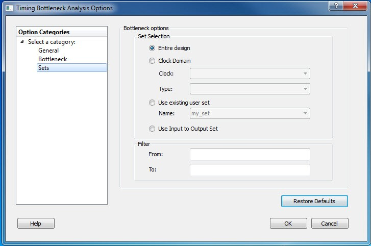

# Sets Pane

The **Sets** pane has four mutually exclusive options:

-   Entire design
-   Clock Domain
-   Use existing user set
-   Use Input to Output Set

**Entire design**: Displays bottleneck information for the entire design.

**Clock Domain**: Displays bottleneck information for the selected clock  domain. You can specify the following options:

-   **Clock**: Allows pruning based on a given clock domains. Only cells that lie on these violating paths are reported.
-   **Type**: This option can only be used with clock. The following table shows the acceptable values.

|Value|Description|
|-----|-----------|
|Register to Register|Paths between registers in the design.|
|Asynchronous to Register|  Paths from asynchronous pins to registers. |
|Register to Asynchronous|Paths from registers to asynchronous pins.|
|External Recovery|The set of paths from inputs to asynchronous pins.|
|External Setup|Paths from input ports to register.|
|Clock to Output|Paths from registers to output ports.|

**Use existing user set**: Displays bottleneck information for the existing  user set selected. Only paths that lie within the name set will be considered towards  the Bottleneck Report.

**Filter**: Allows you to filter the Bottleneck Report by the following options:

-   **From**: Reports only cells that lie on violating paths that start at locations specified by this option.
-   **To**: Reports only cells that lie on violating paths that end at locations specified by this option. Filter defaults to all outputs.

**Parent topic:**[Timing Bottleneck Analysis Options Dialog Box](GUID-05ED0374-C577-4F82-AAAB-331A31619D55.md)

