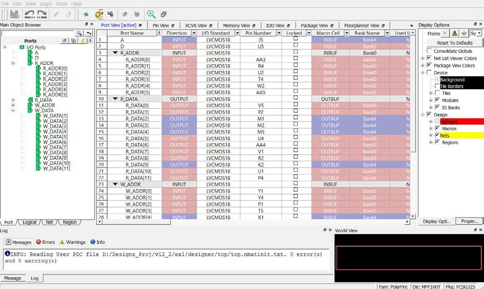

# Invoking the I/O Editor

The design must be in the post-synthesis state before the I/O Editor can be invoked. A warning message appears if the I/O Editor is invoked in the pre-synthesis state.

The I/O Editor can be invoked in two ways from the Constraint Manager:

-   **Design Flow window &gt; Manage Constraints &gt; Open Manage****Constraints View****&gt; Constraint****Manager &gt;****I/O Attributes****&gt; Edit****&gt; Edit****with I/O Editor**
-   **Design Flow****window &gt;****Manage Constraints****&gt; Open Manage Constraints View &gt; Constraint Manager &gt; I/O Attributes &gt; View**

The **Edit with****I/O Editor**option in the Constraint Manager allows you to save or commit your changes to PDC files, whereas the **View**option shows the post-Place and Route design including the final placement and the I/O attributes in read-only mode. You cannot save or commit any changes made in the I/O Editor opened using the **View**option.

However, you can export and save the physical constraints using **File &gt; Export Physical Constraint \(PDC\)**in both options and save them. These constraints can later be used in your design as input files, depending on the design's requirement.

The I/O Editor opens with view tabs across the top of the graphical interface, as shown in the following figure.

