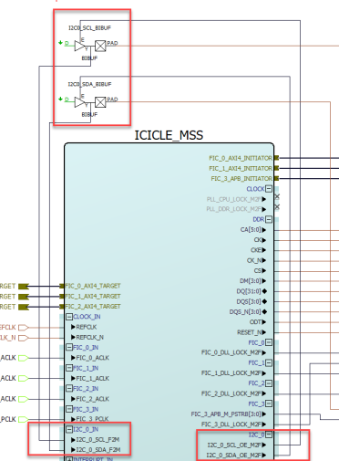
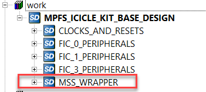

# I2C Port Configuration for Fabric I/O

Fabric connections for the MSS I2C peripherals do not generate an output port, instead  only an Output Enable \(OE\) port is available on the MSS component. You must instantiate  an BIBUF with the D connected to 'GND' and the E and Y pins connected to OE and IN,  respectively. The following figure shows these connections.

To see the BIBUF configuration required to use the I2C peripheral with fabric  connections, see the [PolarFire SoC Icicle Kit Reference Design](https://github.com/polarfire-soc/icicle-kit-reference-design) from **MSS\_WRAPPER subsystem** &gt; **SmartDesign** .

**Parent topic:**[Peripherals](GUID-D560CB4A-6A33-4FAD-B89B-92B0556648BE.md)

**Previous topic:**[Peripherals](GUID-D560CB4A-6A33-4FAD-B89B-92B0556648BE.md)

**Next topic:**[MSS I/O Attributes](GUID-6392C9C4-AA6E-4EBA-A8EA-249C4AD964F3.md#)

