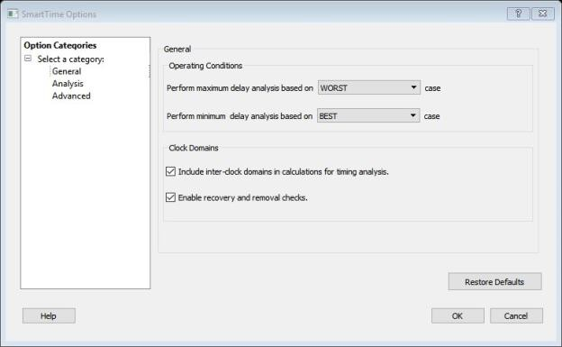
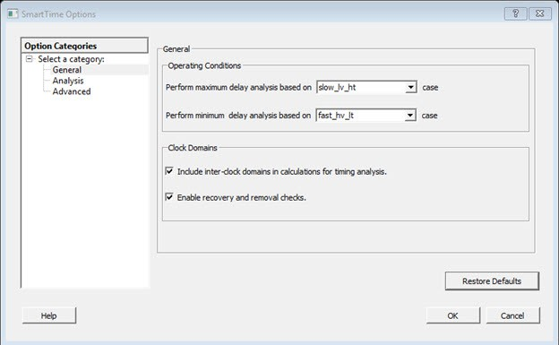

# SmartTime Options Dialog Box

Use the SmartTime Options dialog box to specify the SmartTime options to perform timing analysis.  This interface includes the following categories:

-   General
-   Analysis
-   Advanced

To open the SmartTime Options dialog box from the SmartTime tool, choose **Tools &gt; Options**.

-   **[Operating Conditions](GUID-EFDE7B97-84CE-44E3-B1B4-13651F130428.md)**  

-   **[Clock Domains](GUID-24291837-4F81-4526-AE25-CFE8A3552FE5.md)**  

-   **[Restore Defaults](GUID-A9251468-D921-490E-9D7D-2A70D58A34A5.md)**  

-   **[Analysis](GUID-44BB67D0-1146-44E6-AF9F-5B7FF726A1AC.md)**  

-   **[Display of Paths](GUID-5F5D70C7-689D-4881-8180-8C16990D2790.md)**  

-   **[Show Clock Network Details in Expanded Path](GUID-4D1275B6-8E12-4D21-A9DC-F0423089D317.md)**  

-   **[Restore Defaults](GUID-1AAC4741-41C4-4A05-9D49-F0A80FFF56AE.md)**  

-   **[Advanced Dialog Box](GUID-F890FE4A-D702-4224-BA0C-4AE5CAE348A4.md)**  

-   **[Special Situations](GUID-50A46802-FDD4-4044-AE97-77BBB0D397EF.md)**  

-   **[Scenarios](GUID-E451EA20-CB19-41FA-AA09-D98488CF5446.md)**  

-   **[Restore Defaults](GUID-B5807E83-887F-431C-89BB-57B40D13BE50.md)**  

**Parent topic:**[SmartTime Dialog Boxes](GUID-F96D2B4E-7DDD-4507-8621-C49A84F55C81.md)

