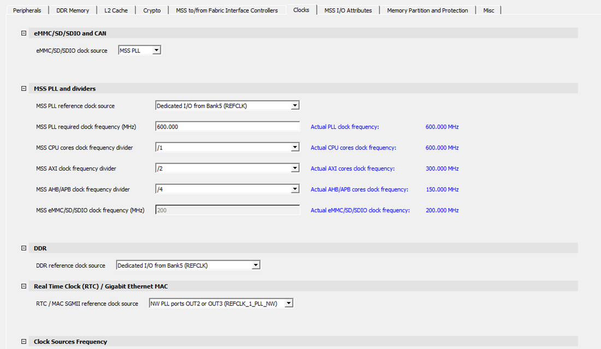
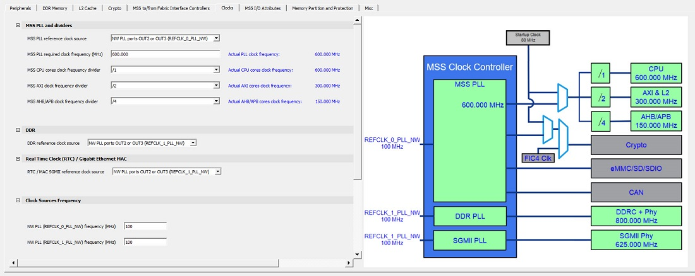

# Clocks

Use the **Clocks** tab to configure the MSS PLL clock frequency and clock<br /> sources. For more information, see the [PolarFire Family Clocking Resources User Guide](https://ww1.microchip.com/downloads/aemDocuments/documents/FPGA/ProductDocuments/UserGuides/Microchip_PolarFire_FPGA_and_PolarFire_SoC_FPGA_Clocking_Resources_User_Guide_VB.pdf).

There are three PLLs inside MSS, which generate the necessary clocks:

-   MSS PLL
-   DDR PLL
-   SGMII PLL

Each PLL generates four output clocks from one input reference clock.

The actual output that PLL Solver generates is shown in the GUI next to the<br /> **Actual:** label. If the requirement is met, the color of the<br /> label is blue. If it is not met \(from you\), it is red.

In MSS PLL, you must specify the four output clock requirements.

-   Output 0 \(CPU Clock\)
-   Output 1 \(Crypto Clock\)
-   Output 2 \(eMMC Clock\)
-   Output 3 \(CAN Clock\)

The following conditions pose restrictions on the PLL solver. Solver attempts to solve the fixed requirements first and then the ones without restriction.

1.  When eMMC is enabled, the output clock requirement is fixed at 200 MHz.
2.  When the CAN peripheral is enabled, the output clock requirement must be a multiple of 8 \(maximum 80 MHz\).
3.  Crypto can be at most 200 MHz for STD speed grade and 213 MHz for -1 speed grade.
4.  CPU has the maximum frequency of 625 MHz for STD speed grade and 667 MHz for -1 speed grade.

    **Note:** When the actual frequency found by the PLL solver exceeds the maximum required clock frequency for MSS PLL and Crypto, MSS generation fails with the following error message.

    ```
    ERROR: Invalid solution found for Output0 of MSS PLL. 800 MHz is greater than the 
    supported value of 667 MHz.
    ```


In DDR PLL, enter the required output clock frequency in the DDR tab in Line Edit "Memory clock<br /> frequency." All four output clocks are generated by the PLL that has the same<br /> frequency.

In SGMII PLL, the output frequency requirement is fixed at 625 MHz for all four outputs. You do<br /> not have to enter this. Additionally, the output clocks are phase-shifted by 90° \(output<br /> clock 0 has a 0° phase shift, output clock 1 has a 90° phase shift, and so on\).

The following table lists the option provided in the MSS **Clocks** selection<br /> tab.

<table id="TABLE_PXB_JXQ_YMB"><thead><tr><th>

Option

</th><th>

Description

</th></tr></thead><tbody><tr><td>

eMMC/SD/SDIO clock source

</td><td>

<br /> eMMC/SD/SDIO can be clocked either through MSS PLL or Fabric<br /> I/O.<br />

</td></tr><tr><td>

CAN clock source

</td><td>

CAN can be clocked either through MSS PLL or Fabric<br /> I/O.

</td></tr><tr><td>

MSS PLL reference clock source

</td><td>

MSS can be clocked from dedicated I/O from Bank 5<br /> \(REFCLK\) or North West PLL output.

</td></tr><tr><td>

MSS PLL required clock frequency

</td><td>

-   For STD speed, you can set the frequency value of up to 625 MHz.
-   For -1 speed, you can set the frequency value of up to 667 MHz.

 All MSS clock frequencies are derived from this<br /> setting.

</td></tr><tr><td>

MSS CPU cores clock frequency divider

</td><td>

The MSS CPU clock frequency is based on the MSS PLL<br /> clock frequency and is set using the divider values /1, /2, /4, or<br /> /8. The frequency must be greater than or equal to the MSS AXI<br /> clock, and can have a maximum value of 667 MHz for -1 speed, and 625<br /> MHz for STD speed.

</td></tr><tr><td>

MSS AXI clock frequency divider

</td><td>

The MSS AXI clock frequency is based on the MSS CPU<br /> clock frequency and is set using the divider values of /1, /2, /4,<br /> or /8. The frequency must be greater than or equal to MSS AHB/APB<br /> clock, and can have a maximum value of 333.50 MHz for -1 speed, and<br /> 312.50 MHz for STD speed.

</td></tr><tr><td>

MSS AHB/APB clock frequency divider

</td><td>

The MSS AHB/APB clock frequency is based on the MSS<br /> CPU clock frequency and is set using the divider values /2, /4, or<br /> /8. The maximum supported frequency is 166.75 MHz for -1 speed, and<br /> 156.25 MHz for STD speed.

</td></tr><tr><td>

DDR reference clock source

</td><td>

You can select the North West \(NW\) PLL ports or I/Os<br /> from Bank 5.

</td></tr><tr><td>

RTC/MAC SGMII reference clock input source

</td><td>

You can select the NW PLL ports or I/Os from Bank<br /> 5.

</td></tr><tr><td>

Dedicated I/O from Bank5 \(REFCLK\) frequency

</td><td>

This is a dedicated I/O from Bank 5 to the MSS PLL.<br /> It can either be 100 MHz or 125 MHz.

</td></tr><tr><td>

NW PLL \(REF\_0\_PLL\_NW\) frequency \(MHz\)/NW PLL<br /> \(REF\_1\_PLL\_NW\) frequency \(MHz\)

</td><td>

This option is available when any peripheral is<br /> clocked from NW PLL output. It can be any value between 50 MHz and<br /> 125 MHz.

</td></tr><tr><td>

Crypto clock frequency from MSS \(MHz\)

</td><td>

You can set the reference clock frequency for Crypto<br /> between 1 MHz and 200 MHz for STD speed grade, and between 1 MHz and<br /> 213 MHz for -1 speed grade.

</td></tr><tr><td>

MSS CAN clock frequency \(MHz\)

</td><td>

The MSS CPU clock frequency is based on the MSS PLL<br /> clock frequency. The supported frequencies in MHz are 8, 16, 24, 32,<br /> 40, 48, 56, 64, 72, and 80.

</td></tr></tbody>
</table>**Note:** The **DDR Reference Clock Input Source** option appears only when the DDR memory type is selected from the **DDR Memory** tab.

The following figure shows the **Clocks** tab in the PolarFire SoC MSS<br /> Configurator. In this example, the following configurations are used:

-   Dedicated I/Os from Bank 5 \(REFCLK\) are selected as the reference clock input source for the MSS. The MSS PLL clock frequency is set to 600 MHz.
-   Dedicated I/Os from Bank 5 \(REFCLK\) are used to source the reference clock input frequency for the DDR subsystem.
-   The DDR clock source and MSS clock source are set to 125 MHz.



The following figure shows the **Clocks** tab with PLL in the PolarFire SoC<br /> MSS Configurator. In this example, the following configuration is used:

-   NW PLL ports OUT2 or OUT3 \(REFCLK\_0\_PLL\_NW\) are selected as the reference clock input source for the MSS. The MSS PLL clock frequency is set to 600.000 MHz.
-   NW PLL ports OUT2 or OUT3 \(REFCLK\_1\_PLL\_NW\) are used to source the reference clock input frequency for the DDR subsystem and Real Time Clock/Gigabit Ethernet MAC.
-   The DDR Clock Source and MSS Clock Source are set to 100 MHz.



For more information about configuring the MSS DDR subsystem, see [DDR Memory](GUID-A29420D1-4E36-4920-B9BB-DD0B63F5E787.md#).

**Parent topic:**[Using the PolarFire SoC MSS Configurator GUI](GUID-E11D45E3-7975-4122-BA81-72D6BDD0CD1A.md)

**Previous topic:**[Using the PolarFire SoC MSS Configurator GUI](GUID-E11D45E3-7975-4122-BA81-72D6BDD0CD1A.md)

**Next topic:**[MSS To/From Fabric Interface Controllers](GUID-A1E1F5D7-A681-4C06-9435-D515826BD296.md)

