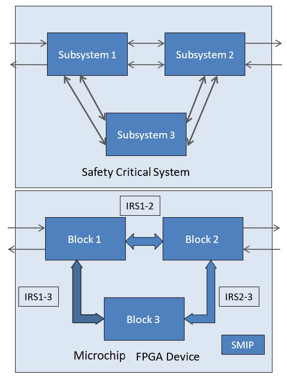

# Introduction

This guide describes the design separation methodology required to implement security and safety-critical applications. For a system to be secure and reliable, all critical subsystems in the design should be independent of each other.

Traditionally, a system with security and safety-critical requirements is built with each critical subsystem implemented using multiple integrated circuits \(ICs\). With each critical subsystem as an independent IC, fault and reliability analysis is simplified. In a traditional Field Programmable Gate Array \(FPGA\) design, netlists generated for place-and-route often are flattened for efficient placement. Design functions from various parts of the design hierarchy may share physical resources. To meet critical security and safety application requirements, critical subsystems within an FPGA design might need to be isolated to simplify failure analysis and prevent propagation of faults from one subsystem adversely affecting another.

The Microchip Design Separation methodology provides a way to create independent critical  subsystems on a single FPGA. Functional blocks that must be independent can be isolated  physically from other functional elements in the FPGA using place-and-route constraints  in the Libero® SoC software. The following figure shows a top-level  view for implementing a security and safety-critical application in a Microchip  FPGA.

