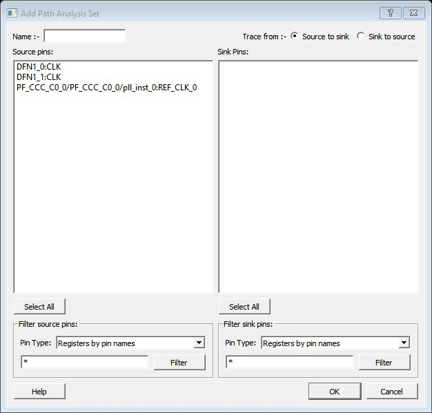

# Add Path Analysis Set Dialog Box

Use the Add Path Analysis Set dialog box to specify a custom path analysis set.

To open the Add Path Analysis Set dialog box from the SmartTime Timing Analyzer, choose  any path and right-click to select **Add Set**.

 

**Note:** The **Analysis** menu is available only in Maximum or Minimum Delay Analysis view.

 

-   **[Name](GUID-CA14CB72-4784-4D42-8DC0-C420D92CC9AE.md)**  

-   **[Trace from](GUID-016ABF92-CA40-4870-8642-AADE82E846D8.md)**  

-   **[Source Pins](GUID-69DCFA3C-75DD-4C0E-86E7-F062B72E60C0.md)**  

-   **[Select All](GUID-E8946FB9-D507-4E67-A0DF-CA27A1066018.md)**  

-   **[Filter Source Pins](GUID-D5E9A771-4707-4F91-9832-2880FDD61DF6.md)**  

-   **[Sink Pins](GUID-959BB25C-72C3-4C0F-BEB3-9B87C473E77C.md)**  

-   **[Select All](GUID-7591644C-1F42-46D5-8E07-B6C8951A5B43.md)**  

-   **[Filter Sink Pins](GUID-A154161D-17EB-4313-BDD6-A0CCEDA6F10F.md)**  

**Parent topic:**[SmartTime Dialog Boxes](GUID-F96D2B4E-7DDD-4507-8621-C49A84F55C81.md)

