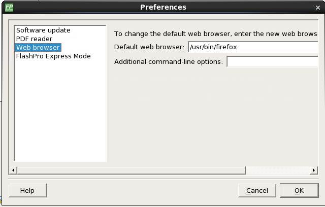

# Chain Programming

This section describes how to perform chain programming.

## Chain Order

Chain Programming allows you to program several devices at one time. The order of devices  in the chain imported from Job Project must match the physical chain to be  programmed.

The TDO for the first device connects to the programmer, and the last device's TDI  connects to the programmer. The devices in the chain go in order from a device's TDI  into the next device's TDO, as shown in the following figure.

## Multiple Device Chain Programming

The FlashPro Express software allows direct chain programming without generating a chain STAPL  file. Each device is programmed in sequential order, starting from device 1 to device  *N* \(see the following example\).

`TDI > Device N > Device N-1 >… > Device 2 > Device 1 > TDO`

### Device Programming Compatibility

PolarFire, SmartFusion 2, IGLOO 2, and RTG4 devices can be programmed in the same chain.

### Programmer Support

FlashPro5/4/3/3X supports PolarFire, SmartFusion 2, IGLOO 2, and RTG4 devices. The Vpump on  FlashPro5/4/3/3X is designed to support the programming of only one device. Make sure  that Vpump, Vcc, and Vjtag are provided on board for chain programming. Connect the  Vpump to the header as the Flashpro Express software will attempt to check for all  external supplies, including Vpump, to ensure successful programming. There is no  limitation to the chain length; however, ensure that the JTAG signal integrity and the  timing are preserved.

