# Implementing Designs

The following topics describe how to implement the design.

**Note:**   Libero uses multiple cores automatically. For this reason, Libero does not provide options for setting multi-cores manually. The following scenarios describe when Libero uses multiple cores. Optimal runtime improvement is achieved when your system has at least four cores. Additional cores will deliver only marginal runtime improvements.

-   [Synthesis](GUID-16AC6815-2A39-4FFC-8AE9-F7A82337A198.md#) uses up to four cores when using Libero \(only one Synplify Pro license is needed for four cores\) if automatic or manual compile points are used.
-   [Place and Route](GUID-16AC6815-2A39-4FFC-8AE9-F7A82337A198.md#) uses up to four cores.
-   [Static timing analysis](GUID-16AC6815-2A39-4FFC-8AE9-F7A82337A198.md#) uses as many cores available.

## Synthesize

There are two ways to run synthesis using the Synthesis tool:

-   Run synthesis on your design with the default settings specified in the Synthesis tool: Double-click **Synthesize**.
-   Run the Synthesis tool interactively: Right-click **Synthesize** and choose **Open Interactively**. If you open the tool interactively, you must complete synthesis from within the Synthesis tool.

The default Synthesis tool included with Libero SoC is SynplifyPro ME. If you want to use a<br /> different Synthesis tool, change the settings in [Tool Profiles](GUID-DD5BFD75-BB76-49D8-99EA-EC328F43A5FD.md#).

You can organize input synthesis source files using the [Organize Source Files](GUID-DD5BFD75-BB76-49D8-99EA-EC328F43A5FD.md#) dialog box.

**Note:** Libero uses multiple cores automatically. For this reason, Libero does not provide options for setting multi-cores manually. The following scenarios describe when Libero uses multiple cores. For maximum runtime improvements, use four cores. Adding more cores delivers marginal improvements.

-   Synthesis uses up to four cores when using Libero \(only one Synplify Pro license is needed for four cores\).
-   Automatic or manual compile points.
-   Place and Route uses up to four cores.
-   Static timing analysis uses as many cores available.

### Synthesize Options

You can set or change synthesis configuration options using the Synthesize Options dialog<br /> box in the Synthesis tool.

To display this dialog box, expand **Implement Design** in the Design Flow<br /> window, right-click **Synthesize**, and choose **Configure Options**.

")

")

#### Active Implementation

The **Active Implementation** option allows you to select an active Synthesis<br /> or Identify implementation from a list of existing implementations. A check box is provided<br /> for creating a new Synthesis or Identify implementation. If you check this box, the options in<br /> the following table appear.

|Option|Description|
|------|-----------|
|Synthesis Implementation|Click to specify the new implementation as a Synthesis Implementation.|
|Identify Implementation|Click to specify the new implementation as an Identify Implementation.|
|Implementation Name|Assign a name to the new Synthesis or Identify implementation.|

#### Global Nets \(Promotions and Demotions\)

Use the following options to specify the threshold value beyond which the Synthesis tool promotes<br /> the pins to globals:

**Note:** You cannot use these options to control hardwired connections to global resources, such as CCC hardwired connections to GB and I/O hardwired connections to GB.

<table id="TABLE_KWC_BLJ_G4B"><thead><tr><th>

Option

</th><th>

Description

</th></tr></thead><tbody><tr><td>

Minimum number of clock pins

</td><td>

Threshold value for Clock pin promotion. Default: 2

</td></tr><tr><td>

Minimum number of asynchronous pins

</td><td>

<br /> Threshold value for asynchronous pin promotion.<br /> Default for PolarFire and PolarFire SoC:<br /> 800<br /> Default for SmartFusion 2, IGLOO 2, and RTG4: 12<br /> This option is not available for the RT4G150\_ES device.<br />

</td></tr><tr><td>

Minimum fanout of non-clock nets to be kept on globals

</td><td>

<br /> Threshold value for data pin promotion to global resources. This<br /> value is the minimum fanout of non-clock \(data\) nets to be kept on<br /> globals \(no demotion\). <br /> Range: 1000–200000<br /> Default: 5000<br />

</td></tr><tr><td>

Number of global resources

</td><td>

<br /> Controls the number of global resources you want to use in your<br /> design. <br /> Default for PolarFire and PolarFire SoC: 36<br /> Default for SmartFusion 2, IGLOO 2, and RTG4: Number of available<br /> global resources for the die you selected for the project. This<br /> number varies with different die sizes.<br />

</td></tr><tr><td>

Maximum number of global nets that could be demoted to row-globals

</td><td>

Maximum number of global nets that can be demoted to<br /> row-globals. Range: 0–50 Default: 16

</td></tr><tr><td>

Minimum fanout of global nets that could be demoted to row-globals

</td><td>

<br /> Minimum fanout of global nets that can be demoted to row-global. <br /> It is undesirable to have high fanout nets demoted using row-globals<br /> because it can result in high skew. If you run out of global routing<br /> resources for your design, reduce this number to allow more globals<br /> to be demoted to Row Globals or select a bigger die for your<br /> design.<br /> Range: 25-5000<br /> Default for PolarFire and PolarFire SoC: 1000<br /> Default for SmartFusion 2, IGLOO 2, and RTG4: 300<br />

</td></tr><tr><td>

Infer Gated Clocks from Enable-registers

</td><td>

Enable this option to infer gated clocks from enable registers. This option is unchecked by default. Additional sub-options are as follows:-   Minimum number of Enable pins to Infer Gated Clock global: Minimum number of enable pins to infer<br /> gated chip-level global. Default: 1000

-   Minimum number of Enable pins to Infer Gated Clock row-global: Minimum number of enable pins to infer gated clock row-global. Default: 100

</td></tr><tr><td>

Detect Clock Domain Crossings

</td><td>

Enable this option to detect all clock domain crossings \(CDC\) in the RTL design that have paths either between two asynchronous clocks or two synchronous clocks but with a false path or max-delay constraint. For each crossing, analyze if the RTL design contains a control or data synchronizer circuit and report if it is considered "safe" according to the minimum requirements you specify below. The option is checked by default.-   Minimum number of synchronizer registers. Range: 2–9. Default: 2


</td></tr></tbody>
</table>The generated CDC report will not contain any synchronizer circuits formed with macros<br /> instantiated from the catalog. The generated report, with the name<br /> `<root_name>_cdc.csv`, will be visible in the respective<br /> Synthesis node of the report view \(**Design &gt; Reports**\). The<br /> report will contain all CDC inferred from the RTL design and explain the reason\(s\) why a<br /> synchronizer is considered unsafe.

<table id="TABLE_JZY_NNS_SPB"><thead><tr><th>

Reason

</th><th>

Description

</th></tr></thead><tbody><tr><td>

No synchronizer circuit detected

</td><td>

<br /> -   If the control signals<br /> `reset`,`enable`, and<br /> `set` on the first and second sync<br /> registers do not match.

-   Combinational logic between the first and second register<br /> synchronizers.

-   Diversion between first and second register synchronizers<br /> \(that is, the fanout is greater than 1\).

-   Only 1 register in the synchronizer circuit.


<br />

</td></tr><tr><td>

Number of register levels in synchronizer logic is less than the<br /> specified threshold.

</td><td>

Register levels in synchronizer logic are lower than a certain<br /> threshold value.

</td></tr><tr><td>

Combinational logic detected at clock domain crossing.

</td><td>

Combinational logic is present between the source register \(start<br /> instance\) and the destination register \(end instance\) at the<br /> crossover.

</td></tr><tr><td>

Divergence detected in the crossover path.

</td><td>

Source register \(start instance\) has fanout greater than 1 at the<br /> crossover.

</td></tr><tr><td>

Enable signal for synchronizer registers does not have a safe<br /> crossing.

</td><td>

Enable signal of data synchronizer does not have a safe synchronizer<br /> circuit.

</td></tr><tr><td>

Sources from different domains in fanin.

</td><td>

The destination is driven by multiple registers from different clock<br /> domains and are asynchronous to the destination register clock<br /> domain.

</td></tr><tr><td>

Synchronizer registers have synchronous reset or set as control<br /> signal.

</td><td>

The Synchronizer registers have a synchronous set or reset even if<br /> shared by all. This is tagged as unsafe since the reset logic can move<br /> to the data path instead of connecting to the reset port of the register<br /> and hence lead to metastability.

</td></tr></tbody>
</table>#### Optimizations

The following table describes the Optimizations options.

<table id="GUID-092DCAB4-167D-4E61-A684-9F4D5720432D"><thead><tr><th>

Option

</th><th>

Description

</th></tr></thead><tbody><tr><td>

Enable retiming

</td><td>

Check to enable Retiming during synthesis. Retiming is the process of moving registers<br /> \(register balancing\) across combinational gates automatically to improve<br /> timing, while ensuring identical logic behavior.Default: Not checked<br /> \(no retiming during synthesis\)

</td></tr><tr><td>

Enable automatic compile point

</td><td>

Check to enable Automatic Compile Point during synthesis. Default: Checked \(Automatic<br /> Compile Point enabled\)

</td></tr><tr><td>

RAM optimized for

</td><td>

Guides the Synthesis tool to optimize RAMs to achieve your design goal. -   High speed: RAM is optimized for speed. The resulting synthesized design achieves better performance \(higher speed\) at the expense of more dynamic power. \(*Default*\)
-   Low power: RAM is optimized for power. RAMs are inferred and configured to ensure the lowest power consumption.

</td></tr><tr><td>

Map seq-shift register components to:

</td><td>

Maps sequential shift registers. Choices are:-   Registers: Sequential shift logic in the RTL maps to registers.
-   RAM64x12: Sequential shift logic in the RTL maps to a 64x12 RAM block. This is the default setting.

</td></tr><tr><td>

Map ROM components to:

</td><td>

Maps ROM components. Choices are:-   Logic: Maps ROM components to logic. \(*Default*\)
-   RAM: Maps ROM components to RAM.

</td></tr></tbody>
</table>#### Additional Options for SynplifyPro Synthesis

The following table describes additional options for SynplifyPro Synthesis.

<table id="TABLE_GWG_T5K_G4B"><thead><tr><th>

Option

</th><th>

Description

</th></tr></thead><tbody><tr><td>

Script File

</td><td>

Click the Browse \(\) button to<br /> navigate to a Synplify Tcl file that contains the<br /> SynplifyPro-specific options. Libero passes the options in the Tcl<br /> file to SynplifyPro for processing.

</td></tr><tr><td>

Additional Options

</td><td>

Enter additional Synplify options. Place each option on a<br /> separate line. Libero passes these additional options as-is to<br /> SynplifyPro for processing, without checking syntax. These options<br /> are set on the Active Implementation only.**Note:** Options from the Additional Options Editor have priority over Tcl Script file options if they are the same.

</td></tr></tbody>
</table>##### Recommended Synthesis Tcl Options \(PolarFire\)

You can add or modify the following list of recommended Synthesis Tcl options in the Tcl<br /> Script File or Additional Options Editor.

<br />

```
set_option -use_fsm_explorer 0/1
set_option -frequency 200.000000
set_option -write_verilog 0/1
set_option -write_vhdl 0/1
set_option -resolve_multiple_driver 1/0
set_option -rw_check_on_ram 0/1
set_option -auto_constrain_io 0/1
set_option -run_prop_extract 1/0
set_option -default_enum_encoding default/onehot/sequential/gray
set_option -maxfan 30000
set_option -report_path 5000
set_option -update_models_cp 0/1
set_option -preserve_registers 1/0
set_option -continue_on_error 1/0
set_option -symbolic_fsm_compiler 1/0
set_option -compiler_compatible 0/1
set_option -resource_sharing 1/0
set_option -write_apr_constraint 1/0
set_option -dup 1/0
set_option -enable64bit 1/0
set_option -fanout_limit 50
set_option -frequency auto
set_option -hdl_define SLE_INIT=2
set_option -hdl_param -set "width=8"
set_option -looplimit 3000
set_option -fanout_guide 50
set_option -maxfan_hard 1/0
set_option -num_critical_paths 10
set_option -safe_case 0/1

```

<br />

##### Entering Additional Options \(PolarFire\)

Any additional options can be entered through the Script File or Additional Options<br /> Editor. All these options can be added and modified outside of Libero through<br /> interactive SynplifyPro.

Refer to the **SynplifyPro Reference Manual** for detailed information about the<br /> options and supported families. The following options are already set by Libero. Do not<br /> include them in the additional options field or Script File:

<br />

```
add_file <*>
impl <*>
project_folder <*>
add_folder <*>
constraint_file <*>
project <*>
project_file <*>
open_file <*>
set_option –part
set_option -package
set_option -speed_grade
set_option -top_module
set_option -technology
set_option -opcond
set_option -vlog_std
set_option -vhdl2008
set_option -disable_io_insertion
set_option -async_globalthreshold
set_option -clock_globalthreshold
set_option -globalthreshold
set_option -low_power_ram_decomp
set_option -retiming
set_option -automatic_compile_point
set_option -seqshift_to_uram
set_option -rom_map_logic
set_option -gclkint_threshold
set_option -rgclkint_threshold
set_option -low_power_gated_clock
set_option -report_preserve_cdc
set_option -min_cdc_sync_flops
```

<br />

##### Recommended Synthesis Tcl Options \(SmartFusion 2, IGLOO 2, and RTG4\)

```
set_option -use_fsm_explorer 0/1
set_option -frequency 200.000000
set_option -write_verilog 0/1
set_option -write_vhdl 0/1
set_option -resolve_multiple_driver 1/0
set_option -rw_check_on_ram 0/1
set_option -auto_constrain_io 0/1
set_option -run_prop_extract 1/0
set_option -default_enum_encoding default/onehot/sequential/gray
set_option -maxfan 30000
set_option -report_path 5000
set_option -update_models_cp 0/1
set_option -preserve_registers 1/0
set_option -continue_on_error 1/0
set_option -symbolic_fsm_compiler 1/0
set_option -compiler_compatible 0/1
set_option -resource_sharing 1/0
set_option -write_apr_constraint 1/0
set_option -dup 1/0
set_option -enable64bit 1/0
set_option -fanout_limit 50
set_option -frequency auto
set_option -hdl_define SLE_INIT=2
set_option -hdl_param -set "width=8"
set_option -looplimit 3000
set_option -fanout_guide 50
set_option -maxfan_hard 1/0
set_option -num_critical_paths 10
set_option -safe_case 0/1

```

##### Entering Additional Options \(SmartFusion 2, IGLOO 2, and RTG4\)

Any additional options can be entered through the Script File or Additional Options<br /> Editor. All these options can be added and modified outside of Libero through<br /> interactive SynplifyPro.

Refer to the **SynplifyPro Reference Manual** for detailed information about the<br /> options and supported families. The following options are already set by Libero. Do not<br /> include them in the additional options field or Script File:

```
add_file <*>
impl <*>
project_folder <*>
add_folder <*>
constraint_file <*>
project <*>
project_file <*>
open_file <*>
set_option –part
set_option -package
set_option -speed_grade
set_option -top_module
set_option -technology
set_option -opcond
set_option -vlog_std
set_option -vhdl2008
set_option -disable_io_insertion
set_option -async_globalthreshold
set_option -clock_globalthreshold
set_option -globalthreshold
set_option -low_power_ram_decomp
set_option -retiming
```

### SynplifyPro ME

SynplifyPro ME is the default Synthesis tool for Libero SoC.

To run synthesis using SynplifyPro ME and its default settings, right-click **Synthesize** and choose **Run**.

For custom settings, use the following procedure to run Synplify interactively.

1.  If Synplify is your default Synthesis tool, right-click **Synthesize** in the Libero SoC Design Flow window and choose **Open Interactively**. Synplify starts and loads the appropriate design files with preset default values.
2.  From Synplify’s **Project** menu, choose **Implementation Options**.
3.  Set your specifications and click **OK**.
4.  Deactivate synthesis of the defparam statement. The defparam statement is only for simulation tools and is not intended for synthesis. Embed the defparam statement between the **translate\_on** and **translate\_off** synthesis directives:

    ```
    /* synthesis translate_off */
    defparam M0.MEMORYFILE = "meminit.dat"
    /*synthesis translate_on */
    // rest of the code for synthesis
    ```

5.  Click the **Run** button. Synplify compiles and synthesizes the design into an HDL netlist. The resulting `*.vm` files appear under **Synthesis Files** in the **Files** list.

    If errors appear after you click the **Run** button, use the Synplify editor to edit the file. Double-click the file name in the Synplify window showing the loaded design files. Your changes are saved to the original design file in your project.

6.  To close Synplify, from the **File** menu, choose **Exit**. When prompted to save changes you made, click **Yes**.

    **Note:** For a list of attributes related to Microchip devices, see the Microchip Attribute and Directive Summary in the Synplify online help.

    **Note:** To add a clock constraint in Synplify, add **n:&lt;net\_name&gt;** in your SDC file. If you omit the **n:**, the constraint will not be added.


### Identifying Debug Designs

Libero SoC integrates the Identify RTL debugger tool. Identify debugging software allows you to<br /> probe and debug your FPGA design directly in the source RTL. Use the software if the<br /> design behavior after programming is not in accordance with the simulation results.

The following list summarizes the Identify key features:

-   Instrument and debug your FPGA directly from RTL source code.
-   Internal design visibility at full speed.
-   Incremental iteration permit design changes made to the device from the Identify environment using incremental compile operations. This allows you to iterate in a fraction of the time it takes route the entire device.
-   Debug and display results allow you to collect only the data you need using unique and complex triggering mechanisms.

To open the Identify RTL debugger, in the Design Flow window, under **Debug Design**, double-click **Instrument Design**.

The following procedure describes how to use the Identify Instrumentor and Debugger. To run the<br /> following debugging flow, you must have the Identify RTL Debugger and the Identify<br /> Instrumentor.

1.  Create your source file and run pre-synthesis simulation.
2.  Optional: Perform an entire flow \(Synthesis - Compile - Place and Route - Generate a Programming File\) without starting Identify.
3.  Right-click **Synthesize** and choose **Open Interactively** in Libero SoC to launch Synplify.
4.  In Synplify, click **Options &gt; Configure Identify Launch** to setup Identify.
5.  In Synplify, create an Identify implementation by clicking **Project &gt; New Identify Implementation**.
6.  In the Implementations Options dialog box, make sure that the **Implementation Results &gt; Results Directory** points to a location under `<libero project>\synthesis\`; otherwise, Libero SoC will not detect your resulting Verilog Netlist file.
7.  From the Instrumentor UI, specify the sample clock, the breakpoints, and other signals to probe. Synplify creates a new synthesis implementation. Synthesize the design.
8.  In Libero SoC, run Synthesis, Place and Route and generate a programming file.

    **Note:** Libero SoC works from the edit netlist of the current active implementation, which is the implementation you created in Synplify for Identify debug.

9.  In the Design Flow window, double-click **Identify Debug Design** to launch the Identify Debugger.

To work properly, the Identify RTL Debugger, Synplify, and FlashPro must be synchronized. For<br /> more information about which versions of the tools work together, see the [Release Notes](https://www.microchip.com/en-us/products/fpgas-and-plds/fpga-and-soc-design-tools/fpga/libero-software-later-versions#downloads).

## Verifying Post-Synthesized Designs

The following sections describe how to verify designs after they are synthesized.

### Generating Simulation Files

This step generates the post-synthesis Verilog or VHDL netlist for post-synthesis simulation.

-   The post-synthesis Verilog netlist file ends with a `*.v` extension.
-   The VHDL netlist file ends with a `*.vhd` extension.

Post-synthesis simulation verifies the post-synthesis<br /> implementation of the design.

The netlist file is in the synthesis folder of the project. Libero SoC passes this file to the<br /> simulator for the post-synthesis simulation run.

**Note:** Before performing post-synthesis, the design must pass the synthesis process. If you have not run synthesis, generating Simulation Files initiates a synthesis run automatically.

### Verifying Post-Synthesis Implementations - Simulate

The steps for performing [functional](GUID-BA52F539-E830-4341-B5FA-D07408FE99BC.md#) \(post-synthesis\) and timing \(post-layout\) simulation are nearly identical.

-   Perform functional simulation before Place and Route to simulate the functionality of the logic in the design.
-   Perform timing simulation after the design completes Place and Route. This simulation uses timing information based on the delays in the Place and Route designs.

To perform functional simulation:

1.  Back-annotate your design and create your testbench.
2.  In the Design Flow window, click **Implement Design**.
3.  Right-click **Simulate** and choose **Organize Input Files &gt; Organize Stimulus Files**.

    In the Organize Files for Source dialog box, all stimulus files in the current project appear in **Source Files** in the **Project** list box. Files associated with the block appear in the **Associated Source Files** list box.

    In most cases, you will have one testbench associated with your block. However, if you want simultaneous association of multiple testbench files for one simulation session, as in the case of PCI cores, add multiple files to the **Associated Source Files** list.

4.  To add a testbench, select the testbench you want to associate with the block in the **Source Files** in the **Project** list box and click **Add** to add it to the**Associated Source Files** list.
5.  To remove a testbench or change the files in the **Associated Source Files** list box, select the files and click **Remove**.
6.  To order testbenches, use the up and down arrows to define the order in which you want the testbenches compiled. The top level-entity must be at the bottom of the list.
7.  When you are satisfied with the **Associated Simulation Files** list, click **OK**.
8.  To start ModelSim ME Pro, right-click **Simulate** in the Design Hierarchy window and choose **Open Interactively**. ModelSim ME Pro starts and compiles the appropriate source files. When the compilation completes, the simulator runs for 1ps and the Wave window shows the simulation results.
9.  Scroll in the Wave window to verify the logic works as intended. Use the cursor and zoom buttons to zoom in, zoom out, and measure timing delays.
10. When you are done, click **Quit** from the **File** menu.

## Compile Netlist

Compile contains functions that perform legality checking and basic netlist optimization.<br /> Compile checks for netlist errors \(bad connections and fan-out problems\) removes unused<br /> logic \(gobbling\) and combines functions to reduce logic count and improve performance.<br /> Compile also verifies that your selected device has sufficient resources to fit the<br /> design.

The Compile Netlist step appears in the Design Flow window after unchecking the<br /> **Enable Synthesis** option in the **Project &gt; Project Settings &gt; Design Flow** page. This option appears after<br /> importing or linking your HDL Netlist files into the project and building the design<br /> hierarchy.

To compile your device with default settings, right-click **Compile Netlist** in the Design Flow window and choose **Run**<br /> or double-click **Compile Netlist**.

To compile your design with custom settings, right-click **Compile Netlist** in the Design Flow window and choose **Configure Options**.

During compile, the Log window shows information about your design, including warnings<br /> and errors. Libero SoC issues warnings when your design violates recommended Microchip<br /> design rules. Microchip recommends that you address all warnings, if possible, by<br /> modifying your design before you continue.

If the design fails to compile due to errors, modify the design to remove the errors and<br /> re-Compile.

The Compile Netlist Options set the threshold value for global resource promotion and<br /> demotion when Place and Route is executed.

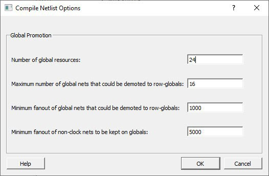

|Option|Description|
|------|-----------|
|Number of global resources|<br /> Number of available global resources for the die.<br />|
|Maximum Number of global nets that could be demoted to<br /> row-globals|<br /> Maximum number of global nets that can be demoted to row-globals. <br /> Default: 16<br />|
|Minimum fanout of global nets that could be demoted to row-globals|<br /> Minimum fanout of global nets that can be demoted to row-global. If<br /> you run out of global routing resources for your design, reduce this<br /> number to allow more globals to be demoted or select a larger die<br /> for your design.<br /> Default: 1000<br />|
|Minimum fanout of non-clock nets to be kept on globals|<br /> Minimum fanout of non-clock \(data\) nets to be kept on globals \(no<br /> demotion\). If you run out of global routing resources for your<br /> design, increase this number.<br /> Range: 1000–200000<br /> Default: 5000<br />|

## Configure Flash\*Freeze \(SmartFusion 2 and IGLOO 2\)

SmartFusion 2 SoC and IGLOO 2 FPGAs support Flash\*Freeze technology for<br /> implementing low-power solutions.

Flash\*Freeze mode is an ultra-low power static mode with the lowest<br /> standby power of 1.92 mW. It allows easy entry and exit from ultra-low power<br /> static mode while retaining SRAM content, I/O state, and register data,<br /> significantly reducing power.

For more information about Flash\*Freeze mode, see the [SmartFusion2 and IGLOO2 FPGA Low-Power Design User Guide](https://ww1.microchip.com/downloads/aemDocuments/documents/FPGA/ProductDocuments/SoC/microsemi_smartfusion2_igloo2_fpga_low_power_design_user_guide_ug0444_v5.pdf) .

Fabric SRAMs — both the Large SRAM \(LSRAM\) instances of RAM1xK18 and the Micro SRAM \(μSRAM\)<br /> instances of RAM64x18 — can be placed into Suspend mode or Sleep<br /> mode. These SRAMs are grouped in rows in Libero SoC devices.

### uRAM/LSRAM State

The following table describes the uRAM/LSRAM State options.

|Option|Description|
|------|-----------|
|Sleep|Selects Sleep mode. LSRAM and uSRAM contents are not<br /> retained.|
|Suspend|Selects Suspend mode. LSRAM and uSRAM contents are retained.|

### MSS Clock Source

The lower the frequency, the lower the power. However, some peripherals, such as SPI or<br /> MMUART, can remain active. In these cases, you might need a higher MSS clock frequency<br /> \(for example, to meet the baud rate for MMUART\).

|Option|Description|
|------|-----------|
|On-Chip 1 MHz RC Oscillator|Uses the on-chip 1 MHz RC oscillator block.|
|On-Chip 50 MHz RC Oscillator|Uses the on-chip 50 MHz RC oscillator block.|

## Configure Register Lock Bits

For SmartFusion 2, IGLOO 2, and RTG4 devices, use the Register Lock Bits Configuration<br /> tool to lock MSS, SERDES, and FDDR configuration registers to prevent them from being<br /> overwritten by initiators that access these registers. The register lock bits are set in<br /> a text file \(`*.txt`\) and imported into a SmartFusion 2/IGLOO 2<br /> project.

1.  From the Design Flow window, click **Configure Register Lock Bits** to display the Register Lock Bits Setting dialog box.

    <br />

    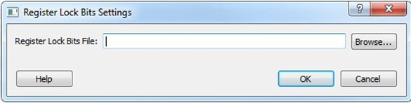

    <br />

2.  Click the **Browse** button to navigate to a text \(`*.txt`\) file that contains the Register Lock Bit settings.

### Register Lock Bit Text File Template

An initial Configuration Lock Bit file can be generated from the Design Flow window by clicking<br /> **Generate FPGA Array Data**.

The initial \(default\) file is named<br /> `<proj_location>/designer/<root>/<root>_init_config_lock_bits.txt`.<br /> Edit this file to ensure that the lock bits are set to “0” for all register bits you<br /> want to lock. After editing the file, save it as a `*.txt` file with a<br /> different name, and then import the file into the project using the Register Lock Bit<br /> Settings dialog box \(**Design Flow window &gt; Configure Register Lock Bits**\).

### Register Lock Bit File Syntax

A valid entry in the Lock Bit Configuration file is defined as a &lt;lock\_parameters&gt; &lt; lock bit value&gt; pair.

-   If the lock bit is for a register, the parameter name is defined as: `<Physical block name>_<register name>_LOCK`
-   If the lock bit is for a field, the parameter name is defined as: `<Physical block name>_<register name>_<field name>_LOCK`

The physical block name can vary with device family and device \(see the following table\).

<table id="TABLE_AY3_WFC_34B"><thead><tr><th>

Family

</th><th>

Name

</th></tr></thead><tbody><tr><td>

SmarftFusion 2 and IGLOO 2 devices

</td><td>

-   MSS
-   FDDR
-   SERDES\_IF\_x \(where x is 0, 1, 2, or 3 to indicate the physical SERDES location\) for SmartFusion 2 and IGLOO 2 010/025/050/150 devices.
-   SERDES\_IF2 060/090 devices \(only one SERDES block per device for SmartFusion 2 and IGLOO 2 devices\).

</td></tr><tr><td>

RTG4 devices

</td><td>

-   FDDR\_E
-   FDDR\_W
-   PCIEx \(where x is 0,1 to indicate the physical SERDES location\)
-   NPSSx \(where x is 0,1,2,3 to indicate the physical SERDES location\)

</td></tr></tbody>
</table>Setting the lock bit value to ‘1’ indicates that the register can be written. Setting it to “0” indicates that the register cannot be written \(locked\). Lines starting with “\#” or “;” are comments. Empty lines are permitted in the Lock Bit Configuration file.


### Validating the Register Lock Bits Configuration File

During Map File generation \(**Design Flow window &gt; Generate FPGA Array Data**\), Libero SoC validates the<br /> Register Lock Bit Configuration file and displays<br /> the following error messages if it encounters an<br /> issue.

|Error Message|Description|
|-------------|-----------|
|Error: Invalid parameter name<br /> ‘&lt;param&gt;’ while reading register lock bits<br /> configuration file &lt;file name&gt;|Libero SoC found an invalid parameter name<br /> in the file specified.|
|Error: Invalid value ‘&lt;value&gt;’ for<br /> parameter ‘&lt;param&gt;’ while reading register<br /> lock bits configuration file &lt;file<br /> name&gt;|Libero SoC found an invalid parameter value<br /> in the file specified.|
|Error: Parameter ‘&lt;param&gt;’ cannot be<br /> set to '1', while reading register lock bits<br /> configuration file &lt;file name&gt;|The value of SERDES register fields<br /> \*K\_BRIDGE\_SPEED is set by the SERDES Configurator<br /> to “0” and cannot be changed. It is illegal to<br /> change the value to “1”.|
|Error: Parameter ‘&lt;param&gt;’ cannot be<br /> set to '1', while reading register lock bits<br /> configuration file &lt;file name&gt;|The value of SERDES register fields<br /> \*K\_BRIDGE\_SPEED is set by the SERDES Configurator<br /> to “0” and cannot be changed. It is illegal to<br /> change the value to “1”.|

## Constraint Flow in Implementation

### Design State Invalidation

The Libero SoC Design Flow window displays status icons to indicate the status of the design state. For any status other than a successful run, the status icon is identified with a tooltip to give you additional information.

<table id="GUID-8A73D820-09ED-4038-BB90-EB77F176FF84"><thead><tr><th>

Status Icon

</th><th>

Tooltip

</th><th>

Description

</th><th>

Possible Causes/Remedy

</th></tr></thead><tbody><tr><td>

<br /> N/A<br />

</td><td>

<br /> Tool has not run yet.<br />

</td><td>

<br /> NEW state.<br />

</td><td>

<br /> Tool has not run or it has been cleaned.<br />

</td></tr><tr><td>


</td><td>

<br /> Tool runs successfully.<br />

</td><td>

<br /> Tool runs with no errors. PASS state.<br />

</td><td>

<br /> N/A<br />

</td></tr><tr><td>

<br /> 

<br />

</td><td>

Tool forced by user to complete<br /> state.

</td><td>

Force updates the tools state to<br /> PASS state.

</td><td>

Only for Synthesize/Compile and<br /> Place and Route tools. The remaining tools do not change states

</td></tr><tr><td>


</td><td>

<br /> Varies with the tool.<br />

</td><td>

<br /> Tool runs but with Warnings.<br />

</td><td>

<br /> Varies with the tool \(For example, for the Compile Netlist step, not<br /> all I/Os are assigned and locked\).<br />

</td></tr><tr><td>


</td><td>

<br /> Tool Fails.<br />

</td><td>

<br /> Tool fails to run.<br />

</td><td>

<br /> Invalid command options or switches, invalid design objects, invalid<br /> design constraints.<br />

</td></tr><tr><td>


</td><td>

<br /> Design State is Out of Date.<br />

</td><td align="left">

<br /> Tool state changes from PASS to OUT OF DATE.<br />

</td><td>

<br /> Since the last successful run, design source design files, constraint<br /> files or constraint file/tool association, constraint files order,<br /> tool options, and/or project settings have changed.<br />

</td></tr><tr><td>


</td><td>

<br /> Timing Constraints have not been met.<br />

</td><td>

<br /> Timing Verification runs successfully but the design fails to meet<br /> timing requirements.<br />

</td><td>

<br /> Design fails Timing Analysis. Design has either set-up or hold time<br /> violations or both. See PolarFire FPGA Timing Constraints<br /> User Guide on how to resolve the timing violations.<br />

</td></tr></tbody>
</table>### Constraints and Design Invalidation

A tool in the Design Flow changes from a PASS state \(green check mark\) to an OUT OF DATE state when a source file or setting affecting the outcome of that tool has changed.

The out-of-date design state is identified by the  icon in the Design Flow window. Sources and/or settings are defined as:

-   HDL sources \(for Synthesis\), gate level netlist \(for Compile\), and Smart Design components

-   Design Blocks \(`*.cxz` files\) – low-level design units that might have completed Place and Route and re-used as components in a higher level design
-   Constraint files associated with a tool
-   Upstream tools in the Design Flow:
    -   If the tool state of a Design Flow tool changes from PASS to OUT OF DATE, the tool states of all the tools below it in the Design Flow, if already run and are in PASS state, also change to OUT OF DATE with appropriate tooltips. For example, if the Synthesis tool state changes from PASS to OUT OF DATE, the tool states of Place and Route tool as well as all the tools below it in the Design Flow change to OUT OF DATE.
        -   If a Design Flow tool is CLEANED, the tool states of all the tools below it in the Design Flow, if already run, change from PASS to OUT OF DATE.
        -   If a Design Flow tool is rerun, the tool states of all the tools below it in the Design Flow, if already run, are CLEANED.
    -   Tool Options
        -   If the configuration options of a Design Flow tool \(right-click the tool and choose **Configure Options**\) are modified, the tool states of that tool and all the other tools below it in the Design Flow, if already run, are changed to OUT OF DATE with appropriate tooltips.
    -   Project Settings:
        -   Device selection
        -   Device settings
        -   Design Flow
        -   Analysis operating conditions

|Setting Changed|Note|Design Flow Tools Affected|New State of the Affected Design Flow Tools|
|---------------|----|--------------------------|-------------------------------------------|
|Die|Part\# is changed|All|CLEANED/NEW|
|Package|Part\# is changed|All|CLEANED/NEW|
|Speed|Part\# is changed|All|CLEANED/NEW|
|Core Voltage|Part\# is changed|All|CLEANED/NEW|
|Range|Part\# is changed|All|CLEANED/NEW|
|Default I/O Technology| |Synthesize, and all tools below it.|OUT OF DATE|
|Reserve Pins for Probes| |Place and Route, and all tools below it.|OUT OF DATE|
|PLL Supply Voltage \(V\)| |Verify Power, Generate FPGA Array Data and all other “Program and Debug Design” tools below<br /> it.|OUT OF DATE|
|Power On Reset Delay| |Generate FPGA Array Data and all other “Program and Debug Design” tools below it.|OUT OF DATE|
|System controller suspended mode| |Generate FPGA Array Data and all other “Program and Debug Design” tools below it.|OUT OF DATE|
|Preferred Language| |None|N/A|
|Enable synthesis| |All|OUT OF DATE|
|Synthesis gate level netlist format| |Synthesize|CLEANED/NEW|
|Reports \(Maximum number of high fanout nets to be displayed\)| |None|N/A|
|Abort flow if errors are found in PDC| |None|N/A|
|Abort flow if errors are found in SDC| |None|N/A|
|Temperature range \(C\)| |Verify Timing, Verify Power|OUT OF DATE|
|Core voltage range \(V\)| |Verify Timing, Verify Power|OUT OF DATE|
|Default I/O voltage range| |<br /> Verify Timing, Verify Power<br />|OUT OF DATE|

**Note:** Cleaning a tool means the output files from that tool are deleted including log and report files, and the tool’s state is changed to NEW.

### Check Constraints

When a constraint file is checked, the Constraint Checker does the following:

-   Checks the syntax
-   Compares the design objects \(pins, cells, nets, ports\) in the constraint file versus the design objects in the netlist \(RTL or post-layout ADL netlist\). Any discrepancy \(For example, constraints on a design object which does not exist in the netlist\) are flagged as errors and reported in the \*\_sdc.log file.

### Design State and Constraints Check

Constraints can be checked only when the design is in the right state.

|Constraint Type|Check for Tools|Required Design State Before Checking|Netlist Used for Design Objects Checks|Check Result|
|---------------|---------------|-------------------------------------|--------------------------------------|------------|
|<br /> I/O Constraints<br />|<br /> Place and Route<br />|<br /> Post-Synthesis<br />|<br /> ADL Netlist<br />|<br /> Reported in Libero Log Window<br />|
|<br /> Floorplanning Constraints<br />|<br /> Place and Route<br />|<br /> Post-Synthesis<br />|<br /> ADL Netlist<br />|<br /> par\_sdc.log<br />|
|<br /> Timing Constraints<br />|<br /> Synthesis<br />|<br /> Pre-Synthesis<br />|<br /> RTL Netlist<br />|<br /> synthesis\_sdc.l og<br />|
|<br /> Place and Route<br />|<br /> Post-Synthesis<br />|<br /> ADL Netlist<br />|<br /> par\_sdc.log<br />|
|<br /> Timing Verification<br />|<br /> Post-Synthesis<br />|<br /> ADL Netlist<br />|<br /> vt\_sdc.log<br />|
|<br /> Netlist Attributes<br />|<br /> FDC Check<br />|<br /> Pre-Synthesis<br />|<br /> RTL Netlist<br />|<br /> Libero Message Window<br />|
|<br /> Netlist Attributes<br />|<br /> NDC Check<br />|<br /> Pre-Synthesis<br />|<br /> RTL Netlist<br />|<br /> Reported in Libero Log Window<br />|

A pop-up message appears when the check is made, and the design flow has not reached the<br /> right state.


### Edit Constraints

Click the **Edit with I/O Editor/Chip Planner/Constraint Editor**button to edit<br /> existing and add new constraints. Except for the Netlist Attribute constraints \(\*.fdc<br /> and \*.ndc\) file, which cannot be edited by an interactive tool, all other constraint<br /> types can be edited with an Interactive Tool. The \*.fdc and \*.ndc files can be edited<br /> using the Libero SoC Text Editor.

-   The I/O Editor is the interactive tool to edit I/O Attributes, Chip Planner is the interactive tool to edit Floorplanning Constraints, and the Constraint Editor is the interactive tool to edit Timing Constraints.
-   For Timing Constraints that can be associated to Synthesis, Place and Route, and Timing Verification, you need to specify which group of constraint files you want the Constraint Editor to read and edit:
    -   **Edit Synthesis Constraints**- reads associated Synthesis constraints to edit.
    -   **Edit Place and Route Constraints**- reads only the Place and Route associated constraints.
    -   **Edit Timing Verification Constraints**- reads only the Timing Verification associated constraints.

For the three SDC constraints files \(a.sdc, b.sdc, and c.sdc, each with Tool Association<br /> as shown in the following table\) when the Constraint Editor opens, it reads the SDC file<br /> based on your selection and the constraint file/tool association.

| |Synthesis|Place and Route|Timing Verification|
|---|---------|---------------|-------------------|
|a.sdc|—|X|X|
|b.sdc|X|X|—|
|c.sdc \[target\]|X|X|X|

-   **Edit Synthesis Constraints**reads only the b.sdc and c.sdc when Constraint Editor opens.
-   **Edit Place and Route Constraints**reads a.sdc, b.sdc, and c.sdc when Constraint Editor opens.
-   **Edit Timing Verification Constraints**reads a.sdc and c.sdc when Constraint Editor opens.

Constraints in the SDC constraint file that are read by the Constraint Editor and<br /> subsequently modified by you will be written back to the SDC file when you save the<br /> edits and close the Constraint Editor.

When you add a new SDC constraint in the Constraint Editor, the new constraint is added<br /> to the c.sdc file, because it is set as target. If no file is set as target, Libero SoC<br /> creates a new SDC file to store the new constraint.

### Constraint Type and Interactive Tool

|<br /> Constraint Type<br />|<br /> Interactive Tool for Editing<br />|<br /> Design Tool the Constraints File is Associated<br />|<br /> Required Design State Before Interactive Tool Opens for Edit<br />|
|--------------------------------------------------------|---------------------------------------------------------------------|---------------------------------------------------------------------------------------|-----------------------------------------------------------------------------------------------------|
|<br /> I/O Constraints<br />|<br /> I/O Editor<br />|<br /> Place and Route Tool<br />|<br /> Post-Synthesis<br />|
|<br /> Floorplanning Constraints<br />|<br /> Chip Planner<br />|<br /> Place and Route Tool<br />|<br /> Post-Synthesis<br />|
|<br /> Timing Constraints<br />|<br /> SmartTime Constraints Editor<br />|<br /> Synthesis Tool Place and Route Timing Verification<br />|<br /> Pre-Synthesis Post-Synthesis Post-Synthesis<br />|
|<br /> Netlist Attributes Synplify Netlist Constraint \(\*.fdc\)<br />|<br /> Interactive Tool Not Available Open the Text Editor to edit.<br />|<br /> Synthesis<br />|<br /> Pre-Synthesis<br />|
|<br /> Netlist Attributes Compile Netlist Constraint \(\*.ndc\)<br />|<br /> Interactive Tool Not Available Open the Text Editor to edit.<br />|<br /> Synthesis<br />|<br /> Pre-Synthesis<br />|

<br />

**Note:** If the design is not in the proper state when **Edit with &lt;Interactive tool&gt;**is starts, a pop-up message appears.

<br />

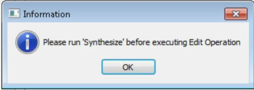

<br />

**Note:** When an interactive tool is opened for editing, the Constraint Manager is disabled. Close the Interactive Tool to return to the Constraint Manager.

<br />

## Place and Route

Double-click **Place and Route**to run Place and Route on your design with the default settings.

### Place and Route Options

To change your place and route settings from the Design Flow window, expand<br /> **Implement Design**, right-click **Place and Route**, and choose **Configure Options**. When the<br /> Layout Options dialog box appears, specify your settings, and then click<br /> **OK**.


The following table describes the place and route options.

|Option|Description|
|------|-----------|
|Timing-Driven|Timing-driven Place and Route strives to meet timing constraints<br /> specified by you or generated automatically. Timing-driven Place and<br /> Route delivers better performance than Standard Place and<br /> Route.If you do not select this option, Libero SoC ignores<br /> timing constraints, although timing reports based on timing<br /> constraints can still be generated for the design.|
|Power-Driven|This option is available when Timing-Driven is checked. This<br /> option runs the Power-Driven layout. This layout reduces dynamic<br /> power while still maintaining timing constraints.|
|I/O Register Combining|This option is available when Timing-Driven is checked. This<br /> option combines any register directly connected to an I/O when it<br /> has a timing Constraint. If multiple registers are directly<br /> connected to a bi-directional I/O, select one register to combine in<br /> the following order: input-data, output-data, output-enable.|
|Global Pins Demotion|This option is available when Timing-Driven is checked. This<br /> option allows the layout tool to select the most timing critical<br /> pins on any Global network and moves them to the source that drives<br /> the Global resource \(proactively attempts to improve timing by<br /> putting timing-critical pins onto routed resources\).If the driver<br /> for the global is a fabric register, the driver is replicated<br /> and the duplicate names are printed. Each set of names must be<br /> used in place of the original register in any specified timing<br /> constraint.|
|Driver Replication|This option is available when Timing-Driven is checked. This<br /> option allows an algorithm to replicate critical net drivers to<br /> reduce timing violations. The algorithm prints the list of registers<br /> along with the duplicate names. Each set of names must be used in<br /> place of the original register in any specified timing<br /> constraint.|
|High Effort Layout|This option is available when Timing-Driven is checked. This<br /> option improves layout success, but increases layout runtime and can<br /> impact timing performance.|
|Repair Minimum Delay Violations|This option is available when Timing-Driven is checked. This<br /> option repairs Minimum Delay violations \(Timing-Driven Place and<br /> Route option enabled\) and performs an additional route. This is done<br /> by increasing the length of routing paths and inserting routing<br /> buffers to add delay to the top violating paths.If this option is<br /> enabled, the programmable delays through I/Os are adjusted to<br /> meet hold time requirements from input to registers. For<br /> register-to-register paths, buffers are inserted.The<br /> Repair tool analyzes paths iteratively with negative minimum<br /> delay slacks \(hold time violations\) and chooses suitable<br /> connections and locations to insert buffers. Not all paths can<br /> be repaired using this technique, but many common cases will<br /> benefit.Even when this option is enabled, it will not<br /> repair a connection or path that:Is a<br /> hardwired, preserved, or global net.Has a<br /> sink pin, which is a clock pin.Violates<br /> a maximum delay constraint \(that is, the maximum delay<br /> slack for the pin is negative\).Can cause<br /> the maximum delay requirement for the sink pin to be<br /> violated \(setup violations\).Typically, this option is enabled with the<br /> Incremental Layout option when a design’s maximum delay<br /> requirements are satisfied.Every effort is made to avoid<br /> creating max-delay timing violations on worst case<br /> paths.Min Delay Repair generates a report in the<br /> implementation directory that lists all the paths that were<br /> considered.If your design continues to have internal hold<br /> time violations, rerun repair Minimum Delay Violations with<br /> Incremental Layout to analyze additional paths.|
|Incremental Layout|<br /> Uses previous placement data as the initial placement for the<br /> next run.<br /> To preserve portions of your design, use Compile Points, which<br /> are RTL partitions of the design that you define before<br /> synthesis. The Synthesis tool treats each Compile Point as a<br /> block that allows you to preserve its structure and timing<br /> characteristics. By executing Layout in Incremental Mode,<br /> locations of previously placed cells and the routing of<br /> previously routed nets is preserved. Compile Points makes it<br /> easy to mark portions of a design as black boxes, and let you<br /> divide the design effort between designers or teams. For more<br /> information, see the Synopsys FPGA Synthesis Pro ME User<br /> Guide.<br />|
|Use Multiple Pass|Runs multiple passes of Place and Route to achieve the best<br /> layout result. Click **Configure** to specify the<br /> criteria you want to use to determine the best layout<br /> result.|
|Block Creation|This option is available only when the Block Creation option is<br /> turned on \(**Project &gt; Project Settings &gt; Design Flow &gt; Enable Block Creation**\). The value entered here<br /> limits the number of row-global resources available in every<br /> row-global region of the device. During Place and Route of the<br /> block, the tool will not exceed this capacity on any row-global<br /> region. The default value is the maximum number of row-globals. If<br /> you enter a value lower than the maximum capacity \(the default\), the<br /> layout of the block can integrate with the rest of the design if it<br /> consumes the remaining row-global capacity.|

## Multiple Pass Layout Configuration

Multiple Pass Layout attempts to improve layout quality by selecting results from a few number of<br /> Layout passes. This is done by running individual place and route multiple times with<br /> varying placement seeds and measuring the best results for the specified criteria.

When using Multiple Pass Layout, observe the following guidelines:

-   Multiple Pass Layout saves your design file with the pass that has the best layout results. If you want to preserve your existing design state, you must save your design file with a different name before proceeding. To do this, select **File &gt; Save As**.
-   The following reports for each pass are written to the working directory to assist you in later analysis: timing, maximum delay timing violations, minimum delay timing violations, and power.
    -   `<root_module_name>_timing_r<runNum>_s<seedIndex>.rpt`
    -   `<root_module_name>_timing_violations_r<runNum>_s<seedIndex>.rpt`
    -   `<root_module_name>_timing_violations_min_r<runNum>_s<seedIndex>.rpt`
    -   `<root_module_name>_power_r<runNum>_s<seedIndex>.rpt`
    -   `<root_module_name>_iteration_summary.rpt` provides additional details about the saved files.

To configure multiple pass options:

1.  When running Layout, select the UI control in the Layout Options dialog box.
2.  Click **Configure**. The Multi-Pass Configuration dialog box appears.

    

3.  Set the options in the following table and click **OK**.

<table id="TABLE_NDX_Q33_34B"><thead><tr><th>

Option

</th><th>

Description

</th></tr></thead><tbody><tr><td>

Number of passes

</td><td>

Number of passes \(iterations\) using the slider. 1 is the minimum and 25 is the maximum.Default: 5

</td></tr><tr><td>

Start at seed index

</td><td>

Index into the array of random seeds that is the starting point for the passes. If not<br /> specified, the default behavior is to continue<br /> from the last seed index that was used.

</td></tr><tr><td>

Measurement

</td><td>

Measurement criteria against which you want to compare layout results.

</td></tr><tr><td>

Slowest clock

</td><td>

Uses the slowest clock frequency in the design in each pass as the performance reference for<br /> the layout pass.

</td></tr><tr><td>

Specific clock

</td><td>

Uses a specific clock frequency as the performance reference for all layout passes.

</td></tr><tr><td>

Timing violations

</td><td>

Timing Violations to use the pass that best meets the slack or timing-violations constraints. This is the default.**Note:** You must enter your own timing constraints through SmartTime or SDC.

</td></tr><tr><td>

Maximum delay

</td><td>

Examines timing violations \(slacks\) obtained from maximum delay analysis. This is the default.

</td></tr><tr><td>

Minimum delay

</td><td>

Examines timing violations \(slacks\) obtained from minimum delay analysis.

</td></tr><tr><td>

Select by

</td><td>

Slack criteria. Choices are:-   Worst Slack: Largest amount of negative slack \(or least amount of positive slack if all constraints are met\) for each pass is identified, and the largest value of all passes determines the best pass. \(*Default*\)
-   Total Negative Slack: Sum of negative slacks from the first 100 paths in the Timing Violations report for each pass is identified, and the largest value of all the passes determines the best pass. If no negative slacks exist for a pass, the worst slack is used to evaluate that pass.
-   Stop on first pass without violations: Stops performing remaining passes if all timing constraints are met when there are no negative slacks reported in the timing violations report.

</td></tr><tr><td>

Total power

</td><td>

Determines the best pass to be the one that has the lowest total power \(static + dynamic\) of all layout passes.

</td></tr></tbody>
</table>### Iteration Summary Report

The file `<root_module>_iteration_summary.rpt` records a summary of<br /> whether the multiple pass run was started through the GUI or the<br /> `extended_run_lib` Tcl script, with arguments for repeating each run.<br /> Each new run appears with its own header in the Iteration Summary Report along with the<br /> fields `RUN_NUMBER` and `INVOKED AS`, followed by a table<br /> containing Seed Index, corresponding Seed value, Comparison data, Report Analyzed, and<br /> Saved Design information.


## Post Layout Editing of I/O Signal Integrity and Delay Parameters

The **Edit Post Layout Design** tool in the Design Flow allows you to tune I/O signal integrity parameters and external timing without executing Place and Route again.

Input is provided using a PDC file. From the Libero user interface, double-click **Edit Post Layout Design** to open a file selection dialog box and select the<br /> input file. In the batch flow, you can issue the command `edit_post_layout_design <input.pdc>`.

The PDC file contains one or more invocations of two PDC commands:

-   `edit_io`
-   `edit_instance_delay`

For more information about these commands, see the [PDC Commands User Guide for PolarFire FPGA](http://coredocs.s3.amazonaws.com/Libero/2025_1/Tool/pf_pdc_ug.pdf).

To assist you in knowing those instances on which this tool can update delays, the<br /> Place-and-Route tool generates a `<root>_delayinstance.rpt` report<br /> file. This report has an editable \(**Editable?**\) column with<br /> **Yes** and **No** values that indicate<br /> whether a delay parameter can be edited by this tool.

The batch command `edit_post_layout_design` fails when any commands in the input PDC file fail. The PDC commands fail if the syntax is incorrect, the referenced instances do not exist, or the values are out of legal ranges. If the batch command fails, the layout state of the design does not change. If the batch command succeeds:

-   Layout state changes to reflect the values in the PDC commands.

-   Pin report and delay instance report files are regenerated to reflect the latest values.

-   Downstream tools Verify Timing, Verify Power, Generate FPGA Array Data, and Generate Back Annotated Files are invalidated.


The batch command `edit_post_layout_design` generates the log file<br /> `<project>/designer/<root>/top_editpostlayout_log.log` to<br /> provide information about the run and which PDC file was used in the run. This log gets<br /> appended with information from each run of the command. Each run’s start message is<br /> prefixed by the time when the run is executed. The log file can be viewed from the<br /> Reports tab \(Design &gt; Reports\). The log file is removed when Place and Route is run<br /> or cleaned.

In the following figure, downstream steps this tool invalidates are highlighted in<br /> yellow.


## Resource Usage

After completing the layout of your design, you can assess the resource usage to understand how efficiently your design utilizes the available resources on the chip. The **Resource Usage** report provides an overview of the types and percentages of resources used relative to the total resources available on the chip in a tabular format.

To access the report:

1.  Navigate to **Design** &gt; **Reports**.
2.  Choose `<design_name>_layout_log.log` file.

**Important:** Numbers in the [Resource Usage Example Report](GUID-16AC6815-2A39-4FFC-8AE9-F7A82337A198.md#GUID-954B1BF6-9CA7-4584-A884-CA4EA01DBCA4) table are generated as an example for metric demonstration only.

|Type|Used|Total|Percentage|
|----|----|-----|----------|
|4LUT|0|299544|0.00|
|DFF|0|299544|0.00|
|Logic Element|0|299544|0.00|
|I/Os using I/O Registers|263|512|51.37|
|I/O Register Flip-Flops|789|1536|51.37|
|-- Input I/O Flip-Flops|263|512|51.37|
|-- Output I/O Flip-Flops|263|512|51.37|
|-- Enable I/O Flip-Flops|263|512|51.37|

Type
:   Specifies the category of the resource being reported. It includes the following:

    4LUT
    :   4-input Look-up Table for executing any logic function involving up to four inputs. In the report, the number of 4-input lookup tables \(4LUTs\) indicates how many are used in the design, regardless of whether they are combined with D Flip-Flops \(DFFs\).

    DFF
    :   D Flip-Flop stores individual bits of data. The report shows the total number of DFFs used in the design, irrespective of their combination with 4LUTs.

    Logic Element
    :   A logic element \(LE\) is a unit in the fabric that might contain a 4LUT, a DFF, or both. The report includes all LEs, whether they contain only 4LUTs, only DFFs, or both.

    I/Os using I/O Registers
    :   Refers to the input/output resources that utilize I/O registers. These registers manage data flow between the internal logic and the external environment.

    I/O Register Flip-Flops
    :   Flip-flops specifically used in I/O operations. They are part of the I/O registers and help in managing the data flow for I/O operations.

    :   Input I/O Flip-Flops
:   Flip-flops are used for input operations such as capturing data from external sources.

        Output I/O Flip-Flops
        :   Flip-flops are used for output operations such as driving data to external destinations.

        Enable I/O Flip-Flops
        :   Flip-flops enable or disable I/O operations. They control the activation of input/output operations, providing fine-tuned management of data flow to and from the chip.

Used
:   Indicates the number of resources of each type that are currently utilized in the design. It provides a direct count of how many 4LUTs, DFFs, LEs, or I/O resources are used.

Total
:   Shows the total number of each resource type available on the chip. It represents the maximum capacity of the selected device for each resource type highlighting the limits within which your design must fit.

Percentage
:   Calculates the percentage of each resource type that is used relative to the total available resources. It is computed as \(Used/Total\) × 100.

### Overlapping of Resource Reporting

The [Resource Usage](GUID-16AC6815-2A39-4FFC-8AE9-F7A82337A198.md#) report contains the total number of used 4LUTs and DFFs, regardless of<br /> whether they are combined within LEs. The **Overlapping of Resource Reporting** provides detailed breakdown of LEs' utilization.

#### General Formulas for Logic Element Utilization

This section provides a set of general formulas that can be applied to calculate the<br /> usage of LEs in any design. Use these formulas to analyze how different components,<br /> such as 4LUTs and DFFs, are distributed across the available LEs.

Total LEs Used
:   Total LEs Used = LEs using both 4LUTs and DFFs + LEs using 4LUTs only or DFFs only

LEs Using 4LUT Only
:   LEs Using 4LUT Only = Total LEs used – LEs containing DFFs

    This formula calculates the number of LEs<br /> that contain only 4LUTs, excluding the LEs that also contain<br /> DFFs.

LEs Using DFF Only
:   LEs Using DFF Only = Total LEs used – LEs containing 4LUTs

    This formula calculates the number of LEs<br /> that contain only DFFs, excluding the LEs that also contain<br /> 4LUTs.

LEs Using Both 4LUT and DFF
:   LEs Using Both 4LUTs and DFFs = \(LEs containing 4LUTs + LEs containing DFFs\) – Total LEs used

LEs Using 4LUTs Only or DFFs Only
:   LEs Using 4LUTs only and DFFs only = LEs using DFFs only + LEs using 4LUTs only

These formulas are applied to different reports to calculate the usage of 4LUTs and<br /> DFFs resources within Logic Elements.

#### Example Application of Logic Element Utilization

To illustrate the practical use of the general formulas for Logic Element<br /> utilization, this section presents a detailed example.

**Important:** Numbers for 4LUTs, DFFs and LEs in **Overlapping of Resource Reporting** are generated as an example to demonstrate the calculations only.

The following example report provides a breakdown of how many of each type of<br /> resource is used in the design:

Used
:   4LUT = 400

    400 out of the 473 LEs have 4LUTs inside which is the total number of<br /> 4LUTs used in the design, irrespective of whether they are combined<br /> with DFFs. This means 73 \(473 - 400\) of them have no 4LUTS.

:   DFF = 300

    300 out of the 473 LEs have DFFs inside which is the total number of<br /> DFFs used, regardless of their combination with 4LUTs. This means<br /> 173 \(473 - 300\) of them have no DFFs.

:   Logic Elements = 473

    It details the number of LEs used, whether they contain only 4LUTs,<br /> only DFFs, or both.

<br />

The following table summarizes the calculations for this example:

|Logic Element Description|Calculated Logic Elements|
|-------------------------|-------------------------|
|LEs using DFF only|<br /> Calculated as the used LEs minus those containing 4LUTs:<br /> 473 - 400 = 73<br /> <br />|
|LEs using 4LUTS only|<br /> Calculated as the used LEs minus those containing DFFs:<br /> 473 - 300 = 173<br />|
|LEs using 4LUTs only or DFFs only|<br /> Calculated as the sum of LEs using only one type of<br /> resource:<br /> 73 + 173 = 246<br />|
|LEs using both 4LUTs and DFFs|<br /> The overlap between LEs containing 4LUTs and DFFs, calculated<br /> as the sum of used 4LUT and used DFF minus the total used<br /> LEs:<br /> \(400 + 300\) – 473 = 227<br />|
|Total LEs used|The total number of Logic Elements<br /> used:**`473`**|

In the following figure, the overlapping area in a Venn diagram represents the LEs<br /> that utilize both 4LUTs and DFFs within the design.


## Global Net Report

The Global Net Report displays all the nets that use the global routing resources of the<br /> device. This report is generated after the Place and Route step and is available in XML<br /> format in the **Reports** tab \(**Libero SoC &gt; Design&gt;Reports &gt; &lt;design\_name&gt;\_glb\_net\_report.xml**\).

The global routing resources in Microchip FPGA devices offer a low-skew network for<br /> effective distribution of high fanout nets including clock signals. Global routing<br /> resources include the following:

-   Fabric CCC
-   Global Buffers \(GB\)
-   Row Global Buffers \(RGB\)

    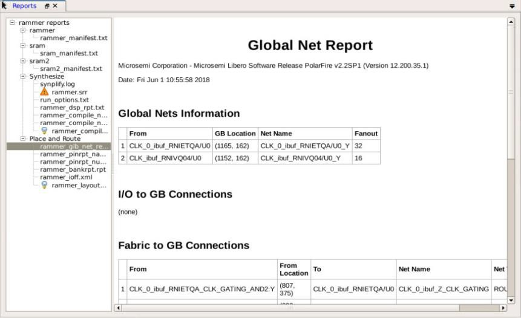


The following topics describe the sections in the Global Net Report.

### Global Nets Information

Under **Global Nets Information**, the **GB Location** column refers to the location of the global routing<br /> resource/instance name of the macro on the chip. The location is indicated by X-Y<br /> coordinates of the global resource macro.


### I/O to GB Connections

The **I/O to GB Connections** section lists all the I/Os connected to the<br /> Global Resource/instance name of the macro.


<table id="TABLE_AN2_GLK_34B"><thead><tr><th>

Column

</th><th>

Description

</th></tr></thead><tbody><tr><td>

I/O Function

</td><td>

I/O connection details, such as the bank name, any hardwired GB or<br /> hardwired CCC connections, and any dedicated SERDES/DDR connections. -   For hardwired connections, the function name<br /> \(DDRIO120PB2/MDDR\_DQ\_ECC1/GB12/CCC\_NE1\_CLKI2\) contains the<br /> GB index \(GB12 in the preceding example\) that matches the GB<br /> index in the **To** column \(GBL\[12\] in<br /> the preceding example\).

-   For routed connections, the function name does not contain<br /> the proper GB index.


</td></tr><tr><td>

Net Type

</td><td>

Routed or hardwired:-   Hardwired net types are dedicated wiring resources and have lower insertion delays.
-   Routed net types are implemented using fabric routing resources and the insertion delay \(generally higher than hardwired nets\) and vary from iteration to iteration.

</td></tr></tbody>
</table>### Fabric to GB Connections

The **Fabric to GB Connections** section lists all the nets originating from<br /> the fabric to the Global Resources/Instance name of the macro. The **From Location** column refers to the X-Y coordinates of the driver pin of the<br /> net. The nets are routed nets, not hardwired.

### CCC to GB Connections

The **CCC to GB Connections** section lists the nets originating from the<br /> Clock Conditioning Circuitry \(CCC\) outputs \(GLx\) to the Global Resources/instance name<br /> of the macro. To minimize clock skew, CCC clock outputs usually are hardwired dedicated<br /> connections to Global resources \(GB\).

### CCC Input Connections

The **CCC Input Connections** section lists the nets from the I/O pins<br /> to the CCC inputs.

Net type can be routed or hardwired. Hardwired net types are dedicated wiring resources<br /> and have lower insertion delays. Routed net types are implemented using fabric routing<br /> resources and the insertion delay \(generally higher than that of hardwired nets\), varies<br /> from iteration to iteration.

|Column|Description|
|------|-----------|
|I/O Function|I/O connection details, such as bank name, any hardwired GB or<br /> hardwired CCC connections, and any dedicated SERDES/DDR connections. For<br /> hardwired connections, the I/O function name contains the CCC location<br /> \(CCC\_NE0 in the preceding figure\).|
|To \(Pin Swapped for Back Annotation Only\)|For hardwired connections, input pin of the CCC in the back annotated<br /> netlist.|

### Local Clock Nets to RGB Connections

The **Local Clock Nets to RGB Connections** section lists the clock nets from<br /> the local clock nets to RGB \(Row globals\). RGBs are situated on the vertical stripes of<br /> the global network architecture inside the FPGA fabric. The global signals from the GBs<br /> are routed to the RGBs. Each RGB is independent and can be driven by fabric routing in<br /> addition to being driven by GBs. This facilitates using RGBs to drive regional clocks<br /> spanning a small fabric area, such as the clock network for SERDES.


|Column|Description|
|------|-----------|
|From|Driver routed to different RGBs, each with different local<br /> fanout.|
|From Location|X-Y coordinates of the driver of the net.|
|Fanout|Total fanout of the net and the local fanout column gives the fanout<br /> at the local RGB only.|
|RGB Location|X-Y coordinates on the chip.|
|RGB Fanout|Fanout at the local RGB.|

### Global Clock Nets to RGB Connections

The **Global Clock Nets to RGB Connections** section lists all nets<br /> from Globals \(GBs\) to Row Globals \(RGBs\).

<br />


<br />

|Column|Description|
|------|-----------|
|From|Hardwired to different RGBs each with different local<br /> fanout.|
|From Location|X-Y coordinates on the chip. The **Fanout**<br /> column gives the total fanout of the net.|
|Local Fanout|Fanout local to RGB.|

<br />

### Warnings \(RTG4 only\)

The Warning section is available in RTG4 devices only. It gives warnings about clock or reset<br /> nets which are not radiation protected and recommends ways to protect the nets from<br /> radiation. Some warning examples are:

-   Clocks or reset nets that are routed are not radiation protected.
-   Hardwired connections from `DDRIO` bank are not radiation protected.
-   For radiation protection, Microchip recommends using dedicated global clocks that come with built-in radiation protection.

    

-   Local resets that are not driven by three separate logic cones are not radiation protected.

    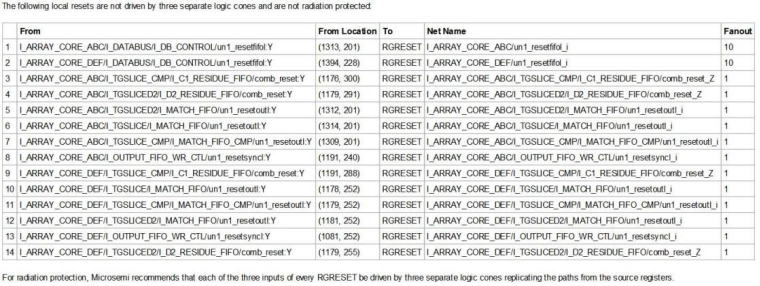

-   For radiation protection, Microchip recommends that each of the three inputs of every `RGRESET` be driven by three separate logic cones replicating the paths from the source registers. See the descriptions of `RGRESET` macro in the [Macro Library User Guide for RTG4](http://coredocs.s3.amazonaws.com/Libero/2025_1/Tool/rtg4_mlg.pdf).

## Verify Post Layout Implementation

The following sections describe how to verify post-implementations of your design.

### Generate Back Annotated Files

The first step when verifying the post-layout implementation generates two files:

-   `*ba.sdf`
-   `*ba.v`/`.vhd`

The `*ba.sdf` file is a delay file in Standard Delay Format \(SDF\).<br /> It is used for back annotation to the simulator.

The `*ba.v`/`.vhd` file is a post-layout flattened netlist<br /> used for back-annotated timing simulation. The file can contain low-level macros to<br /> improve design performance.

This step allows you to select **Export Enhanced min delays for best case**.<br /> Checking this option exports your enhanced minimum delays to include the best-case<br /> timing results in your back annotated file.

### Simulate - Opens ModelSim ME Pro

The back-annotation functions are used to extract timing delays from your post layout data. These extracted delays are placed into a file for use by your CAE package’s timing simulator. The default simulator for Libero SoC is ModelSim ME Pro. You can change your default simulator in your [Tool Profile](GUID-DD5BFD75-BB76-49D8-99EA-EC328F43A5FD.md#).

To perform pre-layout simulation, in the Design Flow window, under **Verify Pre-Synthesized design**, double-click **Simulate**.

To perform timing simulation:

1.  Back-annotate your design and create your testbench.
2.  Right-click **Simulate** in the Design Flow window \(**Implement Design &gt; Verify Post-Synthesis Implementation &gt; Simulate**\) and choose **Organize Input Files &gt; Organize Simulation Files**.
    -   In the Organize Files for Source dialog box, all the stimulus files in the current project appear in the Source Files in the Project list box. Files already associated with the block appear in the **Associated Source Files** list box.

    -   In most cases, you will have one testbench associated with your block. However, if you want simultaneous association of multiple testbench files for one simulation session, as in the case of PCI cores, add multiple files to the **Associated Source Files** list.

    -   To add a testbench, select the testbench you want to associate with the block in the **Source Files** in the **Project** list box and click **Add**to add it to the Associated Source Files list.

    -   To remove or change the files in the **Associated Source Files** list box, select the files and click **Remove**.

    -   To arrange testbenches, use the up and down arrows to define the order you want the testbenches compiled. The top-level entity must be at the bottom of the list.

3.  When you are satisfied with the **Associated Simulation Files** list, click **OK**.
4.  To start ModelSim ME Pro, right-click **Simulate** in the Design Hierarchy window and choose **Open Interactively**. ModelSim ME Pro starts and compiles the appropriate source files. When the compilation completes, the simulator runs for 1 microsecond and the Wave window opens to display the simulation results.
5.  In the Wave window, scroll to verify the logic works as intended. Use the cursor and zoom buttons to zoom in and out and measure timing delays. If you did not create a testbench with WaveFormer Pro, you might receive error messages with the `vsim` command if the instance names of your testbench do not follow the same conventions as WaveFormer Pro. Ignore the error message and type the correct `vsim` command.
6.  On completion, from the **File** menu, click **Quit**.

### Verify Timing

Using the Verify Timing Configuration dialog box, you can configure the Verify Timing tool to<br /> generate a timing constraint coverage report along with detailed static timing analysis<br /> and violation reports based on different combinations of process speed, operating<br /> voltage, and temperature. For multi-corner analysis, the following operation<br /> conditioning corners are considered:

-   Max analysis at BEST and WORST operating conditions
-   Min analysis at BEST and WORST operating conditions

Although the analysis is done for all corners, Multi Corner Timing Analysis reports<br /> show only two conditions. To cross-check this, run the command with the tool.


The following figures show an example of the Verify Timing Configuration dialog box.

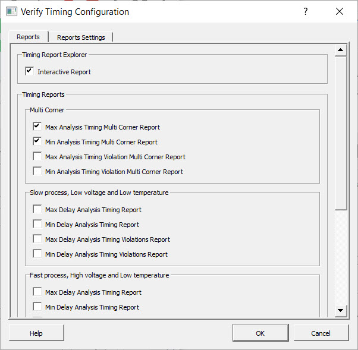

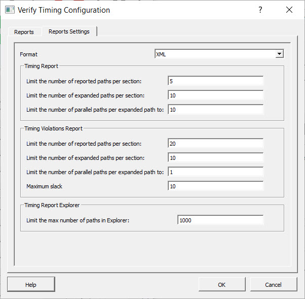

The reports can be generated in XML or text format. The following table lists the report<br /> settings.

**Note:** If any options are left blank in the **Report Settings** tab, a tooltip error icon appears as shown in the following figure.

<br />


<br />

|Report|Setting|Description|
|------|-------|-----------|
|Timing Report|Limit the number of reported paths per section|Number of reported paths under each section. Range:<br /> 1–20000|
|Limit the number of expanded paths per section|Number of expanded paths under each section. Range:<br /> 1–20000|
|Limit the number of parallel paths per expanded path to|Number of parallel paths for each expanded path. Range:<br /> 1–20000|
|Timing Violations Report|Limit the number of reported paths per section|Number of reported paths under each section.Range:<br /> 1–20000|
|Limit the number of expanded paths per section|Number of expanded paths under each section.Range:<br /> 0–20000|
|Limit the number of parallel paths per expanded path to|Number of parallel paths for each expanded path.Range:<br /> 1–20000|
|Maximum Slack|Maximum slack threshold value in nanoseconds. Paths are filtered<br /> based on the slack threshold value in Timing Violation<br /> reports.|
|Timing Report Explorer|Limit the max number of paths in Explorer|<br /> Number of input paths in Timing Report Explorer.<br /> Range: 1–10000<br /> Timing Report Explorer can also be opened from Design<br /> Tab &gt; Timing Report Explorer.<br /> After generating a report, the Timing Report Explorer appears in<br /> Path View as shown in the following figure.<br />|


In the preceding figure, click any path and select the UI control view from the<br /> settings drop-down list to display a detailed view similar to the one in the following<br /> figure.


Observe the following guidelines:

-   The following warning message appears if there are no paths for a selected filter:

    `No paths were found to match your filter. Choose another filter or try modifying your search criteria.`

-   Cross Probing between Timing Report Explorer and Chip Planner is supported for<br /> nets and cells.

-   Mousing over the Source/Destination clock combo boxes displays tooltips as shown<br /> in the following figures:

    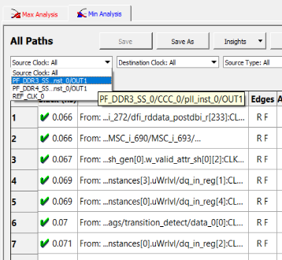

    


**Insights**: This option provides an insight into the graphical view<br /> of slack distribution across the selected filter, cell vs. net delays, and logic level<br /> distribution.

#### Slack Distribution

Click **Insights** &gt; **Slack Distribution** to view the slack distribution. The following figure shows an example of<br /> positive slack distribution.

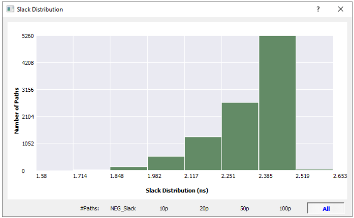

The following figure shows an example of negative slack distribution.


#### Cell vs Net Delays

Click **Insights** &gt; **Cell vs Net Delays** to view a delay breakdown of the top 100 paths in the form of a stacked<br /> bar chart, percentage chart, and pie chart.

**Stacked Bar Chart**

The stacked bar chart shows the net and cell delay for a path. Radio buttons at the top<br /> of the chart allows you to toggle between value and percentage \(%\) views. Buttons at the<br /> bottom of the chart allow you to select the number of paths from the path range:<br /> **NEG\_Slack**, **10p**,<br /> **20p**, **50p**, and<br /> **100p** \(default is **10p**\). Hovering over<br /> the bar of a data chart displays a tooltip with From, To, Net Delay, and Cell Delay<br /> information.

")

Clicking a bar in the chart displays a pop-up chart with expanded path information,<br /> similar to the following.

**Percentage \(%\) View**

Every stack bar in the percentage chart represents net and cell delay for a path in terms<br /> of percentage. Buttons at the bottom of the chart allow you to select the number of<br /> paths from the path range: **NEG\_Slack**, **10p**,<br /> **20p**, **50p**, and<br /> **100p** \(default is **10p**\).

")

Clicking a bar in the chart displays a pop-up chart with expanded path information,<br /> similar to the following.

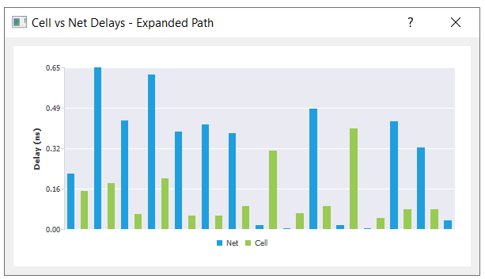

**Pie Chart**

The pie chart shows the sum of total net delay and cell delay for a selected path range.<br /> Buttons at the bottom of the chart allow you to select the number of paths from the path<br /> range: **NEG\_Slack**, **10p**,<br /> **20p**, **50p**, and<br /> **100p** \(default is **10p**\).


#### Logic Level Distribution

Click **Insights** &gt; **Logic Level Distribution** to view a distribution chart that represents the number of paths having a<br /> logic count equal to the bar number. Hovering over a bar in the distribution chart<br /> displays a tooltip that shows the total number of path information. The following figure<br /> shows an example of logic level distribution.

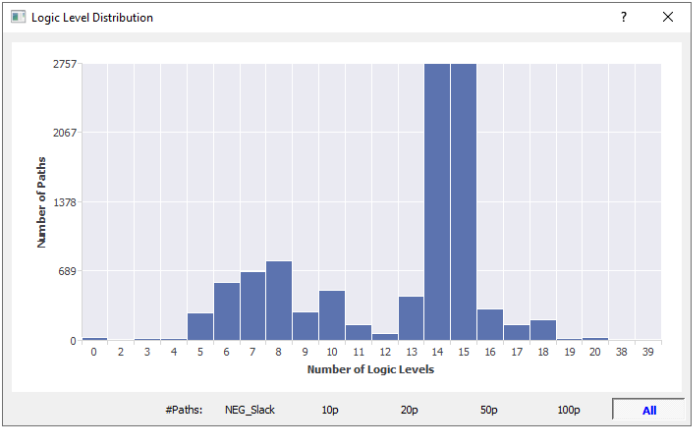

### Types of Timing Reports

From the **Design Flow &gt; Verify Timing**, you can generate the following reports. The<br /> following reports organize timing information by clock domain. Four types of timing<br /> reports are available. To configure which reports to generate, use the Verify Timing<br /> Configuration dialog box \(**Design Flow &gt; Verify Timing &gt; Configure Options**\).

<table id="TABLE_EP2_NGF_J4B"><thead><tr><th>

Report

</th><th>

Description

</th></tr></thead><tbody><tr><td>

Timing reports

</td><td>

<br /> The following reports can be generated:<br /> -   Max Delay Static Timing Analysis report based on Slow process, Low Voltage, and High Temperature operating conditions.
-   Min Delay Static Timing Analysis report based on Fast process, High Voltage, and Low Temperature operating conditions.
-   Max Delay Static Timing Analysis report based on Fast process, High Voltage, and Low Temperature operating conditions.
-   Min Delay Static Timing Analysis report based on Slow process, Low Voltage, and High Temperature operating conditions.
-   Max Delay Static Timing Analysis report based on Slow process, Low Voltage, and Low Temperature operating conditions.
-   Min Delay Static Timing Analysis report based on Slow process, Low Voltage, and Low Temperature operating conditions.

<br />

</td></tr><tr><td>

Timing violations reports

</td><td>

<br /> Organizes timing information by clock domain. You can configure<br /> which reports to generate using the Verify Timing Configuration<br /> dialog box. The following reports can be generated:<br /> -   Max Delay Analysis Timing Violation report based on Slow process, Low Voltage, and High Temperature operating conditions.
-   Min Delay Analysis Timing Violation report based on Fast process, High Voltage, and Low Temperature operating conditions.
-   Max Delay Analysis Timing Violation report based on Fast process, High Voltage, and Low Temperature operating conditions.
-   Min Delay Analysis Timing Violation report based on Slow process, Low Voltage, and High Temperature operating conditions.
-   Max Delay Analysis Timing Violation report based on Slow process, Low Voltage, and Low Temperature operating conditions.
-   Min Delay Analysis Timing Violation report based on Slow process, Low Voltage, and Low Temperature operating conditions.

<br />

</td></tr><tr><td>

Constraints coverage report

</td><td>

Displays the overall coverage of the timing constraints set on<br /> the current design.&lt;root&gt;\_timing\_constraints\_coverage.xml<br /> \(generated by default\)

</td></tr></tbody>
</table>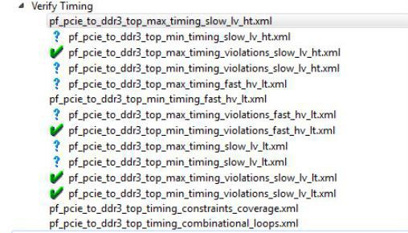

The following table describes the icons associated with reports.

|Icon|Definition|
|----|----------|
||Timing requirements met for this report.|
|<br /> <br />|<br /> Timing requirements not met \(violations\) for this report.<br />|
|<br /> <br />|<br /> Timing report is available but not selected/configured for<br /> generation.<br />|

### SmartTime

SmartTime is the Libero SoC gate-level static timing analysis tool. With SmartTime, you can<br /> perform complete timing analysis of your design to ensure that you meet all timing<br /> constraints and that your design operates at the desired speed, with the right amount of<br /> margin across all operating conditions.

For information about creating and editing timing constraints, see the [Timing Constraints Editor User Guide](http://coredocs.s3.amazonaws.com/Libero/2025_1/Tool/smarttime_ce_ug.pdf).

#### Static Timing Analysis \(STA\)

Static timing analysis \(STA\) identifies timing violations in your design and ensures it meets<br /> your timing requirements. You can communicate timing requirements and timing exceptions<br /> to the system by setting timing constraints. A static timing analysis tool then checks<br /> and reports setup and hold violations as well as violations on specific path<br /> requirements.

STA is well-suited for traditional synchronous designs. The main advantage of STA is that, unlike<br /> dynamic simulation, it does not require input vectors. It covers all possible paths in<br /> the design and does all the above with relatively low run-time requirements.

STA tools report all possible paths, including false paths. False paths are timing paths in the<br /> design that do not propagate a signal. Because STA tools do not automatically detect<br /> false paths in their algorithms, you need to identify false paths as false path<br /> constraints to the STA tool and exclude them from timing considerations to obtain a true<br /> and useful timing analysis.

##### Timing Constraints

SmartTime supports a range of timing constraints to provide useful analysis and efficient timing-driven layout.

##### Timing Analysis

SmartTime provides analysis types that allow you to:

-   Find the minimum clock period/highest frequency that does not result in a timing violations
-   Identify paths with timing violations
-   Analyze delays of paths that have no timing constraints
-   Perform inter-clock domain timing verification
-   Perform maximum and minimum delay analysis for setup and hold checks

To improve the accuracy of the results, SmartTime evaluates clock skew during timing analysis by<br /> computing individual clock insertion delays for each register.

SmartTime checks the timing requirements for violations, such as multicycle or false paths, while<br /> evaluating timing exceptions.

#### SmartTime and Place and Route

Timing constraints impact analysis the same way they affect place and route. As a result, adding<br /> and editing timing constraints in SmartTime is the best way to achieve optimum<br /> performance.

#### SmartTime and Timing Reports

The following report files can be generated from **SmartTime &gt; Tools &gt; Reports**:

-   Timing Report \(for both Max and Min Delay Analysis\)
-   Timing Violations Report \(for both Max and Min Delay Analysis\)
-   Bottleneck Report
-   Constraints Coverage Report
-   Combinational Loop Report

#### SmartTime and Cross-Probing into Chip Planner

From SmartTime, you can select a design object and cross-probe the same design object in Chip Planner. Design objects that can be cross-probed from SmartTime to Chip Planner include:

-   Ports
-   Macros
-   Timing Paths

For more information, see the **SmartTime User’s Guide** \(**Libero SoC &gt; Help &gt; Reference Manual &gt; SmartTime User’s Guide**\).

#### SmartTime and Cross-Probing into Constraint Editor

From SmartTime, you can cross-probe into the Constraint Editor. Select a Timing Path in<br /> SmartTime’s Analysis View and add one of the following Timing<br /> Exception Constraints:

-   False Path
-   Multicycle Path
-   Max Delay
-   Min Delay

The Constraint Editor reflects the newly added timing exception<br /> constraint.

For more information, see the [SmartTime Static Timing Analyzer User Guide](http://coredocs.s3.amazonaws.com/Libero/2025_1/Tool/smarttime_sta_ug.pdf).

### Verify Power

In the Design Flow window, right-click **Verify Power** to display the<br /> following menu options.


The following table describes the options.

|Option|Description|
|------|-----------|
|Run|Runs the default power analysis and produces a power report. This<br /> option is functionally equivalent to double-clicking.|
|Clean and Run All|Functionally equivalent to the sequence of Clean and Run.|
|Open Interactively|Displays the SmartPower for Libero SoC tool.|
|Clean|Clears the history of any previous default power analysis,<br /> including deletion of any reports. The flow task completion icon<br />  will<br /> also be cleared.|
|Configuration Options|If there are options to configure, a dialog box displays<br /> technology-specific choices.|
|View Report|If a report is available, clicking this option adds the<br /> **Report** tab to the Libero SoC GUI window<br /> and **Power Report** will be selected.|

### Verify Power Sub-Commands

The following table describes the Verify Power sub-commands.

|Sub-command|Description|
|-----------|-----------|
|Run|Runs the default power analysis and produces a power report. This<br /> sub-command is functionally equivalent to double-clicking Verify<br /> Power.|
|Clean and Run All|Functionally equivalent to clicking Clean and Run.|
|Open Interactively|Starts the SmartPower for Libero SoC tool.|
|Clean|Clears the history of any previous default power analysis,<br /> including deletion of any reports, and clears the flow task<br /> completion icon .|
|Configure Options|If there are options to configure, a dialog box appears with<br /> technology-specific choices.|
|View Report|Available if a report is available. Selecting this sub-command<br /> adds the Report tab to the Libero SoC GUI and selects and displays<br /> the Power Report.|

### SmartPower

SmartPower is the Microchip SoC state-of-the-art power analysis tool. SmartPower allows you to visualize power consumption and potential power consumption problems within your design globally and in-depth, so you can adjust to reduce power consumption.

SmartPower provides a detailed and accurate way to analyze designs for Microchip SoC FPGAs. From a top-level summary, you can analyze specific functions within the design, such as gates, nets, I/Os, memories, clock domains, blocks, and power supply rails.

You can analyze the hierarchy of block instances and specific instances within a hierarchy. Each analysis can be viewed in different ways to show the respective power consumption of the component pieces.

SmartPower allows you to analyze power by functional modes, such as Active, Flash\*Freeze, Shutdown, Sleep, or Static, depending on the specific FPGA family used. You can also create custom modes created in the design. Custom modes can also be used for testing "what if" potential operating modes.

SmartPower allows you to create test scenario profiles. Using a profile, you can create sets of operational modes to understand the average power consumed by a combination of functional modes, such as a combination of Active, Sleep, and Flash\*Freeze modes used over time in an application.

SmartPower generates detailed hierarchical reports of the power consumption of a design for easy evaluation. This allows you to find power consumption sources and take appropriate action to reduce power.

SmartPower supports the Value-Change Dump \(VCD\) file format, as specified in the IEEE® 1364 standard, generated by the simulation runs. Support for this format allows<br /> you to generate switching activity information from ModelSim ME Pro or other simulators, and<br /> then use the switching activity-over-time results to evaluate average and peak power<br /> consumption for your design.

For more information, see the [SmartPower User Guide](http://coredocs.s3.amazonaws.com/Libero/2025_1/Tool/smartpower_ug.pdf).

### Simultaneous Switching Noise

Simultaneous Switching Noise \(SSN\) is the Libero SoC voltage noise analysis tool. It provides a<br /> detailed analysis of the noise margin about each I/O pin in the design, based on the pin<br /> information and other active pins placed in the same I/O bank of the design. The tool<br /> computes the noise margin based on I/O standards, drive strength, and pin placement. The<br /> SSN Analyzer helps you achieve the desired voltage noise margin, resulting in improved<br /> signal integrity.

To open the SSN Analyzer, right-click **SSN Analyzer** in the Design Flow<br /> window and select **Open Interactively**.

#### Supported Dies and Packages

The following table lists supported dies and packages. Dies and packages for which<br /> characterization data is unavailable are not supported.

**Note:** In the following table, 1 ns pulse width is supported for MPF300XT/FCG1152 only.

|Family|Die|Package|
|------|---|-------|
|PolarFire®|RTPF500ZT|CG1509|
|MPF050T|FCSG325/FCVG484|
|MPF300XT|FCG1152|
|MPF100T|FCG484|
|MPF200T|FCG484/FCG784|
|MPF300T|FCG484/FCG784 /FCG1152|
|MPF500T|FCG784/FCG1152|
|SmartFusion®2 / IGLOO®2|M2S/M2GL150|FC1152|
|M2S/M2GL090|FC676|
|M2S/M2GL060|FG896|
|M2S/M2GL050|FG896|
|M2S/M2GL025|FG484/VF400|
|M2S/M2GL010|FG484|
|RTG4™ FPGA|RTG150|CG1657|

#### Supported I/O Standard

The SSN Analyzer supports the following I/O standards:

-   LVCMOS 3.3V
-   LVCMOS 2.5V
-   LVCMOS 1.8V
-   LVCMOS 1.5V
-   LVCMOS 1.2V
-   LVTTL

#### Supported I/O Types

The SSN Analyzer supports single-end I/Os only. Differential I/Os are not supported.

#### SSN Analyzer Tabs

The SSN Analyzer has three tabs:

-   Noise Report
-   Excluded IOs
-   Summary

##### Noise Report Tab

The **Noise Report** tab displays by default when the SSN Analyzer<br /> opens. This tab lists all the design Output and Inout ports. Input I/Os are not<br /> supported.


The following table describes the columns in the tab.

<table id="TABLE_FG3_ZJH_J4B"><thead><tr><th>

Column

</th><th>

Description

</th></tr></thead><tbody><tr><td>

Bank Name/Pin Number

</td><td>

The bank number and package pin number of the port.

</td></tr><tr><td>

Port Name

</td><td>

Name of the port.

</td></tr><tr><td>

Instance name

</td><td>

Instance name of the port.

</td></tr><tr><td>

I/O Standard

</td><td>

I/O standards supported by SSN Analyzer. Supported standards<br /> are:-   LVCMOS 3.3V
-   LVCMOS 2.5V
-   LVCMOS 1.8V
-   LVCMOS 1.5V
-   LVCMOS 1.2V
-   LVTTL

</td></tr><tr><td>

Drive Strength \(mA\)

</td><td>

Drive Strength selections are available from 2 to 12.

</td></tr><tr><td>

Static

</td><td>

Checked: I/O is considered neither as an Aggressor nor as a<br /> Victim. It is excluded from SSN Analysis.

</td></tr><tr><td>

Don’t Care

</td><td>

Checked: I/O is excluded from consideration as a Victim for Noise<br /> Margin computation. This is considered as an Aggressor for Noise<br /> Margin computation of other I/Os.**Note:** Static and Don’t Care are mutually exclusive.

</td></tr><tr><td>

Noise Margin \(%\)

</td><td>

Noise margin number computed by the SSN Analyzer. A red negative<br /> number indicates that it is outside the guideline of SSN<br /> analysis.

</td></tr><tr><td>

Within Guideline

</td><td>

Yes \(Positive Noise Margin\) or No \(Negative Noise Margin\). The<br /> Yes \(within guideline\) or No \(outside guideline\) guideline is<br /> different for different I/O standards:-   LVTTL/LVCMOS \(3.3 V\): Yes \(within guideline\) is defined as follows:
    -   A ground bounce voltage less than or equal to 1.25 V and a pulse width of less than or equal to 1 ns.
    -   A VDD dip voltage greater than or equal to VIHmin and a pulse width of less than or equal to 1 ns.
-   All other LVCMOS standards \(2.5 V, 1.8 V, 1.5 V, 1.2 V\): A Yes \(within guideline\) is defined as follows:
    -   A ground bounce voltage less than or equal to VILmax for ground bounce and a pulse width of less than or equal to 1 ns.
    -   A VDD dip voltage greater than or equal to VIHmin and a pulse width of less than or equal to 1 ns.
-   Noise margin violating the criteria for **Yes** is considered to fall outside the specified guidelines, and is reported as a **No**.

</td></tr></tbody>
</table>The following table describes the menu items available when you right-click an I/O in the<br /> **Noise Report** tab. You can select multiple I/Os and then<br /> right-click to apply the menu items to all selected I/Os.

<table id="TABLE_XL3_JMH_J4B"><thead><tr><th>

Menu

</th><th>

Description

</th></tr></thead><tbody><tr><td>

Show in IO Editor/Chip Planner

</td><td>

Allows you to cross-probe or reconfigure the selected I/Os in I/O<br /> Editor or Chip Planner.**Note:** This menu item is active when the **I/O Editor** is open.

</td></tr><tr><td>

Mark Selected Static

</td><td>

Marks the selected I/Os as static \(excluded from Noise<br /> Analysis\).

</td></tr><tr><td>

Unmark Selected Static

</td><td>

Unmarks the selected I/Os as static \(included for Noise<br /> Analysis\).

</td></tr><tr><td>

Mark Selected Don’t Care

</td><td>

Marks the selected I/O as Don’t Care \(not to be considered as<br /> Victim\).

</td></tr><tr><td>

Unmark Selected Don’t Care

</td><td>

Unmarks the selected I/Os as Don’t Care \(to be considered as<br /> Victim\).

</td></tr><tr><td>

Copy Selection

</td><td>

Copies the selected I/Os to the Clipboard for pasting into other<br /> applications.

</td></tr><tr><td>

Print Selection

</td><td>

Copies the selected I/Os and sends to the printer.

</td></tr><tr><td>

Sort by Package Die Pad Number

</td><td>

Sorts the pin number by the order of the I/O pad number. Use this<br /> option to find a pin and its neighboring pins. All used pins are<br /> arranged in order of geographical proximity.

</td></tr><tr><td>

Search and Filter

</td><td>

Filtering is available for Port Names. For example, if you enter the<br /> search pattern “DATA\*” in the Port Name field and click<br /> **Search**, the list is populated with all I/O<br /> names beginning with DATA. Names that do not begin with DATA are<br /> excluded from the list. Filtering allows you to focus on I/Os in which<br /> you are interested in SSN analysis.

</td></tr><tr><td>

Pulse Width

</td><td>

<br /> Settling time of the signal bounce. This is a threshold value that<br /> the signal bounce must exceed before the signal bounce is recognized<br /> for SSN calculation. Choices are:0 ns: any<br /> signal bounce with a pulse width above 0 ns is recognized<br /> for SSN calculation.1 ns: only<br /> signal bounces with a pulse width at or above 1 ns are<br /> recognized for SSN calculation.<br /> Changing this selection discards changes made for the current pulse<br /> width selection and triggers a re-analysis based on the new pulse<br /> width.<br /> **Note:** 1 ns pulse width is supported for the MPF300XT/FCG1152 die/package only.

<br />

</td></tr><tr><td>

Run Analysis

</td><td>

<br /> Not active when SSN first opens. It is activated only when you have<br /> made changes in the Noise Report. These changes might include one or<br /> more of the following:<br /> -   Checking/unchecking the **Don’t’ Care** check box for one or more I/Os.
-   Checking/unchecking the **Static** check box for one or more I/Os.

<br /> When you make your changes, click Run Analysis<br /> to enable SSN recompute the Noise Margin number.<br />

</td></tr><tr><td>

Save Report

</td><td>

<br /> Click to save the Noise Report in one of the following formats:<br /> -   Text: Text file with `*.txt` file extension.
-   CSV: Spreadsheet file with `*.csv` file extension.
-   XML: XML file with `*.xml` file extension.

<br />

</td></tr></tbody>
</table>##### Excluded I/Os Tab

The **Excluded I/O** tab shows all I/Os excluded from Noise Analysis. Excluded<br /> I/Os include:

-   I/Os on unsupported I/O standards
-   I/Os marked as **Static** in the **Noise Analysis** tab
-   JTAG I/Os for which noise analysis is irrelevant


The following table describes the columns in the tab.

**Note:** You can right-click an I/O previously marked as static in the **Excluded I/Os** list and select **Unmarked Selected Static** to include it in Noise Report Analysis.

<table id="TABLE_DHM_M4H_J4B"><thead><tr><th>

Options

</th><th>

Description

</th></tr></thead><tbody><tr><td>

Bank Name/Pin Number

</td><td>

Shows the bank number and package pin number of the port.

</td></tr><tr><td>

Port Name

</td><td>

Shows the name of the port.

</td></tr><tr><td>

Instance name

</td><td>

Shows the instance name of the port.

</td></tr><tr><td>

I/O Standard

</td><td>

Shows the I/O standards supported by SSN Analyzer. Supported<br /> standards are:-   LVCMOS 3.3V
-   LVCMOS 2.5V
-   LVCMOS 1.8V
-   LVCMOS 1.5V
-   LVCMOS 1.2V
-   LVTTL

</td></tr><tr><td>

Comment

</td><td>

Reason for exclusion \(for example, unsupported I/O Standards or<br /> Marked as Static I/Os\).

</td></tr></tbody>
</table>##### Summary Tab

The **Summary** tab summarizes the SSN Analyzer. Click **Save Summary** to save the summary in text, CSV, or XML format.


#### SSN Noise Analyzer Reports Failure Procedure

If the SSN Noise Analyzer reports poor noise margin or failure, perform the following<br /> procedure to improve the noise margin:

1.  Change the I/O standard to one that has a lower noise impact for the failing I/O Bank.
2.  Select the lower Drive-Strength to reduce the noise. Open the I/O Advisor to see the power/timing impact of the specific I/O cell.
3.  Rerun the SSN Analyzer to see if the noise margin of the I/O Cell improves. In this scenario, Place and Route information remains intact.
4.  If the improvement is not significant, open the Pin Attributes Editor and change the placement of the pin within the I/O bank to a location farther away from the noisy pins.
5.  Spread the failing pins across multiple I/O banks. This reduces the number of aggressive outputs on the power system of the I/O bank.
6.  Rerun Place-and-Route and rerun SSN Analyzer to check the Noise Report.


