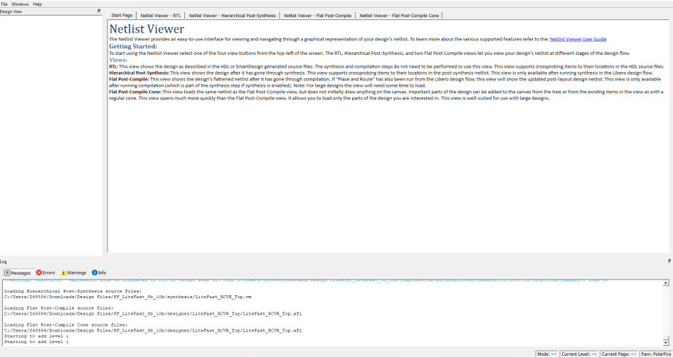
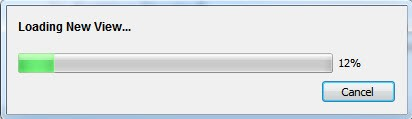

# Opening a View

Click any of the following views at the top-left corner to load the  netlist into the Netlist Viewer for viewing:

-   RTL view—pre-synthesis RTL netlist is drawn in the view
-   Hierarchical Post-Synthesis view—post-synthesis netlist is drawn in the view

 

**Note:** The Hierarchical Post-Synthesis view is not available if synthesis is disabled in the design flow \(**Project** &gt; **Project Settings** &gt; **Design Flow** &gt; **Enable Synthesis** is unchecked\).

 

-   Flat Post-Compile view—flattened post-compile netlist is drawn in the view
-   Flat Post-Compile Cone view—no netlist is drawn until design objects are added to the view

 

**Important:**

-   When you open netlist views for the first time in the Netlist Viewer, they load into system memory, where they remain until the Netlist Viewer exits. For very large designs, loading the netlist for the first time may take some time. A pop-up window reports the status of the loading process.
-   The Flat Post-Compile Cone view takes very little runtime because no netlist is drawn when this view is first loaded. This view does not display a netlist until instances from the design tree are selected and loaded.

After the netlist views open for the first time, they load into system  memory, making them available almost immediately in the Netlist Viewer.

-   **[Displaying the Flat Post-Compile Cone View](GUID-30D775AD-ED75-4835-81B5-C7B252DB402A.md)**  

**Parent topic:**[Netlist Viewer Windows](GUID-29F3E93D-3ECA-4F8B-9478-64D63D5F1873.md)

