# Generating Timing Reports

The following sections describe how to generate timing reports.

## Types of Reports

The following table lists the types of timing reports you can generate using<br /> SmartTime.

|Report|Description|
|------|-----------|
|Timer Report|Displays the timing information organized by clock<br /> domain.|
|Timing Violations Report|Provides information about constraint violations.|
|Bottleneck Report|Displays points in the design that contribute to the most timing<br /> violations.|
|Datasheet Report|Describes the characteristics of the pins, I/O technologies, and<br /> timing properties in the design.|
|Constraints Coverage Report|Displays the overall coverage of the timing constraints set on<br /> the current design.|
|Combinational Loop Report|Displays loops found during initialization.|
|Clock Domain Crossing Report|Analyzes timing paths that cross from one clock domain \(the<br /> source clock\) to another clock domain \(the destination<br /> clock\).|

## Generating a Timing Report

The Timing Report allows you to determine whether timing problems exist in your design.

The Maximum Delay Analysis Timing Report lists the following information about your design:

-   Maximum delay from input I/O to output I/O
-   Maximum delay from input I/O to internal registers
-   Maximum delay from internal registers to output I/O
-   Maximum delays for each clock network
-   Maximum delays for interactions between clock networks

To generate a Timing Report:

1.  From the SmartTime Max/Min Delay Analysis View, choose **Tools &gt; Reports &gt; Timer**.

    The [Timing Report Options dialog box](GUID-29A2149F-C54F-4D59-B99E-CCC19A108FF0.md#) appears.

2.  Select the options you want to include in the report, and then click **OK**.

    The Timing Report appears in a separate window.


## Understanding Timing Reports

The following table lists the sections in the Timing Report.

<br />

<table id="TABLE_M23_5LS_JNB"><thead><tr><th>

Section

</th><th>

Description

</th></tr></thead><tbody><tr><td>

Header

</td><td>

Lists the:-   Report type
-   Version of Designer used to generate the report
-   Date and time the report was generated
-   General design information \(name, family, and so on\)

</td></tr><tr><td>

Summary

</td><td>

Reports the timing information for each clock domain. By default,<br /> the clock domains reported are the explicit clock domains that are<br /> shown in SmartTime. To filter the domains and show only specific<br /> sections in the report, use the [Timing Report Options dialog box](GUID-29A2149F-C54F-4D59-B99E-CCC19A108FF0.md#).

</td></tr><tr><td>

Path

</td><td>

Lists the timing information for different types of paths in the<br /> design. This section is reported by default. You can deselect this<br /> option in the Timing Report Options dialog box. By default, the<br /> number of paths displayed per set is 5. You can filter the<br /> domains using the Timing Report Options dialog box. You can also<br /> view the stored filter sets in the generated report using the<br /> Timing Report options. The filter sets are listed by name in<br /> their appropriate section. The number of paths reported for the<br /> filter set is the same as for the main sets. By default, the<br /> filter sets are not reported.

</td></tr></tbody>
</table><br />

### Clock Domains

Paths are organized by clock domain.

### Register to Register Set

This set reports the paths from the registers clock pins to the registers data pins in the current clock domain.

### External Setup Set

This set reports the paths from the top-level design input ports to the registers in the current<br /> clock domain.

### Clock to Output Set

This set reports the paths from the registers clock pins to the top-level design output ports in<br /> the current clock domain.

### Register to Asynchronous Set

This set reports the paths from registers to asynchronous control signals, such as asynchronous<br /> set/reset.

### External Recovery Set

This set reports the external recovery check timing for asynchronous control signals, such as<br /> asynchronous set/reset.

### Asynchronous to Register Set

This set reports the paths from asynchronous control signals, such as asynchronous set/reset, to<br /> registers.

### Inter-clock Domain

This set reports the paths from the registers clock pins of the specified clock domain to the<br /> registers data pins in the current clock domain. Inter-domain paths are reported by<br /> default.

### Pin to Pin

This set lists input to output paths and user sets. Input-to-output paths are reported by<br /> default. To see the user- defined sets, use the [Timing Report Options dialog box](GUID-29A2149F-C54F-4D59-B99E-CCC19A108FF0.md#).

### Input to Output Set

This set reports the paths from the top-level design input ports to the top-level design output<br /> ports.

### Expanded Paths

Expanded paths can be reported for each set. By default, the number of expanded paths to report<br /> is set to 1. You can select and change the number when you specify [Timing Report options](GUID-29A2149F-C54F-4D59-B99E-CCC19A108FF0.md#).

<br />


<br />

## Generating a Timing Violation Report

The Timing Violations Report provides a Flat Slack Report centered around constraint violations.

To generate Timing Violations Report:

1.  From the SmartTime Max/Min Delay Analysis View window, choose **Tools &gt; Reports &gt; Timing Violations**.

    The [Timing Violations Report Options dialog box](GUID-892D2E3C-BC08-4D52-8468-95678F41CD25.md#) appears.

2.  Select the options you want to include in the report, and then click **OK**.

    The Timing Violations Report appears in a separate window.


## Understanding Timing Violation Reports

The following figure shows an example of a Timing Violations Report.

<br />

<br />


<br />

The following table lists the sections in the Timing Violation Report.

<table id="TABLE_M23_5LS_JNB"><thead><tr><th>

Section

</th><th>

Description

</th></tr></thead><tbody><tr><td>

Header

</td><td>

This section lists the:-   Report type
-   Version of Designer used to generate the report
-   Date and time the report was generated
-   General design information \(name, family, and so on\)

</td></tr><tr><td>

Paths

</td><td>

This section lists the timing information for different types of<br /> paths in the design. The number of paths displayed is controlled by the<br /> following parameters:-   A maximum slack threshold to report
-   A maximum number or path to report

<br /> By default, the slack threshold is 0 and the number of paths is<br /> limited. The default maximum number of paths reported is 100. All<br /> clocks domains are mixed in this report. The paths are listed by<br /> decreasing slack.You can also choose to expand one or more<br /> paths. By default, no paths are expanded. For details, see the<br /> Timing Violation Report options.

</td></tr></tbody>
</table>## Generating a Constraints Coverage Report

The Constraints Coverage Report contains information about the constraints in the design.

To generate a Constraints Coverage Report:

1.  From the SmartTime Max/Min Delay Analysis View, choose **Tools &gt; Reports &gt; Constraints Coverage**.

2.  Select the text format and number of unconstrained instances and click **OK**.

    The report appears in a separate window.


## Understanding Constraints Coverage Reports

The Constraints Coverage Report shows the overall coverage of the timing constraints set<br /> on the current design. You can generate this report either from within Designer or<br /> within SmartTime Analyzer.


The following table lists the sections in the Constraints Coverage Report.

|Section|Description|
|-------|-----------|
|Coverage Summary|Shows statistical information about the timing constraint in the<br /> design. For each type of timing checks \(Setup, Recovery, Output, Hold,<br /> and Removal\), it specifies how many are Met \(there is a constraint and<br /> it is satisfied\), Violated \(there is a constraint and it is not<br /> satisfied\), or Untested \(no constraint was found\).|
|Results by Clock Domain|This section provides a coverage summary for each clock<br /> domain.|
|Enhancement Suggestions|Reports, per clock domain, a list of constraints that can be added to<br /> the design to improve the coverage. It also reports if some options<br /> impacting the coverage can be changed.|
|Detailed Stats|Provides detailed suggestions about specific clocks or I/O ports that<br /> may require to be constrained for every pin/port that requires<br /> checks.|

## Generating a Bottleneck Report

To generate a Bottleneck Report:

From the SmartTime Max/Min Delay Analysis View, choose **Tools &gt; Reports &gt; Bottleneck**. The report appears in a separate window.

## Understanding Bottleneck Reports—SmartFusion 2, IGLOO 2, RTG4, and PolarFire

A bottleneck is a point in the design that contributes to multiple timing violations. The<br /> Bottleneck Report lists the bottlenecks in the design. You can generate this report<br /> from SmartTime Analyzer.

**Note:** The bottleneck can be computed only when a cost type is defined. There are two cost type options available:

-   **Path count**: Associates the severity of the bottleneck to the count of violating/critical paths that traverse the instance.
-   **Path cost**: Associates the severity of the bottleneck to the sum of the timing violations for the violating/critical paths that traverse the instance.

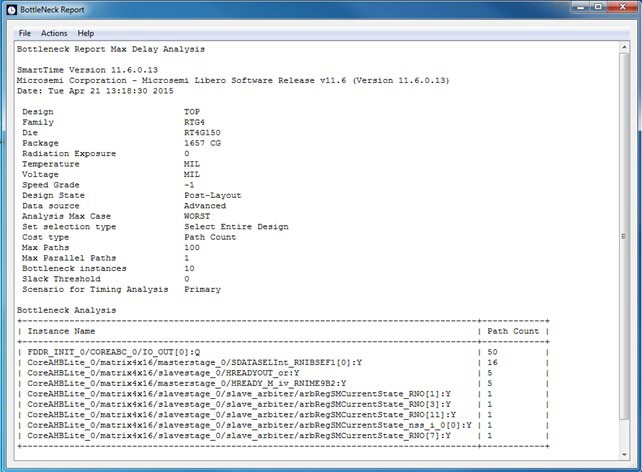

The following table lists the sections in the Bottleneck Report.

<br />

<table id="TABLE_GP5_RCV_JNB"><thead><tr><th>

Part

</th><th>

Description

</th></tr></thead><tbody><tr><td>

Device Description

</td><td>

Contains general information about the design, including:-   Design name
-   Family
-   Die
-   Package
-   Software version

</td></tr><tr><td>

Bottleneck Analysis

</td><td>

<br /> Lists the core of the bottleneck information. It is organized<br /> into two columns:<br /> -   Instance Name: Refers to the output pin name of the instance.
-   Path Count: Shows the number of violating paths that include the instance pin.

<br />

</td></tr></tbody>
</table><br />

## Generating a Datasheet Report

The Datasheet Report shows information about a design’s external characteristics.

To generate a Datasheet Report:

1.  From the SmartTime Max/Min Delay Analysis View, choose **Tools &gt; Reports &gt; Datasheet**.

    The report appears in a separate window.


## Understanding Datasheet Reports

The Datasheet Report displays the external characteristics of the design. You can<br /> generate this report from SmartTime Max/Min Delay Analysis View.

<br />

<br />

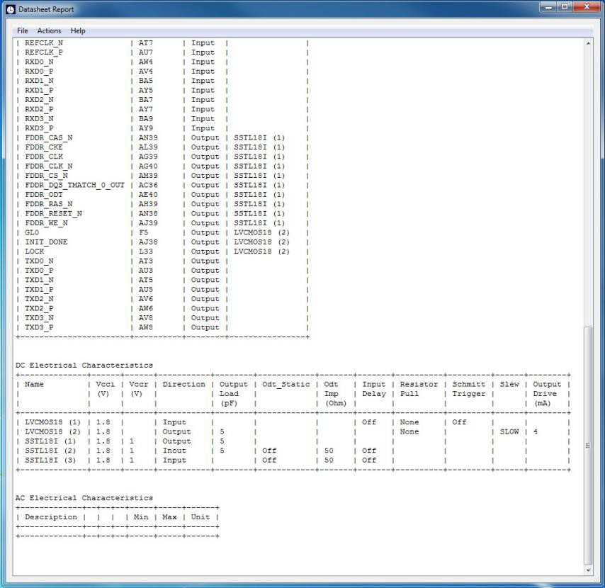

The following table lists the tables in the Datasheet Report.

<br />

|Table|Description|
|-----|-----------|
|Pin Description|Provides the port name in the netlist, location on the package, type<br /> of port, and I/O technology assigned to it. Types can be input, output,<br /> or clock. Clock ports are ports shown as "clock" in the Clock domain<br /> browser.|
|DC Electrical Characteristics|Provides the parameters of the different I/O technologies used in the<br /> design. The number of parameters displayed depends on the family for<br /> which you have created the design.|
|AC Electrical Characteristics|Provides the timing properties of the design ports For each<br /> clock, this section includes the maximum frequency. For each input, it<br /> includes the external setup, external hold, external recovery, and<br /> external removal for every clock where it applies. For each output, it<br /> includes the clock-to-out propagation time. This section also displays<br /> the input-to-output propagation time for combinational paths.|

## Generating a Combinational Loop Report

The Combinational Loop Report shows all loops found during initialization and reports pins associated with the loop\(s\) and the location where a loop is broken.

To generate a Combinational Loop Report:

1.  From the **Tools** menu, choose **Reports &gt; Combinational Loops**.

    The Combinational\_Loops Report Options dialog box appears.

2.  Select either **Plain Text** or **Comma Separated Values**.

3.  Click **OK**.


## Understanding Combinational Loop Reports

The Combinational Loop Report shows all loops found during initialization, reports the pins<br /> associated with the loops, and identifies the locations where loops are broken.

<br />


<br />

## Generating a Clock Domain Crossing \(CDC\) Report

The Clock Domain Crossing \(CDC\) Report analyzes timing paths that cross from one clock domain \(the source clock\) to another clock domain \(the destination clock\). The CDC Report helps identify instances where there may be data loss or metastability issues.

To generate the CDC Report:

1.  From the **Tools** menu, choose **Reports &gt; Clock Domain Crossing \(CDC\).**.

    The Clock Domain Crossing Report Options dialog box appears.

2.  Select either **CDC Table** or **Comma Separated Values**.

3.  Click **OK**.

    Selecting **CDC Table** displays a graphical table with color-coded cells.<br /> Each cell represents a CDC type between the source<br /> clock and the destination clock domains that have<br /> constraints. Clocks without constraints do not<br /> appear in the CDC table.

    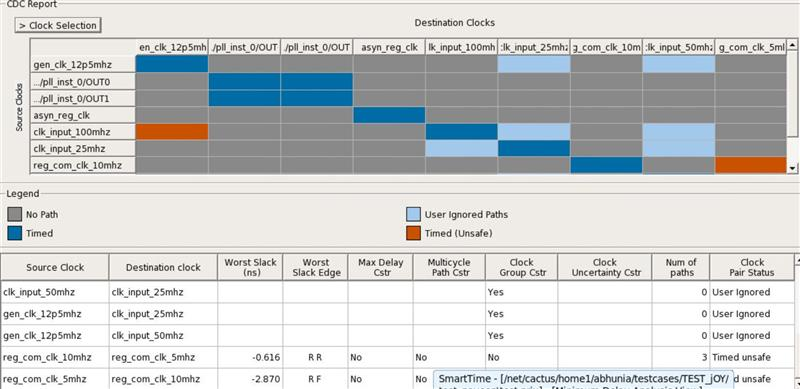

    The attributes present in the path table are as follows:

    -   Source Clock: Source of the clock

    -   Destination Clock: Destination of the clock

    -   Worst Slack \(ns\): Worst slack of the CDC path in nanoseconds

    -   Worst Slack Edge: Source/sink edge for the worst path of CDC

    -   Max Delay Cstr: See the following table.

<table><thead><tr><th align="left" id="d133664e895">

Value

</th><th align="left" id="d133664e897">

Description

</th></tr></thead><tbody><tr><td>

Yes

</td><td>

All paths in CDC have set\_max\_delay applied

</td></tr><tr><td>

No

</td><td>

No paths in CDC have the constraints<br /> applied

</td></tr><tr><td>

Partial

</td><td>

Any path in CDC has the constraint applied

</td></tr></tbody>
</table>    -   Multicycle Path Cstr: see the following table.

<table><thead><tr><th align="left" id="d133664e938">

Value

</th><th align="left" id="d133664e940">

Description

</th></tr></thead><tbody><tr><td>

Yes

</td><td>

All paths in CDC have set\_multicycle\_path<br /> applied

</td></tr><tr><td>

No

</td><td>

No paths in CDC have the constraints<br /> applied

</td></tr><tr><td>

Partial

</td><td>

Any path in CDC has the constraint applied

</td></tr></tbody>
</table>    -   Clock Group Cstr: See the following table.

<table><thead><tr><th align="left" id="d133664e981">

Value

</th><th align="left" id="d133664e983">

Description

</th></tr></thead><tbody><tr><td>

Yes

</td><td>

CDC has set\_clock\_group applied

</td></tr><tr><td>

No

</td><td>

CDC does not have set\_clock\_group applied

</td></tr></tbody>
</table>    -   Clock Uncertainty Cstr: Uncertainty value for the worst path in CDC; otherwise, the clock<br /> uncertainty field is left empty.

    -   Num of Paths: Number of paths in CDC. For User Ignored paths, the value is 0.

    -   Clock Pair Status: Status can be Timed Safe, Timed Unsafe or User Ignored.

    In the CDC Report dialog box, you can select the clocks to view or hide. Clicking the<br /> **Clock Selection** button at<br /> the top left of the dialog box lists all clocks that<br /> can be viewed or hidden. By default, all clocks are<br /> checked and visible. To hide a clock, clear its<br /> check box.

    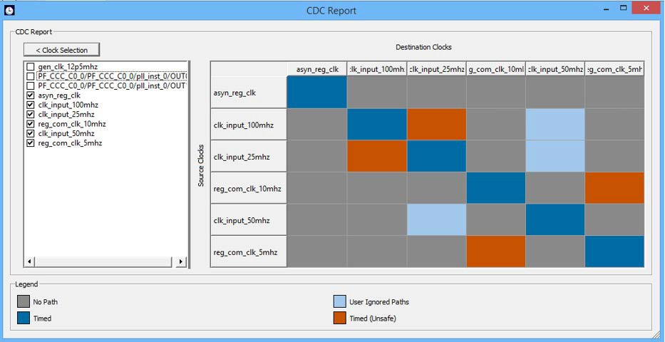

    The following table describes the colors in the CDC Report shown in the preceding figure.

    |Pattern|Status|Color|
    |-------|------|-----|
    |Paths from the source clock domain to the destination clock domain have all been disabled by false path or clock group constraints.|User-Ignored Paths|Light blue|
    |No Paths found from the source clock domain to the destination clock domain.|No Paths|Gray|
    |The source and destination clocks are synchronous: Both the clocks have a common primary<br /> clock and paths are found from the source clock<br /> domain to the destination clock domain.|Timed|Dark Blue|
    |Synchronizers have been identified on all paths between source and destination<br /> clocks.|Synchronized|Orange|

    There are certain scenarios related to the path table as explained in the following:

    1.  When CDC Report is generated, path table is shown by default for all CDC having paths. Each row<br /> shows the worst slack for a clock crossing. Similarly, when clicking on a particular<br /> CDC crossing in CDC Report, you can have a single row showing the worst slack for<br /> CDC crossing.

        Example: The path table shown in the following figure, the worst path for reg\_com\_clk\_10mhz to<br /> reg\_com\_clk\_5mhz has the worst slack of 93.541.<br /> The same path is displayed by default, when the<br /> CDC crossing is selected.

        

        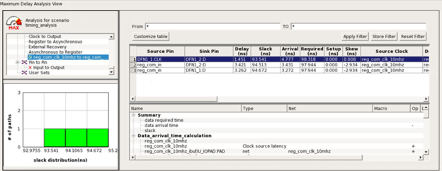

    2.  Clicking on the CDC box shows the worst slack for a clock crossing as in path table in the<br /> following figure.

        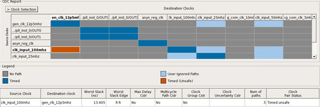

        Clicking on the same CDC box again shows details for all the clocks selected in the CDC<br /> Report.

        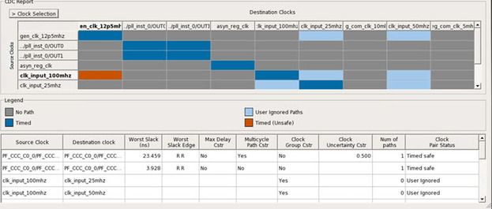

        For all clocks having large names, tool-tips for columns have been added.

        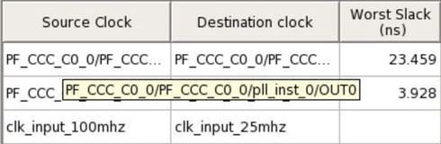

    3.  Selecting/deselecting clocks in clock selection dynamically changes the path table along with the<br /> CDC table. Both the tables are in sync. Example: Here, clk\_input\_100mhz is selected,<br /> therefore, the clock is displayed in CDC table and path table.

        

        When the clock clk\_input\_100mhz is unselected, then the same clock is removed from the CDC table.<br /> The crossings related to the clock are also<br /> removed from the path table as shown in the<br /> following figure.

        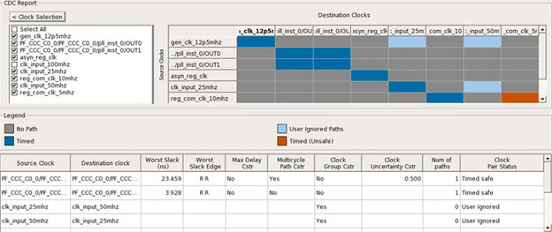

    After clicking any one of the four options in the CDC category, the clock table is filtered<br /> according to the CDC category selected.

    In the following scenario, the Timed button has been selected and Timed safe CDC is displayed<br /> only in the clock table.

    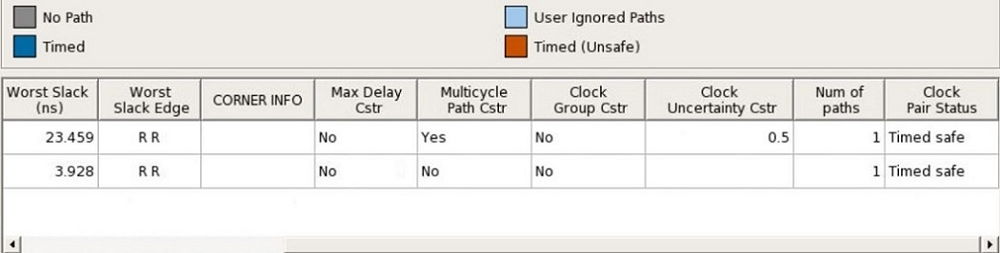

    Clicking on the same CDC category shows the details for all the clocks selected in<br /> CDC Report. Selecting/unselecting clocks in clock selection does dynamically change the<br /> clock table along with the CDC table.

    In the following figure, the User Ignored CDC category button is chosen and clk\_input\_100mhz is<br /> selected. Therefore, the clock is displayed in CDC<br /> table and clock table.

    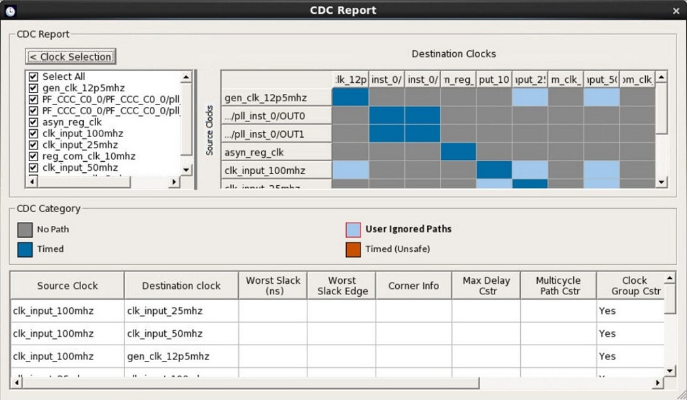

    Now, when clock clk\_input\_100mhz is unselected, the same clock is moved from CDC table and the<br /> crossings related to that clock are also removed<br /> from clock table. Therefore, when the User Ignored<br /> CDC category is selected, entries related to<br /> clk\_input\_100mhz are not visible.

    

    After right-clicking a CDC box, you can choose to **Copy**, **Add a Clock Group Constraint** or **Go to Timing Explorer**.

    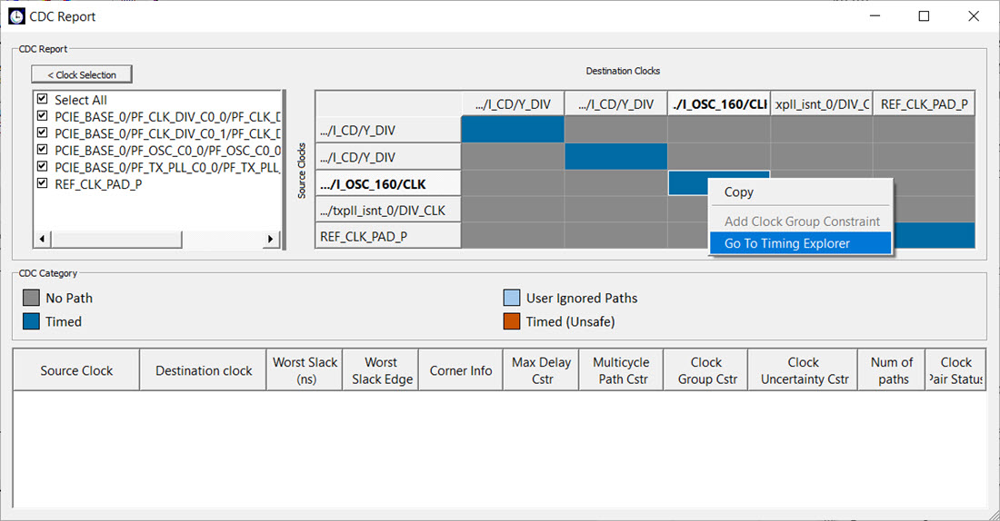

    Selecting the **Go to Timing Explorer** option opens the Timing Explorer<br /> dialog box.

    

    There are corner scenarios when cross probing between CDC and Timing Explorer:

    **Scenario 1:**

    This is a scenario where difference is seen between SmartTime and Verify timing, when two clocks<br /> are defined on same port and when cross probing for<br /> CDC reg\_com\_clk\_10mhz and reg\_com\_clk\_5mhz is unable<br /> to find the same in Timing Report Explorer.

    The constraints are as follows:

    ```
     create_clock -name {reg_com_clk_10mhz} -period 100 -waveform {0 50 } [ get_ports { reg_com_clk_10mhz } ]
    create_clock -name {reg_com_clk_5mhz} -period 200 -waveform {0 100 } -add [ get_ports { reg_com_clk_10mhz } ]
    ```

    The Timing Report Explorer does not pick reg\_com\_clk\_5mhz as destination clock, and Smart time<br /> does pick the reg\_com\_clk\_10mhz and reg\_com\_clk\_5mhz pair as CDC, as shown in the<br /> following figure.

    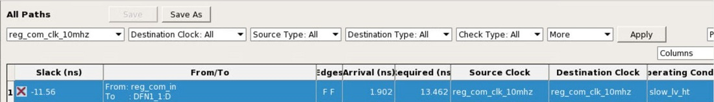

    

    

    Timing Explorer is picking the worst slack<br /> path for a pair of start and end point. Therefore,<br /> you can miss CDC and other reg to reg paths with<br /> lower slack values.

    **Scenario 2:**

    This is a scenario where due to different operating conditions set in Smart Time, you can have<br /> different results, when cross probing between CDC<br /> and Timing Report Explorer. SmartTime and CDC are in<br /> sync.

    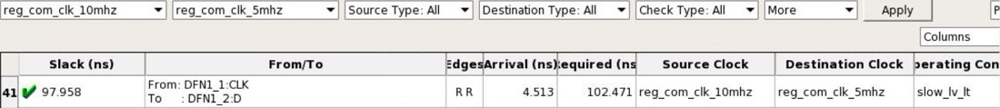

    

    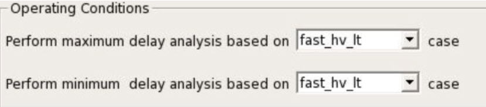

    The Timing Report Explorer reports the path<br /> from slow\_lv\_lt, and SmartTime reports using the<br /> operating condition fast\_hv\_lt. When the operating<br /> condition in SmartTime is changed to slow\_lv\_lt, the<br /> worst slack becomes the same as in the Timing Report<br /> Explorer.

    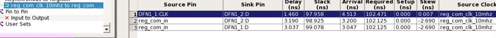

    CDC Reports worst path for a particular corner selected in SmartTime, and Timing Report Explorer<br /> reports the worst path across all the corners.

    In such cases, you can see changes in values when navigating from CDC to Timing Report Explorer.<br /> To make you aware of such situations, Corner Info<br /> column is added to display the operating<br /> conditions.

    **Note:**

    -   The path details for the same clock crossing \(C1 to C1\) are not shown in the path tale as they<br /> are not valid clock crossings and are currently shown as timed safe by default<br /> in CDC Report.

    -   The clock table has CDC details only related to clocks checked in clock selection from CDC<br /> Report.

    -   Path table will not show any CDC having no paths.

    -   For User Ignored CDC columns, “Worst Slack \(ns\)”, “Worst Slack Edge”, “Max Delay Cstr”,<br /> “Multicycle Path Cstr”, and “Clock Uncertainty<br /> Cstr” are empty.

    -   Cross probing is allowed to Timing Report Explorer for the same clock crossing \(C1 to C1\).
    -   For User Ignored CDC category, Corner Info column is empty.
    Selecting **Comma Separated Value** exports the CDC Report to a CSV file. If you select this option, a window appears in which you assign a name to the CSV file and specify the location where it will be exported. The CSV file shows details about the CDC between each clock domain in numeric format. Each CDC type is represented as a number similar to colors in the table. The CSV file includes an explanation of each number type and CDC type.

    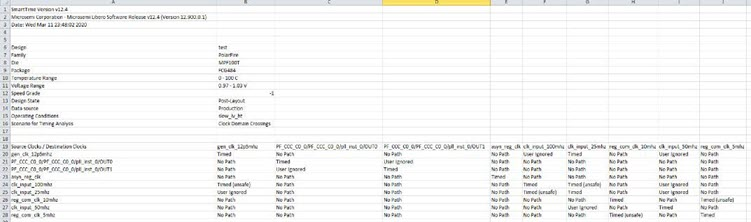


