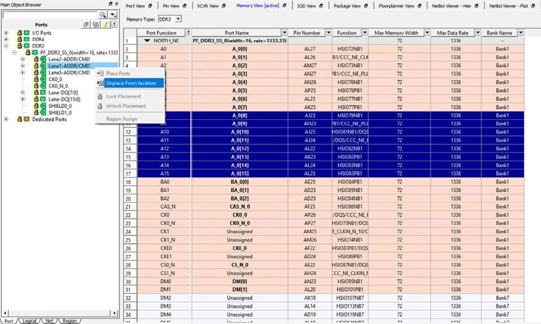

# Removing I/O Assignments

To remove a DDR Memory Interface I/O assignment:

1.  Select the Port tab in the Design Tree view.

2.  Right click the Memory Interface in the Design Tree view.

3.  Select Unplace &lt;memory\_interface\_name&gt; .

    See the following figure.

    

**Parent topic:**[Memory Interface View](GUID-04C2F3E6-C9E6-4210-AF6D-16C492A0BAAA.md)

