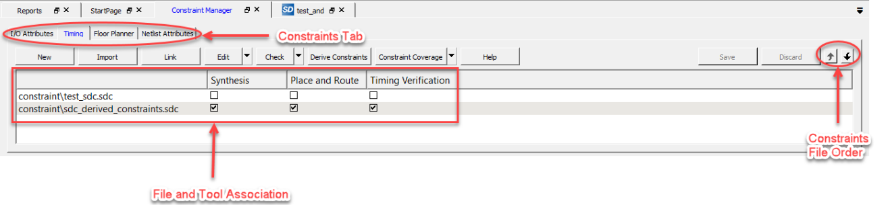

# Overview

The following topics provide an overview of Libero SoC.

## Libero SoC Design Flow

The following figure shows the Libero SoC design flow.

### Creating the Design

Create your design with the following design capture tools:

-   System Builder
-   Create SmartDesign
-   Create HDL
-   Create SmartDesign Testbench \(optional, for simulation only\)
-   Create HDL Testbench \(optional, for simulation only\)

After you create the design, start the simulation for pre-synthesis verification.

You can also click the   button to start the Libero SoC software through  Place and Route with default settings. However,  doing so bypasses constraint management.

### Working with Constraints

In the FPGA design world, constraint files are as important as design source files.  Constraint files are used throughout the FPGA design process to guide FPGA tools to  achieve the timing and power requirements of the design. For the synthesis step, SDC  timing constraints set the performance goals whereas non-timing FDC constraints guide  the Synthesis tool for optimization. For the Place and Route step, SDC timing  constraints guide the tool to achieve the timing requirements, whereas Physical Design  Constraints \(PDC\) guide the tool for optimized placement and routing \(Floorplanning\).  For Static Timing Analysis, SDC timing constraints set the timing requirements and  design-specific timing exceptions for static timing analysis.

Libero SoC provides the Constraint Manager to manage your design constraint needs.  Constraint Manager is a single centralized graphical interface that allows you to  create, import, link, check, delete, and edit design constraints, and associate the  constraint files to design tools in the Libero SoC environment. Constraint Manager also  allows you to manage constraints for SynplifyPro synthesis, Libero SoC Place and Route,  and the SmartTime Timing Analysis throughout the design process.

After project creation, double-click **Manage Constraints** in the  Design Flow window to open the **Constraint Manager**.

 

 

#### Constraint Flow and Design Sources

The Constraint flow supports HDL and Netlist design sources. The Libero SoC Design Flow window  and the Constraint Manager are context-sensitive according to whether the design source  is HDL or Netlist.

#### Constraint Flow for VM Netlist Designs

When the design source is a Netlist, the Design Flow window displays Compile Netlist as a design step. Timing constraints can be passed to Place and Route and Timing Verification only.

The options to promote or demote global resources of the chip are set in the Compile Netlist  options. The following figure compares and contrasts the HDL  flow versus the Netlist flow.

<table id="GUID-08570E77-6332-4786-9E91-A0E115AA0D7F"><tbody><tr><td>

HDL Flow

</td><td>

Netlist Flow

</td></tr><tr><td>

Design Flow Window

</td><td>

Design Flow Window

</td></tr><tr><td>

Constraint Manager

</td><td>

Constraint Manager

</td></tr><tr><td>

Constraint Manager - Check \*.fdc and \*.ndc

</td><td>

Constraint Manager - Check \*.ndc only

</td></tr><tr><td>

Global Promotion/Demotion Options set in Synthesis Options Dialog Box

</td><td>

Global Promotion/Demotion Options set in Compile Netlist Options Dialog Box

</td></tr></tbody>
</table>#### Constraint Flow for HDL Designs

When the design source is HDL, the Design Flow window displays Synthesis as a design step. The Constraint Manager also makes available Synthesis as a target to receive timing constraints and netlist attribute constraints. The options to promote or demote global resources of the chip are set in the Synthesis options.

### Implementing the Design

The following references provide information about implementing your design.

-   [Netlist Viewer User Guide](http://coredocs.s3.amazonaws.com/Libero/2025_1/Tool/stdalone_nlv_ug.pdf)
-   [Synthesize](GUID-16AC6815-2A39-4FFC-8AE9-F7A82337A198.md#). This procedure runs synthesis on your design with the default settings and passes to Synplify the constraints associated with Synthesis in the Constraint Manager.
-   [Verifying Post-Synthesized Designs](GUID-16AC6815-2A39-4FFC-8AE9-F7A82337A198.md#)
-   [Configure Flash\*Freeze \(SmartFusion 2 and IGLOO 2\)](GUID-16AC6815-2A39-4FFC-8AE9-F7A82337A198.md#)
-   [Configure Register Lock Bits](GUID-16AC6815-2A39-4FFC-8AE9-F7A82337A198.md#)
-   [Place and Route](GUID-16AC6815-2A39-4FFC-8AE9-F7A82337A198.md#). Takes the design constraints from the Constraint Manager and uses default settings. This is the last step in the push-button design flow execution.
-   [Verify Post Layout Implementation](GUID-16AC6815-2A39-4FFC-8AE9-F7A82337A198.md#)
    -   [Generate Back Annotated Files](GUID-16AC6815-2A39-4FFC-8AE9-F7A82337A198.md#)
    -   [Simulate - Opens ModelSim ME Pro](GUID-16AC6815-2A39-4FFC-8AE9-F7A82337A198.md#)
    -   [Verify Timing](GUID-16AC6815-2A39-4FFC-8AE9-F7A82337A198.md#)
    -   [SmartTime](GUID-16AC6815-2A39-4FFC-8AE9-F7A82337A198.md#)
    -   [Verify Power](GUID-16AC6815-2A39-4FFC-8AE9-F7A82337A198.md#)
    -   [Simultaneous Switching Noise](GUID-16AC6815-2A39-4FFC-8AE9-F7A82337A198.md#)

### Programming and Debugging the Design

The following topics provide information about programming and debugging your design.

#### Generating and Updating Data

-   [Generating FPGA Array Data](GUID-AE825DD9-DE91-4C39-95B7-F501D59B5932.md#)
-   [Initializing Design Blocks \(PolarFire and PolarFire SoC\)](GUID-AE825DD9-DE91-4C39-95B7-F501D59B5932.md#)
-   [Generating Initialization Clients \(PolarFire\)](GUID-AE825DD9-DE91-4C39-95B7-F501D59B5932.md#)

#### Configuring the Hardware

-   [Configuring Actions and Procedures](GUID-AE825DD9-DE91-4C39-95B7-F501D59B5932.md#)
-   [Configuring I/O States During JTAG Programming](GUID-AE825DD9-DE91-4C39-95B7-F501D59B5932.md#)
-   [Configuring Programming Options](GUID-AE825DD9-DE91-4C39-95B7-F501D59B5932.md#)

#### Programming the Design

-   [Generating FPGA Array Data](GUID-AE825DD9-DE91-4C39-95B7-F501D59B5932.md#)
-   [Initializing Design Blocks \(PolarFire and PolarFire SoC\)](GUID-AE825DD9-DE91-4C39-95B7-F501D59B5932.md#)
-   [Generating Initialization Clients \(PolarFire\)](GUID-AE825DD9-DE91-4C39-95B7-F501D59B5932.md#)
-   [Configuring Actions and Procedures](GUID-AE825DD9-DE91-4C39-95B7-F501D59B5932.md#)
-   [Configuring I/O States During JTAG Programming](GUID-AE825DD9-DE91-4C39-95B7-F501D59B5932.md#)
-   [Configuring Programming Options](GUID-AE825DD9-DE91-4C39-95B7-F501D59B5932.md#)
-   [Configuring Security](GUID-AE825DD9-DE91-4C39-95B7-F501D59B5932.md#)
-   [Configure Security Locks for Production](GUID-DD5BFD75-BB76-49D8-99EA-EC328F43A5FD.md#)
-   [Configuring Bitstreams](GUID-AE825DD9-DE91-4C39-95B7-F501D59B5932.md#)
-   [Generating the Bitstream](GUID-AE825DD9-DE91-4C39-95B7-F501D59B5932.md#)
-   [Running Programming Device Actions](GUID-AE825DD9-DE91-4C39-95B7-F501D59B5932.md#)
-   [Programming SPI Flash Image \(PolarFire and PolarFire SoC\)](GUID-AE825DD9-DE91-4C39-95B7-F501D59B5932.md#)

#### Debugging the Design

-   [Generating SmartDebug FPGA Array Data \(PolarFire\)](GUID-379E48FA-E0B8-467F-9C7B-F8731AB58130.md#)
-   [Using the SmartDebug Tool](GUID-379E48FA-E0B8-467F-9C7B-F8731AB58130.md#)
-   [Identifying the Debug Design](GUID-379E48FA-E0B8-467F-9C7B-F8731AB58130.md#)

### Handing Off the Design to Production

The following topics provide information about handing off your design to production.

-   [Exporting Bitstreams](GUID-7C0FFD89-F0F2-49A8-9E21-FBB94A5C33F9.md#)
-   [Exporting FlashPro Express Jobs](GUID-7C0FFD89-F0F2-49A8-9E21-FBB94A5C33F9.md#)
-   [Exporting Job Manager Data](GUID-7C0FFD89-F0F2-49A8-9E21-FBB94A5C33F9.md#)
-   [Export a SPI Flash Image \(PolarFire and PolarFire SoC\)](GUID-7C0FFD89-F0F2-49A8-9E21-FBB94A5C33F9.md#)
-   [Exporting Pin Reports](GUID-7C0FFD89-F0F2-49A8-9E21-FBB94A5C33F9.md#)
-   [Exporting BSDL Files](GUID-7C0FFD89-F0F2-49A8-9E21-FBB94A5C33F9.md#)
-   [Exporting IBIS Models](GUID-7C0FFD89-F0F2-49A8-9E21-FBB94A5C33F9.md#)
-   [Export Initialization Data and Memory Report \(PolarFire and PolarFire SoC\)](GUID-7C0FFD89-F0F2-49A8-9E21-FBB94A5C33F9.md#)
-   [Exporting μPROM Reports \(RTG4\)](GUID-7C0FFD89-F0F2-49A8-9E21-FBB94A5C33F9.md#)
-   [Exporting SmartDebug Data](GUID-99300B62-DD85-49BD-86E4-F8281EA90F74.md#)

### Handing Off Design for Firmware \(SmartFusion 2, IGLOO 2, and RTG4\)

The following topics provide information about handing off your design for firmware. These topics  apply to SmartFusion 2, IGLOO 2, and RTG4.

-   [Software IDE Integration \(SmartFusion 2 and IGLOO 2\)](GUID-EB25243E-CB13-48EC-A0F8-BF2960C8C6EC.md#)
-   [Viewing/Configuring Firmware Cores \(SmartFusion 2 and IGLOO 2\)](GUID-EB25243E-CB13-48EC-A0F8-BF2960C8C6EC.md#)
-   [Exporting Firmware \(SmartFusion 2 and IGLOO 2\)](GUID-EB25243E-CB13-48EC-A0F8-BF2960C8C6EC.md#)

## File Types in Libero SoC

Creating a new project in Libero SoC creates new directories and project files  automatically. The project directory contains your local project files. When you import  files from outside your current project, the files are copied into your local project  folder.

The Project Manager allows you to manage your files as you import them. For example, to  store and maintain your design source files and design constraint files in a central  location outside the project location, you can link them to the Libero project folders  when you created the project. These files are linked, not copied, to the project  folder.

Depending on your project preferences and the installed version of Libero SoC, the  software creates directories for your project. The following table describes these  directories.

<table id="TABLE_XWM_C2G_HPB"><tbody><tr><td>

`<project_name>`

</td><td>

  This is the top-level directory. It contains the  \*.prjx file. Only one  \*.prjx file is enabled for each Libero SoC  project. If you associate Libero SoC as the default program with  the \*.prjx file \(Project &gt;  Preferences &gt; Startup &gt; Check the default file  association \(.prjx\) at startup\), you can open  the project with Libero SoC by double-clicking the  \*.prjx file. 

</td></tr><tr><td>

`component`

</td><td>

Contains SmartDesign components \(`.sdb` and  `.cxf` files\) and the  `*_manifest.txt` file for each design component  in your Libero SoC project. To run synthesis, simulation, and  firmware development with your own point tools outside the Libero  SoC environment, see the `*_manifest.txt` file. For  each design component, Libero SoC generates a  `<component_name>_manifest.txt` file that  stores the file name and location of:-   HDL source files to be used for synthesis and simulations
-   Stimulus files and configuration files for simulation
-   Firmware files for software IDE tools
-   Configuration files for programming
-   Configuration files for power analysis

To run synthesis, simulation, firmware development,  programming, and power analysis outside the Libero SoC  environment, see the SmartFusion 2/IGLOO 2 Custom Flow  User Guide.  When  importing components, make sure that .sdb  and .cxf files reside in the same  directory. 

</td></tr><tr><td>

`constraint`

</td><td>

Contains all the constraint files:-   SDC timing constraint files
-   Floorplanning PDC files
-   I/O PDC files
-   Netlist Attributes NDC files

</td></tr><tr><td>

`designer`

</td><td>

Contains the following files:-   For Silicon Explorer: `*_ba.sdf`, `*_ba.v(hd)`, `STP`, and `PRB`
-   To run designer: `TCL`
-   Local project file relative to revision: `impl.prj_des`
-   Log file: `designer.log`

</td></tr><tr><td>

`hdl`

</td><td>

Contains all HDL sources:-   VHDL: `*.vhd` files
-   Verilog: `*.v` and `*.h` files

</td></tr><tr><td>

`simulation`

</td><td>

Contains the following files for simulation: -   `meminit.dat`
-   `modelsim.ini`
-   `*.bfm`
-   `*.vec file`
-   `run.do`

</td></tr><tr><td>

`smartgen`

</td><td>

Contains GEN files and LOG files from generated cores.

</td></tr><tr><td>

`stimulus`

</td><td>

Contains BTIM, Verilog, and VHDL stimulus files.

</td></tr><tr><td>

`synthesis`

</td><td>

Contains files generated by the tools \(not managed by Libero  SoC\), including:-   `*.vm` file
-   Synplify log file: `*_syn.prj`
-   Precision project file: `*.psp`
-   Synplify log file: `*.srr`
-   Precision log file: `precision.log`
-   To run synthesis: `*.tcl`

</td></tr><tr><td>

`viewdraw`

</td><td>

Contains `viewdraw.ini` files.

</td></tr></tbody>
</table>### Internal Files

Libero SoC generates the following internal files, some of which are encrypted. These files are  for Libero SoC housekeeping and are not intended for you to use.

|File|File Extension|Remarks|
|----|--------------|-------|
|Routing Segmentation File|`*.seg`|None|
|Combiner Info|`*.cob`|None|
|Hierarchical Netlist|`*.adl`|None|
|Flattened Netlist|`*.afl`|None|
|Location file|`*.loc`|None|
|map file|`*.map`|Fabric Programming File|
|tieoffs.txt|`*.txt`|RTG4 devices only|

## Software Tools

Libero SoC integrates design tools, streamlines design flow, manages design and log files, and  passes design data between tools. The following table identifies the tools you can use  to perform Libero SoC functions. For more information about Libero SoC tools, visit  [https://www.microchip.com/en-us/products/fpgas-and-plds/fpga-and-soc-design-tools/fpga/libero-software-later-versions\#overview](https://www.microchip.com/en-us/products/fpgas-and-plds/fpga-and-soc-design-tools/fpga/libero-software-later-versions#overview).

<table id="GUID-5EF844D5-D7F9-4E91-909C-53DEBCC892DA"><thead><tr><th>

Function

</th><th>

Tool

</th><th>

Comments

</th></tr></thead><tbody><tr><td>

Project Manager, HDL Editor, Core Generation

</td><td>

Libero SoC

</td><td>

Project Manager, HDL Editor targets the creation of HDL code. HDL Editor supports VHDL and Verilog with color, highlighting keywords for both HDL languages.

</td></tr><tr><td>

Synthesis

</td><td>

Synplify® Pro ME

</td><td>

Synplify Pro ME is integrated as part of the design package, enabling designers to target HDL  code to specific devices.

</td></tr><tr><td>

Simulation

</td><td>

ModelSim® ME Pro

</td><td>

Allows source-level verification so designers can verify HDL code. Designers can perform  simulation at all levels: behavioral \(or pre-synthesis\), structural \(or  post-synthesis\), and dynamic simulation.

</td></tr><tr><td>

Timing/Constraints, Power Analysis, Netlist Viewer, Floorplanning, Package Editing, Place and  Route, Debugging

</td><td>

Libero SoC

</td><td>

This software package includes:-   ChipPlanner: displays I/O and logic macros in your design for floorplanning
-   Netlist Viewer: design schematic viewer.
-   SmartPower: power analysis tool.
-   SmartTime: static timing analysis and constraints editor.

</td></tr></tbody>
</table>## Software IDE Integration

Libero SoC simplifies the task of transitioning between designing your FPGA and developing your  embedded firmware by managing the firmware for your FPGA  hardware design. This includes managing:

-   Firmware hardware abstraction layers required for your processor.
-   Firmware drivers for the processor peripherals in your FPGA design.
-   Sample application projects available for drivers that show how to use the APIs properly.

To see which firmware drivers Libero SoC found to be compatible with your design, open the  Firmware View. From this view, you can change the configuration  of your firmware, change to a different version, read driver  documentation, and generate sample projects for each driver.

Libero SoC manages the integration of your firmware with your preferred Software Development  Environment, including SoftConsole, Keil, and IAR Embedded  Workbench. The projects and workspace for your selected  development environment are generated automatically with the  proper settings and flags so you can write your applications  immediately.

