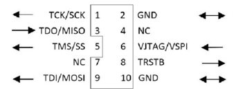
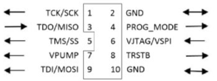
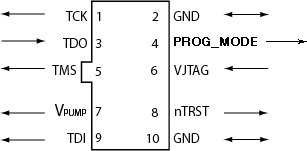
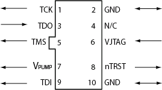

# Electrical Specifications

This chapter describes the FlashPro electrical specifications.

## FlashPro6

FlashPro6 is a JTAG-based programmer for Flash-based Microchip devices.

The FlashPro6 output is supplied through a connector, to which a detachable 10-pin cable is  fitted. The connector on the FlashPro6 unit is a 2x5, RA male Header connector that is  manufactured by 3M and has a manufacturer’s part number of N2510-5002-RB. This is a  standard 2x5, 0.1-pitch keyed connector. In your board, use the 10-pin header, Samtec  P/N HTST-105-01-L-DV-A, or equivalent.

The following figure shows the signals on the pins of the FlashPro6 10-pin connector.

**Note:** All ground pins must be connected. The rectangular shape shows connections on the programmer itself. Arrows show current flow towards or from the rectangular programmer.

The following table lists the signals.

<table id="GUID-0C7970E9-CA9E-4F78-B0FA-378A13F513B4"><thead><tr><th>

Signal

</th><th align="center">

Description

</th></tr></thead><tbody><tr><td>

GND

</td><td>

Signal reference

</td></tr><tr><td>

TCK/SCK

</td><td>

JTAG clock; SPI clock

</td></tr><tr><td>

TDI/SDI

</td><td>

JTAG data input to device; SPI MOSI

</td></tr><tr><td>

TDO/SDO

</td><td>

JTAG data output from device; SPI MISO

</td></tr><tr><td>

TMS/SS\#

</td><td>

JTAG mode select; SPI Chip Select

</td></tr><tr><td>

nTRST

</td><td>

Programmable output pin may be set to off, toggle, low, or high level.

</td></tr><tr><td>

VJTAG

</td><td>

Reference voltage from the target board**Note:** The current drawn by the JTAG pin for FlashPro-6 programmers is approximately 30 mA.

</td></tr></tbody>
</table>Some designers of high-integrity military and avionic boards may arrange their boards so that  TRST is tied to ground through a weak pull-down resistor. The purpose of this is to hold  the JTAG state machine in a Reset state by default, so that even with TCK oscillating,  some sudden ion bombardment or other electrical event will not suddenly throw the JTAG  state machine into an unknown state. If your design also uses a weak pull-down resistor  on TRST on your board, enabling the “Drive TRST” flag will be required to force the JTAG  state machine out of reset, to permit programming to take place. With most boards, there  is no need to select this flag.

## FlashPro5

FlashPro5 is a JTAG- and a SPI-based programmer for Flash-based Microchip devices.

The FlashPro5 output is supplied via a connector to which a detachable 10-pin cable is fitted.  The connector on the FlashPro5 unit is a 2x5, RA male Header connector that is  manufactured by AMP and has a manufacturer’s part number of 103310-1. This is a standard  2x5, 0.1-pitch keyed connector. Use the 10-pin right-angle header, AMP P/N 103310-1  \(DigiKey P/N A26285-ND\) for FlashPro4 and use the 10-pin straight header, AMP P/N  103308-1 \(DigiKey P/N A26267-ND\) for the straight version.

The following figure shows the signals on the FlashPro5 10-pin connector pins.

**Note:** All ground pins must be connected. The rectangular shape shows connections on the programmer itself. Arrows show current flow towards or from the rectangular programmer.

The following table lists the signals.

<table id="GUID-AD0697E1-7660-4D29-995A-2ED62288E44B"><thead><tr><th>

Signal

</th><th align="center">

Description

</th></tr></thead><tbody><tr><td>

VPUMP

</td><td>

3.3V Programming voltage

</td></tr><tr><td>

GND

</td><td>

Signal reference

</td></tr><tr><td>

TCK/SCK

</td><td>

JTAG clock; SPI clock

</td></tr><tr><td>

TDI/SDI

</td><td>

JTAG data input to device; SPI MOSI

</td></tr><tr><td>

TDO/SDO

</td><td>

JTAG data output from device; SPI MISO

</td></tr><tr><td>

TMS/SS\#

</td><td>

JTAG mode select; SPI Chip Select

</td></tr><tr><td>

nTRST

</td><td>

Programmable output pin may be set to off, toggle, low, or high level

</td></tr><tr><td>

VJTAG

</td><td>

Reference voltage from the target board**Note:** The current drawn by the JTAG pin for FlashPro 5 programmers is approximately 30 mA.

</td></tr><tr><td>

PROG\_MODE

</td><td>

IGLOO v2 family - used for switching from VCC 1.2V to 1.5V during  programming

</td></tr></tbody>
</table>Some designers of high-integrity boards \(military and avionic\) may arrange their boards so that  TRST is tied to ground via a weak pull-down resistor. The purpose of this is to hold the  JTAG state machine in a Reset state by default, so that even with TCK oscillating, some  sudden ion bombardment or other electrical even will not suddenly throw the JTAG state  machine into an unknown state. If your design also uses a weak pull-down resistor on  TRST on your board, enabling the “Drive TRST” flag will be required to force the JTAG  state machine out of reset to permit programming to take place. With most boards, there  is no need to select this flag.

## FlashPro4

The FlashPro4 output is supplied via a connector to which a detachable 10-pin cable is fitted.  The connector on the FlashPro4 unit is a 2x5, RA male Header connector that is  manufactured by AMP and has a manufacturer’s part number of 103310-1. This is a standard  2x5, 0.1-pitch keyed connector. Use the 10-pin right-angle header, AMP P/N 103310-1  \(DigiKey P/N A26285-ND\) for FlashPro4 and use the 10-pin straight header, AMP P/N  103308-1 \(DigiKey P/N A26267-ND\) for the straight version.

The following figure shows the signals on the FlashPro4 10-pin connector pins.

 

 

**Note:** All ground pins must be connected. The rectangular shape shows connections on the programmer itself. Arrows show current flow towards or from the rectangular programmer.

The following table lists the signals.

<table id="GUID-073BF6BE-FC7E-40F0-A1C2-7F4FEFF87482"><thead><tr><th>

Signal

</th><th align="center">

Description

</th></tr></thead><tbody><tr><td>

VPUMP

</td><td>

3.3V Programming voltage

</td></tr><tr><td>

GND

</td><td>

Signal reference

</td></tr><tr><td>

TCK

</td><td>

JTAG clock

</td></tr><tr><td>

TDI

</td><td>

JTAG data input to device

</td></tr><tr><td>

TDO

</td><td>

JTAG data output from device

</td></tr><tr><td>

TMS

</td><td>

JTAG mode select

</td></tr><tr><td>

nTRST

</td><td>

Programmable output pin may be set to off, toggle, low, or high level

</td></tr><tr><td>

VJTAG

</td><td>

Reference voltage from the target board**Note:** The current drawn by the JTAG pin for FlashPro-4 programmers is approximately 30 mA.

</td></tr><tr><td>

PROG\_MODE

</td><td>

IGLOO v2 family - used for switching from VCC 1.2V to 1.5V during  programming

</td></tr></tbody>
</table>Some designers of high-integrity boards \(military and avionic\) may arrange their boards so that  TRST is tied to ground via a weak pull-down resistor. The purpose of this is to hold the  JTAG state machine in a Reset state by default, so that even with TCK oscillating, some  sudden ion bombardment or other electrical event will not suddenly throw the JTAG state  machine into an unknown state. If your design also uses a weak pull-down resistor on  TRST on your board, enabling the “Drive TRST” flag will be required to force the JTAG  state machine out of reset to permit programming to take place. With most boards, there  is no need to select this flag.

## FlashPro3

The FlashPro3 output is supplied via a connector to which a detachable 10-pin cable is fitted.  The connector on the FlashPro3 unit is a 2x5, RA male Header connector that is  manufactured by AMP and has a manufacturer’s part number of 103310-1. This is a standard  2x5, 0.1-pitch keyed connector. Use the 10-pin right-angle header, AMP P/N 103310-1  \(DigiKey P/N A26285-ND\) for FlashPro5/4/3/3X and use the 10-pin straight header, AMP P/N  103308-1 \(DigiKey P/N A26267-ND\) for the straight version.

The following figure shows the signals on the FlashPro3 10-pin connector pins.

 

 

**Note:** All ground pins must be connected. The rectangular shape shows connections on the programmer itself. Arrows show current flow towards or from the rectangular programmer.

The following table lists the signals.

|Signal|Description|
|------|-----------|
|VPUMP|3.3 V Programming voltage|
|GND|Signal reference|
|TCK|JTAG clock|
|TDI|JTAG data input to device|
|TDO|JTAG data output from device|
|TMS|JTAG mode select|
|nTRST|Programmable output pin may be set to off, toggle, low, or high level|
|VJTAG|Reference voltage from the target board|
|N/C|Programmer does not connect to this pin|

Some designers of high-integrity military and avionic boards may arrange their boards so that  TRST is tied to ground via a weak pull-down resistor. The purpose of this is to hold the  JTAG state-machine in a reset state by default, so that even with TCK oscillating, some  sudden ion bombardment or other electrical even will not suddenly throw the JTAG  state-machine into an unknown state. If your design also uses a weak pull-down resistor  on TRST on your board, enabling the “Drive TRST” flag will be required to force the JTAG  state-machine out of reset to permit programming to take place. With most boards, there  is no need to select this flag.

## JTAG Switching Characteristics

This section describes the FlashPro JTAG switching characteristics.

The following figure shows the JTAG switching characteristics.

 

 

### FlashPro6 Characteristics

|Description|Symbol|Min.|Max.|Unit|
|-----------|------|----|----|----|
|Output Delay from TCK to TDI, TMS|TTCKTDI|2|2.2|ns|
|TDO setup time before TCK rising, VJTAG=3.3 V|TTDOTCK|11.4|481|ns|
|TDO setup time before TCK rising, VJTAG=1.5 V|TTDOTCK|10.5|487|ns|
|TDO Hold time after TCK rising|TTCKTDO|0|  — | |
|TCK period|TTCK|49.4|  — |ns|

### FlashPro5/4/3/3X Characteristics

|Description|Symbol|Min.|Max.|Unit|
|-----------|------|----|----|----|
|Output delay from TCK to TDI, TMS|TTCKTDI|–2|2|ns|
|TDO setup time before TCK rising, VJTAG=3.3|TTDOTCK|12|—|ns|
|TDO setup time before TCK rising, VJTAG=1.5|TTDOTCK|14.5|—|ns|
|TDO hold time after TCK rising|TTCKTDO|0|—|ns|
|TCK period|TTCK|41.7|10667|ns|

