# Netlist Viewer Icons

The Netlist Viewer Toolbar has a list of icons. A tooltip appears when the mouse is hovered over the icon.

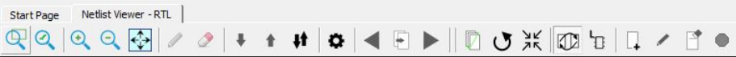

The following table lists the icons used to navigate the netlist.

<table id="GUID-A55CB6F9-2E9C-4CF4-B6C1-E57ED683E420"><thead><tr><th>

Icon

</th><th>

Name

</th><th>

Descriptions

</th><th align="left">

Notes

</th></tr></thead><tbody><tr><td>

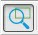

</td><td>

Zoom Tool

</td><td>

When activated \(ON\), cursor operation is in the zoom to selection mode.Click and drag to lower right to zoom to selection.

</td><td align="left">

Default setting is OFF.

</td></tr><tr><td>

</td><td>

Rubber Band Select

</td><td>

When activated \(ON\), selects a rectangular area in the canvas. Click in the canvas view and drag the mouse to the lower right to delineate a rectangular area. Release the mouse to select all design objects in the delineated area.

</td><td align="left">

—

</td></tr><tr><td>

</td><td>

Zoom In

</td><td>

Zoom in to 2x of original \(magnitude of +1\).

</td><td align="left">

Alternatively, click and drag to upper left to zoom in.

</td></tr><tr><td>

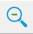

</td><td>

Zoom Out

</td><td>

Zoom out to one-half of original \(magnitude of –1\).

</td><td align="left">

Alternatively, left click mouse and drag to upper right to zoom  out.

</td></tr><tr><td>

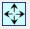

</td><td>

Zoom To Fit

</td><td>

Zoom to fit the size of canvas.

</td><td align="left">

Alternatively, click and drag to lower left to zoom to fit.

</td></tr><tr><td>

</td><td>

Push Into Module

</td><td>

With a module selected, click this icon to go down the design hierarchy one level at a time.

</td><td align="left">

Disabled if the current selected module is the lowest level in the  hierarchy.

</td></tr><tr><td>

</td><td>

Pop Out of Module

</td><td>

With a module selected, click this icon to go up the design hierarchy one level at a time.

</td><td align="left">

Disabled if current module is the top level in the  hierarchy.

</td></tr><tr><td>

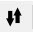

</td><td>

Push/Pop Mode

</td><td>

Click icon to activate \(ON\). Single clicking on a selected module pushes into it and single clicking on black space pops out of the current module.Default setting is OFF.

</td><td align="left">

Cursor operation in one of four modes:-   Zoom mode
-   Highlight mode \(ON/OFF\)
-   Push/pop mode \(ON/OFF\)
-   Selection mode \(default\)

</td></tr><tr><td>

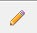

</td><td>

Highlight Tool

</td><td>

With a design object \(net, instance, port\) selected, click this icon \(ON\) to highlight the selected item with a color you set in the Properties setting.

</td><td align="left">

Highlights the object with a color according to your preference in  the Properties setting.

</td></tr><tr><td>

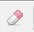

</td><td>

Remove Highlight

</td><td>

Removes all highlights from the current view.

</td><td align="left">

—

</td></tr><tr><td>

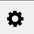

</td><td>

Properties

</td><td>

Allows you to set preferences for the highlight color, selection color, design object colors, and enable/disable display of design object names.

</td><td align="left">

See [Customizing Display Preferences](GUID-A95E02AB-4644-40D0-8D87-246FA078580B.md).

</td></tr><tr><td>

</td><td>

Previous Page

</td><td>

Goes to the previous page when the netlist view span multiple pages.

</td><td align="left">

Disabled if currently on the first page.

</td></tr><tr><td>

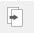

</td><td>

To Page

</td><td>

Displays the current page number. Change this number to go to a different page.

</td><td align="left">

Disabled if design has only one page.

</td></tr><tr><td>

</td><td>

Next Page

</td><td>

Goes to the next page when the netlist view span multiple pages.

</td><td align="left">

Disabled if currently on the last page.

</td></tr><tr><td>

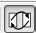

</td><td>

Cross Probing

</td><td>

Toggles cross-probing between Design and netlist views, Chip Canvas view. and World View \(Chip Planner only\).

</td><td align="left">

When enabled \(ON\), modules selected in the netlist view are  automatically selected in the design view and vice versa.Default  setting is ON.

</td></tr><tr><td>

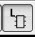

</td><td>

Local Selection

</td><td>

Toggles local selection option. Local means the same level of hierarchy in the design.

</td><td align="left">

When enabled \(ON\), the Go to Net Driver traces the selected net to  the driver up to the hierarchy boundary \(stay local\). The same  restriction/non- restriction applies when adding to the active cone the  drivers/loads of a selected design object. When enabled/local, the  design hierarchy boundary is not crossed. For more information, see  Creating a Logical Cone.  Default setting is OFF.

</td></tr><tr><td>

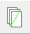

</td><td>

Disable Page Splitting

</td><td>

Toggles the page splitting feature.

</td><td align="left">

When enabled \(ON\), page splitting is disabled and the netlist stays  on one page. Use this setting for multiple large pages with very large  designs. When disabled \(OFF\), the display splits into multiple  pages.Default setting is OFF.

</td></tr><tr><td>

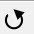

</td><td>

Regenerate View

</td><td>

Places the netlist view optimally with minimal empty spaces.

</td><td align="left">

—

</td></tr><tr><td>

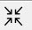

</td><td>

Fold All Instances

</td><td>

Collapses all expanded modules into the parent module.

</td><td align="left">

—

</td></tr><tr><td>

</td><td>

Rename Cone

</td><td>

Allows you to change the cone name.

</td><td align="left">

  Only the cones view has this feature enabled. Names of cones must be  unique across all netlist views. 

</td></tr><tr><td>

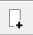

</td><td>

Create Cone

</td><td>

Creates a new active cone associated with the view.

</td><td align="left">

When a logical cone is first created, it becomes the active  cone.

</td></tr><tr><td>

</td><td>

Remove All

</td><td>

Removes all items in a cone.

</td><td align="left">

Disabled if not a cone view.

</td></tr><tr><td>

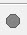

</td><td>

Set As Active Cone

</td><td>

Makes the current cone the active cone.

</td><td align="left">

Disabled if not a cone view.

</td></tr></tbody>
</table>**Parent topic:**[The Netlist Viewer User Interface](GUID-AE5B905A-F233-42EF-B733-E0343D259060.md)

