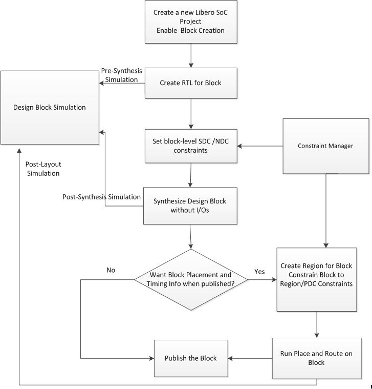

# Synthesis

During Synthesis, the Libero SoC software adds instances of `BLOCK_INTERFACE_I*` to the block. These instances are virtual buffers added to:

-   Improve timing values for the block.
-   Provide a clear interface to the floorplan.
-   Help with clustering constraints.

The `BLOCK_INTERFACE_I*` instances are removed when the block is  published.

**Parent topic:**[Creating Blocks, Options, and Settings](GUID-17CFFDD1-F9FA-4011-AA3A-32EEDDE0DFA2.md)

