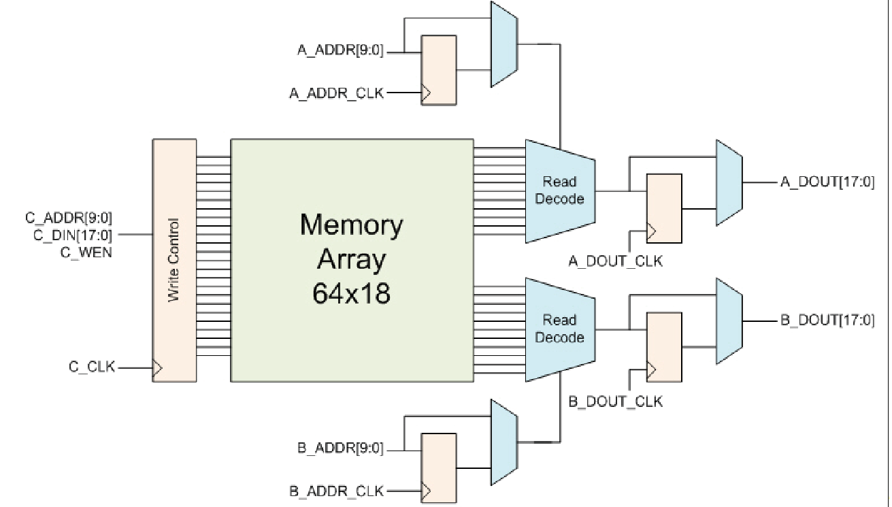

# RAM1K18

The RAM1K18 block contains 18,432 memory bits and is a true dual-port  memory. It can also be configured in two-port mode. All read/write operations to the  RAM1K18 memory are synchronous. To improve the read data delay, an optional pipeline  register at the output is available. A feed-through write mode is also available to  enable immediate access to the write data. The RAM1K18 memory has two data ports, which  can be independently configured in any combination as follows:

1.  Dual-Port RAM with the following configurations:
    -   1Kx18, 1Kx16
    -   2Kx9, 2Kx8
    -   4Kx4
    -   8Kx2
    -   16Kx1
2.  Two-Port RAM with the following configurations:
    -   512x36, 512x32
    -   1Kx18, 1Kx16
    -   2Kx9, 2Kx8
    -   4Kx4
    -   8Kx2
    -   16Kx1

The main features of the RAM1K18 memory block are as follows:

-   It has 18,432 bits.
-   It provides two independent data ports A and B.
-   It has a true dual-port mode, for which both ports have word widths less than or equal to 18 bits.
-   In true dual-port mode, each port can be independently configured to any of the following depth/width: 1Kx18, 1Kx16, 2Kx9, 2Kx8, 4Kx4, 8Kx2, and 16Kx1.
-   The widths of each port can be different, but one needs to be a multiple of the other. There are 29 unique combinations of true dual-port aspect ratios:
    -   1Kx18/1Kx18, 1Kx18/2Kx9
    -   1Kx16/1Kx16, 1Kx16/2Kx8, 1Kx16/4Kx4, 1Kx16/8Kx2, 1Kx16/16Kx1
    -   2Kx9/1Kx18, 2Kx9/2Kx9
    -   2Kx8/1Kx16, 2Kx8/2Kx8, 2Kx8/4Kx4, 2Kx8/8Kx2, 2Kx8/16Kx1
    -   4Kx4/1Kx16, 4Kx4/2Kx8, 4Kx4/4Kx4, 4Kx4/8Kx2, 4Kx4/16Kx1
    -   8Kx2/1Kx16, 8Kx2/2Kx8, 8Kx2/4Kx4, 8Kx2/8Kx2, 8Kx2/16Kx1
    -   16Kx1/1Kx16, 16Kx1/2Kx8, 16Kx1/4Kx4, 16Kx1/8Kx2, 16Kx1/16Kx1
-   RAM1K18 also has a two-port mode. In this case, Port A becomes the read port and Port B becomes the write port.
-   In two-port mode, each port can be independently configured to any of the following depth/width: 512x36, 512x32, 1Kx18, 1Kx16, 2Kx9, 2Kx8, 4Kx4, 8Kx2 and 16Kx1.
-   The widths of each port can be different, but one needs to be a multiple of the other. There are 45 unique combinations of two-port aspect ratios:
    -   512x36/512x36, 512x36/1Kx18, 512x36/2Kx9
    -   512x32/512x32, 512x32/1Kx16, 512x32/2Kx8, 512x32/4Kx4, 512x32/8Kx2, 512x32/16Kx1
    -   1Kx18/512x36, 1Kx18/1Kx18, 1Kx18/2Kx9
    -   1Kx16/512x32, 1Kx16/1Kx16, 1Kx16/2Kx8, 1Kx16/4Kx4, 1Kx16/8Kx2, 1Kx16/16Kx1
    -   2Kx9/512x36, 2Kx9/1Kx18, 2Kx9/2Kx9
    -   2Kx8/512x32, 2Kx8/1Kx16, 2Kx8/2Kx8, 2Kx8/4Kx4, 2Kx8/8Kx2, 2Kx8/16Kx1
    -   4Kx4/512x32, 4Kx4/1Kx16, 4Kx4/2Kx8, 4Kx4/4Kx4, 4Kx4/8Kx2, 4Kx4/16Kx1
    -   8Kx2/512x32, 8Kx2/1Kx16, 8Kx2/2Kx8, 8Kx2/4Kx4, 8Kx2/8Kx2, 8Kx2/16Kx1
    -   16Kx1/512x32, 16Kx1/1Kx16, 16Kx1/2Kx8, 16Kx1/4Kx4, 16Kx1/8Kx2, 16Kx1/16Kx1
-   RAM1K18 performs synchronous operation for setting up the address as well as writing and reading the data. The address, data, block port select, and write enable inputs are registered.
-   An optional pipeline register with a separate enable, synchronous-reset, and asynchronous-reset is available at the read data port to improve the clock-to-out delay.
-   There is an independent clock for each port. The memory is triggered at the rising edge of the clock.
-   The true dual-port mode supports an optional feed-through write mode, where the write data also appears on the corresponding read data port.
-   Read from both ports at the same location is allowed.
-   Read and write on the same location at the same time results in unknown data to be read. There is no collision prevention or detection. However, correct data are expected to be written into the memory.

The following simplified block diagram illustrates the two independent  data ports, the pipeline registers, and the feed-through multiplexors.

The following table shows a simplified block diagram of the RAM1K18  memory block and gives the port descriptions.

|Pin Name|Pin Direction|Type|Description|Polarity|
|--------|-------------|----|-----------|--------|
|A\_ADDR\[13:0\]|Input|Dynamic|Port A address|—|
|A\_BLK\[2:0\]|Input|Dynamic|Port A block selects|High|
|A\_CLK|Input|Dynamic|Port A clock|Rising|
|A\_DIN\[17:0\]|Input|Dynamic|Port A write data|—|
|A\_DOUT\[17:0\]|Output|Dynamic|Port A read data|—|
|A\_WEN\[1:0\]|Input|Dynamic|Port A write enables \(per byte\)|High|
|A\_WIDTH\[2:0\]|Input|Static|Port A width/depth mode select|—|
|A\_WMODE|Input|Static|Port A feed-through write  select|High|
|A\_ARST\_N|Input|Dynamic|Port A reset \(must be tied to  1\)|Low|
|A\_DOUT\_LAT|Input|Static|Port A pipeline register select|Low|
|A\_DOUT\_ARST\_N|Input|Dynamic|Port A pipeline register asynchronous  reset|Low|
|A\_DOUT\_CLK|Input|Dynamic|Port A pipeline register clock \(must be  tied to A\_CLK or 1\)|Rising|
|A\_DOUT\_EN|Input|Dynamic|Port A pipeline register enable|High|
|A\_DOUT\_SRST\_N|Input|Dynamic|Port A pipeline register synchronous  reset|Low|
| |
|B\_ADDR\[13:0\]|Input|Dynamic|Port B address|—|
|B\_BLK\[2:0\]|Input|Dynamic|Port B block selects|High|
|B\_CLK|Input|Dynamic|Port B clock|Rising|
|B\_DIN\[17:0\]|Input|Dynamic|Port B write data|—|
|B\_DOUT\[17:0\]|Output|Dynamic|Port B read data|—|
|B\_WEN\[1:0\]|Input|Dynamic|Port B write enables \(per byte\)|High|
|B\_WIDTH\[2:0\]|Input|Static|Port B width/depth mode select|—|
|B\_WMODE|Input|Static|Port B Feed-through write  select|High|
|B\_ARST\_N|Input|Dynamic|Port B reset \(must be tied to  1\)|Low|
|B\_DOUT\_LAT|Input|Static|Port B pipeline register select|Low|
|B\_DOUT\_ARST\_N|Input|Dynamic|Port B pipeline register asynchronous  reset|Low|
|B\_DOUT\_CLK|Input|Dynamic|Port B pipeline register clock \(must be  tied to B\_CLK or 1\)|Rising|
|B\_DOUT\_EN|Input|Dynamic|Port B pipeline register enable|High|
|B\_DOUT\_SRST\_N|Input|Dynamic|Port B pipeline register synchronous  reset|Low|
| |
|A\_EN|Input|Static|Port A power-down \(must be tied to  1\)|Low|
|B\_EN|Input|Static|Port B power-down \(must be tied to  1\)|Low|
|SII\_LOCK|Input|Static|Lock access to SII|High|
|BUSY|Output|Dynamic|Busy signal from SII|High|

**Tip:** Static inputs are defined at design time and need to be tied to 0 or 1.

**Signal Descriptions for RAM1K18**

A\_WIDTH AND B\_WIDTH

The following table lists the width/depth mode selections for each port.  Two-port mode is in effect when the width of at least one port is 36, and A\_WIDTH  indicates the read width while B\_WIDTH indicates the write width. Also, when the write  width is 36, the read width must also be 36.

|Depth x Width|A\_WIDTH/B\_WIDTH|
|-------------|-----------------|
|16Kx1|000|
|8Kx2|001|
|4Kx4|010|
|2Kx8, 2Kx9|011|
|1Kx16, 1Kx18|100|
|512x32, 512x36\(Two-port\)|10111x|

A\_WEN AND B\_WEN

The following table lists the write/read control signals for each port.  Two-port mode is in effect when the width of at least one port is 36, and read operation  is always enabled. Also, when the write width is 36, both A\_WEN and B\_WEN must be  static.

|Depth x Width|A\_WEN/B\_WEN|Result|
|-------------|-------------|------|
|16Kx1, 8Kx2, 4Kx4, 2Kx8, 2Kx9, 1Kx16,  1Kx18|00|Perform a read operation|
|16Kx1, 8Kx2, 4Kx4, 2Kx8, 2Kx9|01|Perform a write operation|
|1Kx16|01|Write \[7:0\]|
|10|Write \[16:9\]|
|11|Write \[16:9\], \[7:0\]|
|1Kx18|01|Write \[8:0\]|
|10|Write \[17:9\]|
|11|Write \[17:0\]|
|512x32\(Two-port write\)|B\_WEN\[0\] = 1|Write B\_DIN\[7:0\]|
|B\_WEN\[1\] = 1|Write B\_DIN\[16:9\]|
|A\_WEN\[0\] = 1|Write A\_DIN\[7:0\]|
|A\_WEN\[1\] = 1|Write A\_DIN\[16:9\]|
|512x36\(Two-port write\)|B\_WEN\[0\] = 1|Write B\_DIN\[8:0\]|
|B\_WEN\[1\] = 1|Write B\_DIN\[17:9\]|
|A\_WEN\[0\] = 1|Write A\_DIN\[8:0\]|
|A\_WEN\[1\] = 1|Write A\_DIN\[17:9\]|

A\_ADDR AND B\_ADDR

The following table address buses for the two ports. Fourteen bits are  needed to address the 16K independent locations in x1 mode. In wider modes, fewer  address bits are used. The required bits are MSB justified and unused LSB bits must be  tied to 0. A\_ADDR is synchronized by A\_CLK while B\_ADDR is synchronized to B\_CLK.  Two-port mode is in effect when the width of at least one port is 36, and A\_ADDR  provides the read address while B\_ADDR provides the write address.

|Depth x Width|A\_ADDR/B\_ADDR|
|Used Bits|Unused Bits\(must be  tied to 0\)|
|-------------|---------------|
|---------|----------------------------------------------------|
|16Kx1|\[13:0\]|None|
|8Kx2|\[13:1\]|\[0\]|
|4Kx4|\[13:2\]|\[1:0\]|
|2Kx8, 2Kx9|\[13:3\]|\[2:0\]|
|1Kx16, 1Kx18|\[13:4\]|\[3:0\]|
|512x32,512x36  \(Two-port\)|\[13:5\]|\[4:0\]|

A\_DIN AND B\_DIN

The following table lists the data input buses for the two ports. The  required bits are LSB justified and unused MSB bits must be tied to 0. Two-port mode is  in effect when the width of at least one port is 36, and A\_DIN provides the MSB of the  write data while B\_DIN provides the LSB of the write data.

|Depth x Width|A\_DIN/B\_DIN|
|Used Bits|Unused Bits\(must be  tied to 0\)|
|-------------|-------------|
|---------|----------------------------------------------------|
|16Kx1|\[0\]|\[17:1\]|
|8Kx2|\[1:0\]|\[17:2\]|
|4Kx4|\[3:0\]|\[17:4\]|
|2Kx8|\[7:0\]|\[17:8\]|
|2Kx9|\[8:0\]|\[17:9\]|
|1Kx16|\[16:9\] is \[15:8\]\[7:0\] is \[7:0\]|\[17\]\[8\]|
|1Kx18|\[17:0\]|None|
|512x32\(Two-port  write\)|A\_DIN\[16:9\] is \[31:24\]A\_DIN\[7:0\] is \[23:16\]B\_DIN\[16:9\] is \[15:8\]B\_DIN\[7:0\] is  \[7:0\]|A\_DIN\[17\] A\_DIN\[8\] B\_DIN\[17\]  B\_DIN\[8\]|
|512x36\(Two-port  write\)|A\_DIN\[17:0\] is \[35:18\]B\_DIN\[17:0\] is \[17:0\]|None|

A\_DOUT AND B\_DOUT

The following table lists the data output buses for the two ports. The  required bits are LSB justified. Two-port mode is in effect when the width of at least  one port is 36, and A\_DOUT provides the MSB of the read data while B\_DOUT provides the  LSB of the read data.

|Depth x Width|A\_DOUT/B\_DOUT|
|Used Bits|Unused Bits|
|-------------|---------------|
|---------|-----------|
|16Kx1|\[0\]|\[17:1\]|
|8Kx2|\[1:0\]|\[17:2\]|
|4Kx4|\[3:0\]|\[17:4\]|
|2Kx8|\[7:0\]|\[17:8\]|
|2Kx9|\[8:0\]|\[17:9\]|
|1Kx16|\[16:9\] is \[15:8\]\[7:0\] is \[7:0\]|\[17\]\[8\]|
|1Kx18|\[17:0\]|None|
|512x32\(Two-port  read\)|A\_DOUT\[16:9\] is \[31:24\]A\_DOUT\[7:0\] is \[23:16\]B\_DOUT\[16:9\] is \[15:8\]B\_DOUT\[7:0\] is  \[7:0\]|A\_DOUT\[17\]A\_DOUT\[8\]B\_DOUT\[17\]B\_DOUT\[8\]|
|512x36\(Two-port  read\)|A\_DOUT\[17:0\] is \[35:18\]B\_DOUT\[17:0\] is \[17:0\]|None|

A\_BLK AND B\_BLK

The following table lists the block port select control signals for the  two ports. A\_BLK is synchronized by A\_CLK while B\_BLK is synchronized to B\_CLK. Two-port  mode is in effect when the width of at least one port is 36, and A\_BLK controls the read  operation while B\_BLK controls the write operation.

|Block Port Select Signal|Value|Result|
|------------------------|-----|------|
|A\_BLK\[2:0\]|111|Perform read or write operation on Port  A. In 36 width mode, perform a read operation from both ports A and  B.|
|A\_BLK\[2:0\]|Any one bit is 0|No operation in memory from Port A.  Port A read data will be forced to 0. In 36 width mode, the read data  from both ports A and B will be forced to 0.|
|B\_BLK\[2:0\]|111|Perform read or write operation on Port  B. In 36 width mode, perform a write operation to both ports A and  B.|
|B\_BLK\[2:0\]|Any one bit is 0|No operation in memory from Port B.  Port B read data will be forced to 0, unless it is a 36 width mode and  write operation to both ports A and B is gated.|

A\_WMODE AND B\_WMODE

In true dual-port write mode, each port has a feed-through write  option:

-   Logic 0 = Read data port holds the previous value.
-   Logic 1 = Feed-through, that is, write data appears on the corresponding read data port. This setting is invalid when the width of at least one port is 36 and the two-port mode is in effect.

A\_CLK AND B\_CLK

All signals in ports A and B are synchronous to the corresponding port  clock. All address, data, block port select and write enable inputs must be setup before  the rising edge of the clock. The read or write operation begins with the rising edge.  Two-port mode is in effect when the width of at least one port is 36, and A\_CLK provides  the read clock while B\_CLK provides the write clock:

-   A\_DOUT\_LAT and B\_DOUT\_LAT
-   A\_DOUT\_CLK and B\_DOUT\_CLK
-   A\_DOUT\_ARST\_N and B\_DOUT\_ARST\_N
-   A\_DOUT\_EN and B\_DOUT\_EN
-   A\_DOUT\_SRST\_N and B\_DOUT\_SRST\_N

The A\_DOUT\_LAT and B\_DOUT\_LAT signals select the pipeline registers for  the respective port. Two-port mode is in effect when the width of at least one port is  36, and the A\_DOUT register signals control the MSB of the read data while the B\_DOUT  register signals control the LSB of the read data.

The pipeline registers have rising edge clock inputs for each port,  which must be tied to the respective port clock when used. When the pipeline registers  are not being used, they are forced into latch mode and the clock signals must be tied  to 1, which makes them transparent.

The following table lists the functionality of the control signals on  the A\_DOUT and B\_DOUT pipeline registers.

|\_ARST\_N|\_LAT|\_CLK|\_EN|\_SRST\_N|D|Qn+1|
|---------|-----|-----|----|---------|---|----|
|0|X|X|X|X|X|0|
|1|0|Not rising|X|X|X|Qn|
|1|0|—|0|X|X|Qn|
|1|0|—|1|0|X|0|
|1|0|—|1|1|D|D|
|1|1|0|X|X|X|Qn|
|1|1|1|0|X|X|Qn|
|1|1|1|1|0|X|0|
|1|1|1|1|1|D|D|

A\_EN AND B\_EN

These are active-low, and power-down configuration bits for each port.  They must be tied to 1.

A\_ARST\_N AND B\_ARST\_N

Always tie these signals to 1.

SII\_LOCK

Control signal, when 1 locks the entire RAM1K18 memory from being  accessed by the SII.

BUSY

This output indicates that the RAM1K18 memory is being accessed by the  SII.

RAM64X18

The RAM64x18 block contains 1,152 memory bits and is a three-port memory  providing one write port and two read ports. Write operations to the RAM64x18 memory are  synchronous. Read operations can be asynchronous or synchronous for either setting up  the address and/or reading out the data. Enabling synchronous operation at the read  address port improves setup timing for the read address and its enable signals. Enabling  synchronous operation at the read data port improves clock-to-out delay. Each data port  on the RAM64x18 memory can be independently configured in any combination as shown in  the following list:

-   64x18, 64x16
-   128x9, 128x8
-   256x4
-   512x2
-   1Kx1

The main features of the RAM64x18 memory block are as follows:

-   There are two independent read data ports A and B, and one write data port C.
-   The write operation is always synchronous. The write address, write data, C block port select and write enable inputs are registered.
-   For both read data ports, setting up the address can be synchronous or asynchronous.
-   The two read data ports have address registers with a separate enable, synchronous-reset, and asynchronous-reset for synchronous mode operation, which can also be configured to be transparent latches for asynchronous mode operation.
-   The two read data ports have output registers with a separate enable, synchronous-reset, and asynchronous-reset for pipeline mode operation, which can also be configured to be transparent latches for asynchronous mode operation. Therefore, there are four read operation modes for ports A and B:
    -   Synchronous read address without pipeline registers \(sync-async\).
    -   Synchronous read address with pipeline registers \(sync-sync\).
    -   Asynchronous read address without pipeline registers \(async-async\).
    -   Asynchronous read address with pipeline registers \(async-sync\).
-   Each data port on the RAM64x18 memory can be independently configured in any of the following combinations: 64x18, 64x16, 128x9, 128x8, 256x4, 512x2, and 1Kx1.
-   The widths of each port can be different, but they need to be multiples of one another.
-   There is an independent clock for each port. The memory is triggered at the rising edge of the clock.
-   Read from both ports A and B at the same location is allowed.
-   Read and write on the same location at the same time results in unknown data to be read. There is no collision prevention or detection. However, correct data are expected to be written into the memory.

The following figure shows a simplified block diagram of the RAM64x18  memory block and the following table gives the port descriptions. The simplified block  diagram illustrates the three independent read/write ports and the pipeline registers on  the read port.

|Pin Name|Pin Direction|Type|Description|Polarity|
|--------|-------------|----|-----------|--------|
|A\_ADDR\[9:0\]|Input|Dynamic|Port A address|—|
|A\_BLK\[1:0\]|Input|Dynamic|Port A block selects|High|
|A\_WIDTH\[2:0\]|Input|Static|Port A width/depth mode  selection|—|
|A\_DOUT\[17:0\]|Output|Dynamic|Port A read data|—|
|A\_DOUT\_ARST\_N|Input|Dynamic|Port A pipeline register asynchronous  reset|Low|
|A\_DOUT\_CLK|Input|Dynamic|Port A pipeline register clock|Rising|
|A\_DOUT\_EN|Input|Dynamic|Port A pipeline register enable|High|
|A\_DOUT\_LAT|Input|Static|Port A pipeline register select|Low|
|A\_DOUT\_SRST\_N|Input|Dynamic|Port A pipeline register synchronous  reset|Low|
|A\_ADDR\_CLK|Input|Dynamic|Port A address register clock|Rising|
|A\_ADDR\_EN|Input|Dynamic|Port A address register enable|High|
|A\_ADDR\_LAT|Input|Static|Port A address register select|Low|
|A\_ADDR\_SRST\_N|Input|Dynamic|Port A address register synchronous  reset|Low|
|A\_ADDR\_ARST\_N|Input|Dynamic|Port A address register asynchronous  reset|Low|
|B\_ADDR\[9:0\]|Input|Dynamic|Port B address|—|
|B\_BLK\[1:0\]|Input|Dynamic|Port B block selects|High|
|B\_WIDTH\[2:0\]|Input|Static|Port B width/depth mode  selection|—|
|B\_DOUT\[17:0\]|Output|Dynamic|Port B read data|—|
|B\_DOUT\_ARST\_N|Input|Dynamic|Port B pipeline register asynchronous  reset|Low|
|B\_DOUT\_CLK|Input|Dynamic|Port B pipeline register clock|Rising|
|B\_DOUT\_EN|Input|Dynamic|Port B pipeline register enable|High|
|B\_DOUT\_LAT|Input|Static|Port B pipeline register select|Low|
|B\_DOUT\_SRST\_N|Input|Dynamic|Port B pipeline register synchronous  reset|Low|
|B\_ADDR\_CLK|Input|Dynamic|Port B address register clock|Rising|
|B\_ADDR\_EN|Input|Dynamic|Port B address register enable|High|
|B\_ADDR\_LAT|Input|Static|Port B address register select|Low|
|B\_ADDR\_SRST\_N|Input|Dynamic|Port B address register synchronous  reset|Low|
|B\_ADDR\_ARST\_N|Input|Dynamic|Port B address register asynchronous  reset|Low|
|C\_ADDR\[9:0\]|Input|Dynamic|Port C address|—|
|C\_CLK|Input|Dynamic|Port C clock|Rising|
|C\_DIN\[17:0\]|Input|Dynamic|Port C write data|—|
|C\_WEN|Input|Dynamic|Port C write enable|High|
|C\_BLK\[1:0\]|Input|Dynamic|Port C block selects|High|
|C\_WIDTH\[2:0\]|Input|Static|Port C width/depth mode  selection|—|
|A\_EN|Input|Static|Port A power-down \(must be tied to  1\)|Low|
|B\_EN|Input|Static|Port B power-down \(must be tied to  1\)|Low|
|C\_EN|Input|Static|Port C power-down \(must be tied to  1\)|Low|
|SII\_LOCK|Input|Static|Lock access to SII|High|
|BUSY|Output|Dynamic|Busy signal from SII|High|

**Tip:** Static inputs are defined at design time and need to be tied to 0 or 1.

**Signal Descriptions for RAM64x18**

A\_WIDTH, B\_WIDTH AND C\_WIDTH

The following table lists the width/depth mode selections for each  port.

|Depth x Width|A\_WIDTH/B\_WIDTH/C\_WIDTH|
|-------------|--------------------------|
|1Kx1|000|
|512x2|001|
|256x4|010|
|128x8, 128x9|011|
|64x16, 64x18|1xx|

C\_WEN

This is the write enable signal for port C.

A\_ADDR, B\_ADDR AND C\_ADDR

The following table lists the address buses for each port. 10 bits are  required to address 1K independent locations in x1 mode. In wider modes, fewer address  bits are used. The required bits are MSB justified and unused LSB bits must be tied to  0.

|Depth x Width|A\_ADDR/B\_ADDR/C\_ADDR|
|Used Bits|Unused Bits\(must be  tied to zero\)|
|-------------|-----------------------|
|---------|-------------------------------------------------------|
|1Kx1|\[9:0\]|None|
|512x2|\[9:1\]|\[0\]|
|256x4|\[9:2\]|\[1:0\]|
|128x8, 128x9|\[9:3\]|\[2:0\]|
|64x16, 64x18|\[9:4\]|\[3:0\]|

C\_DIN

The following table lists the write data input for port C. The required  bits are LSB justified and unused MSB bits must be tied to 0.

|Depth x Width|C\_DIN|
|Used Bits|Unused Bits\(must be  tied to 0\)|
|-------------|------|
|---------|----------------------------------------------------|
|1Kx1|\[0\]|\[17:1\]|
|512x2|\[1:0\]|\[17:2\]|
|256x4|\[3:0\]|\[17:4\]|
|128x8|\[7:0\]|\[17:8\]|
|128x9|\[8:0\]|\[17:9\]|
|64x16|\[16:9\]\[7:0\]|\[17\]\[8\]|
|64x18|\[17:0\]|None|

A\_DOUT AND B\_DOUT

The following table lists the read data output buses for ports A and B.  The required bits are LSB justified.

|Depth x Width|A\_DOUT/B\_DOUT|
|Used Bits|Unused Bits|
|-------------|---------------|
|---------|-----------|
|1Kx1|\[0\]|\[17:1\]|
|512x2|\[1:0\]|\[17:2\]|
|256x4|\[3:0\]|\[17:4\]|
|128x8|\[7:0\]|\[17:8\]|
|128x9|\[8:0\]|\[17:9\]|
|64x16|\[16:9\] \[7:0\]|\[17\] \[8\]|
|64x18|\[17:0\]|None|

A\_BLK, B\_BLK AND C\_BLK

The following table lists the block port select control signals for the  ports.

|Block Port Select Signal|Value|Result|
|------------------------|-----|------|
|A\_BLK\[1:0\]|Any one bit is 0|Port A is not selected and its read  data are forced to zero.|
|11|Perform read operation from port  A.|
|B\_BLK\[1:0\]|Any one bit is 0|Port B is not selected and its read  data are forced to zero.|
|11|Perform read operation from port  B.|
|C\_BLK\[1:0\]|Any one bit is 0|Port C is not selected.|
|11|Perform write operation to port  C.|

C\_CLK

All signals on port C are synchronous to this clock signal. All write  address, write data, C block port select and write enable inputs must be setup before  the rising edge of the clock. The write operation begins with the rising edge:

-   A\_DOUT\_LAT, A\_ADDR\_LAT, B\_DOUT\_LAT, and B\_ADDR\_LAT
-   A\_DOUT\_CLK, A\_ADDR\_CLK, B\_DOUT\_CLK, and B\_ADDR\_CLK
-   A\_DOUT\_ARST\_N, A\_ADDR\_ARST\_N, B\_DOUT\_ARST\_N, and B\_ADDR\_ARST\_N
-   A\_DOUT\_EN, A\_ADDR\_EN, B\_DOUT\_EN, and B\_ADDR\_EN
-   A\_DOUT\_SRST\_N, A\_ADDR\_SRST\_N, B\_DOUT\_SRST\_N, and B\_ADDR\_SRST\_N
-   The \_LAT signals select the registers for the respective port.

The address and pipeline registers have rising edge clock inputs for  ports A and B. When both the address and pipeline registers for a port are in use, their  clock signals must be tied together. When the registers are not being used, they are  forced into latch mode and the clock signals must be tied to 1, which makes them  transparent.

The following table lists the functionality of the control signals on  the A\_ADDR, B\_ADDR, A\_DOUT, and B\_DOUT registers.

|\_ARST\_N|\_LAT|\_CLK|\_EN|\_SRST\_N|D|Qn+1|
|---------|-----|-----|----|---------|---|----|
|0|X|X|X|X|X|0|
|1|0|Not rising|X|X|X|Qn|
|1|0|—|0|X|X|Qn|
|1|0|—|1|0|X|0|
|1|0|—|1|1|D|D|
|1|1|0|X|X|X|Qn|
|1|1|1|0|X|X|Qn|
|1|1|1|1|0|X|0|
|1|1|1|1|1|D|D|

A\_EN, B\_EN AND C\_EN

Active-Low, power-down configuration bits for each port. They must be  tied to 1.

SII\_LOCK

Control signal, when 1 locks the entire RAM64X18 memory from being  accessed by the SII.

BUSY

Output indicates that the RAM64X18 memory is being accessed by the  SII.

