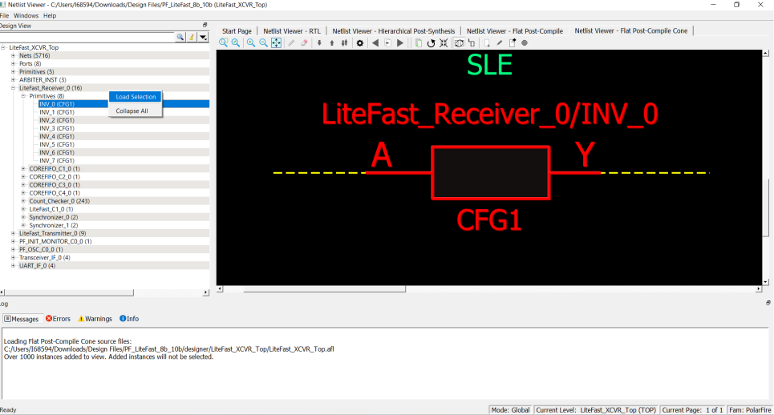

# Adding a Macro

A macro is a basic low-level design object from the Macro Library in the  Catalog. Right click a macro in the Design Tree and select **Load Selection** to add a macro. Adding a macro adds the instance with its  connected nets to the view. The connected nets are always dashed yellow lines, even if they  are not connected to any logic outside the view. Double clicking the net adds connections  \(if any\) and turns the net from a dashed line to a solid line. A solid line for a net  indicates that it is a user-added net.

**Parent topic:**[Displaying the Flat Post-Compile Cone View](GUID-30D775AD-ED75-4835-81B5-C7B252DB402A.md)

