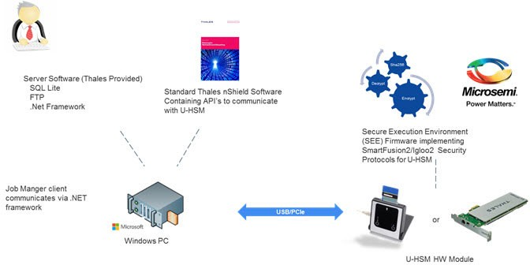

# HSM Server Architecture

The HSM module must be attached to the host PC running standard Thales nShield software. This  software provides access to the HSM module. U-HSM and M-HSM servers have an architecture  that is similar to the U-HSM architecture shown in the following figure, but the client  software is FlashPro Express instead of the Job Manager.

 

 

The client application \(Job Manager in this diagram\) makes a request to the server. The  HSM server Software running on the host PC receives the client request. Depending on  request, it reads all required information from the database on the host PC and passes  it through nShield software to the firmware running inside the HSM module. The HSM  module decrypts received keys and processes the request. It encrypts output data and  sends the response back to the HSM server. Some information is stored in the local  database \(for example, CoC\). Client call-requested information is returned to the  caller.

The SEE firmware is stored on disc of the host PC in encrypted form \(see [HSM Security Environment](GUID-CB383160-3D0F-4B70-A9A9-19D5D7B82F3B.md#) for details\).

**Parent topic:**[HSM Servers](GUID-8655628F-64C1-4EED-AA0C-2F15C461DFAB.md)

