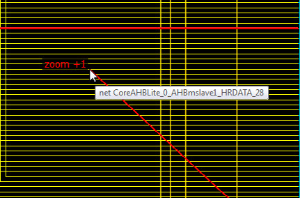

# Zoom In/Out

There are multiple ways to zoom in/out in the Netlist Viewer:

-   Use Ctrl+ mouse scroll wheel.
-   Left click and drag towards upper-left corner to zoom in. Left click and drag towards upper-right corner to zoom out. The drag distance determines the zoom in and zoom out magnitude. The bigger the distance of the drag, the bigger is the zoom magnitude, which is displayed as a positive integer for zoom in and a negative integer for zoom out.

-   Use the Zoom In/Zoom Out icons in the toolbar. The Zoom In/Zoom Out icons are equivalent to a left click mouse drag magnitude of +1/-1.

**Parent topic:**[Basic Operations](GUID-2BCBBDD5-68FE-42F3-ADB5-6A002D087C8E.md)

