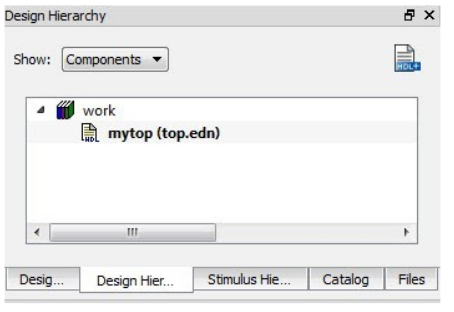
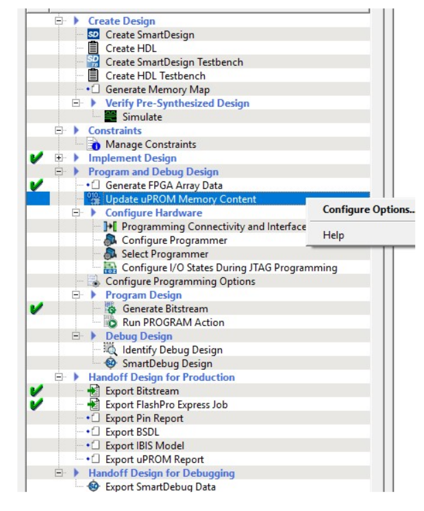

# Implementing Your Design

After completing the Synthesis and Post-Synthesis simulation in your environment, you must use Libero again to physically implement your design, run timing and power analysis, and generate your programming file.

1.  Create a new Libero project for the physical implementation and layout of the design. Make sure to target the same device as in the reference project you created in [Component Configuration](GUID-21EFBB2D-7F99-4C6B-B52B-40B50BBF57D9.md).
2.  After project creation, remove Synthesis from the tool chain in the Design Flow window \(`Project > Project Settings > Design Flow > Uncheck Enable Synthesis`\).
3.  Import your post-synthesis `*.edn` or `*.vm` file into this project, \(`File > Import > Synthesized Verilog Netlist (VM)`\).

    **Tip:** It is recommended that you create a link to this file, so that if you re-synthesize your design, Libero always uses the latest post-synthesis netlist.

    1.  In the Design Hierarchy window, note the name of the root module \(shown in the following figure\).

        

4.  Import the constraints into the Libero project. Use the Constraint Manager to import `*.pdc`

    /`*.sdc/*.ndc` constraints.

    1.  Import I/O `*.pdc` constraint files \(`Constraints Manager > I/O Attributes > Import`\).
    2.  Import Floorplanning `*.pdc` constraint files \(`Constraints Manager > Floor Planner > Import).` If your design contains CoreConfigP \(SmartFusion 2 and IGLOO 2 only\), make sure to import the PDC file generated through Derive Constraint tool.
    3.  Import `*.sdc` timing constraint files \(`Constraints Manager > Timing > Import`\). If your design has any of the cores listed in [Overview](GUID-A37221FD-A433-48C8-92E2-E0E51BC1034D.md), make sure to import the SDC file generated through derive constraint tool.
    4.  Import `*.ndc` constraint files \(`Constraints Manager > Netlist Attributes > Import`\). If your design is an RTG4 design using RTG4FCCCECALIB core, then make sure to import the NDC file generated through derive constraint tool.
5.  Associate Constraints Files to design tools

    1.  Open Constraint Manager \(`Manage Constraints > Open Manage Constraints View`\). Check the Place-and-Route and Timing Verifications check box next to the constraint file to establish constraint file and tool association. Associate the `*.pdc` constraint to Place-and-Route and the `*.sdc` to both Place-and-Route and Timing Verifications. Associate the `*.ndc` file to Compile Netlist.
    **Tip:**

    -   If Place and Route fails with this `*.sdc` constraint file, import this same `*.sdc` file to synthesis and re-run synthesis.
    -   SmartFusion 2 and IGLOO 2 only: The derived floorplanning PDC file constrains the CoreConfigP in an optimal location for placement and improves timing performance of the design.
6.  Click Compile Netlist and then Place and Route to complete the layout step.
7.  From all [Component Manifests](GUID-CBA28D38-9B16-4D6E-B465-EF0C370A2E37.md) Reports:

    -   For SmartFusion 2 and IGLOO 2 devices, import all the files in the<br /> **Configuration files to be used for Programming** and<br /> **Configuration files to be used for Power Analysis** sections<br /> using the `import_component_data` Tcl command:

        ```
        import_component_data -module "<name of root component>" \
                        -fddr "<path to FDDR.reg>" \
                        -mddr "<path to MDDR.reg>" \
                        -serdes0 "<path to SERDESIF_0_init.reg>" \
                        -serdes1 "<path to SERDESIF_1_init.reg>" \
                        -serdes2 "<path to SERDESIF_2_init.reg>" \
                        -serdes3 "<path to SERDESIF_3_init.reg>" \
                        -envm_cfg "<path to eNVM cfg>"
        ```

    -   For RTG4, import all the files in the **Configuration files to be used for Programming** and **Configuration files to be used for Power Analysis** sections using the `import_component_data`<br /> Tcl command:

        ```
        import_component_data 
                        -module "<name of root component>" \
                        -uprom_cfg "<path to uPROM cfg>"
        ```

    **Important:** All configuration files imported with `import_component_data`. Tcl command are imported to the `designer/<root name>/component/ folder` in the Libero project directory.

    **Tip:**

    -   For SmartFusion 2 device, if you do not run SmartPower, you can skip importing the `*.reg files`, and you only need to import the `ENVM.cfg` file. For IGLOO 2 device, you must import all `*.reg` and `ENVM.cfg` files specified in all your relevant [Component Manifests](GUID-CBA28D38-9B16-4D6E-B465-EF0C370A2E37.md) Reports.
    -   For RTG4, only the UPROM `.cfg` file can be imported.
8.  For SmartFusion 2/IGLOO 2 devices, if you need to change eNVM content, open the **Update eNVM Memory Content** dialog box \(see the following figure\). Changes you make in this dialog box are saved to the eNVM `*.cfg` file you imported.

    

9.  For RTG4, if you need to change uPROM content, open the **Update uPROM Memory Content** dialog box \(see the following figure\). Changes you make in this dialog box are saved to the `uPROM.cfg` file you imported.

    

10. **PolarFire**: The Configure Design Initialization Data and Memories tool allows you to initialize design blocks such as LSRAM, uSRAM, XCVR \(transceivers\), and PCIe using data stored in nonvolatile uPROM, sNVM, or external SPI Flash storage memory. The tool has the following tabs for defining the specification of the design initialization sequence and the specification of the initialization clients as well as user data clients.

    -   Design Initialization tab
    -   uPROM tab
    -   sNVM tab
    -   SPI Flash tab
    -   Fabric RAMs tab
    Use the tabs in the tool to configure the design initialization data and<br /> memories.

    

    After completing the configuration, perform the following steps to program the<br /> initialization data:

    -   Generate initialization clients
    -   Generate or export the bit stream
    -   Program the device
    For detailed information on how to use this tool, see [Libero SoC Design Flow User Guide](http://coredocs.s3.amazonaws.com/Libero/2025_1/Tool/libero_ecf_ug.pdf). For more information<br /> on the Tcl commands used to configure various tabs in the tool and specify memory<br /> configuration files \(`*.cfg`\), see [Tcl Commands Reference Guide](http://coredocs.s3.amazonaws.com/Libero/2025_1/Tool/libero_soc_tcl_cmd_ref_ug.pdf).

11. Generate a Programming File from this project and use it to program your FPGA.

