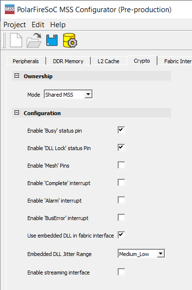

# Crypto

The following table lists the crypto ownership modes.

 

|Owner|Description|
|-----|-----------|
|  MSS |The MSS owns the  crypto.|
|  Fabric |The Fabric owns the  crypto and ports are exposed to the fabric.|
|  Shared MSS |This is shared between  the MSS and the Fabric. The MSS is the first owner.  There  are regular ports and other ports for handshaking to switch the  ownership.|
|  Shared Fabric |This is shared between  the MSS and the Fabric. The Fabric is the first  owner.  There are regular ports and other ports for handshaking and to  switch ownership.|

 

**Note:** Streaming Interface is not available for Fabric mode.

 

 

In the crypto modes:

 

-   The status pins and interrupt pins are available as configuration options in all the ownership modes except the MSS ownership mode.
-   There are three options that expose the DLL lock, Busy, and Mesh ports. The Busy and DLL Lock are ON by default, while the Mesh input pin connects to 0 when not used.
-   The **Use embedded DLL in fabric interface** is always provided in all modes and is enabled by default when the **Enable streaming interface** option is selected.

 

**Parent topic:**[Using the PolarFire SoC MSS Configurator GUI](GUID-E11D45E3-7975-4122-BA81-72D6BDD0CD1A.md)

**Previous topic:**[L2 Cache](GUID-A82E6D32-6043-4BDA-AD1C-FC004A2867D0.md)

**Next topic:**[Memory Partition and Protection](GUID-6D3AA583-792D-44D2-BD53-A8758C44BB34.md)

