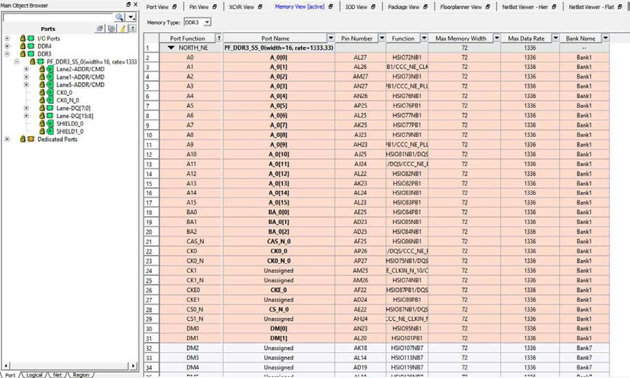

# Memory Interface View Columns

The Memory Interface view detects the type of Memory Interface in the  design and presents the ports in the Ports View. The Memory Interface view displays the  following I/O information in the view. Each of the column can be sorted  \(ascending/descending order\) or filtered:

-   Port Function—Formal port name of the Memory Interface. The ports specific to the memory interface type are loaded into the Port View.
-   Port Name—Port name of the Memory Interface instance in the design.
-   Pin Number—Package pin number assigned to the port of the Memory Interface.
-   Function—More descriptive function name of the Port, which identifies the type of I/O \(for example, HSIO for High-speed I/Os or GPIO \(General-purpose Input/Output\).
-   Max Memory Width—Maximum memory width of the DDR. This is a fixed read-only value specific to the Edge\_Anchor and is different with different Edge\_Anchors.
-   Max Data Rate—Maximum data rate in Mbps. This is a fixed read-only value specific to the Edge\_Anchor and is different with different Edge\_Anchors.

**Note:** When making DDR placement, see the memory width and data rate of the DDR Memory used in the design \(as displayed in the Ports View\). Make sure that the Edge\_Anchor location, where you want to place the DDR memory, can accommodate the DDR memory in terms of the memory width and the data rate. This will avoid invalid placement.

-   Bank Name—the I/O bank name of the port
-   High-speed I/O Clocks—specifies the number of High Speed I/O clocks

The Pin Number and Function are the same as what are listed in the PPAT  for the selected device and package. The PPAT for each PolarFire package are provided in  the PolarFire\_&lt;package&gt; Pinouts file on the [PolarFire Documentation](https://www.microchip.com/en-us/products/fpgas-and-plds/fpgas/polarfire-fpgas#documentation) web page.

The following figure shows memory interface view.

**Parent topic:**[Memory Interface View](GUID-04C2F3E6-C9E6-4210-AF6D-16C492A0BAAA.md)

