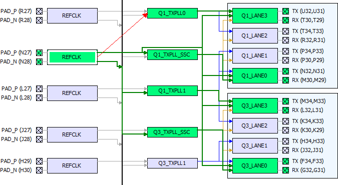

# DRC—REFCLK to TXPLL Connectivity

A REFCLK can connect to all the TXPLLs beside and below it \(down the Cascade Path\) in the Placement View. A REFCLK cannot connect to a TXPLL above it \(up the Cascade Path\).

A cascade path \(represented by the vertical line beside the REFCLKs\) is used for the REFCLK to connect to all the TXPLLs below it and the Lanes below it in the Placement View.

**Parent topic:**[Placement DRC Rules](GUID-C4347DC8-BDDA-465C-9278-A81C8993B2D3.md)

