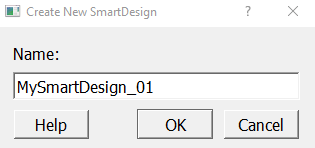
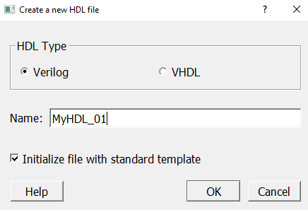

# Creating a Synthesizable SmartDesign

In the design process, the first step is to create a SmartDesign component after creating a project. Create your SmartDesign using the following procedures.

## Creating a SmartDesign Component

To create a SmartDesign component using the SmartDesign canvas, perform the following steps:

1.  Launch the SmartDesign tool in either of the following ways.

    -   On the menu, click **File** &gt; **New** &gt; **SmartDesign**
    -   On the **Design Flow** tab, double-click **Create SmartDesign**
    **Result:** The **Create New SmartDesign** dialog box  appears.

    

2.  Enter an appropriate and unique name for your SmartDesign component in the **Name** box.
3.  Click **OK** to create the SmartDesign component. The SmartDesign component appears in the **Design Hierarchy** tab. The newly created SmartDesign appears as a central tab in the IDE main window.

**Result:** The design file is saved in a folder with the same name as that of the design  itself and is placed in your `<project>\component\work\` folder.

## Importing an Existing HDL Source File\(s\) or Folder\(s\)

To import an HDL design source file\(s\) or folder\(s\) use the following procedures.

1.  Import your design sources in any of the following ways:
    -   On the menu, click **File** &gt; **Import** and select **HDL Source Files**. The **Import Files** dialog box appears.
    -   On the menu, click **File** &gt; **Import**, and select **HDL Source Folder**. The **Import Folders** dialog box appears.
    -   In the **Design Flow** tab, right-click on **Create HDL** option, and select **Import Files**. The **Import Files** dialog box appears.
2.  Navigate to the location where your design source file\(s\) or folder\(s\) are located, select the file\(s\) or folder\(s\), and click **Open**.

    **Important:** When you use the **Design Flow** import option, the selection option changes from **Open** to **Choose**.

**Result:** The selected file\(s\) or folder\(s\) are copied to your  `<project>\hdl\` folder.

For more information, see [Libero Design Flow User Guide](http://coredocs.s3.amazonaws.com/Libero/2022_3/Tool/libero_ecf_ug.pdf).

## Creating a New HDL File Using the IDE

To create a new HDL file using the IDE, perform the following steps:

1.  Launch the IDE in either of the following ways:

    -   On the menu, click **File** &gt; **New** &gt; **HDL**
    -   On the **Design Flow** tab, double-click **Create HDL**
    **Result:** The **Create a new HDL file** dialog box  appears.

    

2.  By default, the preferred language to write the design file is set to **Verilog**. If you choose to use VHDL, select the **VHDL** option.
3.  Enter an appropriate and unique name for your design file in the **Name** box.
4.  By default, the design file is initialized with the built-in standard design file template. If you choose to not use the default template, deselect the **Initialize file with standard template** option.
5.  Click **OK** to create the HDL file. The newly created HDL file appears in the **Design Hierarchy** tab and is displayed in the central tab of the IDE main window.

**Result:** The newly created HDL file is copied to your  `<project>\hdl\` folder.

