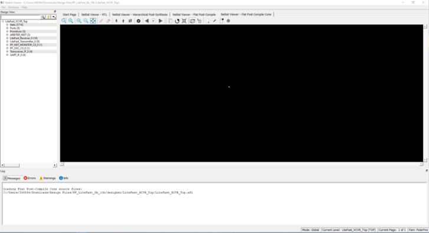
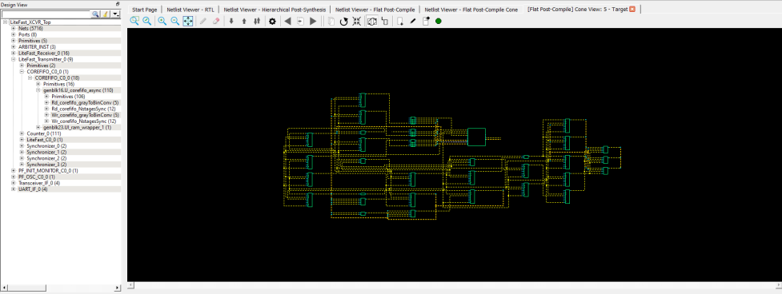

# Displaying the Flat Post-Compile Cone View

When the Flat Post-Compile Cone view has finished loading, unlike the other three views, nothing is drawn in the canvas.

This view is useful when a small or critical part of a very large design  needs to be examined. Design objects that can be selected for display in this view  include:

-   Nets
-   Ports
-   Macros
-   Components

To display design objects in the Flat Post-Compiled Cone view, right  click the design object \(**Nets, Macro, Ports, or Component**\) in the  Design Tree and select **Load Selection**. The design object is added  to the view.

Opening a design in the Flat Post-Compile view may incur a runtime  penalty. This cone view loads the same AFL netlist source file as the Flat Post-Compile  view. However, this cone view, unlike the Flat Post-Compile view, draws nothing until  you select a part of the design you want to display. This reduces the runtime penalty  associated with drawing a large netlist for display.

-   **[Adding a Net](GUID-089A859C-0D5C-4D76-846F-262A59D34B7E.md)**  

-   **[Adding a Macro](GUID-25CF957D-ECB7-4D6C-A345-2896EE5158E3.md)**  

-   **[Adding a Port](GUID-217C22C8-D95A-4EEA-940F-558A60E1DAEA.md)**  

-   **[Adding a Component](GUID-80DB5F63-8DB1-4636-911E-9392C7DD36A4.md)**  

-   **[Load/Driver Display](GUID-3AF4180E-40BA-47D5-817E-C933DB745065.md)**  

**Parent topic:**[Opening a View](GUID-173E7BD7-4EFB-4C93-86E9-B1A34C8B9AED.md)

