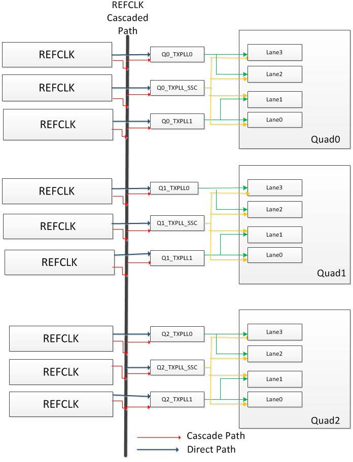
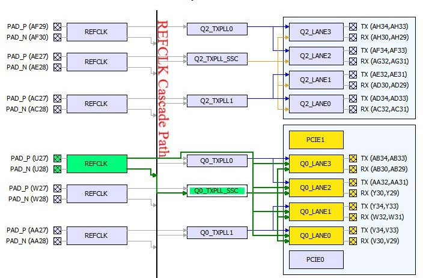

# Direct Versus Cascaded Connection

The PolarFire XCVR reference clock network provides rich connectivity to the TX\_PLL and Transceiver lanes. The connectivity allows the user to share common reference clock inputs to reduce fanout buffers on the board and reduce costs.

The two types of connections between the reference clock and the TX \_PLL  and Transceiver lanes are as follows:

-   Direct Connection
-   Cascaded Connection

Direct connections are used when the reference clock pin and the TX\_PLL or  the Transceiver lanes are in the same Quad location. Cascaded connections are used when the  reference clock pin and the TX\_PLL or the Transceiver lanes are not in the same quad  location. Cascade connections are only available going from the top of the device towards  the bottom. The cascaded connection is denoted in the XCVR view by the black vertical line  down the middle of the placement view.

**Note:** ****A REFCLK can connect to all the lanes beside or below it in any quad \(down the cascade path\) but not those above it \(up the cascade path\).

The red lines denote cascaded REFCLK connection to the TX\_PLL and the  Transceiver lanes in the quad.

Connection/Assignment up the Cascade path \(from REFCLK to TX\_PLL and  Transceiver lanes which are above the REFCLK\) are illegal and indicated by red lines in the  XCVR view.

Each Reference Clock \(REFCLK\) has a direct dedicated connection to its  corresponding TX\_PLL and to the lane that the TX\_PLL drives in the same quad.

Selecting a dedicated connection or a cascaded connection depends on the  trade-off you want to make. A direct dedicated connection from the REFCLK to the TX\_PLL  gives better signal integrity for the Transceiver whereas a cascaded connection reduces  external components and reduces overall power.

The following figure shows direct dedicated path and cascade path.

The following figure shows XCVR view.

**Parent topic:**[XCVR View](GUID-7C12202D-E802-4F24-9D43-D82DA41A819B.md)

