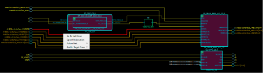

# Go to Net Driver

Right click the net and select **Go to Net Driver** to trace the net to the driver. This feature allows you to easily retrieve the driver of a net. When the net driver is retrieved, the display is centered on the net driver.

If the **Do Selection Locally** option is turned ON, the trace stops on the current level of hierarchy. If the **Do Selection Locally** option is turned OFF, the trace crosses hierarchy boundaries until the instance driving the net is reached. The instance \(net driver\) is selected in the view.

**Parent topic:**[Tracing Nets](GUID-EF51AA6D-DB7E-4E00-A527-83182CBD4E6A.md)

