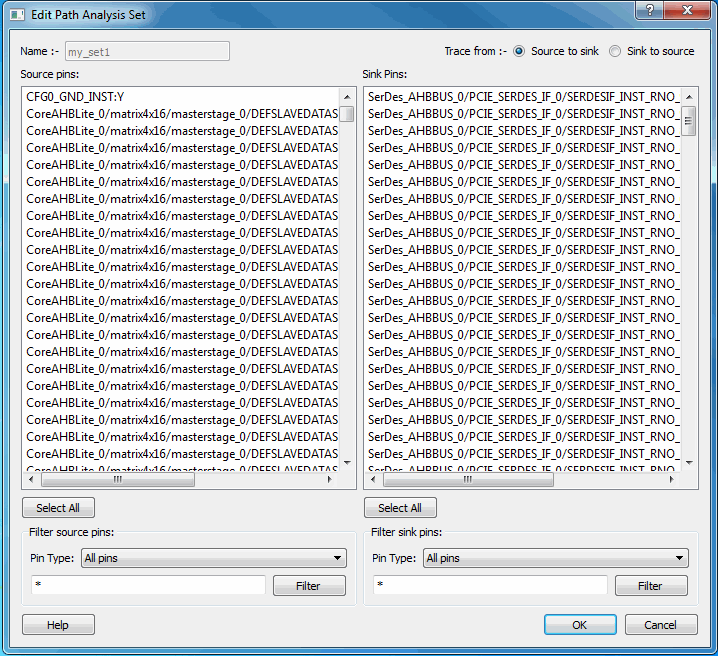

# Edit Filter Set Dialog Box

Use the Edit Filter Set dialog box to specify a filter.

To open the Edit Filter Set dialog box from the SmartTime Max/Min Delay Analysis view,  right-click a filter set in the clock domain browser, and then choose **Edit Set** from the shortcut menu.

-   **[Name](GUID-6E779890-BEFB-465A-8A5A-C903FE975618.md)**  

-   **[Creation filter](GUID-FF67BFBB-65E9-4460-938E-2641C5BDFE77.md)**  

**Parent topic:**[SmartTime Dialog Boxes](GUID-F96D2B4E-7DDD-4507-8621-C49A84F55C81.md)

