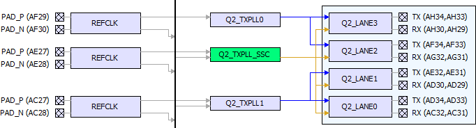
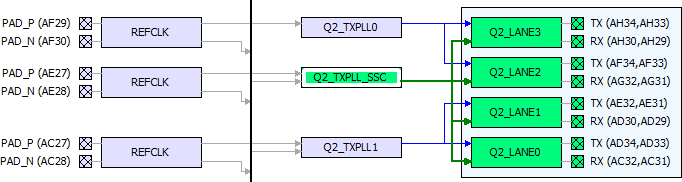

# DRC—TXPLL to **LANES Connectivity**

A TXPLL\_SSC can connect to all the lanes of a quad \(shown in brown lines in the Placement View\).

A TXPLL \(non-SSC\) can connect to two lanes beside it normally \(shown in  blue lines in the Placement View\).

")

")

")

")

**Parent topic:**[Placement DRC Rules](GUID-C4347DC8-BDDA-465C-9278-A81C8993B2D3.md)

