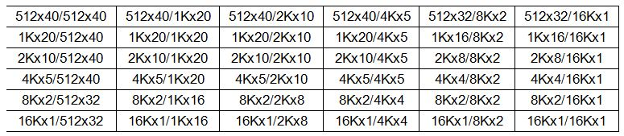

# RAM1K20

The RAM1K20 block contains 20,480 \(16,896 with ECC\) memory bits and is a true dual-port memory. The RAM1K20 memory can also be configured in two-port mode. All read/write operations to the RAM1K20 memory are synchronous. To improve the read-data delay, an optional pipeline register at the output is available. In addition to the feed-through write mode option to enable immediate access to the write-data, RAM1K20 has a Read-before-write option in the dual-port mode. RAM1K20 also includes a Read-enable control for both dual-port and two-port modes. The RAM1K20 memory has two data ports, which can be independently configured in any of the following combination.

-   Non-ECC Dual-Port RAM with the following configurations:
    -   Any of 1Kx20, 2Kx10, 4Kx5, 8Kx2 or 16Kx1 on each port
-   Non-ECC Two-Port RAM with the following configurations:
    -   Any of 512x40, 1Kx20, 2Kx10, 4Kx5, 8Kx2 or 16Kx1 on each port
-   ECC Two-Port RAM with the following configuration:
    -   512x33 on both ports

## Functionality

The main features of the RAM1K20 memory block are as follows:

-   A RAM1K20 block has 16,896 bits with ECC and 20,480 bits without ECC.
-   A RAM1K20 block provides two independent data ports A and B.
-   In non-ECC dual-port mode, each port can be independently configured to any of the following depth/width: 1Kx20, 2Kx10, 4Kx5, 8Kx2 or 16Kx1. There are 25 unique combinations of non-ECC dual-port aspect ratios:

    

-   RAM1K20 also has a two-port mode. In this case, Port A will become the read port and Port B becomes the write port.
-   In non-ECC two-port mode, each port can be independently configured to any of the following depth/width: 512x40, 1Kx20, 2Kx10, 4Kx5, 8Kx2 or 16Kx1. There are 36 unique combinations of non-ECC two-port aspect ratios:

    

-   RAM1K20 has an ECC two-port mode, for which both ports have word widths equal to 33 bits. There is one unique combination of ECC two-port aspect ratio:

    512x33/512x33

-   RAM1K20 performs synchronous operation for setting up the address as well as writing and reading the data.
-   RAM1K20 has a Read-enable control for both dual-port and two-port modes.
-   The address, data, block-port select, write-enable and read-enable inputs are registered.
-   An optional pipeline register with a separate enable, synchronous-reset and asynchronous-reset is available at the read-data port to improve the clock-to-out delay.
-   There is an independent clock for each port. The memory is triggered at the rising edge of the clock.
-   The true dual-port mode supports an optional Read-before-write mode or a feed-through write mode, where the write-data also appears on the corresponding read-data port.
-   Read from both ports at the same location is allowed.
-   Read and write on the same location at the same time results in unknown data to be read. There is no collision prevention or detection. However, correct data is expected to be written into the memory.
-   When ECC is enabled, each port of the RAM1K20 memory can raise flags to indicate single-bit-correct and double-bit-detect.

The following figure shows a simplified block diagram of the RAM1K20 memory block. The  simplified block illustrates the two independent data ports, ECC, the read-data pipeline  registers, read-before-write selection, and the feed-through multiplexors.

|Pin Name|Pin Direction|Type|Description|Polarity|
|--------|-------------|----|-----------|--------|
|A\_ADDR\[13:0\]|Input|Dynamic|Port A address|—|
|A\_BLK\_EN\[2:0\]|Input|Dynamic|Port A block selects|High|
|A\_CLK|Input|Dynamic|Port A clock|Rising|
|A\_DIN\[19:0\]|Input|Dynamic|Port A write-data|—|
|A\_DOUT\[19:0\]|Output|Dynamic|Port A read-data|—|
|A\_WEN\[1:0\]|Input|Dynamic|Port A write-enables \(per byte\)|High|
|A\_REN|Input|Dynamic|Port A read-enable|High|
|A\_WIDTH\[2:0\]|Input|Static|Port A width/depth mode select|—|
|A\_WMODE\[1:0\]|Input|Static|Port A Read-before-write and Feed-through write selects|High|
|A\_BYPASS|Input|Static|Port A pipeline register select|Low|
|A\_DOUT\_EN|Input|Dynamic|Port A pipeline register enable|High|
|A\_DOUT\_SRST\_N|Input|Dynamic|Port A pipeline register synchronous-reset|Low|
|A\_DOUT\_ARST\_N|Input|Dynamic|Port A pipeline register asynchronous-reset|Low|
|B\_ADDR\[13:0\]|Input|Dynamic|Port B address|—|
|B\_BLK\_EN\[2:0\]|Input|Dynamic|Port B block selects|High|
|B\_CLK|Input|Dynamic|Port B clock|Rising|
|B\_DIN\[19:0\]|Input|Dynamic|Port B write-data|—|
|B\_DOUT\[19:0\]| |Dynamic|Port B read-data|—|
|B\_WEN\[1:0\]|Input|Dynamic|Port B write-enables \(per byte\)|High|
|B\_REN|Input|Dynamic|Port B read-enable|High|
|B\_WIDTH\[2:0\]|Input|Static|Port B width/depth mode select|—|
|B\_WMODE\[1:0\]|Input|Static|Port B Read-before-write and Feed-through write selects|High|
|B\_BYPASS|Input|Static|Port B pipeline register select|Low|
|B\_DOUT\_EN|Input|Dynamic|Port B pipeline register enable|High|
|B\_DOUT\_SRST\_N|Input|Dynamic|Port B pipeline register synchronous-reset|Low|
|B\_DOUT\_ARST\_N|Input|Dynamic|Port B pipeline register asynchronous-reset|Low|
|ECC\_EN|Input|Static|Enable ECC|High|
|ECC\_BYPASS|Input|Static|ECC pipeline register select|Low|
|SB\_CORRECT|Output|Dynamic|Single-bit correct flag|High|
|DB\_DETECT|Output|Dynamic|Double-bit detect flag|High|
|BUSY\_FB|Input|Static|Lock access to FCB|High|
|ACCESS\_BUSY|Output|Dynamic|Busy signal from FCB|High|

**Tip:** Static inputs are defined at design time and need to be tied to 0 or 1.

A\_WIDTH and B\_WIDTH

The following table lists the width/depth mode selections for each port.  Two-port mode is in effect when the width of at least one port is greater than 20, and  A\_WIDTH indicates the read width while B\_WIDTH indicates the write width.

|Depth x Width|A\_WIDTH/B\_WIDTH|
|-------------|-----------------|
|16Kx1|000|
|8Kx2|001|
|4Kx4, 4Kx5|010|
|2Kx8, 2Kx10|011|
|1Kx16, 1Kx20|100|
|512x32 \(Two-port\),512x40 \(Two-port\),512x33 \(Two-port ECC\)|101|

A\_WEN and B\_WEN

The following table lists the write/read control signals for each port. Two-port mode is in  effect when the width of at least one port is greater than 20, and read operation is always  enabled.

|Depth x Width|A\_WEN/B\_WEN|Result|
|-------------|-------------|------|
|16Kx1, 8Kx2, 4Kx5,2Kx10|x0|Perform a read operation|
|x1|Perform a write operation|
|1Kx16|00|Perform a read operation|
|01|Write \[8:5\], \[3:0\]|
|10|Write \[18:15\], \[13:10\]|
|11|Write \[18:15\], \[13:10\], \[8:5\], \[3:0\]|
|1Kx20|00|Perform a read operation|
|01|Write \[9:0\]|
|10|Write \[19:10\]|
|11|Write \[19:0\]|
|512x32 \(Two-port write\)|B\_WEN\[0\] = 1|Write B\_DIN\[8:5\], B\_DIN\[3:0\]|
|B\_WEN\[1\] = 1|Write B\_DIN\[18:15\], B\_DIN\[13:10\]|
|A\_WEN\[0\] = 1|Write A\_DIN\[8:5\], A\_DIN\[3:0\]|
|A\_WEN\[1\] = 1|Write A\_DIN\[18:15\], A\_DIN\[13:10\]|
|512x40 \(Two-port write\)|B\_WEN\[0\] = 1|Write B\_DIN\[9:0\]|
|B\_WEN\[1\] = 1|Write B\_DIN\[19:10\]|
|A\_WEN\[0\] = 1|Write A\_DIN\[9:0\]|
|A\_WEN\[1\] = 1|Write A\_DIN\[19:10\]|
|512x33 \(Two-port ECC\)|B\_WEN\[1:0\] = 11|Write B\_DIN\[16:0\]|
|A\_WEN\[1:0\] = 11|Write A\_DIN\[15:0\]|

A\_ADDR and B\_ADDR

The following table lists the address buses for the two ports. 14 bits are  needed to address the 16K independent locations in x1 mode. In wider modes, fewer address  bits are used. The required bits are MSB justified and unused LSB bits must be tied to 0.  A\_ADDR is synchronized by A\_CLK while B\_ADDR is synchronized to B\_CLK. Two-port mode is in  effect when the width of at least one port is greater than 20, and A\_ADDR provides the  read-address while B\_ADDR provides the write-address.

|Depth x Width|A\_ADDR/B\_ADDR|
|Used Bits|Unused Bits\(must be tied to 0\)|
|-------------|---------------|
|---------|--------------------------------|
|16Kx1|\[13:0\]|None|
|8Kx2|\[13:1\]|\[0\]|
|4Kx4, 4Kx5|\[13:2\]|\[1:0\]|
|2Kx8, 2Kx10|\[13:3\]|\[2:0\]|
|1Kx16, 1Kx20|\[13:4\]|\[3:0\]|
|512x32 \(Two-port\),512x40 \(Two-port\),512x33 \(Two-port ECC\)|\[13:5\]|\[4:0\]|

A\_DIN and B\_DIN

The following table lists the data input buses for the two ports. The  required bits are LSB justified and unused MSB bits must be tied to 0. Two-port mode is in  effect when the width of at least one port is greater than 20, and A\_DIN provides the MSB  of the write-data while B\_DIN provides the LSB of the write-data.

|Depth x Width|A\_DIN/B\_DIN|
|Used Bits|Unused Bits\(must be tied to 0\)|
|-------------|-------------|
|---------|--------------------------------|
|16Kx1|\[0\]|\[19:1\]|
|8Kx2|\[1:0\]|\[19:2\]|
|4Kx4|\[3:0\]|\[19:4\]|
|4Kx5|\[4:0\]|\[19:5\]|
|2Kx8|\[8:5\] is \[7:4\]\[3:0\] is \[3:0\]|\[19:9\]\[4\]|
|2Kx10|\[9:0\]|\[19:10\]|
|1Kx16|\[18:15\] is \[15:12\]\[13:10\] is \[11:8\]\[8:5\] is \[7:4\]\[3:0\] is \[3:0\]|\[19\]\[14\]\[9\]\[4\]|
|1Kx20|\[19:0\]|None|
|512x32 \(Two-port write\)|A\_DIN\[18:15\] is \[31:28\] A\_DIN\[13:10\] is \[27:24\] A\_DIN\[8:5\] is \[23:20\] A\_DIN\[3:0\] is \[19:16\] B\_DIN\[18:15\] is \[15:12 B\_DIN\[13:10\] is \[11:8\] B\_DIN\[8:5\] is \[7:4\]B\_DIN\[3:0\] is \[3:0\]|A\_DIN\[19\]A\_DIN\[14\]A\_DIN\[9\]A\_DIN\[4\]B\_DIN\[19\]B\_DIN\[14\]B\_DIN\[9\]B\_DIN\[4\]|
|512x40 \(Two-port write\)|A\_DIN\[19:0\] is \[39:20\] B\_DIN\[19:0\] is \[19:0 \]|None|
|512x33 \(Two-port ECC\)|A\_DIN\[15:0\] is \[32:17\] B\_DIN\[16:0\] is \[16:0 \]|A\_DIN\[19:16\]B\_DIN\[19:17\]|

A\_DOUT and B\_DOUT

The following table lists the data output buses for the two ports. The  required bits are LSB justified. Two-port mode is in effect when the width of at least one  port is greater than 20, and A\_DOUT provides the MSB of the read-data while B\_DOUT provides  the LSB of the read-data.

|Depth x Width|A\_DOUT/B\_DOUT|
|Used Bits|Unused Bits\(must be tied to 0\)|
|-------------|---------------|
|---------|--------------------------------|
|16Kx1|\[0\]|\[19:1\]|
|8Kx2|\[1:0\]|\[19:2\]|
|4Kx4|\[3:0\]|\[19:4\]|
|4Kx5|\[4:0\]|\[19:5\]|
|2Kx8|\[8:5\] is \[7:4\]\[3:0\] is \[3:0\]|\[19:9\]\[4\]|
|2Kx10|\[9:0\]|\[19:10\]|
|1Kx16|\[18:15\] is \[15:12\]\[13:10\] is \[11:8\]\[8:5\] is \[7:4\]\[3:0\] is \[3:0\]|\[19\]\[14\]\[9\]\[4\]|
|1Kx20|\[19:0\]|None|
|512x32 \(Two-port write\)|A\_DIN\[18:15\] is \[31:28\] A\_DIN\[13:10\] is \[27:24\] A\_DIN\[8:5\] is \[23:20\] A\_DIN\[3:0\] is \[19:16\] B\_DIN\[18:15\] is \[15:12 B\_DIN\[13:10\] is \[11:8\] B\_DIN\[8:5\] is \[7:4\]B\_DIN\[3:0\] is \[3:0\]|A\_DIN\[19\]A\_DIN\[14\]A\_DIN\[9\]A\_DIN\[4\]B\_DIN\[19\]B\_DIN\[14\]B\_DIN\[9\]B\_DIN\[4\]|
|512x40 \(Two-port write\)|A\_DOUT\[19:0\] is \[39:20\] B\_DOUT\[19:0\] is \[19:0 \]|None|
|512x33 \(Two-port ECC\)|A\_DOUT15:0\] is \[32:17\] B\_DOUT\[16:0\] is \[16:0 \]|A\_DOUT\[19:16\]B\_DOUT\[19:17\]|

A\_BLK\_EN and B\_BLK\_EN

The following table lists the block-port select control signals for the  two ports. A\_BLK is synchronized by A\_CLK while B\_BLK is synchronized to B\_CLK. Two-port  mode is in effect when the width of at least one port is greater than 20, and A\_BLK\_EN  controls the read operation while B\_BLK\_EN controls the write operation.

|Block-portSelect Signal|Value|Result|
|-----------------------|-----|------|
|A\_BLK\_EN\[2:0\]|111|Perform read or write operation on Port A, unless the width is greater than 20 and a read is performed from both ports A and B.|
|A\_BLK\_EN\[2:0\]|Any one bit is 0|No operation in memory from Port A. Port A read-data will be forced to 0. If the width is greater than 20, the read-data from both ports A and B will be forced to 0.|
|B\_BLK\_EN\[2:0\]|111|Perform read or write operation on Port B, unless the width is greater than 20 and a write is performed to both ports A and B.|
|B\_BLK\_EN\[2:0\]|Any one bit is 0|No operation in memory from Port B. Port B read-data will be forced to 0, unless the width is greater than 20 and write operation to both ports A and B is gated.|

A\_WMODE and B\_WMODE

In true dual-port write mode, each port has a feed-through write or read-before-write option.

-   Logic 00 = Read-data port holds the previous value.
-   Logic 01 = Feed-through, that is write-data appears on the corresponding read-data port. This setting is invalid when the width of at least one port is greater than 20 and the two-port mode is in effect.
-   Logic 10 = Read-before-write, that is previous content of the memory appears on the corresponding read-data port before it is overwritten. This setting is invalid when the width of at least one port is greater than 20 and the two-port mode is in effect.

    A\_CLK and B\_CLK

All signals in ports A and B are synchronous to the corresponding port clock. All address, data, block-port select, write-enable and read-enable inputs must be set up before the rising edge of the clock. The read or write operation begins with the rising edge. Two-port mode is in effect when the width of at least one port is greater than 20, and A\_CLK provides the read clock while B\_CLK provides the write clock.

A\_REN and B\_REN

Enables read operation from the memory on the corresponding port. Two-port read mode is in effect when the width of port A is greater than 20, and A\_REN controls the read operation.

Read-data Pipeline Register Control Signals

A\_BYPASS and B\_BYPASS A\_DOUT\_EN and B\_DOUT\_EN A\_DOUT\_SRST\_N and B\_DOUT\_SRST\_N A\_DOUT\_ARST\_N and B\_DOUT\_ARST\_N

Two-port mode is in effect when the width of at least one port is greater than 20, and the A\_DOUT register signals control both the MSB and LSB of the read-data, and the B\_DOUT register signals are “don’t-cares”.

The following table describes the functionality of the control signals on  the A\_DOUT and B\_DOUT pipeline registers.

|ARST\_N|\_BYPASS|\_CLK|\_EN|\_SRST\_N|D|Qn+1|
|-------|--------|-----|----|---------|---|----|
|0|X|X|X|X|X|0|
|1|0|Not rising|X|X|X|Qn|
|1|0|?|0|X|X|Qn|
|1|0|?|1|0|X|0|
|1|0|?|1|1|D|D|
|1|1|X|X|X|D|D|

ECC\_EN and ECC\_BYPASS

ECC operation is only allowed in Two-port mode and the width of both ports is greater than 20.

-   ECC\_EN = 0: Disable ECC.
-   ECC\_EN = 1, ECC\_BYPASS= 0: Enable ECC Pipelined.
-   ECC Pipelined mode inserts an additional clock cycle to Read-data.
-   In addition, Write-feed-thru and Read-before-write modes add another clock cycle to Read- data.
-   ECC\_EN = 1, ECC\_BYPASS= 1: Enable ECC Non-pipelined.

    SB\_CORRECT and DB\_DETECT

Error detection and correction flags become available when ECC operation  is enabled in Two-port mode and the width of both ports is greater than 20. The following  table describes the functionality of the error detection and correction flags.

|DB\_DETECT|SB\_CORRECT|Flag|
|----------|-----------|----|
|0|0|No errors have been detected.|
|0|1|A single bit error has been detected and corrected in the data output.|
|1|1|Multiple bit errors have been detected, but have not been corrected.|

BUSY\_FB

Control signal, when 1 locks the entire RAM1K20 memory from being accessed by the FCB.

ACCESS\_BUSY

This output indicates that the RAM1K20 memory is being accessed by the FCB.

