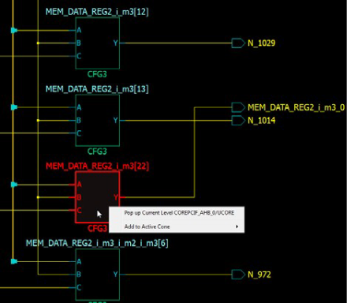

# Pop Instance

To go up one level of hierarchy in the Netlist Viewer:

1.  Click to select an instance and right click **Pop Up current level &lt;instance\_name&gt;**.
2.  Click the Pop icon on the Toolbar or right click and select **Pop Instance &lt;instance\_name&gt;** or double click an empty area in the canvas to move up one level of hierarchy.

**Important:** The right mouse click pop instance menu item is not available at the top of the design hierarchy.

**Parent topic:**[Vertical Navigation](GUID-99ADB4D6-A6A7-4EE4-ACC4-6D7C406E74EC.md)

