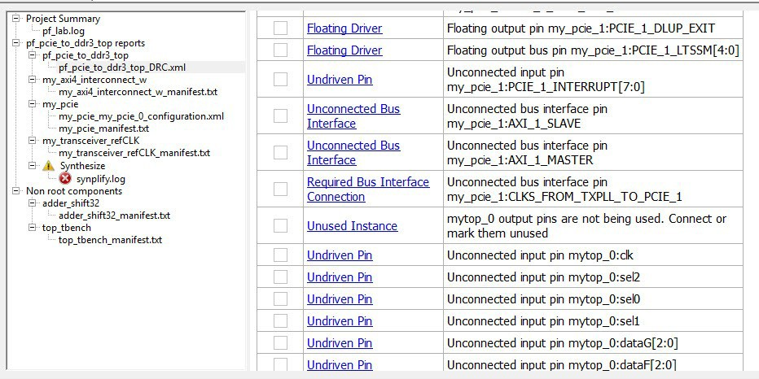

# Validating the SmartDesign Using the DRC

After instantiating all the components and connecting them together, the SmartDesign component must be validated and generated.

Click **Design Rule Check** in the SmartDesign toolbar to generate the  SmartDesign component HDL file. This component can be used by downstream processes such as  synthesis and simulation. You can also instantiate the SmartDesign component into another  SmartDesign. When you generate your SmartDesign, the tool invokes the Design Rules Checker  \(DRC\) to verify the connectivity of your design. Undriven input pins \(output ports\), floating  output pins \(input ports\), and any other DRC violations are reported.

These errors are printed in the **Log**or **Message**window. Any errors must be addressed before a component can be generated  successfully.

**Tip:** You can choose a generated HDL file language from the **Project** &gt; **Project Settings** &gt; **Design flow** tab.

The following table list the DRC errors and the corresponding solutions to fix the  errors.

|DRC Error|Solution|
|---------|--------|
|Unused Instance|You must remove this instance or connect at least one output pin  to the rest of the design.|
|Out-of-date Instance|You must update the instance to reflect a change in the component  interface – ports and/or parameters, referenced by this instance.|
|Undriven Pin|You must connect the pin to a driver or tie it to "1" \(tie high\),  "0" \(tie low\) or, a constant \(tie to constant for bus\\slice pins\).|
|Floating Driver|You can mark the pin unused if it is not going to be used in the  current design. Pins marked unused are ignored by the Design Rules Check.|
|Unconnected Bus Interface|You must connect this Bus Interface to a compatible port because  it is a required connection.|
|Required Bus Interface Connection|You must connect this Bus Interface before you generate the  design. These are typically silicon connection rules.|
|Exceeded Allowable Instances for Core|Some IP cores can only be instantiated a certain  number of times in a design. For example, there can only be one Arm® Cortex®-M1 or  CoreMP7 in a design due to silicon constraints. You must remove the extra instances.  This check is technology-dependent.|
|Incompatible Family Configuration|The instance is not configured to work with this project's Family  setting. Either it is not supported by this family, or you need to re-instantiate the  core. This DRC check is family/ technology-dependent.|
|No RTL License, No Obfuscated License, No Evaluation  License|You do not have the proper license to generate this core. Contact  Microchip SoC to obtain the necessary license.|
|No Top level ports|There are no ports in this design. Use the **Create Port** menu or toolbar command to create ports and connect these ports to  the intended pins in the design.|
|Self-Instantiation|A component cannot instantiate itself.This message is reported  only in the Log window.|
|Bus interface data width mismatch|There is a data width mismatch between the  `<instance1>:<port1>[left1:right1]` and  `<instance1>:<port1>[left2:right2]`, ports implicitly  connected through a Bus Interface net, which might result in loss of data.To  correct an error, make the initiator \(driver\) BIF pin write port width less than or  equal to the target BIF pin write port width as per the port name shown in the DRC  message.Another way to correct the error is to make the target BIF pin read  port width less than or equal to the initiator \(driver\) BIF pin read port width as  per the port name shown in the DRC message.Preceding types of corrections  require to reconfigure the Initiator or the Target core component.|
|Bus interface ID width mismatch|There is an ID width mismatch between the  `<instance1>:<port1>[left1:right1]` and  `<instance1>:<port1>[left2:right2]`, ports implicitly  connected through a Bus Interface net, which might result in loss of data.To  correct an error, make the initiator \(driver\) BIF Pin AWID, WID, or ARID port width  less than or equal to the target BIF pin AWID, WID, or ARID port width as per the  port name shown in the DRC message.Another way to correct an error is to make  the target BIF pin RID or BID port width less than or equal to the initiator  \(driver\) BIF pin RID/BID port width as per port name shown in the DRC  message.Preceding types of corrections require to reconfigure the initiator  or target core component.|

