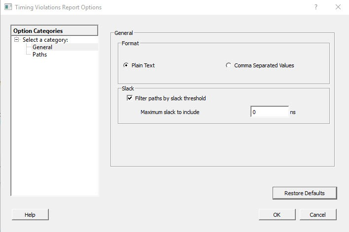

# General

The following figure shows the Timing Violations Report Options—General dialog box.

-   **[Format](GUID-FF3342D5-2D1D-4D5F-9443-DAA81619DA5B.md)**  

-   **[Analysis](GUID-6DAD357F-9C39-4005-AAF1-FF6B26CFA52A.md)**  

-   **[Slack](GUID-1EC8DD22-D9A6-4A53-8D9D-51A76B858163.md)**  

-   **[Restore Defaults](GUID-84CFD867-4C37-4BAA-A4DC-01A08C90B8AD.md)**  

**Parent topic:**[Timing Violations Report Options Dialog Box](GUID-892D2E3C-BC08-4D52-8468-95678F41CD25.md)

