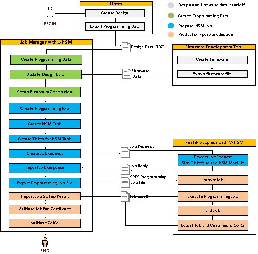
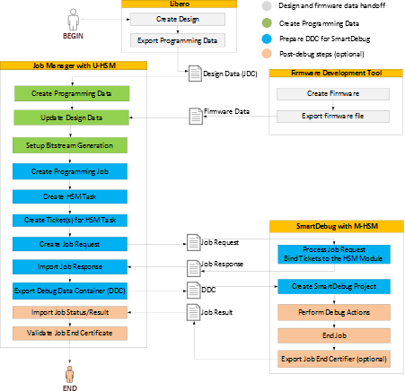

# Main SPPS Flow

The main objectives of this flow are to support secured programming of a blank device  \(initial programming\), enforce overbuild protection, and allow an upgrade flow for  already-programmed devices.

In this flow, all user-selected design information such as Fabric, eNVM, and Security is  exported from Libero through a JDC file and handed off to the OE, which uses the Job  Manager to create and submit an HSM Programming Job for production. The eNVM client data  can be updated in the Job Manager during this step.

**Tip:** The eNVM data is typically provided by \(but not limited to\) the firmware development team.

All operations related to generation and use of encryption keys, pass keys, and other  protected data is handled by the User HSM \(U-HSM\). Production executes the received HSM  Programming Jobs using FlashPro Express. The Manufacturer HSM \(M-HSM\) serves FlashPro  Express security protocol requests, and enforces the overbuild protection policy. Proof  of programming results such as Certificates of Conformance generated by the programmed  devices and the job end certifiers are sent back to the OE and can be validated using  the U-HSM.

From a design security standpoint, design and operation areas are always considered to be  trusted environments. OE can modify security settings from Libero through the JDC file.  Production in the main \(HSM-based\) SPPS flow is considered an untrusted area with  respect to design, security, and job execution. The following figure shows the main SPPS  flow for programming.

In the SmartDebug flow, all user-selected design information such as Fabric, eNVM, and  Security is exported from Libero through a JDC file and handed off to the OE, which uses  the Job Manager to create and submit an HSM Debug Job for production.

All operations related to generation and use of encryption keys, pass keys, and other  protected data is handled by the User HSM \(U-HSM\). Production executes received HSM  Debug Jobs using SmartDebug. The Manufacturer HSM \(M-HSM\) serves SmartDebug security  protocol requests and enforces the overbuild protection policy. From a design security  standpoint, design and operation areas are always considered to be trusted environments.  OE can modify security settings from Libero through the JDC file. Production in the main  \(HSM-based\) SPPS flow is considered an untrusted area with respect to design, security,  and job execution. The following figure shows the main SPPS flow for SmartDebug.

-   **[Libero Design Handoff](GUID-A6D9C6B4-2973-49BA-8B3E-689B7C715DA3.md#)**  

-   **[Firmware Handoff](GUID-02087C6F-F646-40DE-9BA0-E0BDA6AA829D.md)**  

-   **[Programming Data and Bitstream Initialization](GUID-F13D5010-D949-42F1-868B-CA3A31E10EF9.md#)**  

-   **[Job Preparation](GUID-BFB233D2-653B-4FD5-B65F-F6B4EBB72812.md#)**  

-   **[Production](GUID-27F23E45-47F9-403A-A8A0-E0CF2F500A66.md#)**  

-   **[Post Production](GUID-23ACF1AF-3218-4EB7-95C7-39801C648060.md)**  

-   **[Special Cases](GUID-4FBCE3F7-ECAF-4806-92D6-9B33DEF417FB.md#)**  

**Parent topic:**[Programming Production](GUID-9CB51621-8842-4683-A4F7-F1AB8745CAEE.md)

