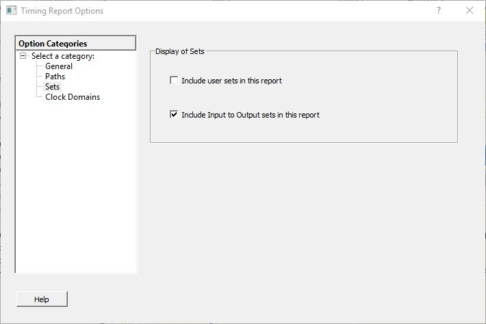

# Sets

The following figure shows the Timing Report Options—Sets dialog box.

-   **[Display of Sets](GUID-70EB3049-DC4F-47DA-8A05-F33D634534A0.md)**  

**Parent topic:**[Timing Report Options Dialog Box](GUID-29A2149F-C54F-4D59-B99E-CCC19A108FF0.md)

