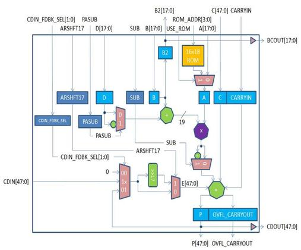

# MACC\_PA\_BC\_ROM

The MACC\_PA\_BC\_ROM macro extends the functionality of the MACC\_PA macro to provide a 16x18 ROM at the A input along with a pipelined output of B for cascading.

## Features

The additional features of the MACC\_PA\_BC\_ROM block are as follows:

-   Selection of the A input from a 16 x 18 ROM.
-   Additional pipelining of the B input for cascading to the next Math block or output to the fabric.
-   Due to routing bandwidth limitations, either result P or B2 output can be used in the same MACC\_PA\_BC\_ROM block.

The following table shows a simplified block diagram of the MACC\_PA\_BC\_ROM  block.

## Parameters

There is one parameter, INIT, to hold the 16x18 ROM content as a linear array. The first 18 bits is word 0, the next 18 bits is word 1, and so on.

|Parameter|Dimensions|Description|
|---------|----------|-----------|
|INIT|parameter \[287:0\] INIT = \{18'h0, 18'h0, 18'h0, 18'h0, 18'h0, 18'h0, 18'h0, 18'h0,18'h0, 18'h0, 18'h0, 18'h0, 18'h0, 18'h0, 18'h0, 18'h0\};|16 x 18 ROM content specified in Verilog|
|INIT|generic map\(INIT =&gt; \(B“00\_0000\_0000\_0000\_0000”&amp; B“00\_0000\_0000\_0000\_0000”&amp;B“00\_0000\_0000\_0000\_0000”&amp; B“00\_0000\_0000\_0000\_0000”&amp;B“00\_0000\_0000\_0000\_0000”&amp; B“00\_0000\_0000\_0000\_0000”&amp;B“00\_0000\_0000\_0000\_0000”&amp; B“00\_0000\_0000\_0000\_0000”&amp;B“00\_0000\_0000\_0000\_0000”&amp; B“00\_0000\_0000\_0000\_0000”&amp;B“00\_0000\_0000\_0000\_0000”&amp; B“00\_0000\_0000\_0000\_0000”&amp;B“00\_0000\_0000\_0000\_0000”&amp; B“00\_0000\_0000\_0000\_0000”&amp;B“00\_0000\_0000\_0000\_0000”&amp; B“00\_0000\_0000\_0000\_0000”\)\)|16 x 18 ROM content specified in VHDL|

PORT LIST

<table id="ID-00001072"><thead><tr id="ID-0000107E"><th id="ID-0000107F">

Port Name

</th><th id="ID-00001081">

Direction

</th><th id="ID-00001083">

Type

</th><th id="ID-00001085">

Polarity

</th><th id="ID-00001087">

Description

</th></tr></thead><tbody><tr id="ID-00001089"><td id="ID-0000108A">

DOTP

</td><td id="ID-0000108C">

Input

</td><td id="ID-0000108E">

Static

</td><td id="ID-00001090">

High

</td><td id="ID-00001092">

Dot-product mode.When DOTP = 1, MACC\_PA\_BC\_ROM block performs Dot-product of two pairs of 9-bit operands.• SIMD must not be 1.• C\[8:0\] must be connected to CARRYIN.

</td></tr><tr id="ID-00001097"><td id="ID-00001098">

SIMD

</td><td id="ID-0000109A">

Input

</td><td id="ID-0000109C">

Static

</td><td id="ID-0000109E">

High

</td><td id="ID-000010A0">

SIMD mode.When SIMD = 1, MACC\_PA\_BC\_ROM block performs dual independent multiplication of two pairs of 9-bit operands.-   DOTP must not be 1.
-   ARSHFT17 must be 0.
-   D\[8:0\] must be 0.
-   C\[17:0\] must be 0.

E\[17:0\] must be  0. Refer to [Table   2](GUID-6AC383CF-C29B-427B-A3B2-FD280645F8CC.md#ID-00000D3E) to see how

operand E is  obtained from P, CDIN or 0.

</td></tr><tr id="ID-000010AE"><td id="ID-000010AF">

OVFL\_CARRYOUT\_SEL

</td><td id="ID-000010B1">

Input

</td><td id="ID-000010B3">

Static

</td><td id="ID-000010B5">

High

</td><td id="ID-000010B7">

Generate OVERFLOW or CARRYOUT with result P.-   OVERFLOW when OVFL\_CARRYOUT\_SEL = 0
-   CARRYOUT when OVFL\_CARRYOUT\_SEL = 1

</td></tr><tr id="ID-000010C0"><td id="ID-000010C1">

CLK

</td><td id="ID-000010C3">

Input

</td><td id="ID-000010C5">

Dynamic

</td><td id="ID-000010C7">

Rising edge

</td><td id="ID-000010C9">

Clock for A, B, C, CARRYIN, D, P, OVFL\_CARRYOUT, ARSHFT17, CDIN\_FDBK\_SEL, PASUB and SUB registers.

</td></tr><tr id="ID-000010CB"><td id="ID-000010CC">

AL\_N

</td><td id="ID-000010CE">

Input

</td><td id="ID-000010D0">

Dynamic

</td><td id="ID-000010D2">

Low

</td><td id="ID-000010D4">

Asynchronous load for A, B, B2, P, OVFL\_CARRYOUT, ARSHFT17, CDIN\_FDBK\_SEL, PASUB and SUB registers. Connect to 1, if none are registered.When asserted, A, B, P and OVFL\_CARRYOUT registers are loaded with zero, while the ARSHFT17, CDIN\_FDBK\_SEL, PASUB and SUB registers are loaded with the complementary value of the respective \_AD\_N.

</td></tr><tr id="ID-000010DA"><td id="ID-000010DB">

USE\_ROM

</td><td id="ID-000010DD">

Input

</td><td id="ID-000010DF">

Static\(virtual\)

</td><td id="ID-000010E2">

High

</td><td id="ID-000010E4">

Selection for operand A.-   When USE\_ROM = 0, select input data A.
-   When USE\_ROM = 1, select ROM data at ROM\_ADDR.

</td></tr><tr id="ID-000010EA"><td id="ID-000010EB">

ROM\_ADDR\[3:0\]

</td><td id="ID-000010EE">

Input

</td><td id="ID-000010F0">

Dynamic

</td><td id="ID-000010F2">

High

</td><td id="ID-000010F4">

Address of ROM data for operand A whenUSE\_ROM = 1.

</td></tr><tr id="ID-000010F7"><td id="ID-000010F8">

A\[17:0\]

</td><td id="ID-000010FA">

Input

</td><td id="ID-000010FC">

Static

</td><td id="ID-000010FE">

High

</td><td id="ID-00001100">

Input data for operand A when USE\_ROM = 0.

</td></tr><tr id="ID-00001102"><td id="ID-00001103">

A\_BYPASS

</td><td id="ID-00001105">

Input

</td><td id="ID-00001107">

Dynamic

</td><td id="ID-00001109">

High

</td><td id="ID-0000110B">

Bypass data A registers. Connect to 1, if not  registered. See [Table   6](GUID-6AC383CF-C29B-427B-A3B2-FD280645F8CC.md#ID-00000F03).

</td></tr><tr id="ID-0000110E"><td id="ID-0000110F">

A\_SRST\_N

</td><td id="ID-00001111">

Input

</td><td id="ID-00001113">

Dynamic

</td><td id="ID-00001115">

Low

</td><td id="ID-00001117">

Synchronous reset for data A registers.  Connect to1, if not registered. See Table   6.

</td></tr><tr id="ID-0000111B"><td id="ID-0000111C">

A\_EN

</td><td id="ID-0000111E">

Input

</td><td id="ID-00001120">

Dynamic

</td><td id="ID-00001122">

High

</td><td id="ID-00001124">

Enable for data A registers. Connect to 1, if  not registered. See [Table   6](GUID-6AC383CF-C29B-427B-A3B2-FD280645F8CC.md#ID-00000F03).

</td></tr><tr id="ID-0000112A"><td id="ID-0000112B">

B\[17:0\]

</td><td id="ID-0000112E">

Input

</td><td id="ID-00001130">

Dynamic

</td><td id="ID-00001132">

High

</td><td id="ID-00001134">

Input data B to Pre-adder with data D.

</td></tr><tr id="ID-00001136"><td id="ID-00001137">

B\_BYPASS

</td><td id="ID-00001139">

Input

</td><td id="ID-0000113B">

Static

</td><td id="ID-0000113D">

High

</td><td id="ID-0000113F">

Bypass data B registers. Connect to 1, if not  registered. See [Table   6](GUID-6AC383CF-C29B-427B-A3B2-FD280645F8CC.md#ID-00000F03).

</td></tr><tr id="ID-00001142"><td id="ID-00001143">

B\_SRST\_N

</td><td id="ID-00001145">

Input

</td><td id="ID-00001147">

Dynamic

</td><td id="ID-00001149">

Low

</td><td id="ID-0000114B">

Synchronous reset for data B registers.  Connect to 1, if not registered. See [Table   6](GUID-6AC383CF-C29B-427B-A3B2-FD280645F8CC.md#ID-00000F03).

</td></tr><tr id="ID-0000114E"><td id="ID-0000114F">

B\_EN

</td><td id="ID-00001151">

Input

</td><td id="ID-00001153">

Dynamic

</td><td id="ID-00001155">

High

</td><td id="ID-00001157">

Enable for data B registers. Connect to 1, if  not registered. See [Table   6](GUID-6AC383CF-C29B-427B-A3B2-FD280645F8CC.md#ID-00000F03).

</td></tr><tr id="ID-0000115D"><td id="ID-0000115E">

B2\[17:0\]

</td><td id="ID-00001160">

Output

</td><td id="ID-00001162">

Dynamic

</td><td id="ID-00001164">

High

</td><td id="ID-00001166">

Pipelined output of input data B. Result P  must be floating when B2 is used.

</td></tr><tr id="ID-00001168"><td id="ID-00001169">

B2\_BYPASS

</td><td id="ID-0000116B">

Input

</td><td id="ID-0000116D">

Static

</td><td id="ID-0000116F">

High

</td><td id="ID-00001171">

Bypass data B2 registers. Connect to 1, if  not registered. See [Table   6](GUID-6AC383CF-C29B-427B-A3B2-FD280645F8CC.md#ID-00000F03)

</td></tr><tr id="ID-00001174"><td id="ID-00001175">

B2\_SRST\_N

</td><td id="ID-00001177">

Input

</td><td id="ID-00001179">

Dynamic

</td><td id="ID-0000117B">

Low

</td><td id="ID-0000117D">

Synchronous reset for data B2 registers.  Connect to 1, if not registered. See [Table   6](GUID-6AC383CF-C29B-427B-A3B2-FD280645F8CC.md#ID-00000F03).

</td></tr><tr id="ID-00001180"><td id="ID-00001181">

B2\_EN

</td><td id="ID-00001183">

Input

</td><td id="ID-00001185">

Dynamic

</td><td id="ID-00001187">

High

</td><td id="ID-00001189">

Enable for data B2 registers. Connect to 1,  if not registered. See [Table   6](GUID-6AC383CF-C29B-427B-A3B2-FD280645F8CC.md#ID-00000F03).

</td></tr><tr id="ID-0000118F"><td id="ID-00001190">

BCOUT\[17:0\]

</td><td id="ID-00001192">

Output

</td><td id="ID-00001194">

Cascade

</td><td id="ID-00001196">

High

</td><td id="ID-00001198">

Cascade output of B2. Value of BCOUT is the same as B2. The entire bus must either be dangling or drive an entire B input of another MACC\_PA or MACC\_PA\_BC\_ROM block.

</td></tr><tr id="ID-0000119D"><td id="ID-0000119E">

D\[17:0\]

</td><td id="ID-000011A0">

Input

</td><td id="ID-000011A2">

Dynamic

</td><td id="ID-000011A4">

High

</td><td id="ID-000011A6">

Input data D to Pre-adder with data B. When SIMD = 1, connect D\[8:0\] to 0.

</td></tr><tr id="ID-000011A8"><td id="ID-000011A9">

D\_BYPASS

</td><td id="ID-000011AB">

Input

</td><td id="ID-000011AD">

Static

</td><td id="ID-000011AF">

High

</td><td id="ID-000011B1">

Bypass data D registers. Connect to 1, if not  registered. See [Table   7](GUID-6AC383CF-C29B-427B-A3B2-FD280645F8CC.md#ID-00000F98).

</td></tr><tr id="ID-000011B4"><td id="ID-000011B5">

D\_ARST\_N

</td><td id="ID-000011B7">

Input

</td><td id="ID-000011B9">

Dynamic

</td><td id="ID-000011BB">

Low

</td><td id="ID-000011BD">

Asynchronous reset for data D registers.  Connect to 1, if not registered. See [Table   7](GUID-6AC383CF-C29B-427B-A3B2-FD280645F8CC.md#ID-00000F98).

</td></tr><tr id="ID-000011C0"><td id="ID-000011C1">

D\_SRST\_N

</td><td id="ID-000011C3">

Input

</td><td id="ID-000011C5">

Dynamic

</td><td id="ID-000011C7">

Low

</td><td id="ID-000011C9">

Synchronous reset for data D registers.  Connect to 1, if not registered. See [Table   7](GUID-6AC383CF-C29B-427B-A3B2-FD280645F8CC.md#ID-00000F98).

</td></tr><tr id="ID-000011CD"><td id="ID-000011CE">

D\_EN

</td><td id="ID-000011D0">

Input

</td><td id="ID-000011D2">

Dynamic

</td><td id="ID-000011D4">

High

</td><td id="ID-000011D6">

Enable for data D registers. Connect to 1, if  not registered. See [Table   7](GUID-6AC383CF-C29B-427B-A3B2-FD280645F8CC.md#ID-00000F98).

</td></tr><tr id="ID-000011DD"><td id="ID-000011DE">

CARRYIN

</td><td id="ID-000011E0">

Input

</td><td id="ID-000011E2">

Dynamic

</td><td id="ID-000011E4">

High

</td><td id="ID-000011E6">

CARRYIN for input data C.

</td></tr><tr id="ID-000011EB"><td id="ID-000011EC">

C\[47:0\]

</td><td id="ID-000011EE">

Input

</td><td id="ID-000011F0">

Dynamic

</td><td id="ID-000011F2">

High

</td><td id="ID-000011F4">

Input data C.When DOTP = 1, connect C\[8:0\] to CARRYIN. When SIMD = 1, connect C\[8:0\] to 0.

</td></tr><tr id="ID-000011F7"><td id="ID-000011F8">

C\_BYPASS

</td><td id="ID-000011FA">

Input

</td><td id="ID-000011FC">

Static

</td><td id="ID-000011FE">

High

</td><td id="ID-00001200">

Bypass CARRYIN and C registers. Connect to 1,  if not registered. See [Table   7](GUID-6AC383CF-C29B-427B-A3B2-FD280645F8CC.md#ID-00000F98).

</td></tr><tr id="ID-00001203"><td id="ID-00001204">

C\_ARST\_N

</td><td id="ID-00001206">

Input

</td><td id="ID-00001208">

Dynamic

</td><td id="ID-0000120A">

Low

</td><td id="ID-0000120C">

Asynchronous reset for CARRYIN and C  registers. Connect to 1, if not registered. See [Table   7](GUID-6AC383CF-C29B-427B-A3B2-FD280645F8CC.md#ID-00000F98).

</td></tr><tr id="ID-0000120F"><td id="ID-00001210">

C\_SRST\_N

</td><td id="ID-00001212">

Input

</td><td id="ID-00001214">

Dynamic

</td><td id="ID-00001216">

Low

</td><td id="ID-00001218">

Synchronous reset for CARRYIN and C  registers. Connect to 1, if not registered. See [Table   7](GUID-6AC383CF-C29B-427B-A3B2-FD280645F8CC.md#ID-00000F98).

</td></tr><tr id="ID-0000121B"><td id="ID-0000121C">

C\_EN

</td><td id="ID-0000121E">

Input

</td><td id="ID-00001220">

Dynamic

</td><td id="ID-00001222">

High

</td><td id="ID-00001224">

Enable for CARRYIN and C registers. Connect  to 1, if not registered. See [Table   7](GUID-6AC383CF-C29B-427B-A3B2-FD280645F8CC.md#ID-00000F98).

</td></tr><tr id="ID-0000122A"><td id="ID-0000122B">

CDIN\[47:0\]

</td><td id="ID-00001230">

Input

</td><td id="ID-00001232">

Cascade

</td><td id="ID-00001234">

High

</td><td id="ID-00001236">

Cascaded input for operand E.The entire bus must be driven by an entireCDOUT of another MACC\_PA or MAC\_PA\_BC\_ROMblock. In Dot-product mode, the driving CDOUTmust also be generated by a MACC\_PA orMAC\_PA\_BC\_ROM block in Dot-product mode.Refer to Table   2 to see how CDIN is propagated to operand E.

</td></tr><tr id="ID-00001242"><td id="ID-00001243">

P\[47:0\]

</td><td id="ID-00001245">

Output

</td><td id="ID-00001247">

 

</td><td id="ID-00001249">

High

</td><td id="ID-0000124B">

Result data. See [Table   3](GUID-6AC383CF-C29B-427B-A3B2-FD280645F8CC.md#ID-00000D7F). B2 output must be floating when P is used.

</td></tr><tr id="ID-0000124F"><td id="ID-00001250">

OVFL\_CARRYOUT

</td><td id="ID-00001252">

Output

</td><td id="ID-00001254">

 

</td><td id="ID-00001256">

High

</td><td id="ID-00001258">

OVERFLOW or CARRYOUT. See [Table   4](GUID-6AC383CF-C29B-427B-A3B2-FD280645F8CC.md#ID-00000E25).

</td></tr><tr id="ID-0000125B"><td id="ID-0000125C">

P\_BYPASS

</td><td id="ID-0000125E">

Input

</td><td id="ID-00001260">

Static

</td><td id="ID-00001262">

High

</td><td id="ID-00001264">

Bypass P and OVFL\_CARRYOUT registers. Connect  to 1, if not registered. See [Table   6](GUID-6AC383CF-C29B-427B-A3B2-FD280645F8CC.md#ID-00000F03). P\_BYPASS must be 0 when  CDIN\_FDBK\_SEL\[0\] = 1. See Table   2.

</td></tr><tr id="ID-0000126A"><td id="ID-0000126B">

P\_SRST\_N

</td><td id="ID-0000126D">

Input

</td><td id="ID-0000126F">

Dynamic

</td><td id="ID-00001271">

Low

</td><td id="ID-00001273">

Synchronous reset for P and OVFL\_CARRYOUT  registers. Connect to 1, if not registered. See [Table   6](GUID-6AC383CF-C29B-427B-A3B2-FD280645F8CC.md#ID-00000F03).

</td></tr><tr id="ID-00001276"><td id="ID-00001277">

P\_EN

</td><td id="ID-00001279">

Input

</td><td id="ID-0000127B">

Dynamic

</td><td id="ID-0000127D">

High

</td><td id="ID-0000127F">

Enable for P and OVFL\_CARRYOUT registers.  Connect to 1, if not registered. See [Table   6](GUID-6AC383CF-C29B-427B-A3B2-FD280645F8CC.md#ID-00000F03).

</td></tr><tr id="ID-00001285"><td id="ID-00001286">

CDOUT\[47:0\]

</td><td id="ID-00001288">

Output

</td><td id="ID-0000128A">

Cascade

</td><td id="ID-0000128C">

High

</td><td id="ID-0000128E">

Cascade output of result P. See [Table   3](GUID-6AC383CF-C29B-427B-A3B2-FD280645F8CC.md#ID-00000D7F).Value of CDOUT is the same as P. The  entire busmust either be dangling or drive an entire  CDIN ofanother MACC\_PA or MAC\_PA\_BC\_ROM block  incascaded mode.

</td></tr><tr id="ID-00001297"><td id="ID-00001298">

PASUB

</td><td id="ID-0000129A">

Input

</td><td id="ID-0000129C">

Dynamic

</td><td id="ID-0000129E">

High

</td><td id="ID-000012A0">

Subtract operation for Pre-adder of B and D.

</td></tr><tr id="ID-000012A2"><td id="ID-000012A3">

PASUB\_BYPASS

</td><td id="ID-000012A5">

Input

</td><td id="ID-000012A7">

Static

</td><td id="ID-000012A9">

High

</td><td id="ID-000012AB">

Bypass PASUB register. Connect to 1, if not  registered. See [Table   5](GUID-6AC383CF-C29B-427B-A3B2-FD280645F8CC.md#ID-00000E48).

</td></tr><tr id="ID-000012AF"><td id="ID-000012B0">

PASUB\_AD\_N

</td><td id="ID-000012B2">

Input

</td><td id="ID-000012B4">

Static

</td><td id="ID-000012B6">

Low

</td><td id="ID-000012B8">

Asynchronous load data for PASUB register.  See [Table   5](GUID-6AC383CF-C29B-427B-A3B2-FD280645F8CC.md#ID-00000E48).

</td></tr><tr id="ID-000012BC"><td id="ID-000012BD">

PASUB\_SL\_N

</td><td id="ID-000012BF">

Input

</td><td id="ID-000012C1">

Dynamic

</td><td id="ID-000012C3">

Low

</td><td id="ID-000012C5">

Synchronous load for PASUB register. Connect  to1, if not registered. See Table   5.

</td></tr><tr id="ID-000012CA"><td id="ID-000012CB">

PASUB\_SD\_N

</td><td id="ID-000012CD">

Input

</td><td id="ID-000012CF">

Static

</td><td id="ID-000012D1">

Low

</td><td id="ID-000012D3">

Synchronous load data for PASUB register.  SeeTable   5.

</td></tr><tr id="ID-000012D7"><td id="ID-000012D8">

PASUB\_EN

</td><td id="ID-000012DA">

Input

</td><td id="ID-000012DC">

Dynamic

</td><td id="ID-000012DE">

High

</td><td id="ID-000012E0">

Enable for PASUB register. Connect to 1, if  not registered. See [Table   5](GUID-6AC383CF-C29B-427B-A3B2-FD280645F8CC.md#ID-00000E48).

</td></tr><tr id="ID-000012E6"><td id="ID-000012E7">

CDIN\_FDBK\_SEL\[1:0\]

</td><td id="ID-000012EC">

Input

</td><td id="ID-000012EE">

Dynamic

</td><td id="ID-000012F0">

High

</td><td id="ID-000012F2">

Select CDIN, P or 0 for operand E. See [Table   2](GUID-6AC383CF-C29B-427B-A3B2-FD280645F8CC.md#ID-00000D3E).

</td></tr><tr id="ID-000012F5"><td id="ID-000012F6">

CDIN\_FDBK\_SEL\_BYPASS

</td><td id="ID-000012F8">

Input

</td><td id="ID-000012FA">

Static

</td><td id="ID-000012FC">

High

</td><td id="ID-000012FE">

Select CDIN, P or 0 for operand E. See [Table   2](GUID-6AC383CF-C29B-427B-A3B2-FD280645F8CC.md#ID-00000D3E).

</td></tr><tr id="ID-00001301"><td id="ID-00001302">

CDIN\_FDBK\_SEL\_AD\_N\[1:0\]

</td><td id="ID-00001305">

Input

</td><td id="ID-00001307">

Static

</td><td id="ID-00001309">

Low

</td><td id="ID-0000130B">

Asynchronous load data for CDIN\_FDBK\_SELregister. See Table   5.

</td></tr><tr id="ID-0000130F"><td id="ID-00001310">

CDIN\_FDBK\_SEL\_SL\_N

</td><td id="ID-00001312">

Input

</td><td id="ID-00001314">

Dynamic

</td><td id="ID-00001316">

Low

</td><td id="ID-00001318">

Synchronous load for CDIN\_FDBK\_SEL register.  Connect to 1, if not registered. See [Table   5](GUID-6AC383CF-C29B-427B-A3B2-FD280645F8CC.md#ID-00000E48).

</td></tr><tr id="ID-0000131B"><td id="ID-0000131C">

CDIN\_FDBK\_SEL\_SD\_N\[1:0\]

</td><td id="ID-0000131F">

Input

</td><td id="ID-00001321">

Static

</td><td id="ID-00001323">

Low

</td><td id="ID-00001325">

Synchronous load data for CDIN\_FDBK\_SELregister. See Table   5.

</td></tr><tr id="ID-00001329"><td id="ID-0000132A">

CDIN\_FDBK\_SEL\_EN

</td><td id="ID-0000132C">

Input

</td><td id="ID-0000132E">

Dynamic

</td><td id="ID-00001330">

High

</td><td id="ID-00001332">

Enable for CDIN\_FDBK\_SEL register. Connect to  1, if not registered. See [Table   5](GUID-6AC383CF-C29B-427B-A3B2-FD280645F8CC.md#ID-00000E48).

</td></tr><tr id="ID-00001338"><td id="ID-00001339">

ARSHFT17

</td><td id="ID-0000133B">

Input

</td><td id="ID-0000133D">

Dynamic

</td><td id="ID-0000133F">

High

</td><td id="ID-00001341">

Arithmetic right-shift for operand E.When asserted, a 17-bit arithmetic right-shift isperformed on operand E. Refer to Table   2 to see how operand E is obtained from P, CDIN or 0. When  SIMD = 1, ARSHFT17 must be 0.

</td></tr><tr id="ID-00001346"><td id="ID-00001347">

ARSHFT17\_BYPASS

</td><td id="ID-00001349">

Input

</td><td id="ID-0000134B">

Static

</td><td id="ID-0000134D">

High

</td><td id="ID-0000134F">

Bypass ARSHFT17 register. Connect to 1, if  not registered. See [Table   5](GUID-6AC383CF-C29B-427B-A3B2-FD280645F8CC.md#ID-00000E48).

</td></tr><tr id="ID-00001352"><td id="ID-00001353">

ARSHFT17\_AD\_N

</td><td id="ID-00001355">

Input

</td><td id="ID-00001357">

Static

</td><td id="ID-00001359">

Low

</td><td id="ID-0000135B">

Asynchronous load data for ARSHFT17 register.  See [Table   5](GUID-6AC383CF-C29B-427B-A3B2-FD280645F8CC.md#ID-00000E48).

</td></tr><tr id="ID-0000135E"><td id="ID-0000135F">

ARSHFT17\_SL\_N

</td><td id="ID-00001361">

Input

</td><td id="ID-00001363">

Dynamic

</td><td id="ID-00001365">

Low

</td><td id="ID-00001367">

Synchronous load for ARSHFT17 register.  Connect to 1, if not registered. See [Table   5](GUID-6AC383CF-C29B-427B-A3B2-FD280645F8CC.md#ID-00000E48).

</td></tr><tr id="ID-0000136A"><td id="ID-0000136B">

ARSHFT17\_SD\_N

</td><td id="ID-0000136D">

Input

</td><td id="ID-0000136F">

Static

</td><td id="ID-00001371">

Low

</td><td id="ID-00001373">

Synchronous load data for ARSHFT17 register.  See [Table   5](GUID-6AC383CF-C29B-427B-A3B2-FD280645F8CC.md#ID-00000E48).

</td></tr><tr id="ID-00001376"><td id="ID-00001377">

ARSHFT17\_EN

</td><td id="ID-00001379">

Input

</td><td id="ID-0000137B">

Dynamic

</td><td id="ID-0000137D">

High

</td><td id="ID-0000137F">

Enable for ARSHFT17 register. Connect to 1,  if not registered. See [Table   5](GUID-6AC383CF-C29B-427B-A3B2-FD280645F8CC.md#ID-00000E48).

</td></tr><tr id="ID-00001385"><td id="ID-00001386">

SUB

</td><td id="ID-00001388">

Input

</td><td id="ID-0000138A">

Dynamic

</td><td id="ID-0000138C">

High

</td><td id="ID-0000138E">

Subtract operation.

</td></tr><tr id="ID-00001390"><td id="ID-00001391">

SUB\_BYPASS

</td><td id="ID-00001393">

Input

</td><td id="ID-00001395">

Static

</td><td id="ID-00001397">

High

</td><td id="ID-00001399">

Bypass SUB register. Connect to 1, if not  registered. See [Table   5](GUID-6AC383CF-C29B-427B-A3B2-FD280645F8CC.md#ID-00000E48).

</td></tr><tr id="ID-0000139C"><td id="ID-0000139D">

SUB\_AD\_N

</td><td id="ID-0000139F">

Input

</td><td id="ID-000013A1">

Static

</td><td id="ID-000013A3">

Low

</td><td id="ID-000013A5">

Asynchronous load data for SUB register. See  [Table   5](GUID-6AC383CF-C29B-427B-A3B2-FD280645F8CC.md#ID-00000E48).

</td></tr><tr id="ID-000013A9"><td id="ID-000013AA">

SUB\_SL\_N

</td><td id="ID-000013AC">

Input

</td><td id="ID-000013AE">

Dynamic

</td><td id="ID-000013B0">

Low

</td><td id="ID-000013B2">

Synchronous load for SUB register. Connect to  1, if not registered. [Table   5](GUID-6AC383CF-C29B-427B-A3B2-FD280645F8CC.md#ID-00000E48).

</td></tr><tr id="ID-000013B5"><td id="ID-000013B6">

SUB\_SD\_N

</td><td id="ID-000013B8">

Input

</td><td id="ID-000013BA">

Static

</td><td id="ID-000013BC">

Low

</td><td id="ID-000013BE">

Synchronous load data for SUB register. See  [Table   5](GUID-6AC383CF-C29B-427B-A3B2-FD280645F8CC.md#ID-00000E48).

</td></tr><tr id="ID-000013C2"><td id="ID-000013C3">

SUB\_EN

</td><td id="ID-000013C5">

Input

</td><td id="ID-000013C7">

Dynamic

</td><td id="ID-000013C9">

High

</td><td id="ID-000013CB">

Enable for SUB register. Connect to 1, if not  registered. See [Table   5](GUID-6AC383CF-C29B-427B-A3B2-FD280645F8CC.md#ID-00000E48).

</td></tr></tbody>
</table>**Tip:** Static inputs are defined at design time and need to be tied to 0 or 1.

