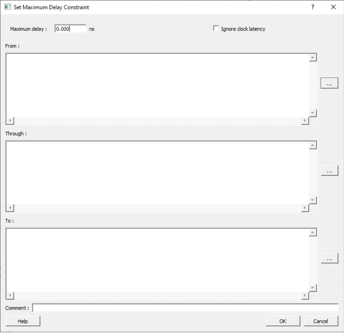
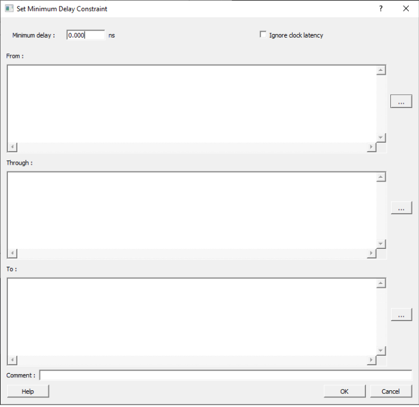
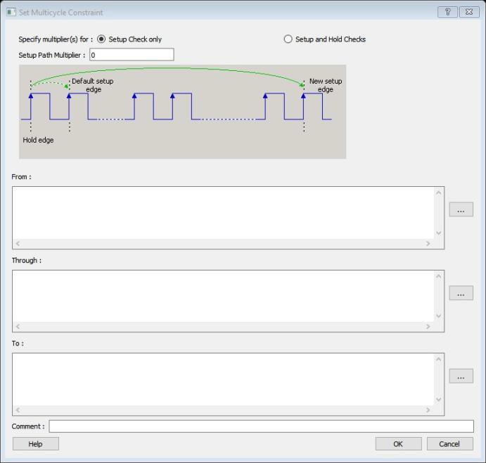

# Timing Exceptions

Use timing exceptions to overwrite the default behavior of the design path. Timing exceptions  includes the following:

-   Setting multicycle constraint to specify paths that \(by design\) take more than one cycle.
-   Setting a false path constraint to identify paths that must not be included in the timing analysis or the optimization flow.
-   Setting a maximum/minimum delay constraint on specific paths to relax or to tighten the original clock constraint requirement.

## Set a Maximum Delay Constraint

Set the options in the **Maximum Delay Constraint** dialog box to relax or to  tighten the original clock constraint requirement on specific paths.

The **Timing Constraints Editor** automatically derives the individual maximum  delay targets from clock waveforms, and port input or output delays. So the maximum delay  constraint is a timing exception. This constraint overrides the default single cycle timing  relationship for one or more timing paths. This constraint also overrides a multiple cycle  path constraint.

**Important:** When the same timing path has more than one timing exception constraint, the **Timing Constraints Editor** honors the timing constraint with the highest precedence and ignores the other timing exceptions, according to the order of precedence listed in the following table.

|Timing Exception Constraints|Order of Precedence|
|----------------------------|-------------------|
|`set_disable_timing`|1|
|`set_false_path`|2|
|`set_maximum_delay/set_minimum_delay`|3|
|`set_multicycle_path`|4|

**Important:** The `set_maximum_delay_constraint` has a higher precedence over `set_multicycle_path` constraint and therefore, the former overrides the latter when both constraints are set on the same timing path.

To set a Maximum Delay Constraint, open the **Set Maximum Delay Constraint** dialog box in one of the following four ways:

-   In the **Constraints Browser**, double-click **Max Delay**.
-   Click the **Add Max Delay Constraint** icon.
-   From the **Constraints** menu, click **Max Delay**.
-   In the **Max Delay Constraints** table, right-click any row and choose **Add Maximum Delay Constraint**. The **Set Maximum Delay Constraint** dialog box appears.

The following table lists and describes the **Set Maximum Delay Constraint**  dialog box options.

<table id="TABLE_Q2R_ZFL_5NB"><thead><tr><th>

Option

</th><th>

Description

</th></tr></thead><tbody><tr><td>

Maximum delay

</td><td>

Specifies a floating point number in nanoseconds that represents the required maximum delay value for specified paths.-   If the path starting point is on a sequential device, the **Timing Constraints Editor** includes clock skew in the computed delay.
-   If the path starting point has an input delay specified, the **Timing Constraints Editor** adds that delay value to the path delay.
-   If the path ending point is on a sequential device, the **Timing Constraints Editor** includes clock skew and library setup time in the computed delay.
-   If the ending point has an output delay specified, the **Timing Constraints Editor**adds that delay to the path delay.

</td></tr><tr><td>

Ignore clock latency

</td><td>

Specifies that the calculation of slack for the specified path excludes clock skew and jitter,  and only the data path is considered. This option is useful for analyzing the paths  between the sequential elements, driven by asynchronous clocks. This option is not  supported by the Synplify Pro Synthesis software; in Libero flows, this option is skipped for Synplify Pro Synthesis  software.

</td></tr><tr><td>

Source/From Pins

</td><td>

Specifies the starting points for max delay constraint path. A valid timing starting point is  a clock, a primary input, an inout port, or a clock pin of a sequential cell.To  specify the Source pins\(s\), click Browse, next to  From, to open the Select Source Pins for Max  Delay Constraint dialog box.The following options are available  on the Select Source Pins for Max Delay Constraint dialog  box:Type:  Displays the type of the available pins in the design. The type options for  source pins are listed as follows:Clock PinsInput PortsAll Register Clock  PinsPattern:  The default is \*, which is a wild-card match for all. You can specify any string  value. Click Search to filter the available pins based on  the specified pin type and pattern.Available  Pins: The list displays the available pins or ports. If you change  the pattern value, the list shows the available pins or ports based on the  filter.To add the pins from the Available Pins list  to the Assigned Pins list, click Add  or Add All. To remove the pins from the  Assigned Pins list, click  Remove or Remove All.Assigned  Pins: Displays pins selected from the Available  Pins list. To add the source pins to the constraint, in this list,  click the pins and click OK.

</td></tr><tr><td>

Through Pins

</td><td>

Specifies the through pins in the specified path for the Maximum Delay constraint.To  specify the Through pin\(s\), click Browse, next to  Through textbox, to open the Select Through Pins  for Max Delay Constraint dialog box.The following options are  available on the Select Through Pins for Max Delay Constraint  dialog box:Type:  Displays the type of the available pins in the design. The  Type options for source pins are listed as follows:All PortsAll PinsAll NetsAll InstancesPattern:  The default is \*, which is a wild-card match for all. You can specify any string  value. Click Search to filter the available pins based on  the specified pin type and pattern.Available  Pins: The list displays the available pins, ports, nets, or  instances. If you change the pattern value, the list box shows the available  pins, ports, nets, or instances based on the filter.To add the pins from the  Available Pins list to the Assigned Pins  list, click Add or Add  All. To remove the pins from the Assigned Pins  list, click Remove or Remove  All.Assigned  Pins: Displays pins selected from the Available  Pins list. To add the through pins to the constraint, in this  list, click the Pins and then click OK.

</td></tr><tr><td>

Destination/To Pins

</td><td>

Specifies the ending points for maximum delay constraint. A valid timing ending point is a  clock, a primary output, an inout port, or a data pin of a sequential cell.To  specify the destination pin\(s\), click Browse, next to the  To box, to open the Select Destination Pins for  Max Delay Constraint dialog box.The following options are  available on the Select Destination Pins for Max Delay  Constraint dialog box:Type:  Displays the type of the available pins in the design. The  Type options for source pins are listed as follows:Clock PinsOutput PortsAll Register Data PinsPattern:  The default is \*, which is a wild-card match for all. You can specify any string  value. Click Search to filter the available pins based on  the specified pin type and pattern.Available  Pins: The list box displays the available pins or ports. If you  change the pattern value, the list box shows the available pins or ports based  on the filter.To add the pins from the Available Pins  list to the Assigned Pins list, click  Add or Add All. To remove the  pins from the Assigned Pins list, click  Remove or Remove All.Assigned  Pins: Displays pins selected from the Available  Pins list. To add the destination pins to the constraint, click  pins from this list and then click OK.

</td></tr><tr><td>

Comment

</td><td>

Enter a one-line comment for the constraint.

</td></tr></tbody>
</table>## Set a Minimum Delay Constraint

Set the options in the **Minimum Delay Constraint** dialog box to relax or to  tighten the original clock constraint requirement on specific paths.

The **Timing Constraints Editor** automatically derives the individual minimum  delay targets from clock waveforms and port input or output delays. So the minimum delay  constraint is a timing exception. This constraint overrides the default single cycle  timing relationship for one or more timing paths. This constraint also overrides a  multiple cycle path constraint.

**Important:** When the same timing path has more than one timing exception constraint, the **Timing Constraints Editor** honors the timing constraint with the highest precedence and ignores the other timing exceptions, according to the order of precedence listed in the following table.

|Timing Exception Constraints|Order of Precedence|
|----------------------------|-------------------|
|`set_disable_timing`|1|
|`set_false_path`|2|
|`set_maximum_delay`/`set_minimum_delay`|3|
|`set_multicycle_path`|4|

**Note:** : The `set_minimum_delay_constraint` has a higher precedence over `set_multicycle_path` constraint and therefore the former overrides the latter when both constraints are set on the same timing path.

To set a Minimum Delay Constraint, open the **Set Minimum Delay Constraint**  dialog box in one of the following four ways:

-   In the Constraints Browser, click **Min Delay**.
-   Click the **Add Min Delay Constraint**  icon.
-   From the **Constraints** menu, click **Min Delay**.
-   Right-click any row of **Min Delay Constraints Table** and then click **Add Minimum Delay Constraint**. The **Set Minimum Delay Constraint** dialog box appears.

The following table describes the **Set Minimum Delay Constraint**  dialog box options.

<table id="TABLE_ALJ_RCM_5NB"><thead><tr><th>

Option

</th><th>

Description

</th></tr></thead><tbody><tr><td>

Minimum delay

</td><td>

Specifies a floating point number in nanoseconds that represents the  required minimum delay value for specified paths.-   If the path starting point is on a sequential device, the **Timing Constraints Editor**includes clock skew in the computed delay.
-   If the path starting point has an input delay specified, the **Timing Constraints Editor** adds that delay value to the path delay.
-   If the path ending point is on a sequential device, the **Timing Constraints Editor** includes clock skew and library setup time in the computed delay.
-   If the ending point has an output delay specified, the **Timing Constraints Editor** adds that delay to the path delay.

</td></tr><tr><td>

Ignore clock latency

</td><td>

  Specifies that the calculation of slack for the specified path  excludes clock skew and jitter, and only the data path is  considered. This option is useful for analyzing the paths between  the sequential elements driven by asynchronous clocks. This option is not supported by the Synplify Pro Synthesis software; in Libero flows, this option is skipped for Synplify Pro Synthesis software. 

</td></tr><tr><td>

Source Pins/From

</td><td>

  Specifies the starting point for minimum delay constraint. A valid  timing starting point is a clock, a primary input, an input port, or  a clock pin of a sequential cell.  To specify the source pins\(s\), click Browse,  next to the From box, to open the  Select Source Pins for Minimum Delay Constraint  dialog box.  The following options are available on the Select Source  Pins for Minimum Delay Constraint dialog box:Type: Displays the type of the  available pins in the design. The  Type options for source pins  are:Clock  PinsInput  PortsAll  Register Clock PinsPattern: The default is \*, which  is a wild-card match for all. You can specify any string  value. Click Search to filter the  available pins based on the specified pin type and  pattern.Available Pins: The list box  displays the available pins or ports. If you change the  pattern value, the list box shows the available pins or  ports based on the filter.To add the pins from the  Available Pins list to the  Assigned Pins list, click  Add or Add  All. To remove the pins from the  Assigned Pins list, click  Remove or Remove  All.Assigned Pins: Displays pins  selected from the Available Pins  list. To add the source pins to the constraint, click pins  from this list and then click  OK. 

</td></tr><tr><td>

Through Pins

</td><td>

  Specifies the through points for the Minimum Delay constraint.  To specify the Through pin\(s\), click Browse,  next to the Through box, to open the  Select the Through Pins for Min Delay  dialog box.  The following options are available on the Select the  Through Pins for Min Delay dialog box:Type: Displays the type of the  available pins in the design. The type options for source  pins are:All  PortsAll  PinsAll  NetsAll  InstancesPattern: The default is \*, which  is a wild-card match for all. You can specify any string  value. Click Search to filter the  available pins based on the specified pin type and  pattern.Available Pins: The list box  displays the available pins, ports, nets, or instances. If  you change the pattern value, the list box shows the  available pins, ports, nets, or instances based on the  filter.To add the pins from the Available  Pins list to the Assigned  Pins list, click Add  or Add All. To remove  the pins from the Assigned Pins  list, click Remove or  Remove All.Assigned Pins: Displays pins  selected from the Available Pins list. To add the through  pins to the constraint, click the pins from this list and  then click OK. 

</td></tr><tr><td>

Destination/To Pins

</td><td>

  Specifies the ending points for minimum delay constraint. A valid  timing ending point is a clock, a primary output, or a data pin of a  sequential cell.  To specify the Destination pin\(s\), click  Browse, next to the  To box, to open the Select the  Destination Pins for Min Delay Constraint dialog  box.  The following options are available on the Select the  Destination Pins for Min Delay Constraint dialog  box:Type: Displays the type of the  available pins in the design. The  Type options for source pins  are:Clock  PinsOutput PortsAll  Register Data PinsPattern: The default is \*, which  is a wild-card match for all. You can specify any string  value. Click Search to filter the  available pins based on the specified pin type and  pattern.Available Pins: The list box  displays the available pins or ports. If you change the  pattern value, the list shows the available pins or ports  based on the filter.To add the pins from the  Available Pins list to the  Assigned Pins list, click  Add or Add  All. To remove the pins from the  Assigned Pins list, click  Remove or Remove  All.Assigned Pins: Displays pins  selected from the Available Pins  list. To add the destination pins to the constraint, click  the pins from this list and then click  OK. 

</td></tr><tr><td>

Comment

</td><td>

Enter a one-line comment for the Constraint.

</td></tr></tbody>
</table>## Set a Multicycle Path

Use this constraint to identify paths in the design that take multiple clock  cycles.

You can set multicycle path constraints in an SDC file, which you can either create  yourself or generate with Synthesis tools, and at the same time you can import the  netlist.

You can use one or more of the following to set the multicycle paths constraints:

-   [set\_multicycle\_path](GUID-652A2AE7-5995-4C36-A9DF-FDCA8CE0B5C3.md)
-   [Specifying a Multicycle Constraint](GUID-4C415143-F59B-459D-8E51-39E527599130.md#)

### Families Supported

The following table lists the families which support this constraint and the file  formats and tools which you can use to enter or modify it:

|Families|SDC|Constraints Editor|
|--------|---|------------------|
|PolarFire®|X|X|
|RTG4™|X|X|
|IGLOO® 2|X|X|
|SmartFusion® 2|X|X|

## Set a Multicycle Constraint

Set the options in the **Set Multicycle Constraint** dialog box to specify  paths that take multiple clock cycles in the current design.

Setting the multiple-cycle path constraint overrides the single-cycle timing relationships  \(default\)  between sequential elements by specifying the number of cycles \(two or more\) that the  data path must have for setup or hold checks.

**Note:** The false path information always takes precedence over multiple cycle path information. A specific maximum delay constraint overrides a general multiple cycle path constraint.

To set a multicycle constraint, open the **Set Multicycle Constraint** dialog  box in one of the following four ways:

-   In the **Constraints Browser**, double-click **Multicycle**.
-   Click the **Add Multicycle Constraint**  icon.
-   From the **Constraints** menu, click **Multicycle**.
-   Right-click any row of **Multicycle Constraints Table** and click **Add Multicycle Path Constraint**. The **Set Multicycle Constraint** dialog box appears.

The following table describes the **Set Multicycle Constraint** dialog  box options.

|Option|Description|
|------|-----------|
|Setup Check Only|Select this check box to apply multiple clock cycle timing  consideration for setup check only.|
|Setup and Hold Checks|Select this check box to apply multiple clock cycle timing  consideration for both setup and hold checks.|
|Hold Path Multiplier|Specifies an integer value that represents the number by which the  edge will move towards the left, or the edge number, where the check  will be performed.|
|Setup Path Multiplier|Specifies an integer value that represents the number of clock cycles  \(more than one\) the data path must have for a setup check.|
|Source Pins/From|  Specifies the starting points for the multiple cycle path. A valid  starting point is a clock, a primary input, an inout port, or the  clock pin of a sequential cell.  To specify the source pins\(s\), click Browse  next to the From box to open the  Multicycle Constraint dialog box.  The following options are available on the Multicycle  Constraint dialog box:Type: Displays the type of the  available pins in the design. The type options for source  pins are:Clock  PinsInput  PortsAll  Register Clock PinsPattern: The default is \*,  which is a wild-card match for all. You can specify any  string value. Click Search to  filter the available pins based on the specified pin  type and pattern.Available Pins:The list box  displays the available  pins  or ports. If you change the pattern  value, the list box shows the available pins  or  ports based on the filter.To  add the pins from the Available Pins  list to the Assigned Pins  list, click Add or  Add All. To remove the pins  from the Assigned Pins list,  click Remove or Remove  All.Assigned Pins:Displays pins  selected in the Available Pins  list. To add the source pins to the constraint, click  pins in this list and click  OK. |
|Through Pins|  Specifies the through points for the multiple cycle path.  To specify the through pin\(s\), click Browse  next to the Through box to open the  Select Through Pins for Multicycle  Constraint dialog box.  The following options are available on the Select Through  Pins for Multicycle Constraint dialog box:Type: Displays the type of the  available pins in the design. The type options for source  pins are:All  PortsAll  PinsAll  NetsAll  InstancesPattern: The default is \*,  which is a wild-card match for all. You can specify any  string value. Click Search to  filter the available pins based on the specified pin  type and pattern.Available Pins:The list box  displays the available  pins,  ports, nets. or instances. If you  change the pattern value, the list box shows the  available  pins,  ports, nets, or instances based on the  filter.To add the pins from the  Available Pins list to the  Assigned Pins list, click  Add or Add  All. To remove the pins from the  Assigned Pins list, click  Remove or Remove  All.Assigned Pins:Displays pins  selected from the Available Pins list. To add the  through pins to the constraint, click the pins from this  list and click OK. |
|Destination/To Pins|  Specifies the ending points for multiple cycle path.  To specify the destination pin\(s\), click  Browse next to the  To box to open the Select  Destination Pins dialog box.  The following options are available on the Select  Destination Pins dialog box:Type: Displays the type of the  available pins in the design. The type options for source  pins are:Clock  PinsOutput PortsAll  Register Data PinsPattern: The default is \*,  which is a wild-card match for all. You can specify any  string value. Click Search to  filter the available pins based on the specified Pin  Type and Pattern.Available Pins:The list box  displays the available  pins  or  ports.  If you change the pattern value, the list box shows the  available pins  or  ports based on the filter.To  add the pins from the Available Pins  list to the Assigned Pins  list, click Add or  Add All. To remove the pins  from the Assigned Pins list,  click Remove or Remove  All.Assigned Pins:Displays pins  selected in the Available Pins  list. To add the destination pins to the constraint,  click pins in this list and click  OK. |
|Comment|Enter a one-line comment for the constraint.|

### Specifying a Multicycle Constraint

You set options in the **Set Multicycle Constraint** dialog box to specify  paths that take multiple clock cycles in the current design.

To specify multicycle constraints:

1.  Add the constraint in the **Editable Constraints Grid** or open the **Set Multicycle Constraint** dialog box using one of the following methods:
    -   From the **Constraints** menu, click **MultiCycle**.
    -   Click the  icon.
    -   In the **Constraints Browser**, double-click **Multicycle**.
    -   Right-click the **Multicycle**option in the **Constraint Browser** and click **Add Multicycle Path Constraint**.

        The **Set Multicycle Constraint** dialog box appears.

        

2.  Specify the number of cycles in the **Setup Path Multiplier**.
3.  Specify the **From**pin\(s\). Click **Browse** next to the **From** box to open the **Select Source Pins for Multicycle Constraint** dialog box.

    

4.  Use **Filter available pins**to narrow the pin list based on the selected **Type**and **Pattern**. In the **Available Pins**list, click the pin\(s\). You can select multiple pins in this window.
5.  Click **Add**or **Add All**to add the pins from the **Available Pins**list to the **Assigned Pins**list. Click **Remove** or **Remove All**to remove the pins from the **Assigned Pins**list.
6.  Click the pins from the **Assigned Pins**list and click **OK**. The **Set Multicycle Constraint**dialog box displays the updated **From**pin\(s\) list.
7.  Click the **Browse** button for **Through**and **To**and add the appropriate pins. The displayed list shows the pins reachable from the previously selected pin\(s\) list
8.  Enter comments in the **Comment**section.
9.  Click **OK**. The **Timing Constraints Editor** adds the multicycle constraints to the **Constraints List**.

## Set a False Path

Use this constraint to identify paths in the design that should be disregarded during  timing analysis and timing optimization.

By definition, false paths are paths that cannot be sensitized under any input vector  pair. Therefore, including false paths in timing calculation may lead to unrealistic  results. For accurate static timing analysis, it is important to identify the false  paths.

You can set false paths constraints in an SDC file, which you can either create  yourself or generate with Synthesis tools, at the same time you import the  netlist.

You can use one or more of the following commands or GUI tools to set false  paths:

-   [set\_false\_path](GUID-7CE41461-4066-4811-9165-24CE466AB221.md)
-   [Specifying False Path Constraint](GUID-4C415143-F59B-459D-8E51-39E527599130.md#)

### Families Supported

The following table lists the families that support this constraint, the file  formats, and tools you can use to enter or modify it.

|Families|SDC|Constraints Editor|
|--------|---|------------------|
|PolarFire®|X|X|
|RTG4™|X|X|
|IGLOO® 2|X|X|
|SmartFusion® 2|X|X|

## Set a False Path Constraint

Set options in the **Set False Path Constraint** dialog box to define  specific timing paths as false path.

This constraint removes timing requirements on these false paths so that they are not  considered during the timing analysis. The path starting points are the input ports or  register clock pins and path ending points are the register data pins or output ports.  This constraint disables setup and hold checking for the specified paths.

**Note:** When the same timing path has more than one timing exception constraint, the Timing Constraints Editor honors the timing constraint with the highest precedence and ignores the other timing exceptions according to the order of precedence as listed in the following table.

|Timing Exception Constraints|Order of Precedence|
|----------------------------|-------------------|
|set\_disable\_timing|1|
|set\_false\_path|2|
|set\_maximum\_delay/set\_minimum\_delay|3|
|set\_multicycle\_path|4|

**Note:** The `set_false_path` constraint has the second highest precedence and always overrides the `set_multicycle_path` constraints and`set_maximum/minimum_delay` constraints.

To set a false path constraint, open the **Set False Path Constraint**dialog box in one of the following four ways:

-   From the Constraints Browser, double-click **False Path**.
-   Click the **Add False Path Constraint**  icon.
-   From the **Constraints** menu, click **False Path**.
-   Right-click any row of **False Path Constraints Table** and click **Add False Path Constraint**. The **Set False Path Constraint** dialog box appears.

The following table describes the **Set False Path Constraint** dialog  box options.

|Option|Description|
|------|-----------|
|Source/From Pins|Specifies the starting point for false path constraint.To specify  the source pins\(s\), click Browse next to the  From box to open the Select  Source Pins for False Path Constraint dialog  box.The following options are available on the  Select Source Pins for False Path Constraint  dialog box:Type: Displays the type of the  available pins in the design. The type options for Source  Pins are listed as follows:Clock  PinsInput  PortsAll  Register Clock PinsPattern: The default is \*,  which is a wild-card match for all. You can specify any  string value. Click Search to  filter the available pins based on the specified pin  type and pattern.Available Pins:The list box  displays the available pins or ports. If you change the  pattern value, the list box shows the available pins or  ports based on the filter.To add the pins from  the Available Pins list to the  Assigned Pins list, click  Add or Add  All. To remove the pins from the  Assigned Pins list, click  Remove or Remove  All.Assigned Pins:Displays pins  selected from the Available Pins  list. To add the source pins, click the pins from this  list and click OK.|
|Through Pins|  Specifies the through points for the false path constraint.  To specify the through pin\(s\), click on the  Browse button next to  Through textbox to open the  Select the Through Pins for False Path  Constraint dialog box.  The following options are available on the Select the  Through Pins for False Path Constraint dialog  box:Type: Displays the Type of the  Available Pins in the design. The type options for source  pins are listed as follows:All  PortsAll  PinsAll  NetsAll  InstancesPattern: The default is \*,  which is a wild-card match for all. You can specify any  string value. Click Search to  filter the available pins based on the specified pin  type and pattern.Available Pins:The list box  displays the available pins, ports, nets, or instances.  If you change the pattern value, the list box shows the  available pins, ports, nets, or instances based on the  filter.To add the pins from the  Available Pins list to the  Assigned Pins list, click  Add or Add  All. To remove the pins from the  Assigned Pins list, click  Remove or Remove  All.Assigned Pins:Displays pins  selected from the Available Pins list. Select Pins from  this list and click OK to add the  through pins to the constraint. |
|Destination/To Pins|Specifies the ending points for false path constraint. To specify  the destination pin\(s\), click Browse next to  the To box to open the Select the  Destination Pins for False Path Constraint dialog  box.The following options are available on the  Select the Destination Pins for False Path  Constraint dialog box:Type: Displays the type of the  available pins in the design. The type options for source  pins are listed as follows:Clock  PinsOutput PortsAll  Register Data PinsPattern: The default is \*,  which is a wild-card match for all. You can specify any  string value. Click Search to  filter the available pins based on the specified pin  type and pattern.Available Pins:The list box  displays the available pins or ports. If you change the  pattern value, the list box shows the available pins or  ports based on the filter.To add the pins from  the Available Pins list to the  Assigned Pins list, click  Add or Add  All. To remove the pins from the  Assigned Pins list, click  Remove or Remove  All.Assigned Pins:Displays pins  selected from the Available Pins list. Select Pins from  this list and click OK to add the  destination pins to the constraint.|
|Comment|Enter a one-line comment for the Constraint.|

### Specifying a False Path Constraint

You set options in the Set False Path Constraint dialog box to define specific timing paths as false.

To specify False Path constraints:

1.  Add the constraint in the Editable Constraints Grid or open the Set False Path Constraint dialog box. You can do this by using one of the following methods:
    -   From the **Constraints** menu, choose **False Path**.
    -   Click the  icon.
    -   From the Constraints Browser, double-click **False Path**.
    -   Right-click **False Path**in the Constraint Browser and choose **Add False Path Constraint**. The **Set False Path Constraint** dialog box appears.

        

2.  Specify the **From**pin\(s\). Click the **Browse**button next to **From**to open the **Select Source Pins for False Path Constraint** dialog box.

    

3.  Use **Filter available pins**to narrow the pin list based on the selected **Type**and **Pattern**. Select the pin\(s\) from the **Available Pins**list. You can select multiple pins in this window.
4.  Click **Add**or **Add All**to add the pins from the **Available Pins**list to the **Assigned Pins**list. Click **Remove** or **Remove All**to remove the pins from the **Assigned Pins**list**.**
5.  Select the pins from the **Assigned Pins**list and click **OK**. The **Set False Path Constraint**dialog box displays the updated **From**pin\(s\) list.
6.  Click the **Browse**button for **Through**and **To**and add the appropriate pin\(s\). The displayed list shows the pins reachable from the previously selected pin\(s\) list.
7.  Enter comments in the **Comment**section.
8.  Click **OK**.

    The False Path constraints are added to the  **Constraints List** in the **Timing Constraints Editor**.

