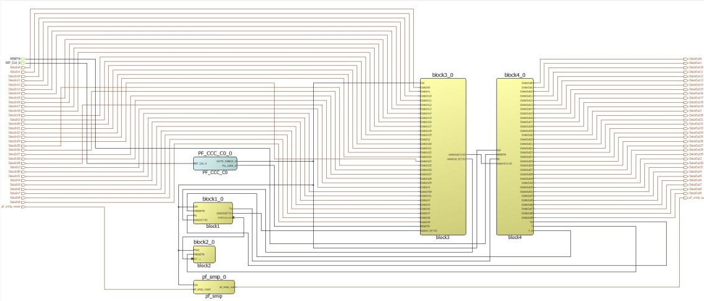

# MSVT.param File

`msvt.param` is an auto-generated file that contains parameters required by MSVT to verify design separation. You can modify the contents of this file according to your requirements.

The following is a Top-Level view of an example design.



The following is an example of a `msvt.param` file. The contents of the `msvt.param` file depend on your design.

## msvt.param File

```
//************************************************************************
//                                                                        
//  This is input parameters file for MSVT Check program                  
//                                                                        
//************************************************************************

DEVICE = MPF300TS
DESIGN = SD_Top.msvt
VERIFY_BLOCKS = block4_0 block2_0 block3_0 block1_0 pf_smip_0 // empty list means all blocks in design will be verified
REQUIRED_SEPARATION = 1
MAX_VIOLATIONS_PER_REPORT_SECTION = 1
IRS block4_0 block2_0 = block4_0_Y 
IRS block2_0 block4_0 = 
IRS block4_0 block3_0 = 
IRS block3_0 block4_0 = block3_0_dataOut[31] block3_0_dataOut[30] block3_0_dataOut[29] 
        block3_0_dataOut[28] block3_0_dataOut[27] block3_0_dataOut[26] block3_0_dataOut[25] 
        block3_0_dataOut[24] block3_0_dataOut[23] block3_0_dataOut[22] block3_0_dataOut[21] 
        block3_0_dataOut[20] block3_0_dataOut[19] block3_0_dataOut[18] block3_0_dataOut[17] 
        block3_0_dataOut[16] block3_0_dataOut[15] block3_0_dataOut[14] block3_0_dataOut[13] 
        block3_0_dataOut[12] block3_0_dataOut[11] block3_0_dataOut[10] block3_0_dataOut[9] 
        block3_0_dataOut[8] block3_0_dataOut[7] block3_0_dataOut[6] block3_0_dataOut[5] 
        block3_0_dataOut[4] block3_0_dataOut[3] block3_0_dataOut[2] block3_0_dataOut[1] 
        block3_0_dataOut[0] 
IRS block4_0 block1_0 = block4_0_TX block4_0_Y_0 
IRS block1_0 block4_0 = block1_0_TX 
IRS block4_0 pf_smip_0 = 
IRS pf_smip_0 block4_0 = 
IRS block2_0 block3_0 = 
IRS block3_0 block2_0 = 
IRS block2_0 block1_0 = block1_0_APBmslave0_PRDATA[31] block1_0_APBmslave0_PRDATA[30] 
        block1_0_APBmslave0_PRDATA[29] block1_0_APBmslave0_PRDATA[28] block1_0_APBmslave0_PRDATA[27] 
        block1_0_APBmslave0_PRDATA[26] block1_0_APBmslave0_PRDATA[25] block1_0_APBmslave0_PRDATA[24] 
        block1_0_APBmslave0_PRDATA[23] block1_0_APBmslave0_PRDATA[22] block1_0_APBmslave0_PRDATA[21] 
        block1_0_APBmslave0_PRDATA[20] block1_0_APBmslave0_PRDATA[19] block1_0_APBmslave0_PRDATA[18] 
        block1_0_APBmslave0_PRDATA[17] block1_0_APBmslave0_PRDATA[16] block1_0_APBmslave0_PRDATA[15] 
        block1_0_APBmslave0_PRDATA[14] block1_0_APBmslave0_PRDATA[13] block1_0_APBmslave0_PRDATA[12] 
        block1_0_APBmslave0_PRDATA[11] block1_0_APBmslave0_PRDATA[10] block1_0_APBmslave0_PRDATA[9] 
        block1_0_APBmslave0_PRDATA[8] block1_0_APBmslave0_PRDATA[7] block1_0_APBmslave0_PRDATA[6] 
        block1_0_APBmslave0_PRDATA[5] block1_0_APBmslave0_PRDATA[4] block1_0_APBmslave0_PRDATA[3] 
        block1_0_APBmslave0_PRDATA[2] block1_0_APBmslave0_PRDATA[1] block1_0_APBmslave0_PRDATA[0] 
        block1_0_APBmslave0_PREADY 
IRS block1_0 block2_0 = block1_0_APBmslave0_PADDR[11] block1_0_APBmslave0_PADDR[10] 
        block1_0_APBmslave0_PADDR[9] block1_0_APBmslave0_PADDR[8] block1_0_APBmslave0_PADDR[7] 
        block1_0_APBmslave0_PADDR[6] block1_0_APBmslave0_PADDR[5] block1_0_APBmslave0_PADDR[4] 
        block1_0_APBmslave0_PADDR[3] block1_0_APBmslave0_PADDR[2] block1_0_APBmslave0_PADDR[1] 
        block1_0_APBmslave0_PADDR[0] block1_0_APBmslave0_PWDATA[31] block1_0_APBmslave0_PWDATA[30] 
        block1_0_APBmslave0_PWDATA[29] block1_0_APBmslave0_PWDATA[28] block1_0_APBmslave0_PWDATA[27] 
        block1_0_APBmslave0_PWDATA[26] block1_0_APBmslave0_PWDATA[25] block1_0_APBmslave0_PWDATA[24] 
        block1_0_APBmslave0_PWDATA[23] block1_0_APBmslave0_PWDATA[22] block1_0_APBmslave0_PWDATA[21] 
        block1_0_APBmslave0_PWDATA[20] block1_0_APBmslave0_PWDATA[19] block1_0_APBmslave0_PWDATA[18] 
        block1_0_APBmslave0_PWDATA[17] block1_0_APBmslave0_PWDATA[16] block1_0_APBmslave0_PWDATA[15] 
        block1_0_APBmslave0_PWDATA[14] block1_0_APBmslave0_PWDATA[13] block1_0_APBmslave0_PWDATA[12] 
        block1_0_APBmslave0_PWDATA[11] block1_0_APBmslave0_PWDATA[10] block1_0_APBmslave0_PWDATA[9] 
        block1_0_APBmslave0_PWDATA[8] block1_0_APBmslave0_PWDATA[7] block1_0_APBmslave0_PWDATA[6] 
        block1_0_APBmslave0_PWDATA[5] block1_0_APBmslave0_PWDATA[4] block1_0_APBmslave0_PWDATA[3] 
        block1_0_APBmslave0_PWDATA[2] block1_0_APBmslave0_PWDATA[1] block1_0_APBmslave0_PWDATA[0] 
        block1_0_APBmslave0_PENABLE block1_0_APBmslave0_PSELx block1_0_APBmslave0_PWRITE 
IRS block2_0 pf_smip_0 = 
IRS pf_smip_0 block2_0 = 
IRS block3_0 block1_0 = block3_0_dataOut_0[7] block3_0_dataOut_0[6] block3_0_dataOut_0[5] 
        block3_0_dataOut_0[4] block3_0_dataOut_0[3] block3_0_dataOut_0[2] block3_0_dataOut_0[1] 
        block3_0_dataOut_0[0] 
IRS block1_0 block3_0 = block1_0_dataOut[7] block1_0_dataOut[6] block1_0_dataOut[5] 
        block1_0_dataOut[4] block1_0_dataOut[3] block1_0_dataOut[2] block1_0_dataOut[1] 
        block1_0_dataOut[0] 
IRS block3_0 pf_smip_0 = 
IRS pf_smip_0 block3_0 = 
IRS block1_0 pf_smip_0 = 
IRS pf_smip_0 block1_0 = 
REGIONS_VERBOSITY = 0


```

|Parameter|Description|
|---------|-----------|
|DEVICE|Name of the Microchip FPGA device implementing the design.|
|DESIGN|Location of the files required for MSVT. By default, it will point to the auto-generated `msvt.dtf` folder.|
|VERIFY BLOCKS|Contains a list of blocks to be verified. By default, all the block names present in the design are listed. You can modify this list and include a subset of blocks to be audited by MSVT.|
|REQUIRED\_SEPARATION|Required separation parameter per the guideline requirements. The default value is 1.|
|MAX\_VIOLATIONS\_PER\_REPORT\_SECTION|Controls the number of violations that are to be reported in each section. The default value is 1.|
|IRS|Contains a list of IRS signal names present in the design. Each IRS statement is comprised of a pair of separated blocks followed by a list of the IRS signal names between them.|
|REGIONS\_VERBOSITY|Controls reporting of each routing region and the assigned instances. The default value is 0.|

You can modify the parameters in the `msvt.param` file to refine your verification criteria. We recommend modifying the `REQUIRED_SEPARATION` parameter according to your system requirements before executing MSVT. You can also specify the blocks you want to verify, the names of each IRS signal, and add a limit to the max number of violations to be reported.

**Parent topic:**[Extracting MSVT Files](GUID-12E4C266-D458-4905-A739-AABF2014D996.md)

