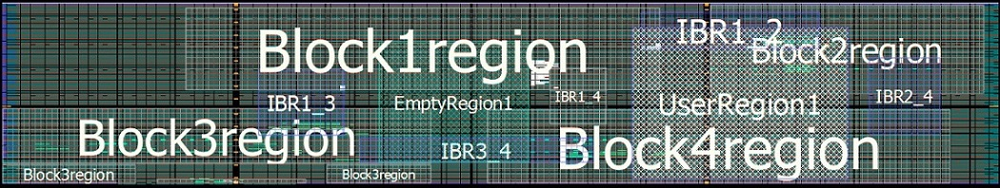

# Empty Regions in the MSVT Output Report

This section of the MSVT output report shows the empty regions. These regions should also be defined as Routing Regions. This section is generated only if there are such empty routing regions in the design.

## MSVT Output Report

The following is a Chip Planner view of the input design having three empty Routing Regions<br /> defined.



## MSVT Output Report Section

```
-----------------------------------------------------------------------------------------------------------------------------------------
The following are empty region(s): ==============================================================================
( EXCLUSIVE REGION
    ( RECT 1476 6 1584 84)
)
-----------------------------------------------------------------------------------------------------------------------------------------
```

**Parent topic:**[Propagating IRS Nets Outgoing from &lt;Block1&gt; to &lt;Block2&gt;](GUID-3A0EBBB3-83C1-4E25-A372-7804481722B2.md)

