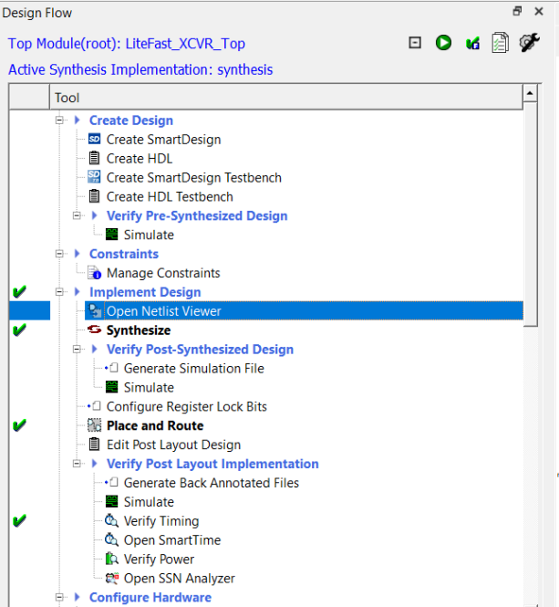

# Invocation

The standalone Netlist Viewer is available for invocation in the Design Flow window. To open the standalone Netlist Viewer in the Flow window, perform one of the following steps:

-   Double click **Netlist Viewer** in the Design Flow window
-   Right click **Netlist Viewer** and select **Open Interactively**

    

When Netlist Viewer opens, it makes available for loading and viewing the following views of the netlist:

-   RTL—available after design capture/design generation
-   Hierarchical Post-Synthesis—available after Synthesis
-   Flat Post-Compile—available after Synthesis or Place and Route. If after Place and Route, the Netlist Viewer loads the Flat Post-Compile view to reflect the netlist generated after Place and Route.
-   Flat Post-Compile Cone—available after Synthesis or Place and Route. If after Place and Route, the Netlist Viewer loads the Flat Post-Compile view to reflect the netlist generated after Place and Route. This view does not display any netlist on the canvas until an instance from the design tree is selected and loaded. This view allows you to load in a special area of the design in which you are interested. It also cuts down the runtime.

