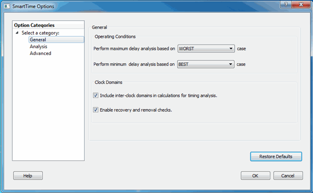
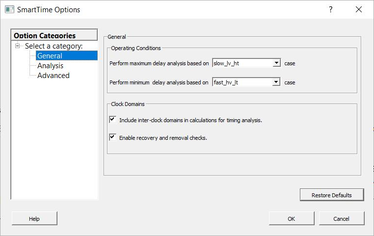

# Configuring SmartTime Settings

The SmartTime Options dialog box allows you to change general, analysis, and advanced  settings.

## Configuring SmartTime General Settings

To configure **General** settings in the SmartTime Options dialog box:

1.  From the SmartTime Maximum/Minimum Delay Analysis View window, choose **Tools &gt; Options**.

    The SmartTime Options dialog box appears.

    

    

2.  In the **General** category, select the settings for the operating conditions. SmartTime performs maximum or minimum delay analysis based on the best, typical, or worst case.

3.  Specify whether you want SmartTime to use inter-clock domains in calculations for timing analysis.

4.  To revert the **General** settings to their default value, click **Restore Defaults**.

5.  Change **Analysis** and **Advanced** settings as necessary.

6.  When finished, click **OK**.

## Configuring SmartTime Analysis Settings

To configure **Analysis** settings in the SmartTime Options dialog box:

1.  From the SmartTime Maximum/Minimum Delay Analysis View window, choose **Tools &gt; Options**.

    The SmartTime Options dialog box appears.

2.  In the left pane, click **Analysis**.

    

3.  Enter a number greater than 1 to specify the maximum number of paths to include in a path set during timing analysis.

4.  Check or uncheck whether to filter the paths by slack value. If you check this box, specify the slack range between the minimum slack and maximum slack.

5.  Check or uncheck whether to include clock network details.

6.  To specify the number of parallel paths in the expanded path, enter a number greater than 1.

7.  To revert the **Analysis** settings to their default value, click **Restore Defaults**.

8.  Change **General** and **Advanced** settings as necessary.

9.  When finished, click **OK**.

## Configuring SmartTime Advanced Settings

To configure **Advanced** settings in the SmartTime Options dialog box:

1.  From the SmartTime Maximum/Minimum Delay Analysis View window, choose **Tools &gt; Options**.

    The SmartTime Options dialog box appears.

2.  In the left pane, click **Advanced**.

    

3.  Specify whether to use loopback in bidirectional buffers \(bibufs\) and/or break paths at asynchronous pins. Then specify whether to disable non-unate arcs in the clockpath.

4.  To revert the **Advanced** settings to their default value, click **Restore Defaults**.

5.  Change **General** and **Analysis** settings as necessary.

6.  When finished, click **OK**.

