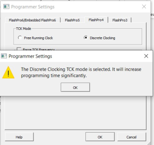
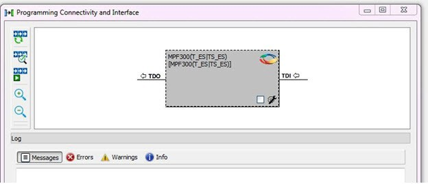
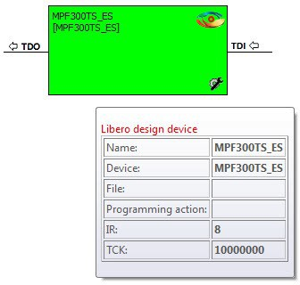
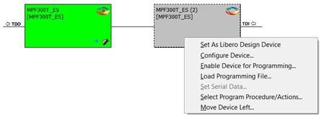
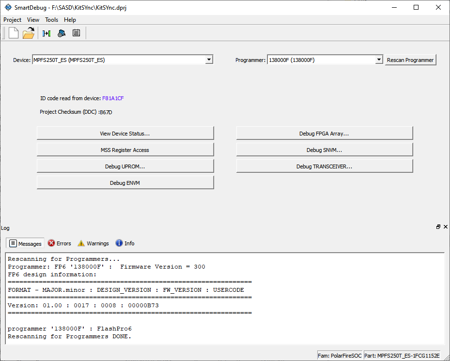
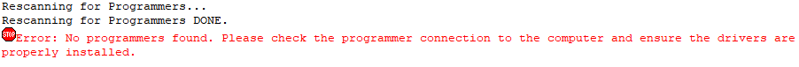

# SmartDebug User Interface

This topic introduces the basic elements and features of SmartDebug.

## Standalone SmartDebug User Interface

You can launch the standalone SmartDebug from the Libero installation folder or from the FlashPro installation folder on the operating systems listed in the following table.

|Operating System|Launch Instructions|
|----------------|-------------------|
|Windows®|`<Libero Installation folder>/Designer/bin/sdebug.exe`|
|`<FlashPro Installation folder>/bin/sdebug.exe`|
|Linux®|`<Libero Installation folder>/bin/sdebug`|
|`<FlashPro Installation folder>/bin/sdebug`|

### Project Menu

The following table describes the menu options in the **Project**  menu.

|Menu Option|Description|
|-----------|-----------|
|New Project|Creates a new SmartDebug project.|
|Open Project|Opens an existing debug project.|
|Execute Script|Executes SmartDebug-specific Tcl scripts.|
|Export Script File|Exports SmartDebug-specific commands to a script file.|
|Recent Projects|Lists recent SmartDebug projects.|

### Log Window

The following table describes the tabs on the **Log** view in the  standalone SmartDebug window. This view appears when you start SmartDebug. To hide it,  click **View** &gt; **View Log**.

|Tab|Description|
|---|-----------|
|Messages|Displays standard output messages.|
|Errors|Displays error messages.|
|Warnings|Displays warning messages.|
|Info|Displays general information.|

### Tools Menu

The Tools menu includes Programming Connectivity and Interface and Programmer Settings options, which are enabled after creating or opening a SmartDebug project.

 

**Attention:** When the **Discrete Clocking** mode is selected, a warning pop-up appears, which states that using the Discrete Clocking TCK mode will increase the programming time significantly, as shown in the following figure.

After the pop-up is closed by the user, a warning icon with a message tooltip  appears next to the **Discrete Clocking** radio button. The icon  and the tooltip appear when the programmer settings dialog is re-opened.

 

For more information, see [Programming Connectivity and Interface](GUID-593F19AE-C1E3-4819-8BB0-65929625C4A5.md#).

## Programming Connectivity and Interface

To open the Programming Connectivity and Interface dialog box from the standalone  SmartDebug Tools menu, choose **Programming Connectivity and Interface**. The Programming Connectivity and Interface dialog box  displays the physical chain from TDI to TDO.

All devices in the chain are disabled by default when a standalone SmartDebug project is  created using the **Construct Automatically** option in the Create  SmartDebug Project dialog box.

**Note:** SmartDebug displays a pop-up window if it detects an outdated FlashPro6 programmer. You can then choose to update the programmer design.

 

 

The following table describes the actions available in the Programming Connectivity and  Interface dialog box.

|Action|Description|
|------|-----------|
|Construct Chain Automatically|Construct the physical chain automatically. Running Construct  Chain Automatically in the Programming Connectivity and Interface  removes all existing debug/programming data included using  DDC/programming files. The project is the same as a new project  created using the Construct Chain Automatically option|
|Scan and Check Chain|Scan the physical chain connected to the programmer and check if  it matches the chain constructed in the scan chain block  diagram.|
|Run Programming Action|Program the device with the selected programming procedure. When  two devices are connected in the chain, the programming actions are  independent of the device.|
|Zoom In|Zoom into the scan chain block diagram.|
|Zoom Out|Zoom out of the scan chain block diagram.|

### Hover Information

The device tooltip displays the Libero design device information if you hover the cursor over a  device in the scan chain block diagram

The following table describes each Libero design device information option.

|Option|Description|
|------|-----------|
|Name|User-specified device name. This field indicates the unique name  specified by the user in the Device Name field in Configure Device  \(right click **Properties**\).|
|Device|Microchip device name.|
|Programming File|Programming file name.|
|Programming Action|The programming action selected for the device in the chain when a  programming file is loaded.|
|IR|Device instruction length.|
|TCK|Maximum clock frequency in MHz to program a specific device;  standalone SmartDebug uses this information to ensure that the  programmer operates at a frequency lower than the slowest device in the  chain.|

### Device Chain Details

The device within the chain has the following details:

-   User-specified device name
-   Device name
-   Programming file name
-   Programming action: Select **Enable Device for Programming**to enable the device for programming. Enabled devices are green, and disabled devices are grayed out.

### Context Menu Options

The following options are available when you right click a device \(context menu\) in the  Programming Connectivity and Interface dialog box.

 

 

<table id="TABLE_GNS_32M_KNB"><thead><tr><th>

Option

</th><th>

Description

</th></tr></thead><tbody><tr><td>

Set as Libero Design Device

</td><td>

The user must set the Libero design device when there are multiple  identical Libero design devices in the chain.

</td></tr><tr><td>

Configure Device

</td><td>

Ability to reconfigure the device.-   Family and Die: The device can be explicitly configured from the Family, Die drop-down.
-   Device Name: Editable field for providing user-specified name for the device.

</td></tr><tr><td>

Enable Device for Programming

</td><td>

Select to enable the device for programming. Enabled devices are  shown in green, and disabled devices are grayed out.

</td></tr><tr><td>

Load Programming File

</td><td>

Load the programming file for the selected device.

</td></tr><tr><td>

Select Programming Procedure/Actions

</td><td>

Option to select programming action/procedures for the devices  connected in the chain.-   Actions: List of programming actions for your device.
-   Procedures: Advanced option; enables you to customize the list of recommended and optional procedures for the selected action.

</td></tr><tr><td>

Import Debug Data from DDC File

</td><td>

Option to import debug data information from the DDC file.**Note:** This option is supported when SmartDebug is invoked in Standalone mode.

The DDC  file selected for import into device must be created for a  compatible device. When the DDC file is imported successfully,  all current device debug data is removed and replaced with debug  data from the imported DDC file.

The JTAG Chain  configuration from the imported DDC file is ignored in this  option.

If a programming file is already loaded into the  device prior to importing debug data from the DDC file, the  programming file content is replaced with the content of the DDC  file \(if programming file information is included in the DDC  file\).

</td></tr></tbody>
</table>### Debug Context Save

Debug context refers to the user selections in debug options such as Debug FPGA Array, Debug  Transceiver, and View Flash Memory Content. In standalone SmartDebug, the debug context of the  current session is saved or reset depending on the user actions in Programming Connectivity  and Interface.

The debug context of the current session is retained for the following actions in Programming Connectivity and Interface:

-   Enable Device for Programming
-   Select Programming Procedure/Actions
-   Scan and Check Chain
-   Run Programming Action

The debug context of the current session is reset for the following actions in Programming  Connectivity and Interface:

-   Auto Construct: Clears all the existing debug data. You need to re-import the debug data from DDC file.
-   Import Debug Data from DDC file
-   Configure Device: Renames the device in the chain
-   Configure Device: Family/Die change
-   Load Programming File

### Selecting Devices for Debug

Standalone SmartDebug provides an option to select the devices connected in the JTAG chain for  debug. Click the **Device** drop-down list to select the device. The  device debug context is not saved when another debug device is selected.

## View Device Status

Click **View Device Status**in the standalone SmartDebug main window to display the Device Status Report. The Device Status Report is a complete summary of IDCode, device certificate, design information, programming information, digest, and device security information. Use this dialog box to save or print your information for future reference.

The following table describes the device status report information.

<table id="TABLE_SX1_TQM_KNB"><thead><tr><th>

Information

</th><th>

Description

</th></tr></thead><tbody><tr><td>

IDCode

</td><td>

IDCode read from the device under debug.

</td></tr><tr><td>

Device Certificate

</td><td>

Displays Family and Die information if the device certificate is installed on the device.If the device certificate is not installed on the device, a message indicates that the device certificate may not have been installed.

</td></tr><tr><td>

Design Information

</td><td>

Displays the following:-   Design Name
-   Design Checksum
-   Design Version

</td></tr><tr><td>

Digest Information

</td><td>

Displays Fabric Digest, sNVM Digest \(if applicable\) computed from the device during programming. sNVM Digest is shown when sNVM is used in the design.

</td></tr><tr><td>

Device Security Settings

</td><td>

Displays information about your security settings, including live probes, JTAG boundary scan, global key modes, and user keys.

</td></tr><tr><td>

Programming Information

</td><td>

Displays the following:-   Cycle Count: Number of times the device has been programmed since it has been out of factory reset. There is no limit to this count, but a lower threshold is around 2000 cycles.
-   Algorithm Version: Programming algorithm version number written to the device during programming.
-   Programmer: Details of the programmer hardware used during programming.
-   Software Version: Libero software version indicates the release version used for programming.
-   Programming Software: Software used for programming is FlashPro or DirectC or Non-Microchip software.
-   Programming Interface Protocol: Indicates the protocol followed for programming. For example, JTAG, SPI MASTER, and SPI SLAVE.
-   Programming File Type: Type of programming file used for programming the device. For example, STAPL, PPD, SVF, and IEEE® 532.

</td></tr></tbody>
</table>## Rescan Programmer

The **Rescan Programmer** button when clicked rescans for the programmer  attached to the computer. You can also click the button to rescan for programmers when  they are switched or changed. The information gathered by the utility is displayed as  log messages.

**Note:** The **Rescan Programmer** button is disabled in the Demo mode.

An error is displayed when the programmer is detached from the computer.

